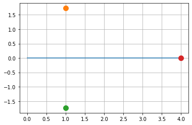
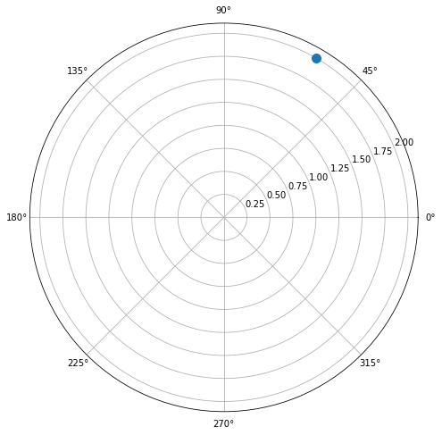
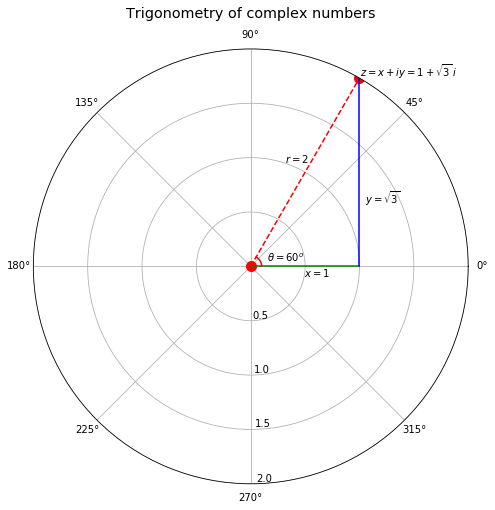

---
redirect_from:
  - "/appendixa-complex-numbers"
interact_link: content/AppendixA_complex_numbers.ipynb
kernel_name: python3
has_widgets: false
title: '1.5 Appendix A. Complex numbers.'
prev_page:
  url: /python-intro
  title: '1.4 Crash course of Python and interactive plotting.'
next_page:
  url: /LEC4-Chem324
  title: '2.0 Waves'
comment: "***PROGRAMMATICALLY GENERATED, DO NOT EDIT. SEE ORIGINAL FILES IN /content***"
---


# Complex numbers


**Reccomended:** Watch the  following YouTube video 
["complex numbers are real, part-1"](https://www.youtube.com/watch?v=T647CGsuOVU)


### Complex Numbers

A complex number has a **real part** $ x $ and a purely **imaginary part** $ y $.<br>
The Euclidean, polar, and trigonometric forms of a complex number $ z $ are:


$$z = x + iy = re^{i\theta} = r(\cos{\theta} + i \sin{\theta})$$

The second equality above is known as **Euler’s formula**. [Euler](https://en.wikipedia.org/wiki/Leonhard_Euler) contributed many other formulas too! The complex conjugate $ \bar z $ of $ z $ is defined as

$$
\bar z = r e^{-i \theta} = r (\cos{\theta} - i \sin{\theta} )
$$

The value $x$ is the **real** part of $z$ and $y$ is the
**imaginary** part of $z$. The symbol $|z|  = \bar z z = r$ represents the **modulus** of $z$.

The value $r$ is the Euclidean distance of vector $(x,y)$ from the
origin:

$$
r = |z| = \sqrt{x^2 + y^2}
$$

The value $ \theta $ is the angle of $ (x,y) $ with respect to the real axis.

Evidently, the tangent of $ \theta $ is $ \left(\frac{y}{x}\right) $. Therefore,

$$
\theta = \tan^{-1} \Big( \frac{y}{x} \Big)
$$

Three elementary trigonometric functions are

$$
\cos{\theta} = \frac{x}{r} = \frac{e^{i\theta} + e^{-i\theta}}{2} , \quad
\sin{\theta} = \frac{y}{r} = \frac{e^{i\theta} - e^{-i\theta}}{2i} , \quad
\tan{\theta} = \frac{x}{y}
$$


<div markdown="1" class="cell code_cell">
<div class="input_area" markdown="1">
```python
# We’ll need the following imports to plot complex numbers
import numpy as np
import matplotlib.pyplot as plt
%matplotlib inline

```
</div>

</div>


### An Example

Consider the complex number $ z = 1 + \sqrt{3} i $.


<div markdown="1" class="cell code_cell">
<div class="input_area" markdown="1">
```python
z=1+np.sqrt(3)*1j

zeros=np.zeros(5)  # plot zero line

plt.plot(zeros)

plt.plot(z.real,z.imag, 'o',ms=10) # plot z

zc=z.conjugate()

plt.plot(zc.real,zc.imag, 'o',ms=10) # plot z conjugate

z_abs=z*zc

plt.plot(z_abs.real,z_abs.imag, 'o',ms=10) # plot z absolute

plt.grid('on')

```
</div>

<div class="output_wrapper" markdown="1">
<div class="output_subarea" markdown="1">

{:.output_png}


</div>
</div>
</div>


Now let us make a polar plot

For $ z = 1 + \sqrt{3} i $, $ x = 1 $, $ y = \sqrt{3} $.

It follows that $ r = 2 $ and
$ \theta = \tan^{-1}(\sqrt{3}) = \frac{\pi}{3} = 60^o $.

Let’s use Python to plot the trigonometric form of the complex number
$ z = 1 + \sqrt{3} i $.


<div markdown="1" class="cell code_cell">
<div class="input_area" markdown="1">
```python
# Set parameters
r = 2                        # multiply by *np.ones(10)
θ = np.pi/3 # multiplying by *np.random.rand(10)


# Plot
fig = plt.figure(figsize=(8, 8))
ax = plt.subplot(projection='polar')

ax.plot(θ,r, 'o', ms=10)             

```
</div>

<div class="output_wrapper" markdown="1">
<div class="output_subarea" markdown="1">


{:.output_data_text}
```
[<matplotlib.lines.Line2D at 0x126a97358>]
```


</div>
</div>
<div class="output_wrapper" markdown="1">
<div class="output_subarea" markdown="1">

{:.output_png}


</div>
</div>
</div>


With a few more options we can annote the plot and connect with cartesian representation.


<div markdown="1" class="cell code_cell">
<div class="input_area" markdown="1">
```python
# Set parameters
r = 2
θ = np.pi/3
x = r * np.cos(θ)

# Plot
fig = plt.figure(figsize=(8, 8))
ax = plt.subplot(111, projection='polar')

ax.plot((0, θ),(0, r), '--o', color='red',ms=10)             # plot r


### Plot lines and annotate
x_range = np.linspace(0, x, 1000)
θ_range = np.linspace(0, θ, 1000)

ax.plot(np.zeros(x_range.shape), x_range, color='green')       # plot x
ax.plot(θ_range, x / np.cos(θ_range), color='blue')           # plot y
ax.plot(θ_range, np.ones(θ_range.shape) * 0.1, color='r')  # plot θ

ax.set_title("Trigonometry of complex numbers", va='bottom', fontsize='x-large')

ax.set_rmax(2)
ax.set_rticks((0.5, 1, 1.5, 2))  # less radial ticks
ax.set_rlabel_position(-88.5)    # get radial labels away from plotted line

ax.text(θ, r+0.01 , r'$z = x + iy = 1 + \sqrt{3}\, i$')   # label z
ax.text(θ+0.2, 1 , '$r = 2$')                             # label r
ax.text(0-0.2, 0.5, '$x = 1$')                            # label x
ax.text(0.5, 1.2, r'$y = \sqrt{3}$')                      # label y
ax.text(0.25, 0.15, r'$\theta = 60^o$')                   # label θ
ax.grid('--')

```
</div>

<div class="output_wrapper" markdown="1">
<div class="output_subarea" markdown="1">

{:.output_png}


</div>
</div>
</div>


## De Moivre’s Theorem

de Moivre’s theorem states that:

$$
(r(\cos{\theta} + i \sin{\theta}))^n =
r^n e^{in\theta} =
r^n(\cos{n\theta} + i \sin{n\theta})
$$

To prove de Moivre’s theorem, note that

$$
(r(\cos{\theta} + i \sin{\theta}))^n = \big( re^{i\theta} \big)^n
$$

and compute.


### Example-1: Pythagoras theorem

We can use de Moivre’s theorem to show that
$ r = \sqrt{x^2 + y^2} $.

We have

$$
\begin{aligned}
1 &= e^{i\theta} e^{-i\theta} \\
&= (\cos{\theta} + i \sin{\theta})(\cos{(\text{-}\theta)} + i \sin{(\text{-}\theta)}) \\
&= (\cos{\theta} + i \sin{\theta})(\cos{\theta} - i \sin{\theta}) \\
&= \cos^2{\theta} + \sin^2{\theta} \\
&= \frac{x^2}{r^2} + \frac{y^2}{r^2}
\end{aligned}
$$

and thus

$$
x^2 + y^2 = r^2
$$

We recognize this as a theorem of **Pythagoras**.


### Example-2: Trigonometric Identities

We can obtain a complete suite of trigonometric identities by
appropriately manipulating polar forms of complex numbers.

We’ll get many of them by deducing implications of the equality

$$
e^{i(\omega + \theta)} = e^{i\omega} e^{i\theta}
$$

For example, we’ll calculate identities for

$ \cos{(\omega + \theta)} $ and $ \sin{(\omega + \theta)} $.

Using the sine and cosine formulas presented at the beginning of this
lecture, we have:

$$
\begin{aligned}
\cos{(\omega + \theta)} = \frac{e^{i(\omega + \theta)} + e^{-i(\omega + \theta)}}{2} \\
\sin{(\omega + \theta)} = \frac{e^{i(\omega + \theta)} - e^{-i(\omega + \theta)}}{2i}
\end{aligned}
$$

We can also obtain the trigonometric identities as follows:

$$
\begin{aligned}
\cos{(\omega + \theta)} + i \sin{(\omega + \theta)}
&= e^{i(\omega + \theta)} \\
&= e^{i\omega} e^{i\theta} \\
&= (\cos{\omega} + i \sin{\omega})(\cos{\theta} + i \sin{\theta}) \\
&= (\cos{\omega}\cos{\theta} - \sin{\omega}\sin{\theta}) +
i (\cos{\omega}\sin{\theta} + \sin{\omega}\cos{\theta})
\end{aligned}
$$

Since both real and imaginary parts of the above formula should be
equal, we get:

$$
\begin{aligned}
\cos{(\omega + \theta)} = \cos{\omega}\cos{\theta} - \sin{\omega}\sin{\theta} \\
\sin{(\omega + \theta)} = \cos{\omega}\sin{\theta} + \sin{\omega}\cos{\theta}
\end{aligned}
$$

The equations above are also known as the **angle sum identities**. We
can verify the equations using the `simplify` function in the
`sympy` package:


### Example-3: Trigonometric Integrals

We can also compute the trigonometric integrals using polar forms of
complex numbers.

For example, we want to solve the following integral:

$$
\int_{-\pi}^{\pi} \cos(\omega) \sin(\omega) \, d\omega
$$

Using Euler’s formula, we have:

$$
\begin{aligned}
\int \cos(\omega) \sin(\omega) \, d\omega
&=
\int
\frac{(e^{i\omega} + e^{-i\omega})}{2}
\frac{(e^{i\omega} - e^{-i\omega})}{2i}
\, d\omega  \\
&=
\frac{1}{4i}
\int
e^{2i\omega} - e^{-2i\omega}
\, d\omega  \\
&=
\frac{1}{4i}
\bigg( \frac{-i}{2} e^{2i\omega} - \frac{i}{2} e^{-2i\omega} + C_1 \bigg) \\
&=
-\frac{1}{8}
\bigg[ \bigg(e^{i\omega}\bigg)^2 + \bigg(e^{-i\omega}\bigg)^2 - 2 \bigg] + C_2 \\
&=
-\frac{1}{8}  (e^{i\omega} - e^{-i\omega})^2  + C_2 \\
&=
\frac{1}{2} \bigg( \frac{e^{i\omega} - e^{-i\omega}}{2i} \bigg)^2 + C_2 \\
&= \frac{1}{2} \sin^2(\omega) + C_2
\end{aligned}
$$

and thus:

$$
\int_{-\pi}^{\pi} \cos(\omega) \sin(\omega) \, d\omega =
\frac{1}{2}\sin^2(\pi) - \frac{1}{2}\sin^2(-\pi) = 0
$$

We can verify the analytical as well as numerical results using
`integrate` in the `sympy` package:

