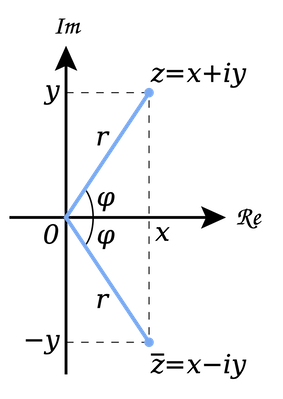
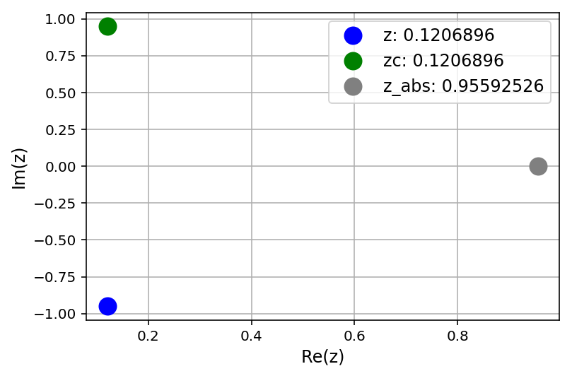
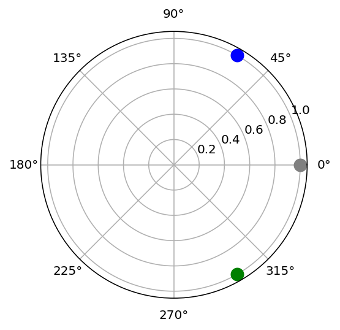
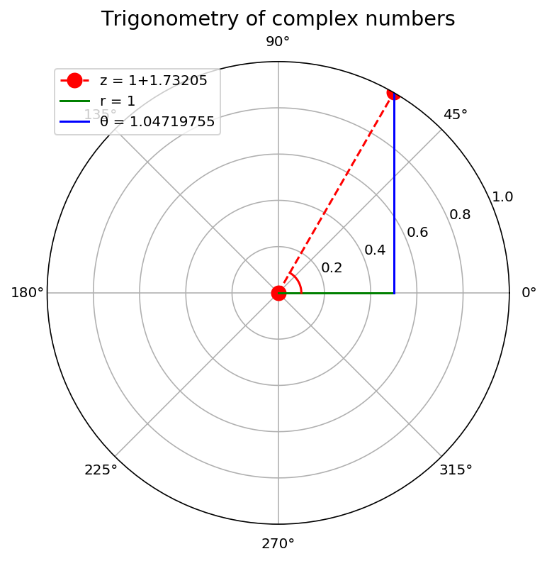

---
redirect_from:
  - "/appendixa-complex-numbers"
interact_link: content/AppendixA_complex_numbers.ipynb
kernel_name: python3
has_widgets: false
title: '1.5 Appendix A. Complex numbers.'
prev_page:
  url: /python-intro
  title: '1.4 Crash course of Python and interactive plotting.'
next_page:
  url: /LEC4-Chem324
  title: '2.0 Waves'
comment: "***PROGRAMMATICALLY GENERATED, DO NOT EDIT. SEE ORIGINAL FILES IN /content***"
---
# Complex numbers


**Reccomended:** Watch the  following YouTube video 
["complex numbers are real, part-1"](https://www.youtube.com/watch?v=T647CGsuOVU)

**Also Reccomended:** [A Visual, Intuitive Guide to Imaginary Numbers](https://betterexplained.com/articles/a-visual-intuitive-guide-to-imaginary-numbers/)


### "Complex numbers are every bit as real as every other number. "

A complex number $z$ is a kind of 2D number that lives in 2D space and requires two components for its full specification:


- **Real part** $ x $ 
- **Imaginary part** $ y $.

Complex numbers are every bit as real as  negative numbers. Sure, you do not count objects on your fingers by using complex numbers but complex numbers obey important relationships in math and physics the same way other numbers do. In fact we will see that central equation for quantum mechanics, the Schrodinger equstion, contains an imaginary number. As a result solutions to Schroidnger equation are functions of complex variable. Why? Because apparently thats how nature works. Nature operates on complex plane which includes real numbers as subset. Can we learn to use complex numbers with ease and devcelop intuition and visual sense? Yup! And that will be our objective in this short Appendix. 


### Intoroducing the i

When first confronted with complex numbers they seem iunintuitive and hard to visualize. The imaginary unit i in particular mystifies as to what it is and where did it come from. 
Some facts from mathematics are in order here:

- **What is the definition of i?** The imaginary number i is defined solely by the property that its square is −1 that is: $i\cdot i=-1$. 

- **How does i change what i know about math of real variables?** Imaginary numbers are an important mathematical concept, which extend the real number system ℝ to the complex number system ℂ, which in turn provides at least one root for every nonconstant polynomial P(x). (See Fundamental theorem of algebra.) The term "imaginary" is used because there is no real number having a negative square.

- **Where does i appear in math?** Most notably imaginary number (i) provide solutions to quadratic equation $x^2 + 1 = 0.$ Although there is no real number with this property, i can be used to extend the real numbers to what are called complex numbers, using addition and multiplication. Generally there are two complex square roots of every real number e.g square root of -1 is i and -i. 

- **What do you call a number that contains i?** A complex number z=1+2i. A function of complex variable is a function if it operates on complex variables z. 


### Eculidead vs polar representation of complex numbers



The Euclidean, polar, and trigonometric forms of a complex number $ z $ are given by:

$$z = x + iy = r(\cos{\phi} + i \sin{\phi}) = re^{i\phi} $$

The second equality above is known as [**Euler’s formula**](https://en.wikipedia.org/wiki/Euler%27s_formula#targetText=Euler's%20formula%20states%20that%20for,argument%20x%20given%20in%20radians.&targetText=When%20%2C%20Euler's%20formula%20evaluates%20to,is%20known%20as%20Euler's%20identity.) 
An equally widely regarded as one of the most beautiful and mysterious in mathematics.


The complex conjugate $\bar{z}$ of $z$ is defined as

$$\bar z = x-iy =  r (\cos{\phi} - i \sin{\phi} ) = re^{i\phi}$$

The value $r$ is the Euclidean distance of vector $(x,y)$ from the
origin and is equal to the modulus of $|z|=\sqrt{\bar{z}z}$

$$r = |z| = \sqrt{x^2 + y^2}$$

The value $\phi$ is the angle of (0,0)-(x,y) line with respect to the real axis. 
The tangent of $\phi$ is $\left(\frac{y}{x}\right) $. Therefore,

$$
\phi = \tan^{-1} \Big(\frac{y}{x} \Big)
$$


Three elementary trigonometric functions are

$$
\cos{\phi} = \frac{x}{r} = \frac{e^{i\phi} + e^{-i\phi}}{2} , \quad
\sin{\phi} = \frac{y}{r} = \frac{e^{i\phi} - e^{-i\phi}}{2i} , \quad
\tan{\phi} = \frac{x}{y}
$$


## De Moivre’s Theorem

[de Moivre’s theorem](https://en.wikipedia.org/wiki/De_Moivre%27s_formula) states that:

$$
z^n=(r(\cos{\theta} + i \sin{\theta}))^n =
r^n e^{in\theta} =
r^n(\cos{n\theta} + i \sin{n\theta})
$$

We raised complex number to power n, used polar representation and realized that exponent raised to power n simply multiplies polar angle by n. 
Note that e Moivre’s theorem allows relating igonometirc functions of angle $\theta$ raised to power $n$ to trignomoteric functions of of angle $n\theta$ of power one:

$$
r^n(\cos{\theta} + i \sin{\theta})^n = r^n (\cos{n\theta} + i \sin{n\theta})
$$

$$
(\cos{\theta} + i \sin{\theta})^n = (\cos{n\theta} + i \sin{n\theta})
$$

The proof of De Moivre's Theorem is done via [induction](https://en.wikipedia.org/wiki/De_Moivre%27s_formula), e.g one can expand the parenthesis ans assert the equality for cases n=2, n=3, ..


**Exercise:** set n=2 and first set real component to zero and obtain expresion for sine. Then set imaginary component to zero and obtain expression for cosine. 


### Example-1: Pythagoras theorem

We can use de Moivre’s theorem to show that
$ r = \sqrt{x^2 + y^2} $.

We have

$$
\begin{aligned}
1 &= e^{i\theta} e^{-i\theta} \\
&= (\cos{\theta} + i \sin{\theta})(\cos{(\text{-}\theta)} + i \sin{(\text{-}\theta)}) \\
&= (\cos{\theta} + i \sin{\theta})(\cos{\theta} - i \sin{\theta}) \\
&= \cos^2{\theta} + \sin^2{\theta} \\
&= \frac{x^2}{r^2} + \frac{y^2}{r^2}
\end{aligned}
$$

and thus

$$
x^2 + y^2 = r^2
$$

We recognize this as a theorem of **Pythagoras**.


### Example-2: Trigonometric Identities

We can obtain a complete suite of trigonometric identities by
appropriately manipulating polar forms of complex numbers.

We’ll get many of them by deducing implications of the equality

$$e^{i(\omega + \theta)} = e^{i\omega} e^{i\theta}$$

For example, we’ll calculate identities for $\cos{(\omega + \theta)} $ and $ \sin{(\omega + \theta)}$.

Using the sine and cosine formulas presented at the beginning of this
lecture, we have:

$$\begin{aligned}
\cos{(\omega + \theta)} = \frac{e^{i(\omega + \theta)} + e^{-i(\omega + \theta)}}{2} \\
\sin{(\omega + \theta)} = \frac{e^{i(\omega + \theta)} - e^{-i(\omega + \theta)}}{2i}
\end{aligned}$$

We can also obtain the trigonometric identities as follows:

$$
\begin{aligned}
\cos{(\omega + \theta)} + i \sin{(\omega + \theta)}
&= e^{i(\omega + \theta)} \\
&= e^{i\omega} e^{i\theta} \\
&= (\cos{\omega} + i \sin{\omega})(\cos{\theta} + i \sin{\theta}) \\
&= (\cos{\omega}\cos{\theta} - \sin{\omega}\sin{\theta}) +
i (\cos{\omega}\sin{\theta} + \sin{\omega}\cos{\theta})
\end{aligned}
$$

Since both real and imaginary parts of the above formula should be
equal, we get:

$$
\begin{aligned}
\cos{(\omega + \theta)} = \cos{\omega}\cos{\theta} - \sin{\omega}\sin{\theta} \\
\sin{(\omega + \theta)} = \cos{\omega}\sin{\theta} + \sin{\omega}\cos{\theta}
\end{aligned}
$$

The equations above are also known as the **angle sum identities**. We
can verify the equations using the `simplify` function in the
`sympy` package:


### Example-3: Trigonometric Integrals

We can also compute the trigonometric integrals using polar forms of
complex numbers.

For example, we want to solve the following integral:

$$\int_{-\pi}^{\pi} \cos(\omega) \sin(\omega) \, d\omega$$

Using Euler’s formula, we have:

$$\begin{aligned}
\int \cos(\omega) \sin(\omega) \, d\omega
&=
\int
\frac{(e^{i\omega} + e^{-i\omega})}{2}
\frac{(e^{i\omega} - e^{-i\omega})}{2i}
\, d\omega  \\
&=
\frac{1}{4i}
\int
e^{2i\omega} - e^{-2i\omega}
\, d\omega  \\
&=
\frac{1}{4i}
\bigg( \frac{-i}{2} e^{2i\omega} - \frac{i}{2} e^{-2i\omega} + C_1 \bigg) \\
&=
-\frac{1}{8}
\bigg[ \bigg(e^{i\omega}\bigg)^2 + \bigg(e^{-i\omega}\bigg)^2 - 2 \bigg] + C_2 \\
&=
-\frac{1}{8}  (e^{i\omega} - e^{-i\omega})^2  + C_2 \\
&=
\frac{1}{2} \bigg( \frac{e^{i\omega} - e^{-i\omega}}{2i} \bigg)^2 + C_2 \\
&= \frac{1}{2} \sin^2(\omega) + C_2
\end{aligned}$$

and thus:

$$
\int_{-\pi}^{\pi} \cos(\omega) \sin(\omega) \, d\omega =
\frac{1}{2}\sin^2(\pi) - \frac{1}{2}\sin^2(-\pi) = 0
$$


## Manipulating and visualizing complex numbers using python


<div markdown="1" class="cell code_cell">
<div class="input_area" markdown="1">
```python
# We’ll need the following imports to plot complex numbers
import numpy as np
import matplotlib.pyplot as plt
%matplotlib inline

#If your screen has retina display this will increase resolution of plots
%config InlineBackend.figure_format = 'retina'

```
</div>

</div>


### An Example

Consider the complex number $ z = 1 + \sqrt{3} i $.


<div markdown="1" class="cell code_cell">
<div class="input_area" markdown="1">
```python
z=1+np.sqrt(3)*1j
z

```
</div>

<div class="output_wrapper" markdown="1">
<div class="output_subarea" markdown="1">


{:.output_data_text}
```
(1+1.7320508075688772j)
```


</div>
</div>
</div>


<div markdown="1" class="cell code_cell">
<div class="input_area" markdown="1">
```python
z.real, z.imag

```
</div>

<div class="output_wrapper" markdown="1">
<div class="output_subarea" markdown="1">


{:.output_data_text}
```
(1.0, 1.7320508075688772)
```


</div>
</div>
</div>


<div markdown="1" class="cell code_cell">
<div class="input_area" markdown="1">
```python
zc=z.conj()

```
</div>

</div>


<div markdown="1" class="cell code_cell">
<div class="input_area" markdown="1">
```python
np.sqrt(z*zc)

```
</div>

<div class="output_wrapper" markdown="1">
<div class="output_subarea" markdown="1">


{:.output_data_text}
```
(1.9999999999999998+0j)
```


</div>
</div>
</div>


<div markdown="1" class="cell code_cell">
<div class="input_area" markdown="1">
```python
abs(z)

```
</div>

<div class="output_wrapper" markdown="1">
<div class="output_subarea" markdown="1">


{:.output_data_text}
```
1.9999999999999998
```


</div>
</div>
</div>


<div markdown="1" class="cell code_cell">
<div class="input_area" markdown="1">
```python
z.conj

```
</div>

<div class="output_wrapper" markdown="1">
<div class="output_subarea" markdown="1">


{:.output_data_text}
```
(1-1.7320508075688772j)
```


</div>
</div>
</div>


### Adding, subtracting and multiplying comple numbers


<div markdown="1" class="cell code_cell">
<div class="input_area" markdown="1">
```python
z1 = 2-1j
z2 = 1+7j

```
</div>

</div>


<div markdown="1" class="cell code_cell">
<div class="input_area" markdown="1">
```python
z1+z2   # Try adding, multiplying, dividing z1 and z2

```
</div>

<div class="output_wrapper" markdown="1">
<div class="output_subarea" markdown="1">


{:.output_data_text}
```
(3+6j)
```


</div>
</div>
</div>


<div markdown="1" class="cell code_cell">
<div class="input_area" markdown="1">
```python
np.sqrt(z1+z2)

```
</div>

<div class="output_wrapper" markdown="1">
<div class="output_subarea" markdown="1">


{:.output_data_text}
```
(2.2032026611843234+1.3616541287161306j)
```


</div>
</div>
</div>


### Cartesian representation


<div markdown="1" class="cell code_cell">
<div class="input_area" markdown="1">
```python
# Specify your complex number here. Feel free to modify
z = 1j/(3+7j)-1j

# Compute conjugate, absolute values
zc = z.conjugate()
z_abs  = abs(z)


### Plot

plt.plot(z.real,z.imag, 'o',ms=12,color='blue') 

plt.plot(zc.real,zc.imag, 'o',ms=12, color='green') 

plt.plot(z_abs.real,z_abs.imag, 'o',ms=12,color='grey') 


#Plot grid and specify a legend

plt.grid('on')
plt.legend(["z: " + str(z)[1:10], "zc: " + str(zc)[1:10], "z_abs: " + str(z_abs)[:10]],fontsize=12)
plt.xlabel("Re(z)",fontsize=12)
plt.ylabel("Im(z)",fontsize=12)

```
</div>

<div class="output_wrapper" markdown="1">
<div class="output_subarea" markdown="1">


{:.output_data_text}
```
Text(0,0.5,'Im(z)')
```


</div>
</div>
<div class="output_wrapper" markdown="1">
<div class="output_subarea" markdown="1">

{:.output_png}


</div>
</div>
</div>


Let’s use Python to convert the trigonometric form of the complex number
$z$ to polar form and that visualize on a polar plot 

For  $z = 1 + \sqrt{3} i $, $ x = 1 $, $ y = \sqrt{3}$.

It follows that $r = 2$ and
$\theta = \tan^{-1}(\sqrt{3}) = \frac{\pi}{3} = 60^o$.


<div markdown="1" class="cell code_cell">
<div class="input_area" markdown="1">
```python
import cmath  # python provides special methods to convert between representtions 

```
</div>

</div>


<div markdown="1" class="cell code_cell">
<div class="input_area" markdown="1">
```python
z=1+np.sqrt(3)*1j 
z

```
</div>

<div class="output_wrapper" markdown="1">
<div class="output_subarea" markdown="1">


{:.output_data_text}
```
(1+1.7320508075688772j)
```


</div>
</div>
</div>


<div markdown="1" class="cell code_cell">
<div class="input_area" markdown="1">
```python
cmath.polar(z) # get the polar form

```
</div>

<div class="output_wrapper" markdown="1">
<div class="output_subarea" markdown="1">


{:.output_data_text}
```
(1.9999999999999998, 1.0471975511965976)
```


</div>
</div>
</div>


<div markdown="1" class="cell code_cell">
<div class="input_area" markdown="1">
```python
r=cmath.polar(z)[0] 
theta=cmath.polar(z)[1]

r, theta

```
</div>

<div class="output_wrapper" markdown="1">
<div class="output_subarea" markdown="1">


{:.output_data_text}
```
(1.9999999999999998, 1.0471975511965976)
```


</div>
</div>
</div>


<div markdown="1" class="cell code_cell">
<div class="input_area" markdown="1">
```python
cmath.rect(1.9999999999999998, 1.0471975511965976)

```
</div>

<div class="output_wrapper" markdown="1">
<div class="output_subarea" markdown="1">


{:.output_data_text}
```
(1+1.732050807568877j)
```


</div>
</div>
</div>


### Polar plot of complex numbers


<div markdown="1" class="cell code_cell">
<div class="input_area" markdown="1">
```python
# Specify complex number either by z or directly pecify r and theta

#z = 1+np.sqrt(3)*1j

r =  1         # cmath.polar(z)[0]                         
θ =  np.pi/3   # cmath.polar(z)[1] 


# Plot
fig = plt.figure()
ax = plt.subplot(projection='polar')

ax.plot( θ,r, 'o', ms=10,color='blue')     # complex number    z     
ax.plot(-θ,r, 'o', ms=10,color='green')    # complex conjugate z
ax.plot( 0,r, 'o', ms=10, color='grey')

```
</div>

<div class="output_wrapper" markdown="1">
<div class="output_subarea" markdown="1">


{:.output_data_text}
```
[<matplotlib.lines.Line2D at 0x1159f2898>]
```


</div>
</div>
<div class="output_wrapper" markdown="1">
<div class="output_subarea" markdown="1">

{:.output_png}


</div>
</div>
</div>


**With a few more options we can annote the plot to show connection with cartesian representation**


<div markdown="1" class="cell code_cell">
<div class="input_area" markdown="1">
```python
# Set parameters
r = 1
θ = np.pi/3
x = r * np.cos(θ)

# Plot
fig = plt.figure(figsize=(6,6))
ax = plt.subplot(projection='polar')

ax.plot((0, θ),(0, r), '--o', color='red',ms=10)               # plot r


### Plot lines and annotate
x_range = np.linspace(0, x, 1000)
θ_range = np.linspace(0, θ, 1000)

ax.plot(np.zeros(x_range.shape), x_range, color='green')       # plot x
ax.plot(θ_range, x / np.cos(θ_range), color='blue')            # plot y
ax.plot(θ_range, np.ones(θ_range.shape) * 0.1, color='r')      # plot θ

ax.set_title("Trigonometry of complex numbers", va='bottom', fontsize='x-large')

ax.set_rmax(r)

ax.legend(["z = " + str(z)[1:10],  "r = " + str(r), "θ = " + str(θ)[:10] ])

```
</div>

<div class="output_wrapper" markdown="1">
<div class="output_subarea" markdown="1">


{:.output_data_text}
```
<matplotlib.legend.Legend at 0x118aabef0>
```


</div>
</div>
<div class="output_wrapper" markdown="1">
<div class="output_subarea" markdown="1">

{:.output_png}


</div>
</div>
</div>


## Sympy and complex numbers


Below we will use symbolic python to derive Euler's relation by expanding sines, conse and exp in taylor series. If you have used Mathematica, WolfraALpha, or another math software that uses symbols than Sympy is essetnially python version of that. The central objects in Sympy are variables which we define and than do symbolic operations such as expand in series, differnetiate, simplify expression, integrate etc. 


<div markdown="1" class="cell code_cell">
<div class="input_area" markdown="1">
```python
from sympy import *

```
</div>

</div>


<div markdown="1" class="cell code_cell">
<div class="input_area" markdown="1">
```python
x = Symbol('x',real=True)
y = Symbol('y',real=True)
z = Symbol('z',complex=True)
n = Symbol('n',real=True)

```
</div>

</div>


<div markdown="1" class="cell code_cell">
<div class="input_area" markdown="1">
```python
exp(x).series(x,0,4)                        # Taylor expand to power 4

```
</div>

<div class="output_wrapper" markdown="1">
<div class="output_subarea" markdown="1">


$\displaystyle 1 + x + \frac{x^{2}}{2} + \frac{x^{3}}{6} + O\left(x^{4}\right)$


</div>
</div>
</div>


<div markdown="1" class="cell code_cell">
<div class="input_area" markdown="1">
```python
a=cos(x).series(x,0,4)
a

```
</div>

<div class="output_wrapper" markdown="1">
<div class="output_subarea" markdown="1">


$\displaystyle 1 - \frac{x^{2}}{2} + O\left(x^{4}\right)$


</div>
</div>
</div>


<div markdown="1" class="cell code_cell">
<div class="input_area" markdown="1">
```python
b=I*sin(y).series(y,0,4) 
b

```
</div>

<div class="output_wrapper" markdown="1">
<div class="output_subarea" markdown="1">


$\displaystyle i \left(y - \frac{y^{3}}{6} + O\left(y^{4}\right)\right)$


</div>
</div>
</div>


<div markdown="1" class="cell code_cell">
<div class="input_area" markdown="1">
```python
(a+b).simplify()         # simplify an expression

```
</div>

<div class="output_wrapper" markdown="1">
<div class="output_subarea" markdown="1">


$\displaystyle 1 + i y - \frac{i y^{3}}{6} - \frac{x^{2}}{2} + O\left(y^{4}\right) + O\left(x^{4}\right)$


</div>
</div>
</div>


Now let us use Sympy to evaluate 
$\int_{-\pi}^{\pi} \cos(nx) \sin(nx) \, d\omega$


<div markdown="1" class="cell code_cell">
<div class="input_area" markdown="1">
```python
integrate(cos(n*x)*sin(n*x), (x,-pi,pi))  # evaluate integral of cos(nx)sin(nx)

```
</div>

<div class="output_wrapper" markdown="1">
<div class="output_subarea" markdown="1">


$\displaystyle 0$


</div>
</div>
</div>


## Complex numbers and Julia sets and fractals.

- **Fractal** is a mathematically defined, self similar object which has similarity and symmetry on a variety of scales. The Julia Set Fractal is a type of fractal defined by the behavior of a function that operates on input complex numbers. More explicitly, upon iterative updating of input complex number, the Julia Set Fractal represents the set of inputs whose resulting outputs either tend towards infinity or remain bounded. <br><br>
- **Julia set fractals** are normally generated by initializing a complex number  $z = x + yi$  where  $i^2 = -1$  and x and y are image pixel coordinates in the range of about -2 to 2. Then, z is repeatedly updated using:  $z = z^2 + c$  where c is another complex number that gives a specific Julia set. After numerous iterations, if the magnitude of z is less than 2 we say that pixel is in the Julia set and color it accordingly. Performing this calculation for a whole grid of pixels gives a fractal image.


<div markdown="1" class="cell code_cell">
<div class="input_area" markdown="1">
```python
import matplotlib.cm as cm
fig, ax = plt.subplots(figsize=(8,8))

# Image width and height; parameters for the plot
im_width, im_height = 500, 500

c = complex(-0.1, 0.65)

zabs_max = 10
nit_max = 1000

xmin, xmax = -1.5, 1.5
xwidth = xmax - xmin

ymin, ymax = -1.5, 1.5
yheight = ymax - ymin

julia = np.zeros((im_width, im_height))

for ix in range(im_width):
    for iy in range(im_height):
        
        nit = 0
        
        # Map pixel position to a point in the complex plane
        z = complex(ix / im_width * xwidth + xmin,
                    iy / im_height * yheight + ymin)

        # Do the iterations
        while abs(z) <= zabs_max and nit < nit_max:
            z = z**2 + c
            nit += 1
            
        shade = 1-np.sqrt(nit / nit_max)
        ratio = nit / nit_max
        julia[ix,iy] = ratio


#ax.imshow(julia, interpolation='nearest', cmap=cm.hot)  #try cm.jet, cm.hot, cm.rainbow, etc

```
</div>

</div>

