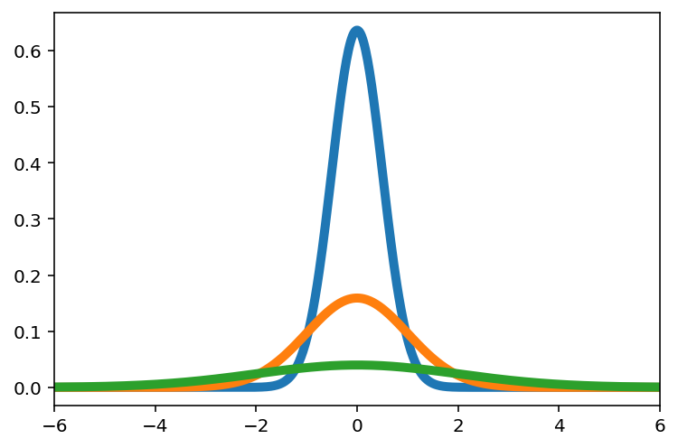
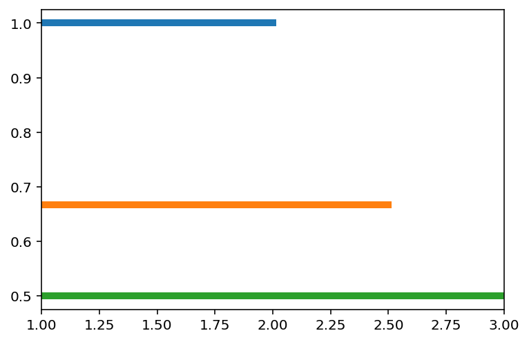

---
redirect_from:
  - "/appendixb-probabilities"
interact_link: content/AppendixB_probabilities.ipynb
kernel_name: python3
has_widgets: false
title: '3.4 Appendix B. Probabilities with Python.'
prev_page:
  url: /Lec9-Chem324
  title: '3.3 Mathematics of QM'
next_page:
  url: /features/markdown
  title: '4.0 Applications of QM'
comment: "***PROGRAMMATICALLY GENERATED, DO NOT EDIT. SEE ORIGINAL FILES IN /content***"
---
# Probability with Python


<div markdown="1" class="cell code_cell">
<div class="input_area" markdown="1">
```python
# Load the libs for numiercs and plotting
import numpy as np
import matplotlib.pyplot as plt
%matplotlib inline

#Load interactive widgets
import ipywidgets as widgets
from IPython.display import display

#If your screen has retina display this will increase resolution of plots
%config InlineBackend.figure_format = 'retina'

```
</div>

</div>


### Gaussian (Normal) distribution


Lets make gaussian distribution function with mu and sigma as parameters


$$p(x)= \frac{1}{2\pi \sigma^2} e^{-(x-\mu)^2/2\sigma^2}$$


<div markdown="1" class="cell code_cell">
<div class="input_area" markdown="1">
```python
def p_gauss(x, mu, sigma):   # x is the variable over which p is distributed while sigma and mu are parameters affecting the distribution
    
    coeff = 1/(2* np.pi * sigma**2)
    
    return coeff * np.exp( -(x-mu)**2 / (2 * sigma**2) )

```
</div>

</div>


Now you can try different values of x, mu sigma. Probability is higher when x is closer to mu. 


<div markdown="1" class="cell code_cell">
<div class="input_area" markdown="1">
```python
p_gauss(4, mu=0, sigma=1)

```
</div>

<div class="output_wrapper" markdown="1">
<div class="output_subarea" markdown="1">


{:.output_data_text}
```
5.3390535453281935e-05
```


</div>
</div>
</div>


Better yet we can make a plot for different values of mu and sigma. Here we show that sigma indeed corresponds to the variance of the distirbution


<div markdown="1" class="cell code_cell">
<div class="input_area" markdown="1">
```python
def plot_gauss(mu, sigma):
    
    x = np.linspace(-100,100,10000)  # The range is arbitrary. The point is to have value of mu inside the range.
    
    y = p_gauss(x,mu,sigma)      # Notice how we are using a function defined before instead of recreating again. 
    
    plt.plot(x, y, lw=5)
    
    plt.xlim([mu-3*sigma, mu+3*sigma]) # Showing values 3 standard deviation away from mean is enough to cover the function!

```
</div>

</div>


<div markdown="1" class="cell code_cell">
<div class="input_area" markdown="1">
```python
# try plotting different values of mu and sigma
plot_gauss(0, 0.5)
plot_gauss(0, 1)
plot_gauss(0, 2)

```
</div>

<div class="output_wrapper" markdown="1">
<div class="output_subarea" markdown="1">

{:.output_png}


</div>
</div>
</div>


Even better way to explore gaussian distirbution is via interactive widgets! 


<div markdown="1" class="cell code_cell">
<div class="input_area" markdown="1">
```python
@widgets.interact(mu=(-10,10), sigma=(1,25))

def plot_gauss(mu, sigma):
    
    x = np.linspace(-100,100,10000)  
    
    y = p_gauss(x,mu,sigma)      
    
    plt.plot(x, y, lw=5)

```
</div>

<div class="output_wrapper" markdown="1">
<div class="output_subarea" markdown="1">
{:.output_data_text}
```
interactive(children=(IntSlider(value=0, description='mu', max=10, min=-10), IntSlider(value=13, description='…
```

</div>
</div>
</div>


### Uniform distribution


$$p(x) = \frac{1}{a-b}$$   for $$x\to[a,b]$$


<div markdown="1" class="cell code_cell">
<div class="input_area" markdown="1">
```python
def p_unif(x, a, b):  # Make sure b is greater than a! 
    
    return x / (x*(b-a))  

```
</div>

</div>


Test that probability is uniformly distirbuted for all values of x


<div markdown="1" class="cell code_cell">
<div class="input_area" markdown="1">
```python
p_unif(1, 0, 10), p_unif(2, 0, 10),  p_unif(9, 0, 10)

```
</div>

<div class="output_wrapper" markdown="1">
<div class="output_subarea" markdown="1">


{:.output_data_text}
```
(0.1, 0.1, 0.1)
```


</div>
</div>
</div>


Lets make a plot of uniform distribution


<div markdown="1" class="cell code_cell">
<div class="input_area" markdown="1">
```python
def plot_unif(a, b):
    
    x = np.linspace(a,b,1000)  # The range needs to be inside a and b
    
    y = p_unif(x, a, b)       # Notice how we are using a function defined before instead of recreating again. 
    
    plt.plot(x, y, lw=5)
    
    plt.xlim([a, b])

```
</div>

</div>


<div markdown="1" class="cell code_cell">
<div class="input_area" markdown="1">
```python
plot_unif(1,2)
plot_unif(1,2.5)
plot_unif(1,3)

```
</div>

<div class="output_wrapper" markdown="1">
<div class="output_subarea" markdown="1">

{:.output_png}


</div>
</div>
</div>


<div markdown="1" class="cell code_cell">
<div class="input_area" markdown="1">
```python
@widgets.interact(b=(2,20))

def plot_uniform(b):
    
    x = np.linspace(1,b,1000)  # We fixed a at 1 and only vary b
    
    y = p_unif(x, 1, b)       
    
    plt.plot(x, y, lw=5)
    
    plt.ylim([0,1])

```
</div>

<div class="output_wrapper" markdown="1">
<div class="output_subarea" markdown="1">
{:.output_data_text}
```
interactive(children=(IntSlider(value=11, description='b', max=20, min=2), Output()), _dom_classes=('widget-in…
```

</div>
</div>
</div>

