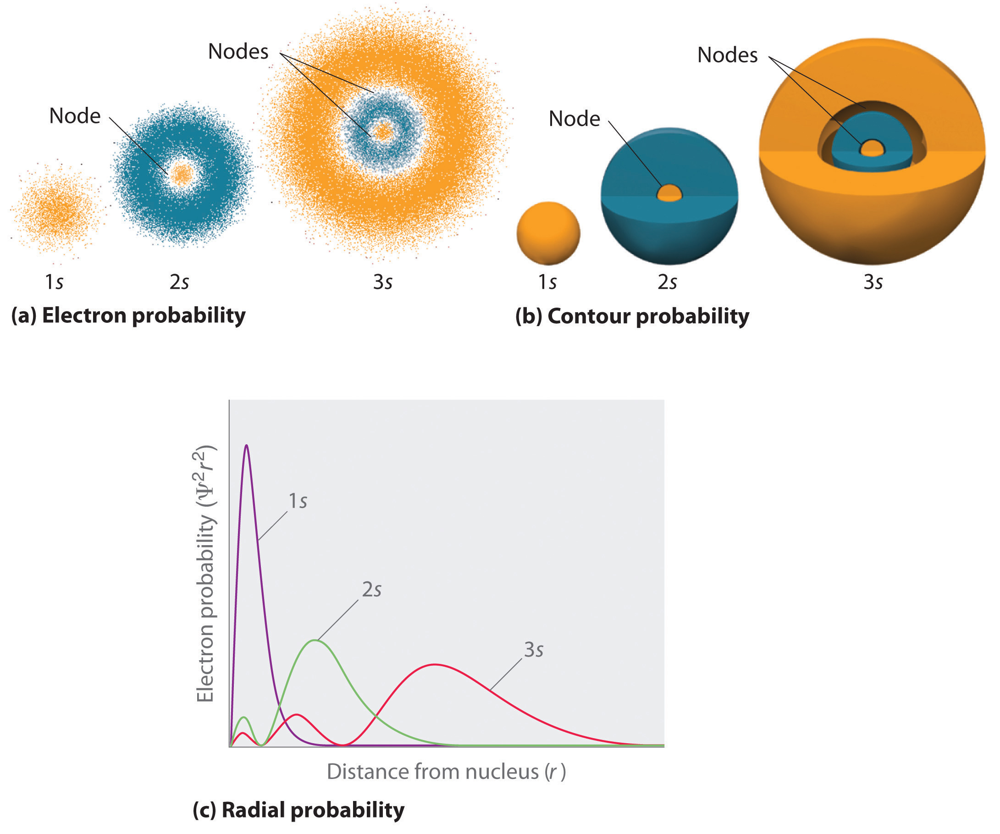
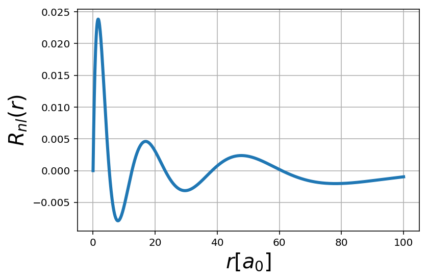
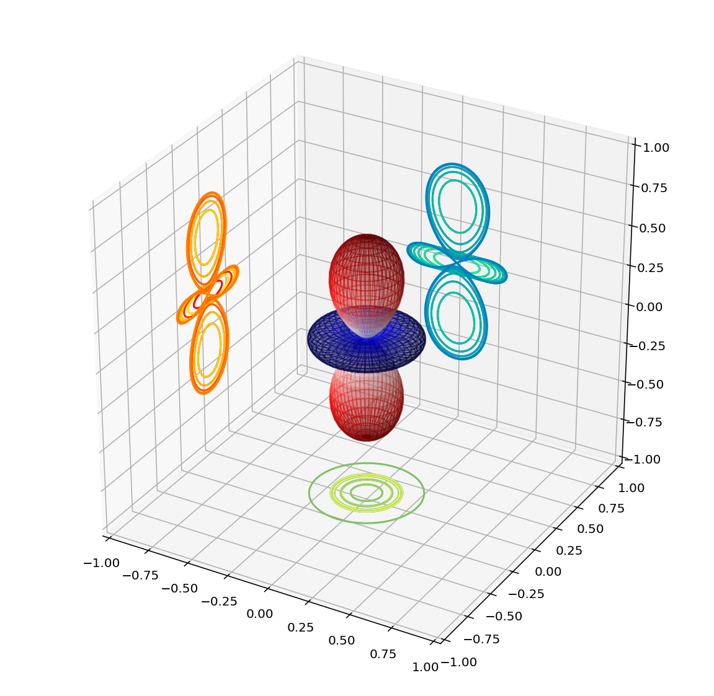

---
redirect_from:
  - "/h-atom-wavef"
interact_link: content/H-atom-wavef.ipynb
kernel_name: python3
has_widgets: false
title: '5.3 Visualizing H atom wavefunctions'
prev_page:
  url: /Lec5-2
  title: '5.2 Spin'
next_page:
  url: 
  title: ''
comment: "***PROGRAMMATICALLY GENERATED, DO NOT EDIT. SEE ORIGINAL FILES IN /content***"
---
## Visualizing wave functions of H atom


<div markdown="1" class="cell code_cell">
<div class="input_area" markdown="1">
```python
%matplotlib inline
import matplotlib.pyplot as plt

from matplotlib import cm, colors
from mpl_toolkits.mplot3d import Axes3D

import numpy as np
import scipy.integrate as integrate

# Increase resolution for retina display
from IPython.display import set_matplotlib_formats
set_matplotlib_formats('retina')

# Load interactive widgets
import ipywidgets as widgets

import ipyvolume as ipv

```
</div>

</div>


## Atomic orbitals: the visualization challanege.


### Note 1: Probability as a function of radial distance goes like $r^2 R(r)$
 
 
 


### Note 2 we use real part of the spherical harmonics which is physically identical to imaginary counterparts


### Note 3: In what follows we will adopt atomic units $a_0=1, \hbar=1, m_e=1, e=1$


## Plotting the radial part of wavefunction. The Laguerre polynomials


$$ R_{nl}(r) = \sqrt{\Big(\frac{2}{n a_0}\Big)^3 \frac{(n-l-1)!}{2n (n+l)!}} e^{-r/n a_0} \Big( \frac{2r}{na_0}\Big)^l  \cdot L^{2l+1}_{n-l-1} \Big(\frac{2r}{n a_0} \Big)$$


#### Step 1: Code up the function and do a basic plot


<div markdown="1" class="cell code_cell">
<div class="input_area" markdown="1">
```python
# Import special functions 
import scipy.special as spe

```
</div>

</div>


<div markdown="1" class="cell code_cell">
<div class="input_area" markdown="1">
```python
def psi_R(r,n=1,l=0):

    coeff = np.sqrt((2.0/n)**3 * spe.factorial(n-l-1) /(2.0*n*spe.factorial(n+l)))
    
    laguerre = spe.assoc_laguerre(2.0*r/n,n-l-1,2*l+1)
    
    return coeff * np.exp(-r/n) * (2.0*r/n)**l * laguerre

```
</div>

</div>


<div markdown="1" class="cell code_cell">
<div class="input_area" markdown="1">
```python
r = np.linspace(0,100,1000)

R = psi_R(r,n=5,l=1)

plt.plot(r, R**2, lw=3)

plt.xlabel('$r [a_0]$',fontsize=20)

plt.ylabel('$R_{nl}(r)$', fontsize=20)

plt.grid('True')

```
</div>

<div class="output_wrapper" markdown="1">
<div class="output_subarea" markdown="1">

{:.output_png}


</div>
</div>
</div>


#### Step 2: Add an interactive widget


<div markdown="1" class="cell code_cell">
<div class="input_area" markdown="1">
```python
nmax=10

@widgets.interact(n = np.arange(1,nmax,1), l = np.arange(0,nmax-1,1))

def plot_radial(n=1,l=0):
    
    r =    np.linspace(0,250,10000)
    
    psi2 = psi_R(r,n,l)**2 * (r**2)
    
    plt.plot(r, psi2, lw=2, color='red')
    

    ''' Styling the plot'''
    
    plt.xlabel('$r [a_0]$')

    plt.ylabel('$R_{nl}(r)$')
    
    rmax = n**2*(1+0.5*(1-l*(l+1)/n**2))
    
    plt.xlim([0, 2*rmax])

```
</div>

<div class="output_wrapper" markdown="1">
<div class="output_subarea" markdown="1">
{:.output_data_text}
```
interactive(children=(Dropdown(description='n', options=(1, 2, 3, 4, 5, 6, 7, 8, 9), value=1), Dropdown(descri…
```

</div>
</div>
</div>


## Plotting angular part of wavefunction: Spherical harmonics


$$
Y_{lm}(\theta,\phi) = \Theta_{lm}(\theta) \Phi_m (\phi) = \sqrt{\frac{2l+1}{4\pi} \frac{(l-m)!}{(l+m)!} } P_{lm}(cos \theta) \cdot e^{im\phi}
$$


#### Code up spherical function  $Y_{lm}(\phi,\theta)$.

Using scipy special funcions makes this one trivial. 


<div markdown="1" class="cell code_cell">
<div class="input_area" markdown="1">
```python
def psi_ang(phi,theta,l=0,m=0):
    
    sphHarm = spe.sph_harm(m,l,phi,theta)
    
    return sphHarm.real

```
</div>

</div>


#### Compute spherican harmonics $Y_{lm}(\phi,\theta)$ on the grid of $(\phi,\theta)$


<div markdown="1" class="cell code_cell">
<div class="input_area" markdown="1">
```python
phi, theta = np.linspace(0, np.pi, 100), np.linspace(0, 2*np.pi, 100)

phi, theta = np.meshgrid(phi, theta)

Ylm = psi_ang(theta,phi,l=2,m=0)

```
</div>

</div>


#### Convert spherical coordinates to Cartesian coordinates of the unit sphere, $r=1$ in order to make the $XYZ$ plot


<div markdown="1" class="cell code_cell">
<div class="input_area" markdown="1">
```python
x = np.sin(phi) * np.cos(theta) * abs(Ylm)
y = np.sin(phi) * np.sin(theta) * abs(Ylm)
z = np.cos(phi) * abs(Ylm)

```
</div>

</div>


#### Make 3D plot of spherical harmonics


<div markdown="1" class="cell code_cell">
<div class="input_area" markdown="1">
```python
'''Set up the 3D Canvas'''

fig = plt.figure(figsize=(10,10))
ax = fig.add_subplot(111, projection='3d')

''' Normalize color bar to [0,1] scale'''

fcolors = (Ylm - Ylm.min())/(Ylm.max() - Ylm.min())

'''Make 3D plot of real part of spherical harmonic'''

ax.plot_surface(x, y, z, facecolors=cm.seismic(fcolors), alpha=0.3)


''' Project 3D plot onto 2D planes'''

cset = ax.contour(x, y, z,20, zdir='z',offset = -1, cmap='summer')
cset = ax.contour(x, y, z,20, zdir='y',offset =  1, cmap='winter' )
cset = ax.contour(x, y, z,20, zdir='x',offset = -1, cmap='autumn')


''' Set axes limit to keep aspect ratio 1:1:1 '''

ax.set_xlim(-1, 1)
ax.set_ylim(-1, 1)
ax.set_zlim(-1, 1)

```
</div>

<div class="output_wrapper" markdown="1">
<div class="output_subarea" markdown="1">


{:.output_data_text}
```
(-1, 1)
```


</div>
</div>
<div class="output_wrapper" markdown="1">
<div class="output_subarea" markdown="1">

{:.output_png}


</div>
</div>
</div>


## Plot full atomic orbitlals


<div markdown="1" class="cell code_cell">
<div class="input_area" markdown="1">
```python
def HFunc(r,theta,phi,n,l,m):
    '''
    Hydrogen wavefunction // a_0 = 1

    INPUT
        r: Radial coordinate
        theta: Polar coordinate
        phi: Azimuthal coordinate
        n: Principle quantum number
        l: Angular momentum quantum number
        m: Magnetic quantum number

    OUTPUT
        Value of wavefunction
    '''


    return psi_R(r,n,l) * psi_ang(phi,theta,l,m)

```
</div>

</div>


<div markdown="1" class="cell code_cell">
<div class="input_area" markdown="1">
```python
nmax = 10
lmax = nmax-1

@widgets.interact(n=np.arange(1,nmax,1), l = np.arange(0,nmax-1,1), m=np.arange(-lmax,lmax+1,1))

def psi_xz_plot(n=1,l=0,m=0):

    plt.figure(figsize=(10,8))
    
    
    limit = 4*(n+l) 
    
    x_1d = np.linspace(-limit,limit,500)
    z_1d = np.linspace(-limit,limit,500)
    
    x,z = np.meshgrid(x_1d,z_1d)
    y   = 0
    
    r     = np.sqrt(x**2 + y**2 + z**2)
    theta = np.arctan2(np.sqrt(x**2+y**2), z )
    phi   = np.arctan2(y, x)

    
    psi_nlm = HFunc(r,theta,phi,n,l,m)
    
    #plt.pcolormesh(x, z, psi_nlm, cmap='inferno')  # Try cmap = inferno, rainbow, autumn, summer, 
    
    plt.contourf(x, z,  psi_nlm, 20, cmap='seismic', alpha=0.6)  # Classic orbitals
    
    plt.colorbar()
    
    plt.title(f"$n,l,m={n,l,m}$",fontsize=20)
    plt.xlabel('X',fontsize=20)
    plt.ylabel('Z',fontsize=20)

```
</div>

<div class="output_wrapper" markdown="1">
<div class="output_subarea" markdown="1">
{:.output_data_text}
```
interactive(children=(Dropdown(description='n', options=(1, 2, 3, 4, 5, 6, 7, 8, 9), value=1), Dropdown(descri…
```

</div>
</div>
</div>


<div markdown="1" class="cell code_cell">
<div class="input_area" markdown="1">
```python
import ipyvolume as ipv

```
</div>

</div>


<div markdown="1" class="cell code_cell">
<div class="input_area" markdown="1">
```python
#Variables to adjust
maxi = 60
resolution = 160

base = np.linspace(-maxi, maxi, resolution)[:,np.newaxis,np.newaxis]
x2 = np.tile(base, (1,resolution,resolution))
y2 = np.swapaxes(x2,0,1)
z2 = np.swapaxes(x2,0,2)

total = np.concatenate((x2[np.newaxis,:],y2[np.newaxis,:],z2[np.newaxis,:]), axis=0)

r2 = np.linalg.norm(total, axis=0)
#Alternative theta calculation
#theta3 = np.abs(np.arctan2(np.linalg.norm(total[:2], axis=0),-total[2]))
np.seterr(all='ignore')
phi2 = np.arctan(np.divide(total[2],np.linalg.norm(total[:2], axis=0))) + np.pi/2
theta2 = np.arctan2(total[1],total[0])

```
</div>

</div>


<div markdown="1" class="cell code_cell">
<div class="input_area" markdown="1">
```python
ipv.figure()

psi = HFunc(r2,theta2,phi2,2,1,1)

ipv.volshow(r2**2 * np.sin(phi2)*psi**2)

ipv.show()

```
</div>

<div class="output_wrapper" markdown="1">
<div class="output_subarea" markdown="1">
{:.output_data_text}
```
VBox(children=(VBox(children=(HBox(children=(Label(value='levels:'), FloatSlider(value=0.1, max=1.0, step=0.00…
```

</div>
</div>
</div>


<div markdown="1" class="cell code_cell">
<div class="input_area" markdown="1">
```python
psi.shape

```
</div>

<div class="output_wrapper" markdown="1">
<div class="output_subarea" markdown="1">


{:.output_data_text}
```
(160, 160, 160)
```


</div>
</div>
</div>

