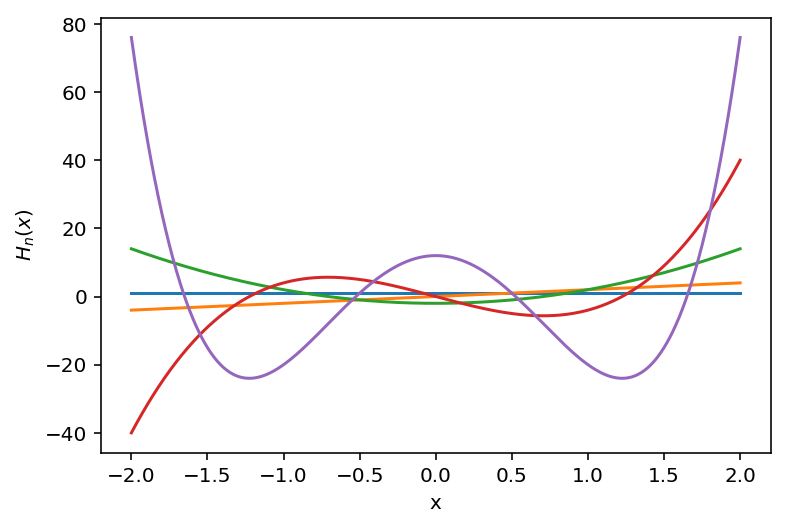
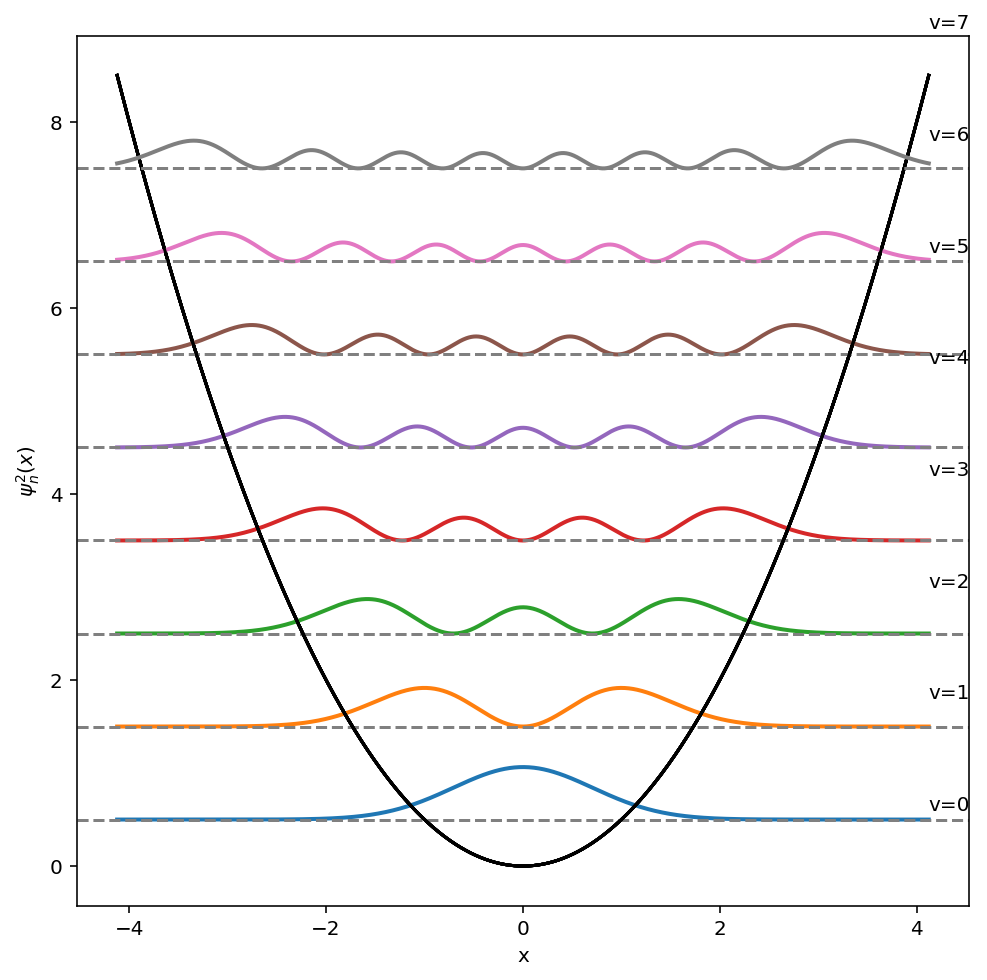

---
redirect_from:
  - "/harmosc-visualize"
interact_link: content/HarmOsc_visualize.ipynb
kernel_name: python3
has_widgets: false
title: '4.5 Visualziing Harmonic Oscillator Solutions'
prev_page:
  url: /Lec4-4
  title: '4.4 Angular momentum in QM'
next_page:
  url: /SphHarm_visualize
  title: '4.6 Visualziing Spherical Harmonics'
comment: "***PROGRAMMATICALLY GENERATED, DO NOT EDIT. SEE ORIGINAL FILES IN /content***"
---
## Visualizing the solutions of harmonic oscillator problem.


<div markdown="1" class="cell code_cell">
<div class="input_area" markdown="1">
```python
# First load the numpy/scipy/matplotlib
import numpy as np
import matplotlib.pyplot as plt

%matplotlib inline

#load interactive widgets
import ipywidgets as widgets
from IPython.display import display

#If your screen has retina display this will increase resolution of plots
%config InlineBackend.figure_format = 'retina'

```
</div>

</div>


### Eigenfunctions and eigenvalues of Harmonic oscillator problem


The harmonic oscillator is often used as an approximate model for the behaviour of some quantum systems, for example the vibrations of a diatomic molecule. Potential energy is a simple quadratic function of dsiplacement: 

$$V(x)=\frac{1}{2}kx^2$$ 

- The Schrödinger equation for a particle of mass m moving in one dimension in a potential 

$$
H = -\frac{\hbar^{2}}{2m} \frac{d^{2}}{d x^{2}} + \frac{1}{2} kx^{2}.
$$

- The **eigenfunctions** are expressed in terms of Hermite polynomials $H_v(x)$, special functions well known in mathematical physics. Where $N_v$ is a normalization factor.

$$\psi(x) = N_v \cdot H_v(x) \cdot e^{-x^2/2}$$

$$H_v(x) = (-1)^v (e^{x^2})\frac{d^v}{dx^v} (e^{-x^2})$$

$$N_v = (\sqrt{\pi} 2^v v!)^{-1/2}$$

- The **eigenvalues** are a simple function of quantum number v:

$$E(v)= h\nu \Big (v+\frac{1}{2}\Big)$$


### Hermite polynomials

- Definition:

$$H_v(x) = (-1)^v (e^{x^2})\frac{d^v}{dx^v} (e^{-x^2})$$

- Recursion relation:

$$x H_v(x) = v H_{v-1}+\frac{1}{2} H_{v+1}(x)$$


| Table of first eight of Hermite polynomials $H_v(x)$ |
| :--------------------------------------------------: |
|                       $H_0=1$                        |
|                       $H_1=2x$                       |
|                     $H_2=4x^2-2$                     |
|                    $H_3=8x^3-12$                     |
|                 $H_4=16x^4-48x^2+12$                 |
|               $H_5=32x^5-160x^3+120 x$               |
|            $H_6=64x^6-480x^4+720 x^2-120$            |
|         $H_7=128x^7-1344 x^5+3360 x^3-1680x$         |


### Plotting hermite polynomials using scipy and numpy and matplotlib

The scipy.special has large collection of special functions inclduing hermite polynomials! While polynomials listed in the table are simple enough to hand type we are going to be lazy and use **scipy.special.hermite** wich provides us with polynomials of any degree to use in numerical calculations!


<div markdown="1" class="cell code_cell">
<div class="input_area" markdown="1">
```python
# Import hermite polynomials and factorial to use in normalization factor
from scipy.special import hermite
from math import factorial

#Check to see if they match the table
H=hermite(4)
print(H)

```
</div>

<div class="output_wrapper" markdown="1">
<div class="output_subarea" markdown="1">
{:.output_stream}
```
    4      2
16 x - 48 x - 8.882e-16 x + 12
```
</div>
</div>
</div>


Now let us plot hermite polynomials $H_v(x)$ on some range of values x, 


<div markdown="1" class="cell code_cell">
<div class="input_area" markdown="1">
```python
x=np.linspace(-2,2,1000) # Range needs to be specified for plotting functions of x

for v in range(0,3):
    
    H=hermite(v)
    
    f=H(x)
    
    plt.plot(x,f)

plt.xlabel('x')
plt.ylabel(r'$H_n(x)$')

```
</div>

<div class="output_wrapper" markdown="1">
<div class="output_subarea" markdown="1">


{:.output_data_text}
```
Text(0, 0.5, '$H_n(x)$')
```


</div>
</div>
<div class="output_wrapper" markdown="1">
<div class="output_subarea" markdown="1">

{:.output_png}


</div>
</div>
</div>


### Harmonic Oscillator wave functions

Now we can write down harmonic oscillator wave functions which are product of Hermite polynomials with a gaussian function and normalization factor:

$$\psi_v(x) = N_v H_v(x) e^{-x^2/2} $$


<div markdown="1" class="cell code_cell">
<div class="input_area" markdown="1">
```python
def N(v):
    '''Normalization constant '''
    
    return 1./np.sqrt(np.sqrt(np.pi)*2**v*factorial(v))

def psi(v, x):
    """Harmonic oscillator wavefunction for level v computed on grid of points x"""
    
    Hr=hermite(v)
    
    Psix = N(v)*Hr(x)*np.exp(-0.5*x**2)
    
    return Psix

```
</div>

</div>


<div markdown="1" class="cell code_cell">
<div class="input_area" markdown="1">
```python
# Check orthogonality

psi(1,x) @ psi(4,x)

```
</div>

<div class="output_wrapper" markdown="1">
<div class="output_subarea" markdown="1">


{:.output_data_text}
```
-4.440892098500626e-16
```


</div>
</div>
</div>


<div markdown="1" class="cell code_cell">
<div class="input_area" markdown="1">
```python
# Normalization is computed by using numerical integration with trapezoidal method:
from scipy.integrate import trapz

# remember that x runs form -inf to +inf so lets use large xmin and xmax
x=np.linspace(-10,10,1000)

psi2=psi(5,x)**2

Integral = trapz(psi2,x)

print(Integral)

```
</div>

<div class="output_wrapper" markdown="1">
<div class="output_subarea" markdown="1">
{:.output_stream}
```
1.0000000000000009
```
</div>
</div>
</div>


### Visualize eigenfunctions of harmonic oscillator $\psi_v(x)$


<div markdown="1" class="cell code_cell">
<div class="input_area" markdown="1">
```python
@widgets.interact(v=(0,50))

def plot_psi(v=0):
    
    x=np.linspace(-10,10,1000)
    
    y= psi(v,x)**2
    
    plt.plot(x,y,lw=2)
    
    plt.grid('on')  
    plt.xlabel('x',fontsize=16)
    plt.ylabel('$\psi_n(x)$',fontsize=16)

```
</div>

<div class="output_wrapper" markdown="1">
<div class="output_subarea" markdown="1">
{:.output_data_text}
```
interactive(children=(IntSlider(value=0, description='v', max=50), Output()), _dom_classes=('widget-interact',…
```

</div>
</div>
</div>


### Plot Eigenvalues and eigenfunctions of harmonic oscillator


<div markdown="1" class="cell code_cell">
<div class="input_area" markdown="1">
```python
def E(v):
    '''Eigenvalues in units of h'''
    
    return (v + 0.5)

def V(x):
    """Potential energy function"""
    
    return 0.5*x**2

```
</div>

</div>


First we decide on how many levels to plot and what is the range for x. 


<div markdown="1" class="cell code_cell">
<div class="input_area" markdown="1">
```python
# plot up to level vmax
VMAX=8 

# Range of x determine by classical tunring points:
xmin, xmax = -np.sqrt(2*E(VMAX)), np.sqrt(2*E(VMAX))

x = np.linspace(xmin, xmax, 1000)

```
</div>

</div>


Next we plot classical potential and then plot eigenfunctions padded up by eigenvalues to have textbook like picture


<div markdown="1" class="cell code_cell">
<div class="input_area" markdown="1">
```python
fig, ax = plt.subplots(figsize=(8,8))

for v in range(8):
     
    # plot potential V(x)
    ax.plot(x,V(x),color='black')
    
    # plot psi squared which we shift up by values of energy
    ax.plot(x,psi(v,x)**2 + E(v), lw=2)
    
    # add lines and labels
    ax.axhline(E(v), color='gray', linestyle='--') 
    ax.text(xmax, 1.2*E(v), f"v={v}")

    
ax.set_xlabel('x')
ax.set_ylabel('$\psi^2_n(x)$')

```
</div>

<div class="output_wrapper" markdown="1">
<div class="output_subarea" markdown="1">


{:.output_data_text}
```
Text(0, 0.5, '$\\psi^2_n(x)$')
```


</div>
</div>
<div class="output_wrapper" markdown="1">
<div class="output_subarea" markdown="1">

{:.output_png}


</div>
</div>
</div>

