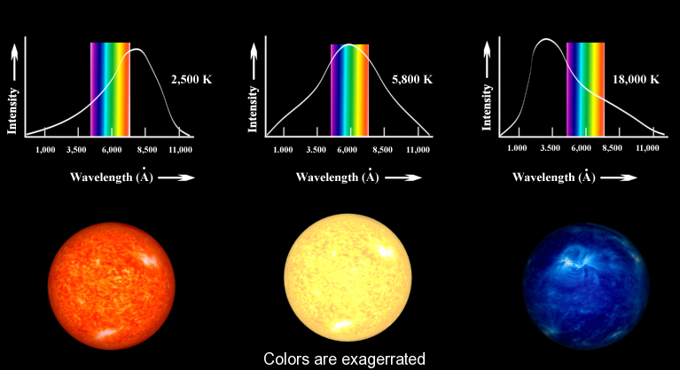
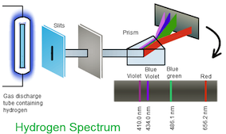

---
redirect_from:
  - "/lec1-chem324"
title: '1.1 Black Body Radiation.'
prev_page:
  url: /LEC0-Chem324
  title: '1.0 Intro to QM thinking.'
next_page:
  url: /LEC2-Chem324
  title: '1.2 Photoelectric effect.'
title: |

    | Lecture 1.1, Chem-324, Fall2019

    | ***    

    | Birth of QM and discovery of energy quantization

author: 'Davit Potoyan'

institute: 'Iowa State University, Ames IA 50011'

comment: "***PROGRAMMATICALLY GENERATED, DO NOT EDIT. SEE ORIGINAL FILES IN /content***"
---

## Outline for Lecture 1.1: 

- **Energies of atoms and molecules are _quantized_ existing in the form of discrete chunks called quanta.** 

- **Quantization of energy is a fundamental aspect of our physical reality and cannot be derived but can is observed in all quantum experiments. Is fully explained by the theory of quantum mechanics.**  
  
- **Key historical developments leading to the birth of QM are _black body radiation_, _double slit experiment_, _photoelectric effect_ .** 

## What makes QM a fundamentally different theory with respect to CM?:  

- **Classical mechanics (CM) assumes:** Energies can take any value! Just like climbing a continuous ramp.
- **Quantum mechanics asserts:** Energy can only take certain discrete values! More like stairs on a staircase (e.g, 1*E, 2*E 3*E... but not 2.5*E or 1.1*E). Energy is quantized! The reason energy may appear continuous in CM is because differences are small or measuring apparatus does not have sufficient resolution.

## Electromagnetic spectrum

 
- **High-frequency waves carry much higher energy.** This means X-ray or Gamma-rays can only be generated by heating “stuff” up at very high temperatures. This happens naturally at the core of the sun!
- **Low-frequency waves carry less energy.** Can be generated in a “microwave” or by broadcasting antennas. 
- **The visible light.** occupies a narrow frequency region  in between. 

## Relationship between frequency, wavelength and speed of light. 

Wavelength **$\lambda$** and frequency **$\nu$** of light are inversely proportional with constant of proportionality being the speed of light **c**:

 $$\lambda \nu = c$$

---
- Think of wavelength as distance between wave peaks 
  (nanometers, nm)

- Think of frequency as a 
  distance traveled in 1 second (hz). 

- Speed of light in vacuum, c is a constant (3 10^6 m/s).  Thus knowing the wavelength allows you to compute the frequency and vice versa.  

## What is the relationship between frequency of radiation $\nu$ and energy $E$?  

---

This is not such a trivial question. In fact, this very question arose in connection with black body radiation; an experiment that forever changed the course of history by giving birth to quantum mechanics! 

## What do we mean by black body and black body radiation: a visual guide. 

{width=50%}

## Thermodynamically speaking 

**A black body is an idealized system which is in equilibrium, maintained at some constant Temperature T which both absorbs and emits every wavelength of electromagnetic radiation.**

 Equilibrium condition in thermodynamics means that the system emits as much energy as it absorbs.IN other words outflix=influx. The reason its called black body is that it absorbs every wavelength that hits the surface, therefore, appearing as 100% perfect black object. If an object has a color, it is because it is reflecting certain wavelengths of light which then gets detected by our eye retina. The distribution of wavelengths, which is emitted by a blackbody, is determined only by its temperature. 

## Applications of black Body radiation

The black body is used as a standard with which the absorption of real bodies is compared. Roughly, we can say that the stars radiate like blackbody radiators. This is important because it means that we can use the theory for blackbody radiation to infer the temperature of the stars from their colors!

- Fun, informative video [The Fingerprint of Stars](https://www.youtube.com/watch?v=uG4xe9cNpP0) 

- Learn more about light waves [Visible Light Waves](https://www.youtube.com/watch?v=PMtC34pzKGc)  

## What did the legendary black body radiation show?

When heated, the black body starts emitting light. As temperature T gets higher, the radiation changes its color from red to yellow to blue. How can we explain this?

Notice that as temperature T goes up, two things happen:

- Radiation intensity goes up, implying higher energy of radiation.
- Distribution of wavelengths shifts left to lower values (left panel) which is the same as  saying the distribution of frequency shifts right (right panel)

## What is classical mechanics & thermodynamics perspective on black body radiation?

- What is “temperature”? A measure for kinetic energy per particle associated with translational, rotation, vibrational degrees of freedom. 
- What is light? Think of an oscillating spring with frequency $\nu$
- Thermodynamics: Heat can only flow from high to low temperature. In equilibrium, each degree of freedom in our case each spring/oscillator gets the same thermal energy $k_B T$.

## Implications of classical mechanics and thermodynamics.

Classical mechanics leads to the Rayleigh-Jeans law (see the dashed curve) which only works for the low wavelength radiation. 
According to this law the number of oscillators N with frequency
 $\nu$ is $\nu^2$ . Following the equipartition principle, each oscillator has $k_BT$ of energy. Thus the intensity of radiation, according to classical mechanics, is **$$I \sim k_B T \nu^2$$**. Intensity increases to infinity at high $\nu$ (or low $\lambda$). This is known as the ultraviolet catastrophe!

## Max Planck finds the right explanation for black body radiation 

In 1900 Planck found that the theoretical curve can very closely match the experimental curve if one postulates that only the discrete (quantized) values for electromagnetic oscillators are possible. The iconic formula resulting from this postulate which now bears his name is $E= nh\nu$ where n=0,1,2,3 are quantum numbers of energy levels.

- This means atoms and molecules absorb and emit radiation in discrete quantities, multiples of $h\nu$, which are called quanta! $E_1, E_2,E_3 …$.
- When light is emitted or absorbed, the atom or molecule jumps from one state to another and the energy difference $h\nu = E_n – E_m$ is either coming from light or is used to generate light.

## How Plank's quantization postulate explains black body radiation

According to classical mechanics, on average each degree of freedom of an oscillator gets $kT$ of thermal energy. 

$$\langle E \rangle=kT$$ 

In Quantum Mechanics, however, because energy levels are quantized on average each degree of freedom of oscillator ends up getting: 

$$\langle E \rangle=k_B T\Big[ \frac{h\nu/kT}{e^{h\nu/kT}-1} \Big ]$$ 

These expression are obtained by taking averages over energy values of oscillators weighted by Boltzman distribution which governs the thermal equilibrium: 

> - For classical case average is over continuum of energies $$\langle E \rangle = \int  p(x) E(x) dx$$ with $E(x)=kx^2/2$ and $P(E)\sim e^{-E(x)/kT}$ 
> - For quantum case average is a sum over discrete values $$\langle E \rangle = \sum_n p_n E_n$$ with $E_n=nh\nu$ for quantum oscillators $P(E_n)\sim e^{-E_n/k_B T}$.   

## Extreme quantum and classical limits.

- At very low frequencies, we recover the classical result! This explains why classical mechanics was at least partially successful. Thermal energy $k_BT$ populates lots of quantum levels with low enough frequencies.

$$h\nu \ll k_BT,\,\,\,\, e^{h\nu/k_BT}\approx 1+\frac{h\nu}{k_BT}$$  $$\langle E \rangle=k_B T\Big[ \frac{h\nu/k_BT}{e^{h\nu/k_BT}-1} \Big ] \rightarrow k_BT$$

- At high frequencies we see that the exponents kills the energy expression.  Thermal energy kT can no longer afford to occupy quantum levels with high frequencies, thus average oscillator energy goes down with increasing frequency:

$$h\nu \gg k_BT,\,\,\,\, e^{h\nu/k_BT}\approx \infty$$  $$\langle E \rangle=k_B T\Big[ \frac{h\nu/k_BT}{e^{h\nu/k_BT}-1} \Big ] \rightarrow 0$$

## Planck equation and Planck’s constant

 

$$E= h\nu$$

- Unit of planck constant, $h = 6.63 10^{–34} J s$
- Unit of frequency $\nu$, $s^{-1}$.

 
Often also written as $E = nh\nu$ (n = 0,1,2,…) to specify that for energy adds up with number of photos n. We thus learn that discretized energy levels accessible by photons are the only allowable energy levels that atoms/molecules can have. All energies are quantized!

Note how small $h$ is in the macroscopic units (such as J s). This is why quantization of energy is hardly noticeable and classical mechanics works so well at the macro scale.
In the limit $h \rightarrow 0$, $E$ becomes continuous, and an arbitrary real value of E is allowed. This is the classical limit.

## Quantization of atomic spectra.

Measurements of atomic emission/absorption spectra were another key experimental evidence showing that energy levels of individual atoms are quantized.

Notice the existence of discrete frequencies in the spectrum consistent with Planck’s assumption. 
Different colors originate from different frequencies being emitted or absorbed by matter.

## Empirical expressions for predicting spectral lines.

- Spectral lines were rationalized by Rydberg who derived an empirical formula showing that differences in spectral lines of the Hydrogen atom are dictated by integer numbers. Integer numbers indeed will go on to play a special role in quantum theory. 

- Blackbody radiation and atomic spectra showed very clearly that atoms exist in states that occupy discrete energy levels.
- Atoms and molecules exchange energy with the environment by jumping from one state Em to another En. The energy difference between these levels  (Em-En)=hv is either supplied by light (absorption) or used to generate light (emission).

## Summary

- Energies of stable atoms, molecules, electromagnetic radiation are discrete (quantized) and are not continuous. Energies of macroscopic bodies are quantized as well, but we do not see it since energy levels are so closely spaced that they appear as continuous for all practical purposes. 
- Classical mechanics works for macroscopic bodies but fails to describe the dynamics of microscopic particles. 
- Some macroscopic phenomena, such as the red color of hot metals, heat capacity of solids at a low temperature, and colors of matter are all due to quantum effects.
- Quantized nature of energy is learned in experiments and cannot be derived. We must simply accept it and move on to construct quantum theory consistent with the observations. 

