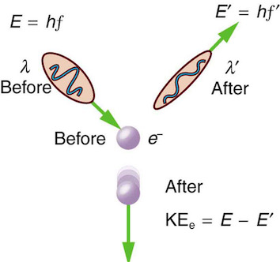

---
redirect_from:
  - "/lec3-chem324"
title: '1.2 Wave particle duality'
prev_page:
  url: /LEC2-Chem324
  title: '1.1 Photoelectric effect.'
next_page:
  url: /LEC1-Chem324
  title: '1.3 Crash course of Python and interactive plotting.'

title: |

    | Lecture 3, Chem-324, Fall2019

	|

    | Electron diffraction and wave particle duality.

author: 'Davit Potoyan'

institute: ' Iowa State University, Ames IA 50011'

toc: false

comment: "***PROGRAMMATICALLY GENERATED, DO NOT EDIT. SEE ORIGINAL FILES IN /content***"
---

## Outline for Lecture 3: 

- **A physical entity has both wave-like (wavelengths, interference, diffraction, etc.) and particle-like (momentum, collision, countable, etc.) characteristics.**
- **Compton scattering, electron diffraction show that concepts of particle and wave are mutually not exclusive and characteristics of all objects!**

## Electron diffraction

- Davisson and Germer at Bell Labs showed that electrons exhibit diffraction, a phenomenon characteristic of a wave.

- Electron diffraction and neutron diffraction are widely used experimental techniques today, complementing X-ray diffraction.

## Diffraction and color. 

Thin films of oil, soap bubbles, butterfly wings, sea shells, CD and DVD, etc. show a rainbow pattern. This is caused by the constructive and destructive interference of light traveling slightly different paths.

An electron can be scattered by different layers of a crystal lattice and interfere constructively or destructively, giving rise to alternating intensity patterns. 

## Bragg's formula for diffraction. 

One expect waves like X-rays to show interference patterns according to this formula. Interference was traditionally thought of purely a wave like phenomena. 

- X-rays interact with the atoms in a crystal.

- According to the $2\theta$ deviation, the phase shift causes constructive (left figure) or destructive (right figure) interferences.

$$2d sin\theta = n\lambda$$

Maxima and minima in interference patters is dictated by simple geometric  argument captured in Bragg’s formula: 
 
## Davisson & Germer show that electrons scatter just like X-rays!

- This is the first experiment which showed that elctrons can behave like waves and show interference patterns. The basic experimental arrangement is shown along with the nickel crystal structure. 

- In 1925, Davisson and Germer were studying electron scattering from various materials. To their great surprise they discovered that at certain angles there was a peak in the intensity of the scattered electron beam. This peak indicated wave behavior for the electrons, and could be interpreted by the Bragg law (previously only applied to X-ray scattering) to give values for the lattice spacing in the nickel crystal. 

## Diffraction patterns

Computing wavelength from de Broglie relation confirmed that thinking of electrons as having dual wave-particle properties was correct with impressive agreement between experimental prediction and theory. 

## Compton scattering

Arthur Compton showed that X-rays get scattered off free electrons like elastic billiard balls. Applying conservation of momentum principle (previously only applied to particle like objects) it was shown that the outgoing X-rays should be of longer wavelength than the incoming ones. This means that a moving photon hits the resting free electron and transfers some energy to get the electron moving. Not that this experimental result makes sense only if you think of photon as a particle with linear momentum which gets bounced off the electron.

## Wave particle duality as universal feature of nature. 

- Light is a wave and a particle. An electron is also a particle and a wave. Is everything a wave and a particle? The answer is YES! This is what is meant by wave-particle duality.  Sometimes we only see one side of the duality because under some conditions either wave or particle characteristics are more pronounced. 

- The wave-like and particle-like characteristics of a physical entity are inversely proportional to each other as described by the de Broglie relationship.

## De Broglie comes up with a simple equation which establishes the duality of matter. 

## Summary

- A physical entity has both wave-like (wavelengths, interference, diffraction, etc.) and particle-like (momentum, collision, countable, etc.) characteristics.

- Wave-like and particle-like characteristics are inversely proportional to each other and are quantified by de Broglie relation: $\lambda=\frac{h}{p}$

- An electron has a wavelength; a photon has a momentum. Welcome to the reality where everything can behave both as wave and a particle!

