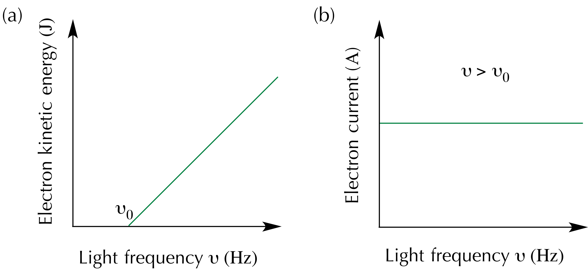

---
redirect_from:
  - "/lec2-chem324"
title: '1.2 Photoelectric effect.'
prev_page:
  url: /Lec1-Chem324.html
  title: '1.1 Black Body Radiation.'
next_page:
  url: /Lec3-Chem324.html
  title: '1.3 Wave particle duality'
title: |

    | Lecture 1.2, Chem-324, Fall2019

    | ***

    | Photoelectric effect and photons.

author: 'Davit Potoyan'

institute: ' Iowa State University, Ames IA 50011'

comment: "***PROGRAMMATICALLY GENERATED, DO NOT EDIT. SEE ORIGINAL FILES IN /content***"
---

## Outline for Lecture 1.2: 

{width=40%}

**Photoelectric effect: Electrons are ejected when light is shone onto a material. This experiment puzzled 20th century scientists who thought of light as being a continuous stream of waves.**

**Only by abandoning classical thinking and accepting the reality of quantized energy reconciles experiments with theory.**

## Photoelectric effect contradicts classical mechanics.

- To reconcile experiment with theory Planck had to assume that a heated material absorbs and emits light with discrete energies: $0, h\nu, 2h\nu, 3h\nu, …$.  At a time this discreteness was thought to be nothing more than a temporary mathematical trick to fix theory. 

- Einstein, on the other hand, was more imaginative and saw in Plank’s prescription more than just a math trick. He suggested that light can behave like a stream of particles with discrete countable energy packets which he called photons. This view was instrumental in making sense of the photoelectric experiment. 

-  Thus experiments showed that energies of both matter and light are quantized!

## Photoelectric effect

When you shine a light with sufficient energy content (UV radiation) on a metal surface electrons, start flying off the surface. This is the essence of the photoelectric effect. Observation of the photoelectric effect was crucial for showing that only quantum mechanics can make sense of how light interest with the matter.

## Applications of photoelectric effect

Besides its historical role in the establishment of QM photoelectric effect has many practical applications. It is relevant for the design of solar cells, photovoltaics, photoelectron spectroscopy, night vision, etc. 

{width=40%}

## Failure of classical way of thinking about light. 

Early experiments of photoelectric effect appeared truly puzzling to scientists of the 20th century for the following reasons:

- They expected to see more electrons being ejected when increasing the intensity or duration of radiation. According to CM if one shines the light long enough or increases the intensity by pumping more energy then surely those pesky electrons will start flying. 
  (reminder: Intensity of light is a quantity measuring the amount of energy transferred per unit surface per unit time.)

- That was not at all what experiments showed. Unless radiation had a frequency above a certain threshold $\nu_0$ not a single electron would escape regardless of the intensity of radiation. That was really weird. 

---

{width=90%}

- In striking contradicton with classical mechanics electrons  get ejected immediately once the frequency threshold is crossed even if the intensity of the radiation is minimal. 

- Furthermore, the kinetic energy of an ejected electron is a linearly increasing function of the frequency of light with no dependence on the intensity.  

---

- The puzzling (from CM point of view) behaviour of photoelectric effect becomes clear once we thinking of light as discrete packets of energy called photons. From quantum mechanics point of view once a photon transfers the necessary amount of energy to the material, one electron gets ejected from the metal. 

$$(E_{photon}-E_{photon})=KE$$

- If energy of photon is smaller $E_{photon} < h\nu_0$  than electron stays bound; if $E_{photon}> h\nu_0$ electron gets ejected and any extra energy, gets converted into kinetic energy since the total energy is conserved. This explains why kinetic energy is a linear function of frequency (Fig a) and why there is no dependence on intensity (Fig b).

