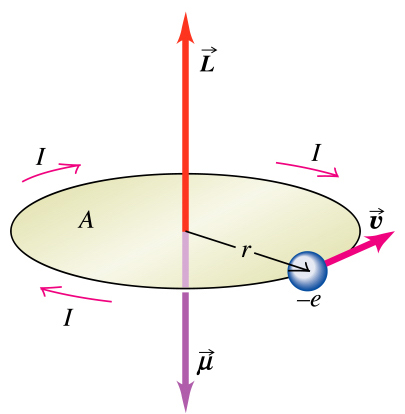
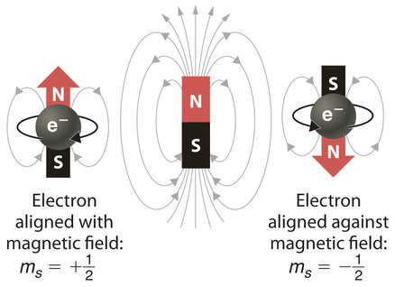
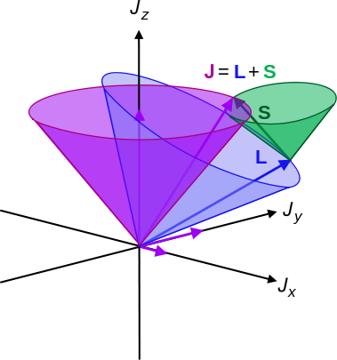
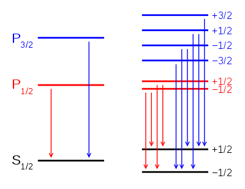

---
redirect_from:
  - "/lec5-2"
title: '5.2 Spin'
prev_page:
  url: /Lec5-1
  title: '5.1 Schrodinger equation for Hydrogen atom'
next_page:
  url: /H-atom-wavef
  title: '5.3 Visualizing H atom wavefunctions'
comment: "***PROGRAMMATICALLY GENERATED, DO NOT EDIT. SEE ORIGINAL FILES IN /content***"
---
## Outline for Lecture 5.2:  "Spin"

### Rotating charge generates mangetic moment

### Effect of magnetic field on atoms

### Spin as a tiny magnet

### Stern-Herlach experiment

<html>

<iframe width="560" height="315" src="https://www.youtube.com/embed/jDxUaBYINeQ" frameborder="0" allowfullscreen>
</iframe>
</html>

### Spin-Orbit coupling

### Zeeman effect

