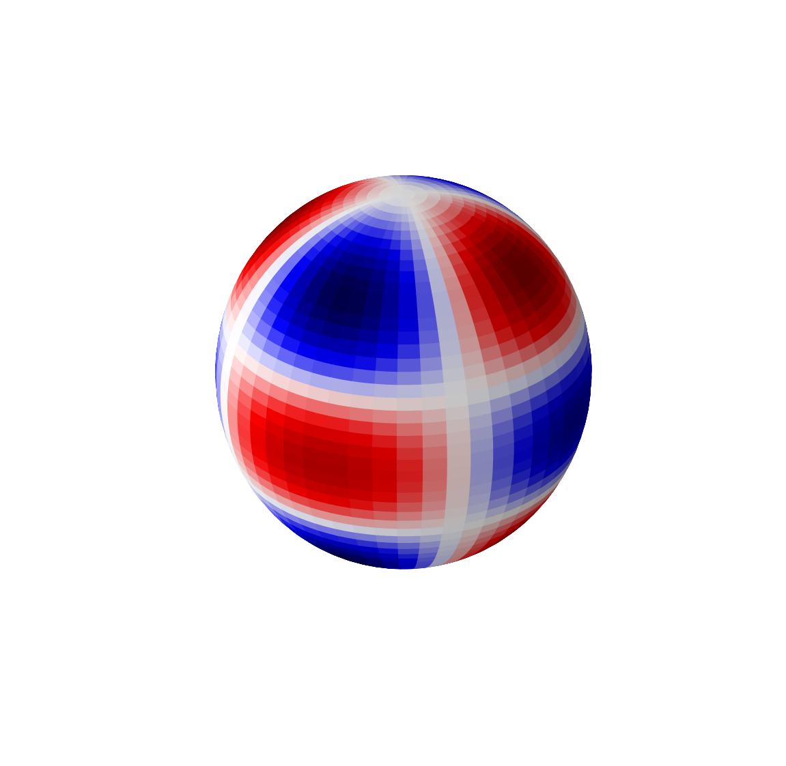

---
redirect_from:
  - "/sphharm-visualize"
interact_link: content/SphHarm_visualize.ipynb
kernel_name: python3
has_widgets: false
title: '4.6 Visualziing Spherical Harmonics'
prev_page:
  url: /HarmOsc_visualize
  title: '4.5 Visualziing Harmonic Oscillator Solutions'
next_page:
  url: /Lec5-0
  title: '5.0 Hydrogen atom'
comment: "***PROGRAMMATICALLY GENERATED, DO NOT EDIT. SEE ORIGINAL FILES IN /content***"
---
## Visualizing the solutions of harmonic oscillator problem.


<div markdown="1" class="cell code_cell">
<div class="input_area" markdown="1">
```python
%matplotlib inline

# First load the numpy/scipy/matplotlib
import matplotlib.pyplot as plt
import numpy as np
from scipy.special import sph_harm

from matplotlib import cm, colors
from mpl_toolkits.mplot3d import Axes3D

#load interactive widgets
import ipywidgets as widgets
from IPython.display import display

#If your screen has retina display this will increase resolution of plots
%config InlineBackend.figure_format = 'retina'

```
</div>

</div>


<div markdown="1" class="cell code_cell">
<div class="input_area" markdown="1">
```python
phi = np.linspace(0, np.pi, 100)
theta = np.linspace(0, 2*np.pi, 100)
phi, theta = np.meshgrid(phi, theta)

# The Cartesian coordinates of the unit sphere
x = np.sin(phi) * np.cos(theta)
y = np.sin(phi) * np.sin(theta)
z = np.cos(phi)

```
</div>

</div>


<div markdown="1" class="cell code_cell">
<div class="input_area" markdown="1">
```python
fig = plt.figure(figsize=(10,10))
ax = fig.add_subplot(111, projection='3d')

m, l = 2, 4
Ylm  = sph_harm(m, l, theta, phi).real

# Calculate the spherical harmonic Y(l,m) and normalize to [0,1]

fcolors = (Ylm - Ylm.min())/(Ylm.max() - Ylm.min())

ax.plot_surface(x, y, z, facecolors=cm.seismic(fcolors))

# Turn off the axis planes
ax.set_axis_off()

```
</div>

<div class="output_wrapper" markdown="1">
<div class="output_subarea" markdown="1">

{:.output_png}


</div>
</div>
</div>

