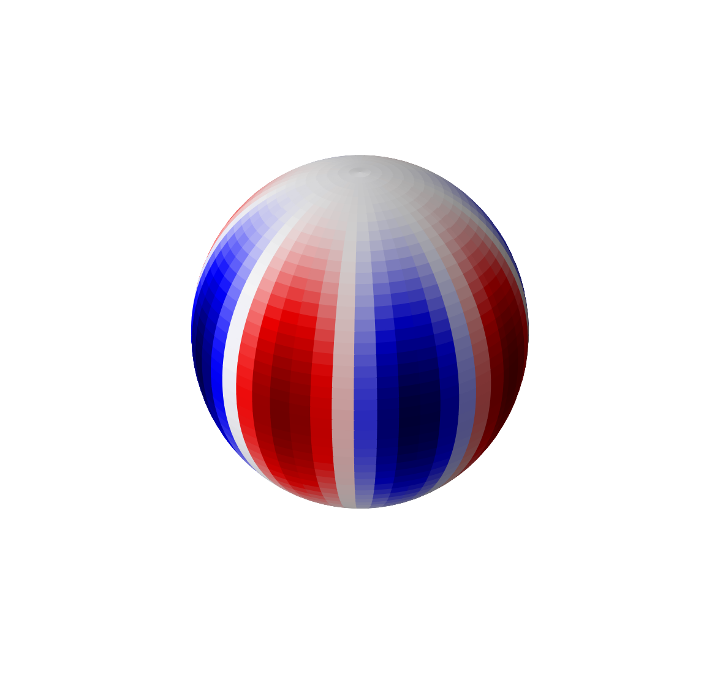

---
redirect_from:
  - "/sphharm-visualize"
interact_link: content/SphHarm_visualize.ipynb
kernel_name: python3
has_widgets: false
title: '4.6 Visualziing Spherical Harmonics'
prev_page:
  url: /HarmOsc_visualize
  title: '4.5 Visualziing Harmonic Oscillator Solutions'
next_page:
  url: /Lec5-0
  title: '5.0 Hydrogen atom'
comment: "***PROGRAMMATICALLY GENERATED, DO NOT EDIT. SEE ORIGINAL FILES IN /content***"
---
## Visualizing Spherical harmonics


<div markdown="1" class="cell code_cell">
<div class="input_area" markdown="1">
```python
%matplotlib inline

# First load the numpy/scipy/matplotlib
import matplotlib.pyplot as plt
import numpy as np

# 3D plotting
from matplotlib import cm, colors
from mpl_toolkits.mplot3d import Axes3D

#Interactive widgets
import ipywidgets as widgets
from IPython.display import display

#Increase resolution of plots
%config InlineBackend.figure_format = 'retina'

```
</div>

</div>


### Import [spherical harmonics](https://docs.scipy.org/doc/scipy/reference/generated/scipy.special.sph_harm.html#scipy.special.sph_harm) from scipy [special functions collection](https://docs.scipy.org/doc/scipy/reference/special.html)


<div markdown="1" class="cell code_cell">
<div class="input_area" markdown="1">
```python
#Import spherical harmonics
from scipy.special import sph_harm

```
</div>

</div>


$$
Y_{lm}(\phi,\theta) = \sqrt{\frac{2l+1}{4\pi} \frac{(l-m)!}{(l+m)!} } P_{lm}(cos \phi) \cdot e^{im\theta}
$$


Notice that scipy adopts slightly different convenient of angles than what is adopted in textbook. 

- **m array_like**
Order of the harmonic (int); must have |m| <= l.

- **l array_like**
Degree of the harmonic (int); must have l >= 0. 

- **$\theta$ array_like**
Azimuthal (longitudinal) coordinate; must be in $[0, 2\pi]$.

- **$\phi$ array_like**
Polar (colatitudinal) coordinate; must be in $[0, \pi]$.


<div markdown="1" class="cell code_cell">
<div class="input_area" markdown="1">
```python
# Create 2D grid of angular variables

phi = np.linspace(0, np.pi, 100)
theta = np.linspace(0, 2*np.pi, 100)
phi, theta = np.meshgrid(phi, theta)

# Convert to cartesian coordinates. r=const=1 for convenience
x = np.sin(phi) * np.cos(theta)
y = np.sin(phi) * np.sin(theta)
z = np.cos(phi)

```
</div>

</div>


<div markdown="1" class="cell code_cell">
<div class="input_area" markdown="1">
```python
fig = plt.figure(figsize=(10,10))
ax = fig.add_subplot(111, projection='3d')

m, l = 2, 4
Ylm  = sph_harm(m, l, theta, phi).real

#normalize color to [0,1] corresponding to magnitude of spherical harmonic

fcolors = (Ylm - Ylm.min())/(Ylm.max() - Ylm.min())

ax.plot_surface(x, y, z, facecolors=cm.seismic(fcolors))

# Turn off the axis planes
ax.set_axis_off()

```
</div>

<div class="output_wrapper" markdown="1">
<div class="output_subarea" markdown="1">

{:.output_png}


</div>
</div>
</div>


<div markdown="1" class="cell code_cell">
<div class="input_area" markdown="1">
```python
@widgets.interact(l = np.arange(0,10,1),m=np.arange(-l,l+1,1))

def plot_SphHarm(l=1,m=0):

    fig = plt.figure(figsize=(10,10))
    ax = fig.add_subplot(111, projection='3d')

    Ylm  = sph_harm(m, l, theta, phi).real

    fcolors = (Ylm - Ylm.min())/(Ylm.max() - Ylm.min())

    ax.plot_surface(x, y, z, facecolors=cm.seismic(fcolors))

    ax.set_axis_off()
    

    # Set axes limit to keep aspect ratio 1:1:1
    ax.set_xlim(-1, 1)
    ax.set_ylim(-1, 1)
    ax.set_zlim(-1, 1)

```
</div>

<div class="output_wrapper" markdown="1">
<div class="output_subarea" markdown="1">
{:.output_data_text}
```
interactive(children=(Dropdown(description='l', index=1, options=(0, 1, 2, 3, 4, 5, 6, 7, 8, 9), value=1), Dro…
```

</div>
</div>
</div>

