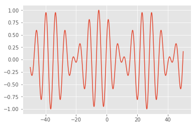

## Import the libraries and configre plot styles


<div markdown="1" class="cell code_cell">
<div class="input_area" markdown="1">
```python
#Load the basics
import numpy as np    
import scipy as sci
import matplotlib.pyplot as plt

%matplotlib inline

```
</div>

</div>


<div markdown="1" class="cell code_cell">
<div class="input_area" markdown="1">
```python
# Choose a style and check out other cool styles via print(plt.style.available)
plt.style.use('ggplot')  

# Increase resolution for retina display
from IPython.display import set_matplotlib_formats
set_matplotlib_formats('retina')


# Load interactive widgets
import ipywidgets as widgets

```
</div>

</div>


## A gallery of useful examples


### Plotting in 1D


1D plotting is conveniently done by creating fig and ax objects which allow saving figure and cutomizing plot properties respectively


<div markdown="1" class="cell code_cell">
<div class="input_area" markdown="1">
```python
fig, ax = plt.subplots()          # Create fig and ax objects

t = np.arange(0.0,  2*np.pi, 0.1) # create x values via np.arange or np.linspace

s = np.sin(t)                     # create y values

ax.plot(t, s, '-o')                     # make the plot

#fig.savefig('myFIG.png')         # save figure

```
</div>

<div class="output_wrapper" markdown="1">
<div class="output_subarea" markdown="1">


{:.output_data_text}
```
[<matplotlib.lines.Line2D at 0x116886c18>]
```


</div>
</div>
<div class="output_wrapper" markdown="1">
<div class="output_subarea" markdown="1">

{:.output_png}


</div>
</div>
</div>


<div markdown="1" class="cell code_cell">
<div class="input_area" markdown="1">
```python
fig, ax = plt.subplots(2,1)          # Create fig and ax objects

t = np.arange(0.0,  2*np.pi, 0.1) # create x values

s = np.sin(t)                     # create y values

ax[0].plot(t, s,'-o', color='purple', lw=1.0)  # plot on subplot-1
ax[1].plot(t, s,'-o', color='green',  lw=1.0)  # plot  on subplot-2

#fig.savefig('sd.png')             # save the figure

```
</div>

<div class="output_wrapper" markdown="1">
<div class="output_subarea" markdown="1">


{:.output_data_text}
```
[<matplotlib.lines.Line2D at 0x116955ba8>]
```


</div>
</div>
<div class="output_wrapper" markdown="1">
<div class="output_subarea" markdown="1">

{:.output_png}


</div>
</div>
</div>


### Plotting in 2D


To make 2D plots we need to generate 2D grid $(x,y)$ of points and pass it to our function $f(x,y)$


<div markdown="1" class="cell code_cell">
<div class="input_area" markdown="1">
```python
fig, ax = plt.subplots()              # Create fig and ax objects

tx = np.arange(0.0,  2*np.pi, 0.1)    # create x values

ty = np.arange(0.0,  2*np.pi, 0.1)    # create y values

TX, TY = np.meshgrid(tx,ty)           # tunring 1D array into 2D grids of x and y values

S = np.sin(TX) * np.cos(TY)           # feed 2D grids to our 2D function f(x,y)

ax.pcolor(TX, TY, S)         # plot 

# try also ax.contour, ax.contourf

```
</div>

<div class="output_wrapper" markdown="1">
<div class="output_subarea" markdown="1">


{:.output_data_text}
```
<matplotlib.collections.PolyCollection at 0x116d7fc88>
```


</div>
</div>
<div class="output_wrapper" markdown="1">
<div class="output_subarea" markdown="1">

{:.output_png}


</div>
</div>
</div>


### Fitting functions


<div markdown="1" class="cell code_cell">
<div class="input_area" markdown="1">
```python
#Lets come up with a polynomial function with three constant coefificients
coef = np.array([0.1, 2.2, 1.4])

x = np.linspace(-5, 5, 100)

y0 = coef[0]*x**2 + coef[1]*x + coef[2]

plt.plot(x, y0)

```
</div>

<div class="output_wrapper" markdown="1">
<div class="output_subarea" markdown="1">


{:.output_data_text}
```
[<matplotlib.lines.Line2D at 0x119f6f6a0>]
```


</div>
</div>
<div class="output_wrapper" markdown="1">
<div class="output_subarea" markdown="1">

{:.output_png}


</div>
</div>
</div>


### Using interactive widgets to explore parameters of functions

Suppose we would like to explore how variation of parameter $\lambda $ affects the following funciton of a satanding wave: 

$$f(x) = sin \Big(\frac{2\pi x}{\lambda}\Big)$$


**Step 1** Make a python-function which creates a plot as a function of parameter(s) of interest. 

**Step 2** Add an interactive widget on top to vary the parameter.


<div markdown="1" class="cell code_cell">
<div class="input_area" markdown="1">
```python
@widgets.interact(L=(1,12))    # Vary between 0.2 and 20

def wave(L=1):          # We make default value equal to 1
    
    x=np.linspace(-10,10,1000)
        
    f = np.sin(2*np.pi*x/L)
        
    plt.plot(x,f, lw=2, color='blue')

```
</div>

<div class="output_wrapper" markdown="1">
<div class="output_subarea" markdown="1">
{:.output_data_text}
```
interactive(children=(IntSlider(value=1, description='L', max=12, min=1), Output()), _dom_classes=('widget-int…
```

</div>
</div>
</div>


### Simple animations

While widgets are useful sometimes we want to make movies of our numerical explorations. We can do taht by using animate methods from matploltib library. To show animation we also need to change %matplotlib magic to notebook format as done in the cell below.


<div markdown="1" class="cell code_cell">
<div class="input_area" markdown="1">
```python
import matplotlib.animation as animation

#We change the matplotlib format from inline to notebook
#Make sure to go back to %matplotlib inline afterwords for making non-animated plots
%matplotlib notebook  
%matplotlib notebook  

```
</div>

</div>


Here we make a simple animation of a traveling wave. Animation is made by re-drawing the plot for different values of t with a pre-defined consant interval.


<div markdown="1" class="cell code_cell">
<div class="input_area" markdown="1">
```python
def travel_wave(x,t):       
    '''A function to be animated over time t'''    
    
    return np.cos(x-t)*np.sin(x/10-t/10)  #+np.cos(x+t)*np.sin(x/10+t/10) # Try making traveling wave into standing


fig, ax = plt.subplots()

x     = np.linspace(-50,50,1000)  # We will keep x-values fixed

line, = ax.plot(x, travel_wave(x,0))  #the plot will be updated by varying the t-values


def animate(t):  
    '''Animation function'''
    
    line.set_ydata(travel_wave(x,t))  # update the t data.
    
    return line,


ani = animation.FuncAnimation(fig, animate, interval=40, blit=True, save_count=200)

# Save animation
#ani.save("Mymovie.mp4")

```
</div>

<div class="output_wrapper" markdown="1">
<div class="output_subarea" markdown="1">

{:.output_png}


</div>
</div>
</div>

