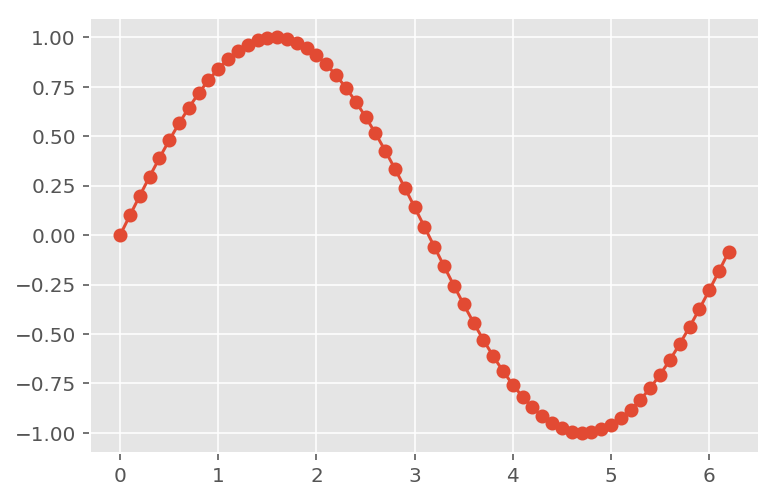
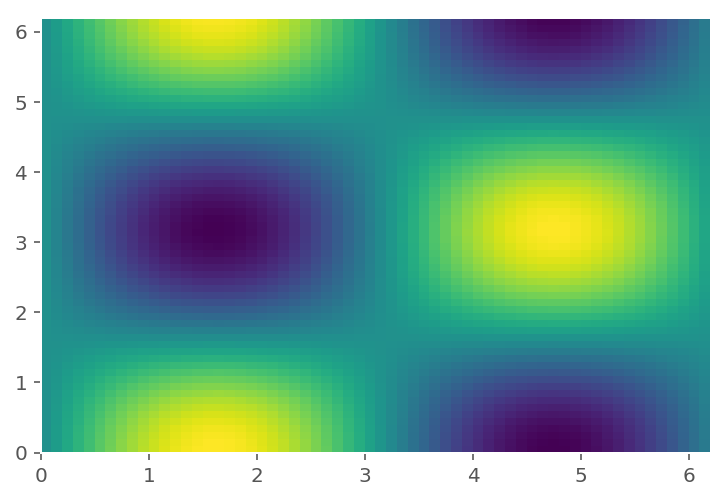

## Import the libraries and configre plot styles


<div markdown="1" class="cell code_cell">
<div class="input_area" markdown="1">
```python
import numpy as np    
import scipy as sci
import matplotlib.pyplot as plt

```
</div>

</div>


<div markdown="1" class="cell code_cell">
<div class="input_area" markdown="1">
```python
# Check out various cool styles via print(plt.style.available)
plt.style.use('ggplot') 

# increase resolution for retina display
from IPython.display import set_matplotlib_formats
set_matplotlib_formats('retina')

```
</div>

</div>


## A gallery of useful examples


### Plotting in 1D


1D plotting is conveniently done by creating fig and ax objects which allow saving figure and cutomizing plot properties respectively


<div markdown="1" class="cell code_cell">
<div class="input_area" markdown="1">
```python
fig, ax = plt.subplots()          # Create fig and ax objects

t = np.arange(0.0,  2*np.pi, 0.1) # create x values

s = np.sin(t)                     # create y values

ax.plot(t, s, '-o')                     # plot

#fig.savefig('myFIG.png')         # save figure

```
</div>

<div class="output_wrapper" markdown="1">
<div class="output_subarea" markdown="1">


{:.output_data_text}
```
[<matplotlib.lines.Line2D at 0x10d006e48>]
```


</div>
</div>
<div class="output_wrapper" markdown="1">
<div class="output_subarea" markdown="1">

{:.output_png}


</div>
</div>
</div>


<div markdown="1" class="cell code_cell">
<div class="input_area" markdown="1">
```python
fig, ax = plt.subplots(2,1)          # Create fig and ax objects

t = np.arange(0.0,  2*np.pi, 0.1) # create x values

s = np.sin(t)                     # create y values

ax[0].plot(t, s,'-o', color='purple', lw=1.0)  # plot on subplot-1
ax[1].plot(t, s,'-o', color='green',  lw=1.0)  # plot  on subplot-2

fig.savefig('sd.png')             # save figure

```
</div>

<div class="output_wrapper" markdown="1">
<div class="output_subarea" markdown="1">

{:.output_png}


</div>
</div>
</div>


### Plotting in 2d


For 2D plots we need to generate 2D grids instead of 1D arrays


<div markdown="1" class="cell code_cell">
<div class="input_area" markdown="1">
```python
fig, ax = plt.subplots()              # Create fig and ax objects

tx = np.arange(0.0,  2*np.pi, 0.1)    # create x values

ty = np.arange(0.0,  2*np.pi, 0.1)    # create y values

TX, TY = np.meshgrid(tx,ty)           # create grid of x and y values

S = np.sin(TX) * np.cos(TY)           # create function f(x,y)

ax.pcolor(TX, TY, S)         # plot 

# try also ax.contour, ax.contourf

```
</div>

<div class="output_wrapper" markdown="1">
<div class="output_subarea" markdown="1">


{:.output_data_text}
```
<matplotlib.collections.PolyCollection at 0x115d86c50>
```


</div>
</div>
<div class="output_wrapper" markdown="1">
<div class="output_subarea" markdown="1">

{:.output_png}


</div>
</div>
</div>


### Simple animations


<div markdown="1" class="cell code_cell">
<div class="input_area" markdown="1">
```python
import matplotlib.animation as animation
%matplotlib notebook

```
</div>

</div>


<div markdown="1" class="cell code_cell">
<div class="input_area" markdown="1">
```python
fig, ax = plt.subplots()

t = np.arange(0.0,  12*np.pi, 0.1) 

s = np.sin(t)

plt.plot(t, s,'--')


redDot, = plt.plot(0, np.sin(0),'ro',ms=12)  # initial position of redDot of size 12

def animate(i):
    redDot.set_data(i, np.sin(i))  # set data dynamically updates location of redDot
    return redDot,

# create animation using the animate() function
myAnimation = animation.FuncAnimation(fig, animate, frames=t, interval=10, blit=True, repeat=True)

```
</div>

<div class="output_wrapper" markdown="1">
<div class="output_subarea" markdown="1">
{:.output_data_text}
```
<IPython.core.display.Javascript object>
```

</div>
</div>
<div class="output_wrapper" markdown="1">
<div class="output_subarea" markdown="1">

<div markdown="0" class="output output_html">
<div id='c20805d3-d93d-4418-8a7e-5716096a1e27'></div>
</div>

</div>
</div>
</div>

