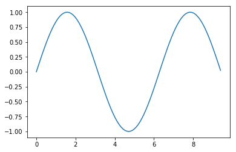
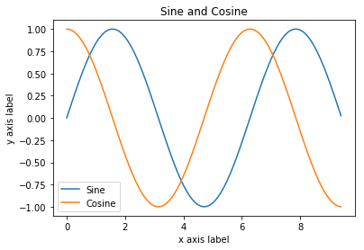

## Python crash course for Chem324.


The objective of these notes it to provide a quick introduction to python language. No background in programming or previous knolwedge of python is assumed. These notes will only cover the bare essentials of python which will be used throughout the course. 


Since our coverage will necessarily be brief belwo listed you can find some more pointers to excellent resources for learning python. Links under 1 are short and very basic. Links under 2 short but smehwat more advanced and Links under 3 are long and comprehensive.    
 
**1. Short tutorials by software carpentry for scientists**
   - [Programming Python](http://swcarpentry.github.io/python-novice-inflammation/)
   - [Plotting and programming in Python ](http://swcarpentry.github.io/python-novice-gapminder/)


**2. Condensed coverage of scientific applicaitons can be found in the following online notes:**
   - [Python programming for Scientists](http://wwwstaff.ari.uni-heidelberg.de/mitarbeiter/rschmidt/pycourse/index.html)
   - [Introduction to Python for Computational Science and Engineering](https://fangohr.github.io/introduction-to-python-for-computational-science-and-engineering/)
   - [Scientific Python lectures by Robert Johanssen](https://nbviewer.jupyter.org/github/jrjohansson/scientific-python-lectures/tree/master/)
   
    

**3. Finally there are the official Python documentaiton and SciPy tutorials. These provide much more in depth and thorough coverage.**
   - [SciPy lectures](http://scipy-lectures.org/index.html)
   - [Official python tutorial](https://docs.python.org/3/tutorial/)


## Introduction


Python is a fantastic general-purpose programming language on its own, but with the help of a few popular libraries (numpy, scipy, matplotlib) it becomes a powerful environment for scientific computing.

You may already know some python and that's great!; for the rest of you, this section will serve as a quick crash course both on the Python programming language and on the use of Python for scientific computing.


In this tutorial, we will cover:

Basics of Python3 language:

- **Data types: numbers, booleans, strings, lists**
- **Functions**
- **Control flow**

Doing computaitons and visualiziations in Jupyter notebook using:

- **Numpy arrays**
- **Scipy functions**
- **Matplotlib plotting**   


## Basics of Python


Python is a high-level, dynamically typed multiparadigm programming language. 

Python code is often said to be almost like pseudocode, since it allows you to express very powerful ideas in very few lines of code while being very readable. A few examples without explanations are below:


<div markdown="1" class="cell code_cell">
<div class="input_area" markdown="1">
```python
menu = ["pizza", "sushi", "taco"] 

for item in menu:
    print(item)

```
</div>

<div class="output_wrapper" markdown="1">
<div class="output_subarea" markdown="1">
{:.output_stream}
```
pizza
sushi
taco
```
</div>
</div>
</div>


<div markdown="1" class="cell code_cell">
<div class="input_area" markdown="1">
```python
menu = ["sushi", "123", "taco", "frog"] 

for item in menu:
    
    if item == "sushi":                     
        print("yum!")
        
    elif item == "taco":                
        print("maybe not today")
        
    else:
        print("eww")

```
</div>

<div class="output_wrapper" markdown="1">
<div class="output_subarea" markdown="1">
{:.output_stream}
```
yum!
eww
maybe not today
eww
```
</div>
</div>
</div>


While these are silly exmples for illustration with same simplicity of code you can do fiarly sophisticated calculations.

Do not worry if some of these commands seem unfamiliar we are going to explain them later on. 


### Python versions


There are older version of python (Python 2.7) and newer versions (Python 3.7+). We will always use the latest version.

If you have installed python on your computer you can check your Python version at the command line by running `python --version`.


### Basic data types

Python has a variety of data types for managing different kinds of data. Examples are:
- numbers.
- strings.
- lists. 
- dictionaries.
- sets.
- tupes, etc. 

Some of these are _point types_ such as simple numbers often used for basic arithmetic operations. Others are of _container kind_ which contain sequences of numbers often used as vectors and matrices.  


## Numbers


Numbers are an important data type for us which we use to do all sorts of computations. It is imporatnt to know that the numbers in python can be:
- Integers: -1, -2, 0,
- Floats: 0.001, 4.56, 3.14
- Complex numbers: 1.2+2.5j, 2j, 3+1j

Let us begin creating some numeric data and assining variable names:


<div markdown="1" class="cell code_cell">
<div class="input_area" markdown="1">
```python
x = 3    # variable called x

```
</div>

</div>


<div markdown="1" class="cell code_cell">
<div class="input_area" markdown="1">
```python
print(x) # print contents of x

```
</div>

<div class="output_wrapper" markdown="1">
<div class="output_subarea" markdown="1">
{:.output_stream}
```
3
```
</div>
</div>
</div>


<div markdown="1" class="cell code_cell">
<div class="input_area" markdown="1">
```python
print(x + 1)   # Addition;
print(x - 1)   # Subtraction;
print(x * 2)   # Multiplication;
print(x ** 2)  # Exponentiation;

```
</div>

<div class="output_wrapper" markdown="1">
<div class="output_subarea" markdown="1">
{:.output_stream}
```
4
2
6
9
```
</div>
</div>
</div>


<div markdown="1" class="cell code_cell">
<div class="input_area" markdown="1">
```python
type(x) # lets find out what kind of number is this

```
</div>

<div class="output_wrapper" markdown="1">
<div class="output_subarea" markdown="1">


{:.output_data_text}
```
int
```


</div>
</div>
</div>


**Exercise:** change the number type to float and complex number and execute the above cells again


<div markdown="1" class="cell code_cell">
<div class="input_area" markdown="1">
```python
x,y,z=1,2,5 # mutliple assingmenets can be done with one line!

```
</div>

</div>


<div markdown="1" class="cell code_cell">
<div class="input_area" markdown="1">
```python
x+y, x*z  # Mutliple opearations can be done with one line also!

```
</div>

<div class="output_wrapper" markdown="1">
<div class="output_subarea" markdown="1">


{:.output_data_text}
```
(3, 5)
```


</div>
</div>
</div>


## Strings


<div markdown="1" class="cell code_cell">
<div class="input_area" markdown="1">
```python
hello = 'hello'   # String literals can use single quotes
world = "world"   # or double quotes; it does not matter.
print(hello, len(hello))

```
</div>

<div class="output_wrapper" markdown="1">
<div class="output_subarea" markdown="1">
{:.output_stream}
```
hello 5
```
</div>
</div>
</div>


<div markdown="1" class="cell code_cell">
<div class="input_area" markdown="1">
```python
hw = hello + ' ' + world  # String concatenation
print(hw)  # prints "hello world"

```
</div>

<div class="output_wrapper" markdown="1">
<div class="output_subarea" markdown="1">
{:.output_stream}
```
hello world
```
</div>
</div>
</div>


String objects have a bunch of useful methods; for example:


<div markdown="1" class="cell code_cell">
<div class="input_area" markdown="1">
```python
s = "hello"
print(s.capitalize())  # Capitalize a string; prints "Hello"
print(s.upper())       # Convert a string to uppercase; prints "HELLO"
print(s.rjust(7))      # Right-justify a string, padding with spaces; prints "  hello"
print(s.center(7))     # Center a string, padding with spaces; prints " hello "
print(s.replace('l', '(ell)'))  # Replace all instances of one substring with another;
                               # prints "he(ell)(ell)o"
print('  world '.strip())  # Strip leading and trailing whitespace; prints "world"

```
</div>

<div class="output_wrapper" markdown="1">
<div class="output_subarea" markdown="1">
{:.output_stream}
```
Hello
HELLO
  hello
 hello 
he(ell)(ell)o
world
```
</div>
</div>
</div>


### Containers


Python includes several built-in container types: lists, dictionaries, sets, and tuples.


#### Lists


A list is the Python equivalent of an array, but is resizeable and can contain elements of different types:


<div markdown="1" class="cell code_cell">
<div class="input_area" markdown="1">
```python
xs = [3, 1, 2]   # Create a list
print(xs, xs[2])
print(xs[-1])    # Negative indices count from the end of the list; prints "2"

```
</div>

<div class="output_wrapper" markdown="1">
<div class="output_subarea" markdown="1">
{:.output_stream}
```
[3, 1, 2] 2
2
```
</div>
</div>
</div>


<div markdown="1" class="cell code_cell">
<div class="input_area" markdown="1">
```python
xs[2] = 'foo'    # Lists can contain elements of different types
print(xs)

```
</div>

<div class="output_wrapper" markdown="1">
<div class="output_subarea" markdown="1">
{:.output_stream}
```
[3, 1, 'foo']
```
</div>
</div>
</div>


<div markdown="1" class="cell code_cell">
<div class="input_area" markdown="1">
```python
xs.append('bar') # Add a new element to the end of the list
print(xs)  

```
</div>

<div class="output_wrapper" markdown="1">
<div class="output_subarea" markdown="1">
{:.output_stream}
```
[3, 1, 'foo', 'bar']
```
</div>
</div>
</div>


<div markdown="1" class="cell code_cell">
<div class="input_area" markdown="1">
```python
x = xs.pop()     # Remove and return the last element of the list
print(x, xs) 

```
</div>

<div class="output_wrapper" markdown="1">
<div class="output_subarea" markdown="1">
{:.output_stream}
```
bar [3, 1, 'foo']
```
</div>
</div>
</div>


As usual, you can find all the gory details about lists in the [documentation](https://docs.python.org/2/tutorial/datastructures.html#more-on-lists).


#### Slicing


In addition to accessing list elements one at a time, Python provides concise syntax to access sublists; this is known as slicing:


<div markdown="1" class="cell code_cell">
<div class="input_area" markdown="1">
```python
nums = range(0,5,1)    # xrange(i,j,k) is a built-in function that creates a list of integers from i to j with a stride k
nums=list(nums)     # make a list
print(nums)         # Prints "[0, 1, 2, 3, 4]"
print(nums[2:4])    # Get a slice from index 2 to 4 (exclusive); prints "[2, 3]"
print(nums[2:])     # Get a slice from index 2 to the end; prints "[2, 3, 4]"
print(nums[:2])     # Get a slice from the start to index 2 (exclusive); prints "[0, 1]"
print(nums[:])      # Get a slice of the whole list; prints ["0, 1, 2, 3, 4]"
print(nums[:-1])    # Slice indices can be negative; prints ["0, 1, 2, 3]"
nums[2:4] = [8, 9] # Assign a new sublist to a slice
print(nums)         # Prints "[0, 1, 8, 9, 4]"

```
</div>

<div class="output_wrapper" markdown="1">
<div class="output_subarea" markdown="1">
{:.output_stream}
```
[0, 1, 2, 3, 4]
[2, 3]
[2, 3, 4]
[0, 1]
[0, 1, 2, 3, 4]
[0, 1, 2, 3]
[0, 1, 8, 9, 4]
```
</div>
</div>
</div>


#### Loops


You can loop over the elements of a list like this:


<div markdown="1" class="cell code_cell">
<div class="input_area" markdown="1">
```python
animals = ['cat', 'dog', 'monkey']
for animal in animals:
    print(animal)

```
</div>

<div class="output_wrapper" markdown="1">
<div class="output_subarea" markdown="1">
{:.output_stream}
```
cat
dog
monkey
```
</div>
</div>
</div>


If you want access to the index of each element within the body of a loop, use the built-in `enumerate` function:


<div markdown="1" class="cell code_cell">
<div class="input_area" markdown="1">
```python
animals = ['cat', 'dog', 'monkey']
for idx, animal in enumerate(animals):
    print('#%d: %s' % (idx + 1, animal))

```
</div>

<div class="output_wrapper" markdown="1">
<div class="output_subarea" markdown="1">
{:.output_stream}
```
#1: cat
#2: dog
#3: monkey
```
</div>
</div>
</div>


#### List comprehensions:


When programming, frequently we want to transform one type of data into another. As a simple example, consider the following code that computes square numbers:


<div markdown="1" class="cell code_cell">
<div class="input_area" markdown="1">
```python
nums = [0, 1, 2, 3, 4]
squares = []
for x in nums:
    squares.append(x ** 2)
squares

```
</div>

<div class="output_wrapper" markdown="1">
<div class="output_subarea" markdown="1">


{:.output_data_text}
```
[0, 1, 4, 9, 16]
```


</div>
</div>
</div>


You can make this code simpler using a list comprehension:


<div markdown="1" class="cell code_cell">
<div class="input_area" markdown="1">
```python
nums = [0, 1, 2, 3, 4]
squares = [x ** 2 for x in nums]
squares

```
</div>

<div class="output_wrapper" markdown="1">
<div class="output_subarea" markdown="1">


{:.output_data_text}
```
[0, 1, 4, 9, 16]
```


</div>
</div>
</div>


List comprehensions can also contain conditions:


<div markdown="1" class="cell code_cell">
<div class="input_area" markdown="1">
```python
nums = [0, 1, 2, 3, 4]
even_squares = [x ** 2 for x in nums if x % 2 == 0]
even_squares

```
</div>

<div class="output_wrapper" markdown="1">
<div class="output_subarea" markdown="1">


{:.output_data_text}
```
[0, 4, 16]
```


</div>
</div>
</div>


### Functions


Python functions are defined using the `def` keyword. For example:


<div markdown="1" class="cell code_cell">
<div class="input_area" markdown="1">
```python
def sign(x):
    if x > 0:
        return 'positive'
    elif x < 0:
        return 'negative'
    else:
        return 'zero'

for x in [-1, 0, 1]:
    print(sign(x))

```
</div>

<div class="output_wrapper" markdown="1">
<div class="output_subarea" markdown="1">
{:.output_stream}
```
negative
zero
positive
```
</div>
</div>
</div>


We will often define functions to take optional keyword arguments, like this:


<div markdown="1" class="cell code_cell">
<div class="input_area" markdown="1">
```python
def hello(name, loud=False):
    if loud:
        print('HELLO, %s' % name.upper())
    else:
        print('Hello, %s!' % name) 

hello('Bob')
hello('Fred', loud=True)

```
</div>

<div class="output_wrapper" markdown="1">
<div class="output_subarea" markdown="1">
{:.output_stream}
```
Hello, Bob!
HELLO, FRED
```
</div>
</div>
</div>


## Numpy


Numpy is the core library for scientific computing in Python. It provides a high-performance multidimensional array object, and tools for working with these arrays. If you are already familiar with MATLAB, you might find this [tutorial](http://wiki.scipy.org/NumPy_for_Matlab_Users) useful to get started with Numpy.


To use Numpy, we first need to import the `numpy` package:


<div markdown="1" class="cell code_cell">
<div class="input_area" markdown="1">
```python
import numpy as np

```
</div>

</div>


### Arrays


A numpy array is a grid of values, all of the same type, and is indexed by a tuple of nonnegative integers. The number of dimensions is the rank of the array; the shape of an array is a tuple of integers giving the size of the array along each dimension.


We can initialize numpy arrays from nested Python lists, and access elements using square brackets:


<div markdown="1" class="cell code_cell">
<div class="input_area" markdown="1">
```python
a = np.array([1, 2, 3])  # Create a rank 1 array
print(type(a), a.shape, a[0], a[1], a[2]) 
a[0] = 5                 # Change an element of the array
print(a)                   

```
</div>

<div class="output_wrapper" markdown="1">
<div class="output_subarea" markdown="1">
{:.output_stream}
```
<class 'numpy.ndarray'> (3,) 1 2 3
[5 2 3]
```
</div>
</div>
</div>


<div markdown="1" class="cell code_cell">
<div class="input_area" markdown="1">
```python
b = np.array([[1,2,3],[4,5,6]])   # Create a rank 2 array
print(b)

```
</div>

<div class="output_wrapper" markdown="1">
<div class="output_subarea" markdown="1">
{:.output_stream}
```
[[1 2 3]
 [4 5 6]]
```
</div>
</div>
</div>


<div markdown="1" class="cell code_cell">
<div class="input_area" markdown="1">
```python
print(b.shape)                    
print(b[0, 0], b[0, 1], b[1, 0]) 

```
</div>

<div class="output_wrapper" markdown="1">
<div class="output_subarea" markdown="1">
{:.output_stream}
```
(2, 3)
1 2 4
```
</div>
</div>
</div>


Numpy also provides many functions to create arrays:


<div markdown="1" class="cell code_cell">
<div class="input_area" markdown="1">
```python
a = np.zeros((2,2))  # Create an array of all zeros
print(a)

```
</div>

<div class="output_wrapper" markdown="1">
<div class="output_subarea" markdown="1">
{:.output_stream}
```
[[0. 0.]
 [0. 0.]]
```
</div>
</div>
</div>


<div markdown="1" class="cell code_cell">
<div class="input_area" markdown="1">
```python
b = np.ones((1,2))   # Create an array of all ones
print(b) 

```
</div>

<div class="output_wrapper" markdown="1">
<div class="output_subarea" markdown="1">
{:.output_stream}
```
[[1. 1.]]
```
</div>
</div>
</div>


<div markdown="1" class="cell code_cell">
<div class="input_area" markdown="1">
```python
c = np.full((2,2), 7) # Create a constant array
print(c)  

```
</div>

<div class="output_wrapper" markdown="1">
<div class="output_subarea" markdown="1">
{:.output_stream}
```
[[7 7]
 [7 7]]
```
</div>
</div>
</div>


<div markdown="1" class="cell code_cell">
<div class="input_area" markdown="1">
```python
d = np.eye(2)        # Create a 2x2 identity matrix
print(d) 

```
</div>

<div class="output_wrapper" markdown="1">
<div class="output_subarea" markdown="1">
{:.output_stream}
```
[[1. 0.]
 [0. 1.]]
```
</div>
</div>
</div>


<div markdown="1" class="cell code_cell">
<div class="input_area" markdown="1">
```python
e = np.random.random((2,2)) # Create an array filled with random values
print(e)

```
</div>

<div class="output_wrapper" markdown="1">
<div class="output_subarea" markdown="1">
{:.output_stream}
```
[[0.47091097 0.51705716]
 [0.00795315 0.14501724]]
```
</div>
</div>
</div>


### Array indexing


Numpy offers several ways to index into arrays.


Slicing: Similar to Python lists, numpy arrays can be sliced. Since arrays may be multidimensional, you must specify a slice for each dimension of the array:


<div markdown="1" class="cell code_cell">
<div class="input_area" markdown="1">
```python
import numpy as np

# Create the following rank 2 array with shape (3, 4)
# [[ 1  2  3  4]
#  [ 5  6  7  8]
#  [ 9 10 11 12]]
a = np.array([[1,2,3,4], [5,6,7,8], [9,10,11,12]])

# Use slicing to pull out the subarray consisting of the first 2 rows
# and columns 1 and 2; b is the following array of shape (2, 2):
# [[2 3]
#  [6 7]]
b = a[:2, 1:3]
print(b) 

```
</div>

<div class="output_wrapper" markdown="1">
<div class="output_subarea" markdown="1">
{:.output_stream}
```
[[2 3]
 [6 7]]
```
</div>
</div>
</div>


A slice of an array is a view into the same data, so modifying it will modify the original array.


<div markdown="1" class="cell code_cell">
<div class="input_area" markdown="1">
```python
print(a[0, 1] )  
b[0, 0] = 77    # b[0, 0] is the same piece of data as a[0, 1]
print(a[0, 1])  

```
</div>

<div class="output_wrapper" markdown="1">
<div class="output_subarea" markdown="1">
{:.output_stream}
```
2
77
```
</div>
</div>
</div>


You can also mix integer indexing with slice indexing. However, doing so will yield an array of lower rank than the original array. Note that this is quite different from the way that MATLAB handles array slicing:


<div markdown="1" class="cell code_cell">
<div class="input_area" markdown="1">
```python
# Create the following rank 2 array with shape (3, 4)
a = np.array([[1,2,3,4], [5,6,7,8], [9,10,11,12]])
print(a) 

```
</div>

<div class="output_wrapper" markdown="1">
<div class="output_subarea" markdown="1">
{:.output_stream}
```
[[ 1  2  3  4]
 [ 5  6  7  8]
 [ 9 10 11 12]]
```
</div>
</div>
</div>


Two ways of accessing the data in the middle row of the array.
Mixing integer indexing with slices yields an array of lower rank,
while using only slices yields an array of the same rank as the
original array:


<div markdown="1" class="cell code_cell">
<div class="input_area" markdown="1">
```python
row_r1 = a[1, :]    # Rank 1 view of the second row of a  
row_r2 = a[1:2, :]  # Rank 2 view of the second row of a
row_r3 = a[[1], :]  # Rank 2 view of the second row of a
print(row_r1, row_r1.shape ) 
print(row_r2, row_r2.shape) 
print(row_r3, row_r3.shape) 

```
</div>

<div class="output_wrapper" markdown="1">
<div class="output_subarea" markdown="1">
{:.output_stream}
```
[5 6 7 8] (4,)
[[5 6 7 8]] (1, 4)
[[5 6 7 8]] (1, 4)
```
</div>
</div>
</div>


<div markdown="1" class="cell code_cell">
<div class="input_area" markdown="1">
```python
# We can make the same distinction when accessing columns of an array:
col_r1 = a[:, 1]
col_r2 = a[:, 1:2]
print(col_r1, col_r1.shape) 
print(" ")
print(col_r2, col_r2.shape) 

```
</div>

<div class="output_wrapper" markdown="1">
<div class="output_subarea" markdown="1">
{:.output_stream}
```
[ 2  6 10] (3,)
 
[[ 2]
 [ 6]
 [10]] (3, 1)
```
</div>
</div>
</div>


Integer array indexing: When you index into numpy arrays using slicing, the resulting array view will always be a subarray of the original array. In contrast, integer array indexing allows you to construct arbitrary arrays using the data from another array. Here is an example:


<div markdown="1" class="cell code_cell">
<div class="input_area" markdown="1">
```python
a = np.array([[1,2], [3, 4], [5, 6]])

# An example of integer array indexing.
# The returned array will have shape (3,) and 
print(a[[0, 1, 2], [0, 1, 0]]) 

# The above example of integer array indexing is equivalent to this:
print(np.array([a[0, 0], a[1, 1], a[2, 0]])) 

```
</div>

<div class="output_wrapper" markdown="1">
<div class="output_subarea" markdown="1">
{:.output_stream}
```
[1 4 5]
[1 4 5]
```
</div>
</div>
</div>


<div markdown="1" class="cell code_cell">
<div class="input_area" markdown="1">
```python
# When using integer array indexing, you can reuse the same
# element from the source array:
print(a[[0, 0], [1, 1]]) 

# Equivalent to the previous integer array indexing example
print(np.array([a[0, 1], a[0, 1]])) 

```
</div>

<div class="output_wrapper" markdown="1">
<div class="output_subarea" markdown="1">
{:.output_stream}
```
[2 2]
[2 2]
```
</div>
</div>
</div>


One useful trick with integer array indexing is selecting or mutating one element from each row of a matrix:


<div markdown="1" class="cell code_cell">
<div class="input_area" markdown="1">
```python
# Create a new array from which we will select elements
a = np.array([[1,2,3], [4,5,6], [7,8,9], [10, 11, 12]])
print(a)

```
</div>

<div class="output_wrapper" markdown="1">
<div class="output_subarea" markdown="1">
{:.output_stream}
```
[[ 1  2  3]
 [ 4  5  6]
 [ 7  8  9]
 [10 11 12]]
```
</div>
</div>
</div>


<div markdown="1" class="cell code_cell">
<div class="input_area" markdown="1">
```python
# Create an array of indices
b = np.array([0, 2, 0, 1])

# Select one element from each row of a using the indices in b
print(a[np.arange(4), b])   # Prints "[ 1  6  7 11]"

```
</div>

<div class="output_wrapper" markdown="1">
<div class="output_subarea" markdown="1">
{:.output_stream}
```
[ 1  6  7 11]
```
</div>
</div>
</div>


<div markdown="1" class="cell code_cell">
<div class="input_area" markdown="1">
```python
# Mutate one element from each row of a using the indices in b
a[np.arange(4), b] += 10
print(a)

```
</div>

<div class="output_wrapper" markdown="1">
<div class="output_subarea" markdown="1">
{:.output_stream}
```
[[11  2  3]
 [ 4  5 16]
 [17  8  9]
 [10 21 12]]
```
</div>
</div>
</div>


Boolean array indexing: Boolean array indexing lets you pick out arbitrary elements of an array. Frequently this type of indexing is used to select the elements of an array that satisfy some condition. Here is an example:


<div markdown="1" class="cell code_cell">
<div class="input_area" markdown="1">
```python
import numpy as np

a = np.array([[1,2], [3, 4], [5, 6]])

bool_idx = (a > 2)  # Find the elements of a that are bigger than 2;
                    # this returns a numpy array of Booleans of the same
                    # shape as a, where each slot of bool_idx tells
                    # whether that element of a is > 2.

print(bool_idx)

```
</div>

<div class="output_wrapper" markdown="1">
<div class="output_subarea" markdown="1">
{:.output_stream}
```
[[False False]
 [ True  True]
 [ True  True]]
```
</div>
</div>
</div>


<div markdown="1" class="cell code_cell">
<div class="input_area" markdown="1">
```python
# We use boolean array indexing to construct a rank 1 array
# consisting of the elements of a corresponding to the True values
# of bool_idx
print(a[bool_idx]) 

# We can do all of the above in a single concise statement:
print(a[a > 2]) 

```
</div>

<div class="output_wrapper" markdown="1">
<div class="output_subarea" markdown="1">
{:.output_stream}
```
[3 4 5 6]
[3 4 5 6]
```
</div>
</div>
</div>


For brevity we have left out a lot of details about numpy array indexing; if you want to know more you should read the documentation.


### Numpy Datatypes


Every numpy array is a grid of elements of the same type. Numpy provides a large set of numeric datatypes that you can use to construct arrays. Numpy tries to guess a datatype when you create an array, but functions that construct arrays usually also include an optional argument to explicitly specify the datatype. Here is an example:


<div markdown="1" class="cell code_cell">
<div class="input_area" markdown="1">
```python
x = np.array([1, 2])  # Let numpy choose the datatype
y = np.array([1.0, 2.0])  # Let numpy choose the datatype
z = np.array([1, 2], dtype=np.int64)  # Force a particular datatype

print(x.dtype, y.dtype, z.dtype) 

```
</div>

<div class="output_wrapper" markdown="1">
<div class="output_subarea" markdown="1">
{:.output_stream}
```
int64 float64 int64
```
</div>
</div>
</div>


You can read all about numpy datatypes in the [documentation](http://docs.scipy.org/doc/numpy/reference/arrays.dtypes.html).


### Array math


Basic mathematical functions operate elementwise on arrays, and are available both as operator overloads and as functions in the numpy module:


<div markdown="1" class="cell code_cell">
<div class="input_area" markdown="1">
```python
x = np.array([[1,2],[3,4]], dtype=np.float64)
y = np.array([[5,6],[7,8]], dtype=np.float64)

# Elementwise sum; both produce the array
print(x + y) 
print(np.add(x, y)) 

```
</div>

<div class="output_wrapper" markdown="1">
<div class="output_subarea" markdown="1">
{:.output_stream}
```
[[ 6.  8.]
 [10. 12.]]
[[ 6.  8.]
 [10. 12.]]
```
</div>
</div>
</div>


<div markdown="1" class="cell code_cell">
<div class="input_area" markdown="1">
```python
# Elementwise difference; both produce the array
print(x - y) 
print(np.subtract(x, y)) 

```
</div>

<div class="output_wrapper" markdown="1">
<div class="output_subarea" markdown="1">
{:.output_stream}
```
[[-4. -4.]
 [-4. -4.]]
[[-4. -4.]
 [-4. -4.]]
```
</div>
</div>
</div>


<div markdown="1" class="cell code_cell">
<div class="input_area" markdown="1">
```python
# Elementwise product; both produce the array
print(x * y) 
print(np.multiply(x, y)) 

```
</div>

<div class="output_wrapper" markdown="1">
<div class="output_subarea" markdown="1">
{:.output_stream}
```
[[ 5. 12.]
 [21. 32.]]
[[ 5. 12.]
 [21. 32.]]
```
</div>
</div>
</div>


<div markdown="1" class="cell code_cell">
<div class="input_area" markdown="1">
```python
# Elementwise division; both produce the array
# [[ 0.2         0.33333333]
#  [ 0.42857143  0.5       ]]
print(x / y) 
print(np.divide(x, y)) 

```
</div>

<div class="output_wrapper" markdown="1">
<div class="output_subarea" markdown="1">
{:.output_stream}
```
[[0.2        0.33333333]
 [0.42857143 0.5       ]]
[[0.2        0.33333333]
 [0.42857143 0.5       ]]
```
</div>
</div>
</div>


<div markdown="1" class="cell code_cell">
<div class="input_area" markdown="1">
```python
# Elementwise square root; produces the array
# [[ 1.          1.41421356]
#  [ 1.73205081  2.        ]]
print(np.sqrt(x)) 

```
</div>

<div class="output_wrapper" markdown="1">
<div class="output_subarea" markdown="1">
{:.output_stream}
```
[[1.         1.41421356]
 [1.73205081 2.        ]]
```
</div>
</div>
</div>


Note that unlike MATLAB, `*` is elementwise multiplication, not matrix multiplication. We instead use the dot function to compute inner products of vectors, to multiply a vector by a matrix, and to multiply matrices. dot is available both as a function in the numpy module and as an instance method of array objects:


<div markdown="1" class="cell code_cell">
<div class="input_area" markdown="1">
```python
x = np.array([[1,2],[3,4]])
y = np.array([[5,6],[7,8]])

v = np.array([9,10])
w = np.array([11, 12])

# Inner product of vectors; both produce 219
print(v.dot(w)) 
print(np.dot(v, w)) 

```
</div>

<div class="output_wrapper" markdown="1">
<div class="output_subarea" markdown="1">
{:.output_stream}
```
219
219
```
</div>
</div>
</div>


<div markdown="1" class="cell code_cell">
<div class="input_area" markdown="1">
```python
# Matrix / vector product; both produce the rank 1 array [29 67]
print(x.dot(v)) 
print(np.dot(x, v)) 

```
</div>

<div class="output_wrapper" markdown="1">
<div class="output_subarea" markdown="1">
{:.output_stream}
```
[29 67]
[29 67]
```
</div>
</div>
</div>


<div markdown="1" class="cell code_cell">
<div class="input_area" markdown="1">
```python
# Matrix / matrix product; both produce the rank 2 array
# [[19 22]
#  [43 50]]
print(x.dot(y)) 
print("")
print(x@y) 

```
</div>

<div class="output_wrapper" markdown="1">
<div class="output_subarea" markdown="1">
{:.output_stream}
```
[[19 22]
 [43 50]]

[[19 22]
 [43 50]]
```
</div>
</div>
</div>


Numpy provides many useful functions for performing computations on arrays; one of the most useful is `sum`:


<div markdown="1" class="cell code_cell">
<div class="input_area" markdown="1">
```python
x = np.array([[1,2],[3,4]])

print(np.sum(x))   # Compute sum of all elements; prints "10"
print(np.sum(x, axis=0) )  # Compute sum of each column; prints "[4 6]"
print(np.sum(x, axis=1))   # Compute sum of each row; prints "[3 7]"

```
</div>

<div class="output_wrapper" markdown="1">
<div class="output_subarea" markdown="1">
{:.output_stream}
```
10
[4 6]
[3 7]
```
</div>
</div>
</div>


You can find the full list of mathematical functions provided by numpy in the [documentation](http://docs.scipy.org/doc/numpy/reference/routines.math.html).

Apart from computing mathematical functions using arrays, we frequently need to reshape or otherwise manipulate data in arrays. The simplest example of this type of operation is transposing a matrix; to transpose a matrix, simply use the T attribute of an array object:


<div markdown="1" class="cell code_cell">
<div class="input_area" markdown="1">
```python
print(x) 
print(x.T) 

```
</div>

<div class="output_wrapper" markdown="1">
<div class="output_subarea" markdown="1">
{:.output_stream}
```
[[1 2]
 [3 4]]
[[1 3]
 [2 4]]
```
</div>
</div>
</div>


<div markdown="1" class="cell code_cell">
<div class="input_area" markdown="1">
```python
v = np.array([[1,2,3]])
print(v)  
print(v.T) 

```
</div>

<div class="output_wrapper" markdown="1">
<div class="output_subarea" markdown="1">
{:.output_stream}
```
[[1 2 3]]
[[1]
 [2]
 [3]]
```
</div>
</div>
</div>


### Broadcasting


Broadcasting is a powerful mechanism that allows numpy to work with arrays of different shapes when performing arithmetic operations. Frequently we have a smaller array and a larger array, and we want to use the smaller array multiple times to perform some operation on the larger array.

For example, suppose that we want to add a constant vector to each row of a matrix. We could do it like this:


<div markdown="1" class="cell code_cell">
<div class="input_area" markdown="1">
```python
# We will add the vector v to each row of the matrix x,
# storing the result in the matrix y
x = np.array([[1,2,3], [4,5,6], [7,8,9], [10, 11, 12]])
v = np.array([1, 0, 1])
y = np.empty_like(x)   # Create an empty matrix with the same shape as x

# Add the vector v to each row of the matrix x with an explicit loop
for i in range(4):
    y[i, :] = x[i, :] + v

print(y) 

```
</div>

<div class="output_wrapper" markdown="1">
<div class="output_subarea" markdown="1">
{:.output_stream}
```
[[ 2  2  4]
 [ 5  5  7]
 [ 8  8 10]
 [11 11 13]]
```
</div>
</div>
</div>


This works; however when the matrix `x` is very large, computing an explicit loop in Python could be slow. Note that adding the vector v to each row of the matrix `x` is equivalent to forming a matrix `vv` by stacking multiple copies of `v` vertically, then performing elementwise summation of `x` and `vv`. We could implement this approach like this:


<div markdown="1" class="cell code_cell">
<div class="input_area" markdown="1">
```python
vv = np.tile(v, (4, 1))  # Stack 4 copies of v on top of each other
print(vv)                 # Prints "[[1 0 1]
                         #          [1 0 1]
                         #          [1 0 1]
                         #          [1 0 1]]"

```
</div>

<div class="output_wrapper" markdown="1">
<div class="output_subarea" markdown="1">
{:.output_stream}
```
[[1 0 1]
 [1 0 1]
 [1 0 1]
 [1 0 1]]
```
</div>
</div>
</div>


<div markdown="1" class="cell code_cell">
<div class="input_area" markdown="1">
```python
y = x + vv  # Add x and vv elementwise
print(y)

```
</div>

<div class="output_wrapper" markdown="1">
<div class="output_subarea" markdown="1">
{:.output_stream}
```
[[ 2  2  4]
 [ 5  5  7]
 [ 8  8 10]
 [11 11 13]]
```
</div>
</div>
</div>


Numpy broadcasting allows us to perform this computation without actually creating multiple copies of v. Consider this version, using broadcasting:


<div markdown="1" class="cell code_cell">
<div class="input_area" markdown="1">
```python
import numpy as np

# We will add the vector v to each row of the matrix x,
# storing the result in the matrix y
x = np.array([[1,2,3], [4,5,6], [7,8,9], [10, 11, 12]])
v = np.array([1, 0, 1])
y = x + v  # Add v to each row of x using broadcasting
print(y)

```
</div>

<div class="output_wrapper" markdown="1">
<div class="output_subarea" markdown="1">
{:.output_stream}
```
[[ 2  2  4]
 [ 5  5  7]
 [ 8  8 10]
 [11 11 13]]
```
</div>
</div>
</div>


The line `y = x + v` works even though `x` has shape `(4, 3)` and `v` has shape `(3,)` due to broadcasting; this line works as if v actually had shape `(4, 3)`, where each row was a copy of `v`, and the sum was performed elementwise.

Broadcasting two arrays together follows these rules:

1. If the arrays do not have the same rank, prepend the shape of the lower rank array with 1s until both shapes have the same length.
2. The two arrays are said to be compatible in a dimension if they have the same size in the dimension, or if one of the arrays has size 1 in that dimension.
3. The arrays can be broadcast together if they are compatible in all dimensions.
4. After broadcasting, each array behaves as if it had shape equal to the elementwise maximum of shapes of the two input arrays.
5. In any dimension where one array had size 1 and the other array had size greater than 1, the first array behaves as if it were copied along that dimension

If this explanation does not make sense, try reading the explanation from the [documentation](http://docs.scipy.org/doc/numpy/user/basics.broadcasting.html) or this [explanation](http://wiki.scipy.org/EricsBroadcastingDoc).

Functions that support broadcasting are known as universal functions. You can find the list of all universal functions in the [documentation](http://docs.scipy.org/doc/numpy/reference/ufuncs.html#available-ufuncs).

Here are some applications of broadcasting:


<div markdown="1" class="cell code_cell">
<div class="input_area" markdown="1">
```python
# Compute outer product of vectors
v = np.array([1,2,3])  # v has shape (3,)
w = np.array([4,5])    # w has shape (2,)
# To compute an outer product, we first reshape v to be a column
# vector of shape (3, 1); we can then broadcast it against w to yield
# an output of shape (3, 2), which is the outer product of v and w:

print(np.reshape(v, (3, 1)) * w) 

```
</div>

<div class="output_wrapper" markdown="1">
<div class="output_subarea" markdown="1">
{:.output_stream}
```
[[ 4  5]
 [ 8 10]
 [12 15]]
```
</div>
</div>
</div>


<div markdown="1" class="cell code_cell">
<div class="input_area" markdown="1">
```python
# Add a vector to each row of a matrix
x = np.array([[1,2,3], [4,5,6]])
# x has shape (2, 3) and v has shape (3,) so they broadcast to (2, 3),
# giving the following matrix:

print(x + v) 

```
</div>

<div class="output_wrapper" markdown="1">
<div class="output_subarea" markdown="1">
{:.output_stream}
```
[[2 4 6]
 [5 7 9]]
```
</div>
</div>
</div>


<div markdown="1" class="cell code_cell">
<div class="input_area" markdown="1">
```python
# Add a vector to each column of a matrix
# x has shape (2, 3) and w has shape (2,).
# If we transpose x then it has shape (3, 2) and can be broadcast
# against w to yield a result of shape (3, 2); transposing this result
# yields the final result of shape (2, 3) which is the matrix x with
# the vector w added to each column. Gives the following matrix:

print((x.T + w).T) 

```
</div>

<div class="output_wrapper" markdown="1">
<div class="output_subarea" markdown="1">
{:.output_stream}
```
[[ 5  6  7]
 [ 9 10 11]]
```
</div>
</div>
</div>


<div markdown="1" class="cell code_cell">
<div class="input_area" markdown="1">
```python
# Another solution is to reshape w to be a row vector of shape (2, 1);
# we can then broadcast it directly against x to produce the same
# output.
print(x + np.reshape(w, (2, 1))) 

```
</div>

<div class="output_wrapper" markdown="1">
<div class="output_subarea" markdown="1">
{:.output_stream}
```
[[ 5  6  7]
 [ 9 10 11]]
```
</div>
</div>
</div>


<div markdown="1" class="cell code_cell">
<div class="input_area" markdown="1">
```python
# Multiply a matrix by a constant:
# x has shape (2, 3). Numpy treats scalars as arrays of shape ();
# these can be broadcast together to shape (2, 3), producing the
# following array:
print(x * 2) 

```
</div>

<div class="output_wrapper" markdown="1">
<div class="output_subarea" markdown="1">
{:.output_stream}
```
[[ 2  4  6]
 [ 8 10 12]]
```
</div>
</div>
</div>


Broadcasting typically makes your code more concise and faster, so you should strive to use it where possible.


This brief overview has touched on many of the important things that you need to know about numpy, but is far from complete. Check out the [numpy reference](http://docs.scipy.org/doc/numpy/reference/) to find out much more about numpy.


## Matplotlib


Matplotlib is a standard plotting library of python. In this section give we give a brief introduction to the `matplotlib.pyplot` module, which provides a plotting system that is similar to that of MATLAB. But of course much more fleixbile and powerful :)


<div markdown="1" class="cell code_cell">
<div class="input_area" markdown="1">
```python
import matplotlib.pyplot as plt

```
</div>

</div>


By running these special commands known as magic commands (start with %), we will be displaying plots inline and making them in high resolution:


<div markdown="1" class="cell code_cell">
<div class="input_area" markdown="1">
```python
#To keep plots inside notebook we add
%matplotlib inline

#If your screen has retina display this will increase resolution of plots
%config InlineBackend.figure_format = 'retina'

```
</div>

</div>


### Plotting


The most important function in `matplotlib` is plot, which allows you to plot 2D data. Here is a simple example:


<div markdown="1" class="cell code_cell">
<div class="input_area" markdown="1">
```python
# Compute the x and y coordinates for points on a sine curve
x = np.arange(0, 3 * np.pi, 0.1)
y = np.sin(x)

# Plot the points using matplotlib
plt.plot(x, y)

```
</div>

<div class="output_wrapper" markdown="1">
<div class="output_subarea" markdown="1">


{:.output_data_text}
```
[<matplotlib.lines.Line2D at 0x111e47278>]
```


</div>
</div>
<div class="output_wrapper" markdown="1">
<div class="output_subarea" markdown="1">

{:.output_png}


</div>
</div>
</div>


With just a little bit of extra work we can easily plot multiple lines at once, and add a title, legend, and axis labels:


<div markdown="1" class="cell code_cell">
<div class="input_area" markdown="1">
```python
y_sin = np.sin(x)
y_cos = np.cos(x)

# Plot the points using matplotlib
plt.plot(x, y_sin)
plt.plot(x, y_cos)
plt.xlabel('x axis label')
plt.ylabel('y axis label')
plt.title('Sine and Cosine')
plt.legend(['Sine', 'Cosine'])

```
</div>

<div class="output_wrapper" markdown="1">
<div class="output_subarea" markdown="1">


{:.output_data_text}
```
<matplotlib.legend.Legend at 0x111eb8400>
```


</div>
</div>
<div class="output_wrapper" markdown="1">
<div class="output_subarea" markdown="1">

{:.output_png}


</div>
</div>
</div>


### Subplots


You can plot different things in the same figure using the subplot function. Here is an example:


<div markdown="1" class="cell code_cell">
<div class="input_area" markdown="1">
```python
# Compute the x and y coordinates for points on sine and cosine curves
x = np.arange(0, 3 * np.pi, 0.1)
y_sin = np.sin(x)
y_cos = np.cos(x)

# Set up a subplot grid that has height 2 and width 1,
# and set the first such subplot as active.
plt.subplot(2, 1, 1)

# Make the first plot
plt.plot(x, y_sin)
plt.title('Sine')

# Set the second subplot as active, and make the second plot.
plt.subplot(2, 1, 2)
plt.plot(x, y_cos)
plt.title('Cosine')

```
</div>

<div class="output_wrapper" markdown="1">
<div class="output_subarea" markdown="1">


{:.output_data_text}
```
Text(0.5,1,'Cosine')
```


</div>
</div>
<div class="output_wrapper" markdown="1">
<div class="output_subarea" markdown="1">

{:.output_png}


</div>
</div>
</div>


You can read much more about the `subplot` function in the [documentation](http://matplotlib.org/api/pyplot_api.html#matplotlib.pyplot.subplot).

