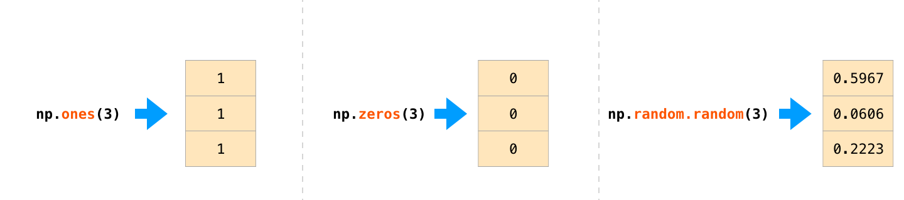
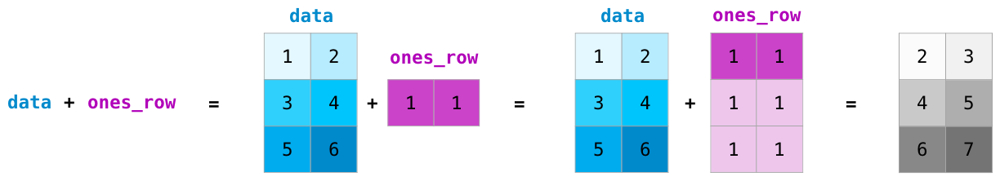
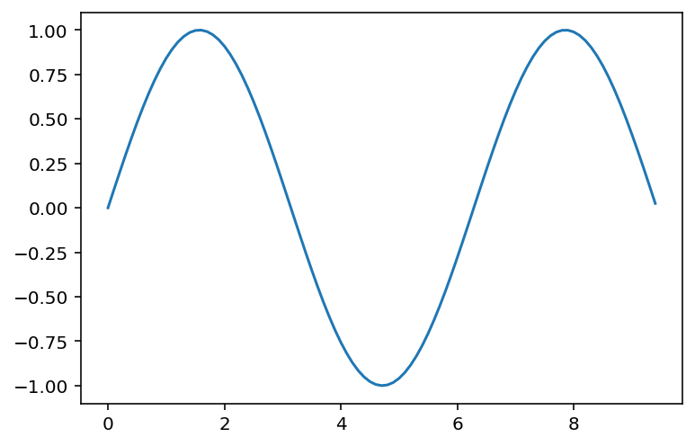
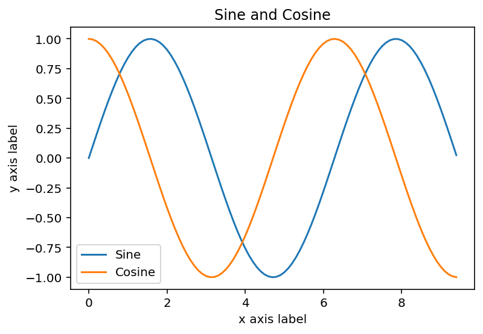

## Python crash course for Chem324.


The objective of these notes it to provide a quick introduction to Python language. No background in programming or previous knolwedge of Python is assumed. These notes will only cover the bare essentials of Python which will be used throughout the course. <br>
Since our coverage will necessarily be brief, you can find some more pointers to excellent resources for learning Python listed below. Links under 1 are short and very basic. Links under 2 short but somewhat more advanced and Links under 3 are long and comprehensive. 


**1. Short tutorials by software carpentry for scientists**
   - [Programming Python](http://swcarpentry.github.io/python-novice-inflammation/)
   - [Plotting and programming in Python ](http://swcarpentry.github.io/python-novice-gapminder/)


**2. Condensed coverage of scientific applicaitons can be found in the following online notes:**
   - [Python programming for Scientists](http://wwwstaff.ari.uni-heidelberg.de/mitarbeiter/rschmidt/pycourse/index.html)
   - [Introduction to Python for Computational Science and Engineering](https://fangohr.github.io/introduction-to-python-for-computational-science-and-engineering/)
   - [Scientific Python lectures by Robert Johanssen](https://nbviewer.jupyter.org/github/jrjohansson/scientific-python-lectures/tree/master/)
   
    

**3. Finally there are the official Python documentaiton and SciPy tutorials. These provide much more in depth and thorough coverage.**
   - [SciPy lectures](http://scipy-lectures.org/index.html)
   - [Official python tutorial](https://docs.python.org/3/tutorial/)


## Introduction


Python is a fantastic general-purpose programming language on its own, but with the help of a few popular libraries (numpy, scipy, matplotlib) it becomes a powerful environment for scientific computing.

You may already know some Python and that's great! For the rest of you, this section will serve as a quick crash course both on the Python programming language and on the use of Python for scientific computing. 


## Material covered in this tutorial:


Basics of python language:

- **Data types: numbers, booleans, strings, lists**
- **Functions**
- **Control flow**

Interactive computing with Jupyter and scientific libraries. 

- **Numpy arrays**
- **Scipy functions**
- **Matplotlib plotting**   


## Basics of Python


Python is a high-level, dynamically-typed, multiparadigm programming language. 

Python code is often said to be almost like pseudocode, since it allows you to express very powerful ideas in very few lines of code while being very readable. A few examples without explanations are below:


<div markdown="1" class="cell code_cell">
<div class="input_area" markdown="1">
```python
menu = ["pizza", "sushi", "taco"] 

for item in menu:
    print(item)

```
</div>

<div class="output_wrapper" markdown="1">
<div class="output_subarea" markdown="1">
{:.output_stream}
```
pizza
sushi
taco
```
</div>
</div>
</div>


<div markdown="1" class="cell code_cell">
<div class="input_area" markdown="1">
```python
menu = ["sushi", "123", "taco", "frog"] 

for item in menu:
    
    if item == "sushi":                     
        print("yum!")
        
    elif item == "taco":                
        print("maybe not today")
        
    else:
        print("eww")

```
</div>

<div class="output_wrapper" markdown="1">
<div class="output_subarea" markdown="1">
{:.output_stream}
```
yum!
eww
maybe not today
eww
```
</div>
</div>
</div>


While these are silly examples for illustration, with the same simplicity of code you can do fairly sophisticated calculations. Do not worry if some of these commands seem unfamiliar, we are going to explain them later on. 


### Python versions


There are older version of Python (Python 2.7) and newer versions (Python 3.7+). We will always use the latest version. If you have installed Python on your computer you can check your Python version at the command line by running `python --version`.


### Comments
A “comment” is a part of code that is not run. It is a way to
write notes about what your code is doing at certain points. This is helpful
when you, or someone else, looks at the code later, so they know what it is
doing. To make a comment in Python, precede the comment with a #.


<div markdown="1" class="cell code_cell">
<div class="input_area" markdown="1">
```python
# Comments can be on their own line like this
print("Hello")

print("World") # A comment can also be at the end of a line

```
</div>

<div class="output_wrapper" markdown="1">
<div class="output_subarea" markdown="1">
{:.output_stream}
```
Hello
World
```
</div>
</div>
</div>


### Whitespace
In programming, white space refers to all of the space in your document that is not filled with code.  Examples of whitespace are spaces, tabs (indents), and newlines (when you press enter and go to the next line). Python is very particular about white space and how you use it, specifically the use of indentations and newlines.
- **Newlines:** Python uses newline characters to separate logical lines of code. A logical line of code consists of a "command" in code. It is considered good Python style, or _Pythonic_ , to separate logical lines with newlines, although other methods exist.
- **Indentation:** Tab characters, or indentation, are used to indicate code blocks in Python. These will be seen later in the tutorial with for loops, while loops, if statements, and other structures. For now, the take-home message is to follow the indentation pattern of the example and avoid unnecessary indentation.


<div markdown="1" class="cell code_cell">
<div class="input_area" markdown="1">
```python
print("Hello") # This is a logical line that assigns the value 16 to x
print("World") # This is another logical line, on the next line, that prints the value of x

```
</div>

<div class="output_wrapper" markdown="1">
<div class="output_subarea" markdown="1">
{:.output_stream}
```
Hello
World
```
</div>
</div>
</div>


<div markdown="1" class="cell code_cell">
<div class="input_area" markdown="1">
```python
print("Hello")     # This line is not indented, so it is fine
    print("World") # Unnecessary indentation, this code will not work

```
</div>

<div class="output_wrapper" markdown="1">
<div class="output_subarea" markdown="1">
{:.output_traceback_line}
```

      File "<ipython-input-2-3c37af9014f9>", line 2
        print("World") # Unnecessary indentation, this code will not work
        ^
    IndentationError: unexpected indent


```
</div>
</div>
</div>


**Exercise:** Remove unnecessary indentation in the broken code above and execute it again.


### Basic data types

Python has a variety of data types for managing different kinds of data. Examples are:
- numbers
- strings
- lists
- dictionaries
- sets
- tuples 

Some of these are _point types_ such as simple numbers often used for basic arithmetic operations. Others are of _container kind_ which contain sequences of numbers often used as vectors and matrices.  


## Numbers


Numbers are an important data type for us which we use to do all sorts of computations. It is important to know that the numbers in Python can be:
- **Integers:** -2, -1, 0, 1, 2
- **Floats:** -0.001, 4.56, 3.14
- **Complex numbers:** 1.2+2.5j, 2j, 3+1j

Let us begin creating some numeric data and assigning variable names:


<div markdown="1" class="cell code_cell">
<div class="input_area" markdown="1">
```python
x = 3    # variable called x

```
</div>

</div>


<div markdown="1" class="cell code_cell">
<div class="input_area" markdown="1">
```python
print(x) # print contents of x

```
</div>

<div class="output_wrapper" markdown="1">
<div class="output_subarea" markdown="1">
{:.output_stream}
```
3
```
</div>
</div>
</div>


<div markdown="1" class="cell code_cell">
<div class="input_area" markdown="1">
```python
x        # Works the same for single line but for multiple lines you need print. See below

```
</div>

<div class="output_wrapper" markdown="1">
<div class="output_subarea" markdown="1">


{:.output_data_text}
```
3
```


</div>
</div>
</div>


<div markdown="1" class="cell code_cell">
<div class="input_area" markdown="1">
```python
print(x + 1)   # Addition
print(x - 1)   # Subtraction
print(x * 2)   # Multiplication
print(x ** 2)  # Exponentiation

```
</div>

<div class="output_wrapper" markdown="1">
<div class="output_subarea" markdown="1">
{:.output_stream}
```
4
2
6
9
```
</div>
</div>
</div>


<div markdown="1" class="cell code_cell">
<div class="input_area" markdown="1">
```python
type(x) # let's find out what kind of number is this

```
</div>

<div class="output_wrapper" markdown="1">
<div class="output_subarea" markdown="1">


{:.output_data_text}
```
int
```


</div>
</div>
</div>


**Exercise:** change the number type to float and complex number and execute the above cells again


<div markdown="1" class="cell code_cell">
<div class="input_area" markdown="1">
```python
x, y, z = 1, 2, 5 # multiple assignments can be done with one line!

```
</div>

</div>


<div markdown="1" class="cell code_cell">
<div class="input_area" markdown="1">
```python
x + y, x * z  # Multiple operations can be done with one line also, separated by a comma!

```
</div>

<div class="output_wrapper" markdown="1">
<div class="output_subarea" markdown="1">


{:.output_data_text}
```
(3, 5)
```


</div>
</div>
</div>


#### Complex numbers are handled just as easily


<div markdown="1" class="cell code_cell">
<div class="input_area" markdown="1">
```python
z1 = 10+2j
z2 = 3-1j

```
</div>

</div>


<div markdown="1" class="cell code_cell">
<div class="input_area" markdown="1">
```python
# extract real and imaginary parts as well as the conjugate
z1.real, z1.imag, z1.conjugate()

```
</div>

<div class="output_wrapper" markdown="1">
<div class="output_subarea" markdown="1">


{:.output_data_text}
```
(10.0, 2.0, (10-2j))
```


</div>
</div>
</div>


<div markdown="1" class="cell code_cell">
<div class="input_area" markdown="1">
```python
z1_abs = z1 * z1.conjugate()
print(z1_abs)

```
</div>

<div class="output_wrapper" markdown="1">
<div class="output_subarea" markdown="1">
{:.output_stream}
```
(104+0j)
```
</div>
</div>
</div>


<div markdown="1" class="cell code_cell">
<div class="input_area" markdown="1">
```python
z1_abs**0.5

```
</div>

<div class="output_wrapper" markdown="1">
<div class="output_subarea" markdown="1">


{:.output_data_text}
```
(10.198039027185569+0j)
```


</div>
</div>
</div>


## Booleans


Booleans are key type in any computer language they allow determining true or false statements and constructing logical set of operations


<div markdown="1" class="cell code_cell">
<div class="input_area" markdown="1">
```python
x=True
y=False
z=True

```
</div>

</div>


<div markdown="1" class="cell code_cell">
<div class="input_area" markdown="1">
```python
x==z  # ==, !=, >, < comparison operators and return True or False.

```
</div>

<div class="output_wrapper" markdown="1">
<div class="output_subarea" markdown="1">


{:.output_data_text}
```
True
```


</div>
</div>
</div>


<div markdown="1" class="cell code_cell">
<div class="input_area" markdown="1">
```python
y=2.3
y>2

```
</div>

<div class="output_wrapper" markdown="1">
<div class="output_subarea" markdown="1">


{:.output_data_text}
```
True
```


</div>
</div>
</div>


<div markdown="1" class="cell code_cell">
<div class="input_area" markdown="1">
```python
y<2

```
</div>

<div class="output_wrapper" markdown="1">
<div class="output_subarea" markdown="1">


{:.output_data_text}
```
False
```


</div>
</div>
</div>


<div markdown="1" class="cell code_cell">
<div class="input_area" markdown="1">
```python
y==2.3

```
</div>

<div class="output_wrapper" markdown="1">
<div class="output_subarea" markdown="1">


{:.output_data_text}
```
True
```


</div>
</div>
</div>


<div markdown="1" class="cell code_cell">
<div class="input_area" markdown="1">
```python
y!=-234

```
</div>

<div class="output_wrapper" markdown="1">
<div class="output_subarea" markdown="1">


{:.output_data_text}
```
True
```


</div>
</div>
</div>


## Strings


<div markdown="1" class="cell code_cell">
<div class="input_area" markdown="1">
```python
hello = 'hello'   # String literals can use single quotes
world = "world"   # or double quotes; it does not matter.
print(hello, len(hello))

```
</div>

<div class="output_wrapper" markdown="1">
<div class="output_subarea" markdown="1">
{:.output_stream}
```
hello 5
```
</div>
</div>
</div>


<div markdown="1" class="cell code_cell">
<div class="input_area" markdown="1">
```python
hw = hello + ' ' + world  # String concatenation with the + operator
print(hw)  # prints "hello world"

```
</div>

<div class="output_wrapper" markdown="1">
<div class="output_subarea" markdown="1">
{:.output_stream}
```
hello world
```
</div>
</div>
</div>


String objects have a bunch of useful methods; for example:


<div markdown="1" class="cell code_cell">
<div class="input_area" markdown="1">
```python
s = "hello"
print(s.capitalize())  # Capitalize a string; prints "Hello"
print(s.upper())       # Convert a string to uppercase; prints "HELLO"
print(s.rjust(7))      # Right-justify a string, padding with spaces; prints "  hello"
print(s.center(7))     # Center a string, padding with spaces; prints " hello "
print(s.replace('l', '(ell)'))  # Replace all instances of one substring with another;
                               # prints "he(ell)(ell)o"
print('  world '.strip())  # Strip leading and trailing whitespace; prints "world"

```
</div>

<div class="output_wrapper" markdown="1">
<div class="output_subarea" markdown="1">
{:.output_stream}
```
Hello
HELLO
  hello
 hello 
he(ell)(ell)o
world
```
</div>
</div>
</div>


## Containers


Python includes several built-in container types: **lists, dictionaries, sets, and tuples.** Lists will be the most useful for our objectives in this course so we only cover lists.


### Lists


A list is a generic container for holding any Python type, be it a string, numbers, other lists, or a mix of everything.


<div markdown="1" class="cell code_cell">
<div class="input_area" markdown="1">
```python
xs = [3, 1, 2]   # Create a list
print(xs)        # Print the entire list
print(xs[2])     # Index the list with square brackets; indices start at 0 for the first element, so index 2 is the third element
print(xs[-1])    # Negative indices count from the end of the list; prints "2"

```
</div>

<div class="output_wrapper" markdown="1">
<div class="output_subarea" markdown="1">
{:.output_stream}
```
[3, 1, 2]
2
2
```
</div>
</div>
</div>


<div markdown="1" class="cell code_cell">
<div class="input_area" markdown="1">
```python
xs[2] = 'foo'    # Lists can contain elements of different types
print(xs)

```
</div>

<div class="output_wrapper" markdown="1">
<div class="output_subarea" markdown="1">
{:.output_stream}
```
[3, 1, 'foo']
```
</div>
</div>
</div>


<div markdown="1" class="cell code_cell">
<div class="input_area" markdown="1">
```python
xs.append('bar') # Add a new element to the end of the list
print(xs)  

```
</div>

<div class="output_wrapper" markdown="1">
<div class="output_subarea" markdown="1">
{:.output_stream}
```
[3, 1, 'foo', 'bar']
```
</div>
</div>
</div>


<div markdown="1" class="cell code_cell">
<div class="input_area" markdown="1">
```python
x = xs.pop()     # Remove and return the last element of the list
print(x, xs) 

```
</div>

<div class="output_wrapper" markdown="1">
<div class="output_subarea" markdown="1">
{:.output_stream}
```
bar [3, 1, 'foo']
```
</div>
</div>
</div>


As usual, you can find all the gory details about lists in the [documentation](https://docs.python.org/2/tutorial/datastructures.html#more-on-lists).


### Slicing


In addition to accessing list elements one at a time, Python provides concise syntax to access sublists; this is known as slicing:


<div markdown="1" class="cell code_cell">
<div class="input_area" markdown="1">
```python
nums = range(0,5,1) # range(i,j,k) is a built-in function that creates a list of integers from i to j with a stride k
nums=list(nums)     # make a list
print(nums)         # Prints "[0, 1, 2, 3, 4]"
print(nums[2:4])    # Get a slice from index 2 to 4 (exclusive); prints "[2, 3]"
print(nums[2:])     # Get a slice from index 2 to the end; prints "[2, 3, 4]"
print(nums[:2])     # Get a slice from the start to index 2 (exclusive); prints "[0, 1]"
print(nums[:])      # Get a slice of the whole list; prints ["0, 1, 2, 3, 4]"
print(nums[:-1])    # Slice indices can be negative; prints ["0, 1, 2, 3]"
nums[2:4] = [8, 9] # Assign a new sublist to a slice
print(nums)         # Prints "[0, 1, 8, 9, 4]"

```
</div>

<div class="output_wrapper" markdown="1">
<div class="output_subarea" markdown="1">
{:.output_stream}
```
[0, 1, 2, 3, 4]
[2, 3]
[2, 3, 4]
[0, 1]
[0, 1, 2, 3, 4]
[0, 1, 2, 3]
[0, 1, 8, 9, 4]
```
</div>
</div>
</div>


### Loops


You can loop over the elements of a list like this:


<div markdown="1" class="cell code_cell">
<div class="input_area" markdown="1">
```python
animals = ['cat', 'dog', 'monkey']
for animal in animals:
    print(animal)

```
</div>

<div class="output_wrapper" markdown="1">
<div class="output_subarea" markdown="1">
{:.output_stream}
```
cat
dog
monkey
```
</div>
</div>
</div>


### List comprehensions:


When programming, frequently we want to transform one type of data into another. As a simple example, consider the following code that computes square numbers:


<div markdown="1" class="cell code_cell">
<div class="input_area" markdown="1">
```python
nums = [0, 1, 2, 3, 4]
squares = []
for x in nums:
    squares.append(x ** 2)
squares

```
</div>

<div class="output_wrapper" markdown="1">
<div class="output_subarea" markdown="1">


{:.output_data_text}
```
[0, 1, 4, 9, 16]
```


</div>
</div>
</div>


You can make this code simpler using a special trick of lists called list comprehension:


<div markdown="1" class="cell code_cell">
<div class="input_area" markdown="1">
```python
nums = [0, 1, 2, 3, 4]
squares = [x ** 2 for x in nums]  # This is a list comprehension
squares

```
</div>

<div class="output_wrapper" markdown="1">
<div class="output_subarea" markdown="1">


{:.output_data_text}
```
[0, 1, 4, 9, 16]
```


</div>
</div>
</div>


List comprehensions can also contain conditions:


<div markdown="1" class="cell code_cell">
<div class="input_area" markdown="1">
```python
nums = [0, 1, 2, 3, 4]
even_squares = [x ** 2 for x in nums if x % 2 == 0]
even_squares

```
</div>

<div class="output_wrapper" markdown="1">
<div class="output_subarea" markdown="1">


{:.output_data_text}
```
[0, 4, 16]
```


</div>
</div>
</div>


## Functions


Python functions are defined using the `def` keyword. For example let us write a function that maps numbers into description of postivie, negative and zero. 


<div markdown="1" class="cell code_cell">
<div class="input_area" markdown="1">
```python
def sign(x):
    if x > 0:
        return 'positive'
    elif x < 0:
        return 'negative'
    else:
        return 'zero'

```
</div>

</div>


<div markdown="1" class="cell code_cell">
<div class="input_area" markdown="1">
```python
for x in [-1, 0, 1]:
    print(sign(x))

```
</div>

<div class="output_wrapper" markdown="1">
<div class="output_subarea" markdown="1">
{:.output_stream}
```
negative
zero
positive
```
</div>
</div>
</div>


Let us write a polynomial function $$f(x)=3.0x^3 + x^2 + 10x+1.0 $$


<div markdown="1" class="cell code_cell">
<div class="input_area" markdown="1">
```python
def sq_func(x):  # A more conventional function
    return 3.0*x**3 + x**2 + 10*x+1.0

```
</div>

</div>


<div markdown="1" class="cell code_cell">
<div class="input_area" markdown="1">
```python
sq_func(4.0)

```
</div>

<div class="output_wrapper" markdown="1">
<div class="output_subarea" markdown="1">


{:.output_data_text}
```
249.0
```


</div>
</div>
</div>


## NumPy


NumPy is the core library for numerical and scientific computing in Python. It provides a high-performance multidimensional array object, and tools for working with these arrays. 


To use NumPy, we first need to import the `numpy` package:


<div markdown="1" class="cell code_cell">
<div class="input_area" markdown="1">
```python
import numpy as np

```
</div>

</div>


### Numpy Arrays: overview


- A numpy array is a grid of values, all of the same type, and is indexed by nonnegative integers. 
- The array can have any number of dimensions 1D, 2D, 3D, ...
- The shape of an array is a tuple of integers giving the size of the array along each dimension. For example a 1D vector of size 4 is (4,). a mtrix of size 2 is (2,2), a matrix with size 2x5 is (2,5) 

- Numpy arrays can be generates either by feeding lists to numpy or on the fly using numpy special methods


### Generating arrays from lists


<div markdown="1" class="cell code_cell">
<div class="input_area" markdown="1">
```python
data=np.array([1,2,3])
data

```
</div>

<div class="output_wrapper" markdown="1">
<div class="output_subarea" markdown="1">


{:.output_data_text}
```
array([1, 2, 3])
```


</div>
</div>
</div>


<div markdown="1" class="cell code_cell">
<div class="input_area" markdown="1">
```python
data.shape

```
</div>

<div class="output_wrapper" markdown="1">
<div class="output_subarea" markdown="1">


{:.output_data_text}
```
(3,)
```


</div>
</div>
</div>


<div markdown="1" class="cell code_cell">
<div class="input_area" markdown="1">
```python
print(data[0], data[1], data[2]) 
data[0] = 10                 # Change an element of the array
print(data)                   

```
</div>

<div class="output_wrapper" markdown="1">
<div class="output_subarea" markdown="1">
{:.output_stream}
```
10 2 3
[10  2  3]
```
</div>
</div>
</div>


<div markdown="1" class="cell code_cell">
<div class="input_area" markdown="1">
```python
b = np.array([[1,2,3],[4,5,6]])   # Create a 2D array
print(b)

```
</div>

<div class="output_wrapper" markdown="1">
<div class="output_subarea" markdown="1">
{:.output_stream}
```
[[1 2 3]
 [4 5 6]]
```
</div>
</div>
</div>


<div markdown="1" class="cell code_cell">
<div class="input_area" markdown="1">
```python
print(b.shape)                    
print(b[0, 0], b[0, 1], b[1, 0]) 

```
</div>

<div class="output_wrapper" markdown="1">
<div class="output_subarea" markdown="1">
{:.output_stream}
```
(2, 3)
1 2 4
```
</div>
</div>
</div>


### Generating arrays using special methods





<div markdown="1" class="cell code_cell">
<div class="input_area" markdown="1">
```python
a = np.zeros((2,2))  # Create an array of all zeros
print(a)

```
</div>

<div class="output_wrapper" markdown="1">
<div class="output_subarea" markdown="1">
{:.output_stream}
```
[[0. 0.]
 [0. 0.]]
```
</div>
</div>
</div>


<div markdown="1" class="cell code_cell">
<div class="input_area" markdown="1">
```python
b = np.ones((1,5))   # Create an array of all ones
print(b) 

```
</div>

<div class="output_wrapper" markdown="1">
<div class="output_subarea" markdown="1">
{:.output_stream}
```
[[1. 1. 1. 1. 1.]]
```
</div>
</div>
</div>


<div markdown="1" class="cell code_cell">
<div class="input_area" markdown="1">
```python
e = np.random.random((3,3)) # Create an array filled with random values
print(e)

```
</div>

<div class="output_wrapper" markdown="1">
<div class="output_subarea" markdown="1">
{:.output_stream}
```
[[0.11980927 0.18463882 0.52049483]
 [0.29866457 0.9259604  0.76969261]
 [0.52907565 0.4915988  0.00371352]]
```
</div>
</div>
</div>


<div markdown="1" class="cell code_cell">
<div class="input_area" markdown="1">
```python
x = np.linspace(1,100,10) # create an array between 1 and 100 divided by 10 segments
print(x)

```
</div>

<div class="output_wrapper" markdown="1">
<div class="output_subarea" markdown="1">
{:.output_stream}
```
[  1.  12.  23.  34.  45.  56.  67.  78.  89. 100.]
```
</div>
</div>
</div>


<div markdown="1" class="cell code_cell">
<div class="input_area" markdown="1">
```python
y = np.arange(1,100,10) # create an array strting from 1 to 100 in 10 incremenets
print(y)

```
</div>

<div class="output_wrapper" markdown="1">
<div class="output_subarea" markdown="1">
{:.output_stream}
```
[ 1 11 21 31 41 51 61 71 81 91]
```
</div>
</div>
</div>


<div markdown="1" class="cell code_cell">
<div class="input_area" markdown="1">
```python
c = np.full((2,2), 7) # Create a constant array
print(c)  

```
</div>

<div class="output_wrapper" markdown="1">
<div class="output_subarea" markdown="1">
{:.output_stream}
```
[[7 7]
 [7 7]]
```
</div>
</div>
</div>


<div markdown="1" class="cell code_cell">
<div class="input_area" markdown="1">
```python
d = np.eye(3)        # Create a 3x3 identity matrix
print(d) 

```
</div>

<div class="output_wrapper" markdown="1">
<div class="output_subarea" markdown="1">
{:.output_stream}
```
[[1. 0. 0.]
 [0. 1. 0.]
 [0. 0. 1.]]
```
</div>
</div>
</div>


<div markdown="1" class="cell code_cell">
<div class="input_area" markdown="1">
```python
k = np.tile(d,3)  # repeat the array d 3 times
k

```
</div>

<div class="output_wrapper" markdown="1">
<div class="output_subarea" markdown="1">


{:.output_data_text}
```
array([[1., 0., 0., 1., 0., 0., 1., 0., 0.],
       [0., 1., 0., 0., 1., 0., 0., 1., 0.],
       [0., 0., 1., 0., 0., 1., 0., 0., 1.]])
```


</div>
</div>
</div>


### Indexing, slicing and dicing arrays


**Slicing:** Similar to Python lists, numpy arrays can be sliced. Since arrays may be multidimensional, you must specify a slice for each dimension of the array:


<div markdown="1" class="cell code_cell">
<div class="input_area" markdown="1">
```python
data=np.array([1,2,3])
data[0:3]

```
</div>

<div class="output_wrapper" markdown="1">
<div class="output_subarea" markdown="1">


{:.output_data_text}
```
array([1, 2, 3])
```


</div>
</div>
</div>


<div markdown="1" class="cell code_cell">
<div class="input_area" markdown="1">
```python
data=np.array([[1,3,5], [2,4,6]])
data.T

```
</div>

<div class="output_wrapper" markdown="1">
<div class="output_subarea" markdown="1">


{:.output_data_text}
```
array([[1, 2],
       [3, 4],
       [5, 6]])
```


</div>
</div>
</div>


<div markdown="1" class="cell code_cell">
<div class="input_area" markdown="1">
```python
a = np.array([[1,2,3,4], [5,6,7,8], [9,10,11,12]])
a

```
</div>

<div class="output_wrapper" markdown="1">
<div class="output_subarea" markdown="1">


{:.output_data_text}
```
array([[ 1,  2,  3,  4],
       [ 5,  6,  7,  8],
       [ 9, 10, 11, 12]])
```


</div>
</div>
</div>


<div markdown="1" class="cell code_cell">
<div class="input_area" markdown="1">
```python
a.shape

```
</div>

<div class="output_wrapper" markdown="1">
<div class="output_subarea" markdown="1">


{:.output_data_text}
```
(3, 4)
```


</div>
</div>
</div>


<div markdown="1" class="cell code_cell">
<div class="input_area" markdown="1">
```python
a[1,:]  #

```
</div>

<div class="output_wrapper" markdown="1">
<div class="output_subarea" markdown="1">


{:.output_data_text}
```
array([5, 6, 7, 8])
```


</div>
</div>
</div>


<div markdown="1" class="cell code_cell">
<div class="input_area" markdown="1">
```python
a[1,3]

```
</div>

<div class="output_wrapper" markdown="1">
<div class="output_subarea" markdown="1">


{:.output_data_text}
```
8
```


</div>
</div>
</div>


<div markdown="1" class="cell code_cell">
<div class="input_area" markdown="1">
```python
a[:,-1] # last column

```
</div>

<div class="output_wrapper" markdown="1">
<div class="output_subarea" markdown="1">


{:.output_data_text}
```
array([ 4,  8, 12])
```


</div>
</div>
</div>


<div markdown="1" class="cell code_cell">
<div class="input_area" markdown="1">
```python
a[-1,:] # last row

```
</div>

<div class="output_wrapper" markdown="1">
<div class="output_subarea" markdown="1">


{:.output_data_text}
```
array([ 9, 10, 11, 12])
```


</div>
</div>
</div>


### Array math


Basic mathematical functions operate **elementwise on arrays**, and are available both as operator overloads and as functions in the numpy module:


<div markdown="1" class="cell code_cell">
<div class="input_area" markdown="1">
```python
x = np.array([1,2,3,4])
y = np.array([5,6,7,8])

```
</div>

</div>


<div markdown="1" class="cell code_cell">
<div class="input_area" markdown="1">
```python
# Elementwise sum; both produce the array
print(x + y) 

```
</div>

<div class="output_wrapper" markdown="1">
<div class="output_subarea" markdown="1">
{:.output_stream}
```
[ 6  8 10 12]
```
</div>
</div>
</div>


<div markdown="1" class="cell code_cell">
<div class="input_area" markdown="1">
```python
# Elementwise difference; both produce the array
print(x - y)  

```
</div>

<div class="output_wrapper" markdown="1">
<div class="output_subarea" markdown="1">
{:.output_stream}
```
[-4 -4 -4 -4]
```
</div>
</div>
</div>


<div markdown="1" class="cell code_cell">
<div class="input_area" markdown="1">
```python
# Elementwise product; both produce the array
print(x * y) 

```
</div>

<div class="output_wrapper" markdown="1">
<div class="output_subarea" markdown="1">
{:.output_stream}
```
[ 5 12 21 32]
```
</div>
</div>
</div>


<div markdown="1" class="cell code_cell">
<div class="input_area" markdown="1">
```python
print(x / y) 

```
</div>

<div class="output_wrapper" markdown="1">
<div class="output_subarea" markdown="1">
{:.output_stream}
```
[0.2        0.33333333 0.42857143 0.5       ]
```
</div>
</div>
</div>


<div markdown="1" class="cell code_cell">
<div class="input_area" markdown="1">
```python
print(np.sqrt(x)) 

```
</div>

<div class="output_wrapper" markdown="1">
<div class="output_subarea" markdown="1">
{:.output_stream}
```
[1.         1.41421356 1.73205081 2.        ]
```
</div>
</div>
</div>


<div markdown="1" class="cell code_cell">
<div class="input_area" markdown="1">
```python
1.5*x  # elementwise multiplication!

```
</div>

<div class="output_wrapper" markdown="1">
<div class="output_subarea" markdown="1">


{:.output_data_text}
```
array([1.5, 3. , 4.5, 6. ])
```


</div>
</div>
</div>


<div markdown="1" class="cell code_cell">
<div class="input_area" markdown="1">
```python
y+3    # elementwise addition. 

```
</div>

<div class="output_wrapper" markdown="1">
<div class="output_subarea" markdown="1">


{:.output_data_text}
```
array([ 8,  9, 10, 11])
```


</div>
</div>
</div>


As last two examples show can also do operations on arrays with unequal shapes! These are powerful operations which follow set of rules called **broadcasting.** See the end for these rules and examples


**To use vector,matrix dot product between A and B use A@B**


<div markdown="1" class="cell code_cell">
<div class="input_area" markdown="1">
```python
x = np.array([[1,2],[3,4]])
y = np.array([[5,6],[7,8]])

v = np.array([9,10])
w = np.array([11, 12])

# Inner product of vectors; both produce 219
print(v@w) 

```
</div>

<div class="output_wrapper" markdown="1">
<div class="output_subarea" markdown="1">
{:.output_stream}
```
219
```
</div>
</div>
</div>


<div markdown="1" class="cell code_cell">
<div class="input_area" markdown="1">
```python
# Matrix / vector product; both produce the rank 1 array [29 67]
print(x@v) 

```
</div>

<div class="output_wrapper" markdown="1">
<div class="output_subarea" markdown="1">
{:.output_stream}
```
[29 67]
```
</div>
</div>
</div>


<div markdown="1" class="cell code_cell">
<div class="input_area" markdown="1">
```python
# Matrix / matrix product; both produce the rank 2 array
print(x@y) 

```
</div>

<div class="output_wrapper" markdown="1">
<div class="output_subarea" markdown="1">
{:.output_stream}
```
20
```
</div>
</div>
</div>


### Aggregation


Numpy provides many useful functions for performing computations on arrays; one of the most useful is `sum`:


<div markdown="1" class="cell code_cell">
<div class="input_area" markdown="1">
```python
x = np.array([[1,2],[3,4]])
x

```
</div>

<div class="output_wrapper" markdown="1">
<div class="output_subarea" markdown="1">


{:.output_data_text}
```
array([[1, 2],
       [3, 4]])
```


</div>
</div>
</div>


<div markdown="1" class="cell code_cell">
<div class="input_area" markdown="1">
```python
print(np.sum(x))   # Compute sum of all elements; prints "10"
print(np.sum(x, axis=0) )  # Compute sum of each column; prints "[4 6]"
print(np.sum(x, axis=1))   # Compute sum of each row; prints "[3 7]"

```
</div>

<div class="output_wrapper" markdown="1">
<div class="output_subarea" markdown="1">
{:.output_stream}
```
10
[4 6]
[3 7]
```
</div>
</div>
</div>


<div markdown="1" class="cell code_cell">
<div class="input_area" markdown="1">
```python
print(x.max())
print(x.min())

```
</div>

<div class="output_wrapper" markdown="1">
<div class="output_subarea" markdown="1">
{:.output_stream}
```
4
1
```
</div>
</div>
</div>


### Reshaping arrays


<div markdown="1" class="cell code_cell">
<div class="input_area" markdown="1">
```python
x=np.array([1,2,3,4,5,6,7,8,9,10])
x

```
</div>

<div class="output_wrapper" markdown="1">
<div class="output_subarea" markdown="1">


{:.output_data_text}
```
array([ 1,  2,  3,  4,  5,  6,  7,  8,  9, 10])
```


</div>
</div>
</div>


<div markdown="1" class="cell code_cell">
<div class="input_area" markdown="1">
```python
x=x.reshape(2,5)
x

```
</div>

<div class="output_wrapper" markdown="1">
<div class="output_subarea" markdown="1">


{:.output_data_text}
```
array([[ 1,  2,  3,  4,  5],
       [ 6,  7,  8,  9, 10]])
```


</div>
</div>
</div>


<div markdown="1" class="cell code_cell">
<div class="input_area" markdown="1">
```python
x=x.reshape(5,2)
x

```
</div>

<div class="output_wrapper" markdown="1">
<div class="output_subarea" markdown="1">


{:.output_data_text}
```
array([[ 1,  2],
       [ 3,  4],
       [ 5,  6],
       [ 7,  8],
       [ 9, 10]])
```


</div>
</div>
</div>


<div markdown="1" class="cell code_cell">
<div class="input_area" markdown="1">
```python
x.T # transpose matrix

```
</div>

<div class="output_wrapper" markdown="1">
<div class="output_subarea" markdown="1">


{:.output_data_text}
```
array([[ 1,  3,  5,  7,  9],
       [ 2,  4,  6,  8, 10]])
```


</div>
</div>
</div>


### Broadcasting rules of numpy arrays


Broadcasting is a powerful mechanism that allows numpy to work with arrays of different shapes when performing arithmetic operations. Frequently we have a smaller array and a larger array, and we want to use the smaller array multiple times to perform some operation on the larger array. 


The rules of broadcasting are:

- **Rule 1:** If the two arrays differ in their number of dimensions, the shape of the one with fewer dimensions is padded with ones on its leading (left) side.
- **Rule 2:** If the shape of the two arrays does not match in any dimension, the array with shape equal to 1 in that dimension is stretched to match the other shape.
- **Rule 3:** If in any dimension the sizes disagree and neither is equal to 1, an error is raised.





**example of broadcasting**


<div markdown="1" class="cell code_cell">
<div class="input_area" markdown="1">
```python
data = np.array([[1,3,5],[2,4,6]]).T
ones_row = np.array([1,1])

```
</div>

</div>


<div markdown="1" class="cell code_cell">
<div class="input_area" markdown="1">
```python
data.shape, ones_row.shape

```
</div>

<div class="output_wrapper" markdown="1">
<div class="output_subarea" markdown="1">


{:.output_data_text}
```
((3, 2), (2,))
```


</div>
</div>
</div>


<div markdown="1" class="cell code_cell">
<div class="input_area" markdown="1">
```python
print(data)
print(ones_row)

```
</div>

<div class="output_wrapper" markdown="1">
<div class="output_subarea" markdown="1">
{:.output_stream}
```
[[1 2]
 [3 4]
 [5 6]]
[1 1]
```
</div>
</div>
</div>


<div markdown="1" class="cell code_cell">
<div class="input_area" markdown="1">
```python
data+ones_row

```
</div>

<div class="output_wrapper" markdown="1">
<div class="output_subarea" markdown="1">


{:.output_data_text}
```
array([[2, 3],
       [4, 5],
       [6, 7]])
```


</div>
</div>
</div>


**Let us see both rules in action on another example**


<div markdown="1" class="cell code_cell">
<div class="input_area" markdown="1">
```python

a = np.arange(3).reshape((3, 1))
print(a)
print(a.shape)

```
</div>

<div class="output_wrapper" markdown="1">
<div class="output_subarea" markdown="1">
{:.output_stream}
```
[[0]
 [1]
 [2]]
(3, 1)
```
</div>
</div>
</div>


<div markdown="1" class="cell code_cell">
<div class="input_area" markdown="1">
```python
b = np.arange(3)
print(b)
print(b.shape)

```
</div>

<div class="output_wrapper" markdown="1">
<div class="output_subarea" markdown="1">
{:.output_stream}
```
[0 1 2]
(3,)
```
</div>
</div>
</div>


Lets predict a+b sum. By first rule the sum of arrays with shapes **(3,1)+(3,)** are broadcast to **(3,1)+(1,3)** then by second rule dimensions one are padded to match the shape **(3,3)+(3,3)**


<div markdown="1" class="cell code_cell">
<div class="input_area" markdown="1">
```python
a+b 

```
</div>

<div class="output_wrapper" markdown="1">
<div class="output_subarea" markdown="1">


{:.output_data_text}
```
array([[0, 1, 2],
       [1, 2, 3],
       [2, 3, 4]])
```


</div>
</div>
</div>


## Plotting with Matplotlib


Matplotlib is a standard plotting library of python. We begin by importing it first.


<div markdown="1" class="cell code_cell">
<div class="input_area" markdown="1">
```python
import matplotlib.pyplot as plt

```
</div>

</div>


By running these special commands known as magic commands (start with %), we will be displaying plots inline and making them in high resolution:


<div markdown="1" class="cell code_cell">
<div class="input_area" markdown="1">
```python
#To keep plots inside notebook we add thee magic comand starting with %
%matplotlib inline

#For interactivity try this:
#%matplotlib notebook

#If your screen has retina display this will increase resolution of plots
%config InlineBackend.figure_format = 'retina'

```
</div>

</div>


The most important function in `matplotlib` is plot, which allows you to plot 2D data. Here is a simple example:


<div markdown="1" class="cell code_cell">
<div class="input_area" markdown="1">
```python
# Compute the x and y coordinates for points on a sine curve
x = np.arange(0, 3 * np.pi, 0.1)
y = np.sin(x)

# Plot the points using matplotlib
plt.plot(x, y)

```
</div>

<div class="output_wrapper" markdown="1">
<div class="output_subarea" markdown="1">


{:.output_data_text}
```
[<matplotlib.lines.Line2D at 0x10f906780>]
```


</div>
</div>
<div class="output_wrapper" markdown="1">
<div class="output_subarea" markdown="1">

{:.output_png}


</div>
</div>
</div>


if we want to customize plots it is better to plot by first defining fig and ax objecs which have manuy methods for customizing figure resolution and plot related aspects respecticely. 


<div markdown="1" class="cell code_cell">
<div class="input_area" markdown="1">
```python
fig, ax = plt.subplots()

y_sin = np.sin(x)
y_cos = np.cos(x)

# Plot the points using matplotlib
ax.plot(x, y_sin)
ax.plot(x, y_cos)
ax.set_xlabel('x axis label')
ax.set_ylabel('y axis label')
ax.set_title('Sine and Cosine')
ax.legend(['Sine', 'Cosine'])

#fig.savefig("myfig.pdf")

```
</div>

<div class="output_wrapper" markdown="1">
<div class="output_subarea" markdown="1">


{:.output_data_text}
```
<matplotlib.legend.Legend at 0x111061cc0>
```


</div>
</div>
<div class="output_wrapper" markdown="1">
<div class="output_subarea" markdown="1">

{:.output_png}


</div>
</div>
</div>

