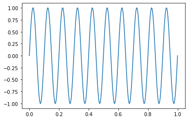
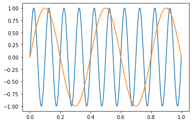

## Visualizing and animating waves via python.


<div markdown="1" class="cell code_cell">
<div class="input_area" markdown="1">
```python
# First load the libs
import numpy as np
import matplotlib.pyplot as plt
from mpl_toolkits import mplot3d
%matplotlib inline

# a and load interactive widgets
import ipywidgets as widgets
from IPython.display import display

```
</div>

</div>


### Standing and traveling waves in 1D

We beging by plotting a simple periodic function
$$y = sin(kx)=sin\Big(2\pi \cdot \frac{x}{\lambda}\Big)$$


<div markdown="1" class="cell code_cell">
<div class="input_area" markdown="1">
```python
L=0.3            # Try different wavelengths

x = np.linspace(0.0, 1.0, 1000)

y = np.sin(2 * np.pi * x/L)

plt.plot(x, y)

```
</div>

<div class="output_wrapper" markdown="1">
<div class="output_subarea" markdown="1">


{:.output_data_text}
```
[<matplotlib.lines.Line2D at 0x113ac6550>]
```


</div>
</div>
<div class="output_wrapper" markdown="1">
<div class="output_subarea" markdown="1">

{:.output_png}


</div>
</div>
</div>


**Using python function to make wavelength exploration simple**


<div markdown="1" class="cell code_cell">
<div class="input_area" markdown="1">
```python
def wave(L):
    
    x = np.linspace(0.0, 1.0, 1000)

    y = np.sin(2*np.pi * x/L)

    plt.plot(x, y)

```
</div>

</div>


<div markdown="1" class="cell code_cell">
<div class="input_area" markdown="1">
```python
# comparing three different wavelength
wave(0.5)
wave(1.0)
wave(2.0)

```
</div>

<div class="output_wrapper" markdown="1">
<div class="output_subarea" markdown="1">

{:.output_png}


</div>
</div>
</div>


### Adding an interactive widget to the plots


<div markdown="1" class="cell code_cell">
<div class="input_area" markdown="1">
```python
@widgets.interact(L=(0.1,2))

def wavef(L):
    
    x = np.linspace(0, +1., 1000)
    
    y = np.sin(2*np.pi * x/L)
    
    plt.plot(x, y)

```
</div>

<div class="output_wrapper" markdown="1">
<div class="output_subarea" markdown="1">
{:.output_data_text}
```
interactive(children=(FloatSlider(value=1.05, description='L', max=2.0, min=0.1), Output()), _dom_classes=('wi…
```

</div>
</div>
</div>


### Traveling waves and wave interference


<div markdown="1" class="cell code_cell">
<div class="input_area" markdown="1">
```python
@widgets.interact(k=(2,20),t=(0,50.0,0.1))

def wavef2(k=2,t=0):

    v=1         #velocity of waves
    
    phi = 4*np.pi/4
    
    x = np.linspace(0, 1., 1000)
    
    wave1 = np.sin(k*(x-v*t)) 
    
    wave2= np.sin(k*(x-v*t)+phi)    # try flipping the direction ofvelocity to get standing wave
    
    
    plt.plot(x, wave1,'--', color='blue')
    plt.plot(x,wave2,'--',  color='green')
    plt.plot(x, wave1+wave2,color='red')
    
    plt.ylim([-2,2])
    
    plt.legend(['Wave1','Wave2','Wave1+Wave2'])
    
    plt.grid('on')

```
</div>

<div class="output_wrapper" markdown="1">
<div class="output_subarea" markdown="1">
{:.output_data_text}
```
interactive(children=(IntSlider(value=2, description='k', max=20, min=2), FloatSlider(value=0.0, description='…
```

</div>
</div>
</div>


## Normal modes of 1D guitar string


<div markdown="1" class="cell code_cell">
<div class="input_area" markdown="1">
```python
@widgets.interact(n=(1,10))

def wavef(n=1):
    
    L=1
    
    x = np.linspace(0, +1., 1000)
    
    y = np.sin(n*np.pi * x/L)
    
    plt.plot(x, y, lw=3, color='red')
    
    plt.grid('on')

```
</div>

<div class="output_wrapper" markdown="1">
<div class="output_subarea" markdown="1">
{:.output_data_text}
```
interactive(children=(IntSlider(value=1, description='n', max=10, min=1), Output()), _dom_classes=('widget-int…
```

</div>
</div>
</div>


## 1D guitar string solution as linear combination of normal modes


For simplicity we will combine two modes with two different mode numbers and shifted with resepct to each ophter by a phase $\phi$.  


$$Mode_1 = cos(\omega t) \cdot sin(n_1\pi  \cdot \frac{x}{L})$$

$$Mode_2 = cos(\omega t+\phi) \cdot sin(n_2\pi  \cdot \frac{x}{L})$$


<div markdown="1" class="cell code_cell">
<div class="input_area" markdown="1">
```python
@widgets.interact(n1=(1,5),n2=(1,5),phi=(0,2*np.pi),t=(0,20,0.2))

def wavef(n1=1,n2=1,phi=0,t=0):
    
    L=1
    omega=1
    
    
    x = np.linspace(0, +1., 50)
    
    mode1 = np.cos(omega*t) * np.sin(n1*np.pi * x/L)
    
    mode2 = np.cos(omega*t + phi) * np.sin(n2*np.pi * x/L)
    
    plt.plot(x, mode1+mode2, lw=5, color='orange')
    
    plt.ylim([-2.5,2.5])
    plt.grid('on')

```
</div>

<div class="output_wrapper" markdown="1">
<div class="output_subarea" markdown="1">
{:.output_data_text}
```
interactive(children=(IntSlider(value=1, description='n1', max=5, min=1), IntSlider(value=1, description='n2',…
```

</div>
</div>
</div>


## Normal modes of 2d membrane


<div markdown="1" class="cell code_cell">
<div class="input_area" markdown="1">
```python
@widgets.interact(n1=(1,10),m1=(1,10))

def membrane(n1=1, m1=1): 
    
    t=0
    omega=1
    
    Lx,Ly = 1,1                       # size of memrbante
    N=40                              # number of grid points along X and Y
    
    xs = np.linspace(0,Lx,N)
    ys = np.linspace(0,Ly,N)
    X,Y = np.meshgrid(xs,ys)          # create 2D mesh of points along X and Y
     

    mode1 = np.sin(n1*np.pi*X/Lx)*np.sin(m1*np.pi*Y/Ly) 

   
    fig, ax =plt.subplots()
    
    ax.contourf(X,Y,mode1,40,cmap='RdBu')

```
</div>

<div class="output_wrapper" markdown="1">
<div class="output_subarea" markdown="1">
{:.output_data_text}
```
interactive(children=(IntSlider(value=1, description='n1', max=10, min=1), IntSlider(value=1, description='m1'…
```

</div>
</div>
</div>


## Vibrations of square 2D membrane as a linear combination of normal modes


<div markdown="1" class="cell code_cell">
<div class="input_area" markdown="1">
```python
%matplotlib inline

@widgets.interact(n1=(1,10),m1=(1,10),n2=(1,10),m2=(1,10),phi=(0,2*np.pi),t=(0,20))

def membrane(n1=1, m1=1, n2=1, m2=1, phi=0, t=0): 
    
    t=0
    omega=1
    
    Lx,Ly = 1,1                       # size of memrbante
    N=40                              # number of grid points along X and Y
    
    xs = np.linspace(0,Lx,N)
    ys = np.linspace(0,Ly,N)
    X,Y = np.meshgrid(xs,ys)          # create 2D mesh of points along X and Y
     

    mode1 = np.cos(omega*t) * np.sin(n1*np.pi*X/Lx) * np.sin(m1*np.pi*Y/Ly) 
     
    mode2 = np.cos(omega*t+phi) * np.sin(n2*np.pi*X/Lx) * np.sin(m2*np.pi*Y/Ly) 
   
    #plt.pcolor(X,Y,mode1+mode2,cmap='jet')
        
    fig = plt.figure()            
    ax  = plt.axes(projection='3d')   # Making a 3D plot     
   
    ax.plot_surface(X,Y,mode1+mode2,cmap='RdYlBu') #Do the Plot 

```
</div>

<div class="output_wrapper" markdown="1">
<div class="output_subarea" markdown="1">
{:.output_data_text}
```
interactive(children=(IntSlider(value=1, description='n1', max=10, min=1), IntSlider(value=1, description='m1'…
```

</div>
</div>
</div>

