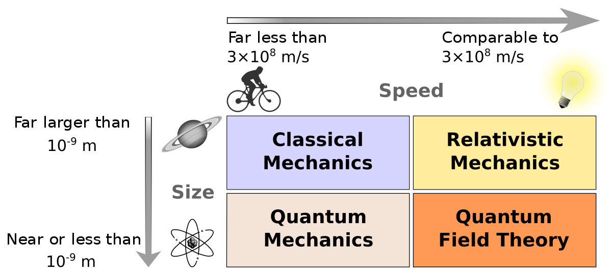

## Why Quantum mechanics

```{admonition} What you need to know
:class: note
- Quantum mechanics is the fundamental theory of nature which describes the smallest scales and energy levels of atoms and subatomic particles. 
 - Quantum theories (including quantum mechanics and quantum field theory) are complete theories of our physical reality which have never failed since their discovery!  
  - Predictions of quantum mechanics have been verified experimentally to an extremely high degree of accuracy. 
```




### Beware, Quantum Mechanics is weird! 

- This is, in fact, is an understatement. Don't take my word for it take Richard Feynman's word: 


```{image} ./images/feynman.png
:align: center
```

> Richard Feynman, an American physicist. Winner of 1965 Nobel prize in Physics for groundbreaking contributions to Quantum Electrodynamics.
 
- Be prepared to suspend the often comforting feeling of "makes sense" because in quantum things most things do not! But, fortunately, that does not prevent us from mastering the logic of quantum mechanics and applying it everywhere with great success.

> Bottom line is: If you do not understand quantum mechanics do not worry you are in good company... of "everyone else"! 

### How does Quantum Mechanics compare to other physics theories?

Even though it was discovered by physicists, it’s not a physical theory in the same sense as electromagnetism or general relativity. In the usual “hierarchy of sciences” – with biology at the top, then chemistry, then physics, then math – quantum mechanics sits at a
 level between math and physics that I don’t know a good name for. Basically, quantum mechanics is the operating system that other physical theories run on as application software. There’s even a word for taking a physical theory and porting it to this OS: “to quantize.”

 > Scott Aaronson, Quantum Computing Since Democritus (2013)

### Where is Quantum Mechanics applied

Ideas of quantum mechanics permeate and in many cases form the basis of understanding whole areas in chemistry, biology, physics and materials science. 

Some examples are:

- Chemical bond, molecular structure, reactivity, color, properties of materials.
- Spectroscopy (NMR, UV, IR, lasers...)
- Modern electronic structure calculations
- Condensed matter 
- Quantum computing

### What new skills will I learn?

Study of quantum mechanics will arm you with several powerful skills beyond quantum mechanics. 

- Probabilistic thinking. 

- A deeper appreciation of linear algebra and differential equation techniques. 

- Ability to decode the meaning of modern electronic structure calculations regularly reported in science journals in a wide range of areas from chemistry & biochemistry to material science and astrophysics.

- Understanding the nature of chemical bonding, reactivity, and spectroscopy.

- Understanding and appreciating the complex world we live in. 


### What else is QM good for?

- Well if the above-given reasons were not enough for you... let me sweeten the deal by saying you will also be able to get popular references and up your meme game to include "quantum" jokes like this one:


```{image} ./images/qm_meme.jpeg
:align: center
```


