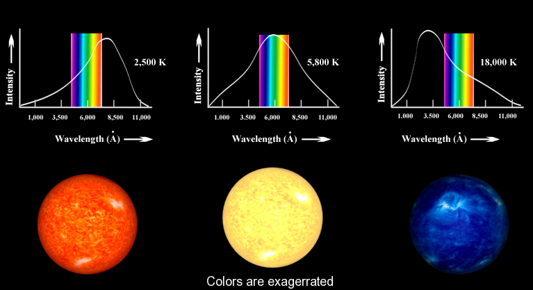

## The need for quantization

:::{admonition} **What you will learn.**
:class: note

- The energies of atoms, molecules, and light are **quantized**. This means that energy can only assume specific, **discrete values** rather than a continuous range.
- Energy quantization is a fundamental principle of our physical reality, consistently observed in quantum experiments. Quantum mechanics provides a comprehensive explanation and accurate predictions of this phenomenon.
- Key historical developments leading to the emergence of quantum mechanics include **black body radiation, the double slit experiment, and the photoelectric effect**.
- Several macroscopic phenomena, such as the red glow of hot metals, the heat capacity of solids at low temperatures, and the colors of materials, are all manifestations of quantum effects.
:::

## What is the nature of light?

:::{figure-md} markdown-fig


Electromagneitc radiation has a perpendicular electric and magnetic components which propogate with a speed of light. Unlike other forms of waves (water, sounds) light needs to medium and can travel in vaccum! 
:::


- According to the classical wave theory light is seen as a traveling wave consisting of electric and magnetic components. 
- We will soon see that this picture of light as enelectromagnetic wave is not the whole story and radically new ideas are needed to understand wide variety of phenomena invlving interaction of light with atoms and molecules.

### Spectrum of electromagnetic waves


:::{figure-md} markdown-fig


Spectrum of Electromagneitc waves showing wavelengths and radiation type. Also shown are objects with comparable size as the wavelength. Also shown are temperatures of objects which radiate different wavelengths. You can see a clear link betwen how "hot" and how much energy the radiation contains. 
:::

- **The visible light.** occupies a narrow frequency region  in between. 
- **High-frequency waves carry much higher energy.** This means X-ray or Gamma-rays can only be generated by heating “stuff” up at very high temperatures. This happens naturally at the core of the sun!
- **Low-frequency waves carry less energy.** Can be generated in a “microwave” or by broadcasting antennas. 

---
- So what is the relationship between frequency of radiation $\nu$ and energy $E$? This is not such a trivial question. In fact, this very question arose in connection with black body radiation; an experiment that forever changed the course of history by giving birth to quantum mechanics! 


### Relationship between frequency, wavelength and speed of light. 


:::{figure-md} markdown-fig


Definitions of wavelength $\lambda$ and frequency $\nu$.
:::


```{admonition} Wavelength, frequency and speed of light
:class: important

 $$\lambda \nu = c$$

 - **Speed of light in vacuum**, $c=3 \cdot 10^8 m/s$ is a fundamental constant.
 - **Frequency** of $1 Hz =  1 s^{-1}$ is the distance that the wave travels in 1 second
 - **Wavelength** of $1 m$ is the distance between peaks of the wave
```


### Black body as a model for heated objects.


:::{figure-md} markdown-fig


Black body radiation guide from PhDcomics! 
:::

---

- Watch this beautiful animation where the first 3 minutes is solely focused on blackbody radiation

<div style="text-align: center;">
<iframe width="560" height="315" src="https://www.youtube.com/embed/uG4xe9cNpP0?si=WwWocuEyIXdI72CD" title="YouTube video player" frameborder="0" allow="accelerometer; autoplay; clipboard-write; encrypted-media; gyroscope; picture-in-picture; web-share" referrerpolicy="strict-origin-when-cross-origin" allowfullscreen></iframe>
</div>

### Black body as an idealized model 

:::{admonition} **Definition of black body**
:class: tip

A black body is a model, an idealized system just like an ideal gas model in thermodynamics. Black body is assumed to be in thermodynamic equilibrium, maintained at some constant Temperature T which both absorbs and emits every wavelength of electromagnetic radiation
:::

- Equilibrium condition in thermodynamics means that the system emits as much energy as it absorbs. In other words outflux = influx. 
- The reason its called black body is that it absorbs every wavelength that hits the surface, therefore, appearing as 100% perfect black object. 
- If an object has a color, it is because it is reflecting certain wavelengths of light which then gets detected by our eye retina. The distribution of wavelengths, which is emitted by a blackbody, is determined only by its temperature!

:::{figure-md} markdown-fig


When heating up a material we observe three things. 1. Radiation intensity of material increases, implying higher radiation energy. 2. Distribution of wavelengths emitted shifts to lower values. Or we can say the distribution of frequency shifts to higher values. 3. The color of the material changes from red to yellow to blue. 

:::


### Ultraviolet catastrophe of classical mechanics


:::{figure-md} markdown-fig


Predictions of CM and QM diverge in the high frequency (low wavelength) limit where CM predicts infinite energy and QM predicts insufficent thermal energy for radiation. 

:::

- **What is radiation in classical mechanics?** Radiation is considered a wave with frequency $\nu$. In a heated body, naturally vibrating springs (which represent atoms or molecules) generate waves with the same frequency. 

:::{figure-md} markdown-fig


Visualuzation of atomic vibrations in a solid body. These vibrational modes are called phonons not to be confused with photons to be introduced in next section!

:::

- **Packing wave modes in a box** One can fit more of high fequency (short wavelength) waves in the box than small frequency ones. The number of waves we can fit in a cubic box in the frequency region $[\nu, \nu+d\nu]$ can be estimated to be $\sim d \nu^3 \sim \nu^2 d\nu$. Constant of proportionality requires a few more steps to derive which we skip and write final result:

$$dN_{\nu }= \frac{8\pi}{c^3}\cdot \nu^2 d\nu$$   

 - **Equipartition of energy** From thermodynamics we know that in equilibrium each degree of freedom or each oscillator gets the same $k_BT$ of energy where $k_B$ is the Boltzman's constant. 

  $$\langle E\rangle = k_BT$$

 -  Every vibrating spring in heated body thus has same energy regardless of frequency, think about this assumption for a sec!

- **Radiation Energy Distribution:** Distribution of radiated frequencies is then product of average thermal energy and number of springs in a frequency interval

$$\rho({\nu}) =  k_B T \cdot \frac{8\pi}{c^3}\nu^2$$

- **Ultraviolet catastrophe:** Energy distribution shoots to infinity at high $\nu$ (or low $\lambda$). This is known as the ultraviolet catastrophe! If you integrate $\rho$ over all frequencies it will give you a total amount of radiation which in this case will be infinite! A light bulb can destroy the universe! Something is off with our classical prediction. 


:::{admonition} Quiz
:class: dropdown

**What is the problem with classical mechanical explanation of black body radiation?**

1. It is not corectly applied. 
2. CM makes some uncontrolled approximations about energy.  
3. CM can not model waves. 
4. Classical mechanics does not have a way to account for the quantization of energy.
:::

### Max Planck and the trick of quantization 

- In 1900 Planck found that the theoretical curve can very closely match the experimental curve if one postulates that only discrete (quantized) values of energy are possible. 

```{admonition} Plack equation
:class: important

$$\boxed{E= h\nu}$$

- Unit of Planck's constant, $h = 6.63 10^{–34} J \cdot s$
- Unit of frequency $\nu$, $1 s^{-1}$.
- Unit of Energy $E$, $1 J$.
```

- This means atoms and molecules absorb and emit radiation in discrete quantities, multiples of $h\nu$, which are called quanta! 

- When light is emitted or absorbed, the atom or molecule jumps from one state to another and the energy difference $h\nu$ is either coming from light or is used to generate light.

- Note how small $h$ is in the macroscopic units (such as J s). This is why quantization of energy is hardly noticeable and classical mechanics works so well at the macro scale. In the limit $h \rightarrow 0$, $E$ becomes continuous, and an arbitrary real value of E is allowed. This is the classical limit.


### The black body radiation distribution function 

:::{Admonition} **Deriving Black Body radiation formula**
:class: tip, dropdown 


Planck hypothesized that the energy of oscillators in a black body is quantized and given by:

$$E_n = n h \nu$$

where $n$ is a positive integer, $h$ is Planck's constant, and $\nu$ is the frequency.

The average energy of an oscillator is found by summing over all possible energies, weighted by the Boltzmann factor:

$$\langle E \rangle = \frac{\sum_n E_n e^{-E_n/kT}}{\sum_n e^{-E_n/kT}}$$

Substituting $E_n = n h \nu$, the sum becomes:

$$\langle E \rangle = \frac{\sum_n n h \nu e^{-n h \nu / kT}}{\sum_n e^{-n h \nu / kT}}$$


This sum is a geometric series. 
For the geometric series of the form:

$$ S = \sum_{n=0}^{\infty} x^n $$

The sum is given by:

$$ S = \frac{1}{1 - x} \quad \text{for} \quad |x| < 1 $$

In the context of Planck's derivation, we use the series:

$$ \sum_{n=0}^{\infty} e^{-n h \nu / kT} $$

This series can be summed as:

$$ \sum_{n=0}^{\infty} e^{-n h \nu / kT} = \frac{1}{1 - e^{-h \nu / kT}} $$

The series involving $n$ in the numerator is:

$$ \sum_{n=0}^{\infty} n e^{-n h \nu / kT} $$

This can be evaluated using the derivative with respect to $x$:

$$ \sum_{n=0}^{\infty} n x^n = x \frac{d}{dx} \left( \frac{1}{1 - x} \right) = \frac{x}{(1 - x)^2} $$

Substituting $x = e^{-h \nu / kT}$, we get:

$$ \sum_{n=0}^{\infty} n e^{-n h \nu / kT} = \frac{e^{-h \nu / kT}}{(1 - e^{-h \nu / kT})^2} $$

Using these results, Planck's formula for the average energy becomes:

$$ \langle E \rangle = \frac{h \nu}{e^{h \nu / kT} - 1} $$


The energy density $\rho(\nu, T)$ is then obtained by multiplying the average energy by the density of states and the number of oscillators per unit volume:

$$\rho(\nu, T) = \frac{8 \pi \nu^2}{c^3} \cdot \frac{h \nu}{e^{h \nu / kT} - 1}$$

This is Planck's law, which describes the spectral density of radiation emitted by a black body in thermal equilibrium at a temperature $T$.

:::

- Assuming that the energy of an oscillator is quantized, Planck dervied a new expression for average energy which now depends on frequency of oscillations unlike classical expression of $k_BT$

$$\langle E \rangle = \Big[ \frac{1}{e^{\frac{h\nu}{ kT}} - 1}\Big] $$

- With this expression we end up with a distirbution of oscillator energies which tends to zero in the high frequency limit.

$$ \rho_{\nu}(T) = \frac{8\pi \nu^2}{c^3} \cdot \Big[\frac{1}{e^{\frac{h\nu}{kT}} - 1} \Big]$$

- You can also express distribution in terms of wavelength by making the subsittion $\nu = c/\lambda$. Here 

$$ \rho_{\lambda}(T) = \frac{8 \pi hc}{\lambda^5} \cdot \Big[ \frac{1}{e^{\frac{hc}{\lambda kT}} - 1}\Big]$$


- The expressions for $\rho_{\lambda}(T)d\lambda$ or $\rho_{\nu}(T)d\nu$ have units of energy per volume which is why they are often referred as **energy density** of radiation. By integrating over the entire spectrum (e.g all frequences or wavelengths) we obtain the total energy of radiation per volume!

$$\int^{\infty}_0 \rho_{\nu}(T)d\nu = \sigma T^4 $$

- $\sigma=5.6697 \cdot 10^{-8} J m^{-2} K^{-4} s^{-1}$ is called Stefan-Boltzmann constat.  

> In some books you may also find black body radiation characterized via the radiation flux which is a radiation measured per unit wavelength and per unit solid angle $B_{\lambda} = \frac{c}{4\pi}  \cdot \rho_{\lambda}$


### Wien's displacement law

- **Connecting temperature of black body with wavelength or frequency**. The energy density peaks at a wavelength $\lambda_{max} $ which is inversely proportional to the temperature. This relationship is described by Wien's displacement law. You can derive it by evaluating $d\rho(\lambda)/d\lambda=0$. 

$$\lambda_{max} = \frac{b}{T}$$

- $ b=2.8977729 \cdot 10^{-3} m·K$ is called Wien's displacement constant.  

### Explore black body radiation

<iframe src="https://phet.colorado.edu/sims/html/blackbody-spectrum/latest/blackbody-spectrum_en.html"
        width="800"
        height="500"
        allowfullscreen>
</iframe>

### Applications of Black Body radiation

:::{figure-md} markdown-fig


The black body is used as a standard with which the absorption of real bodies is compared. To a good approximation, stars radiate like blackbody radiators. Thus we can use blackbody radiation as a model to infer the temperature of the stars from their colors! Find out more in this video on [Visible Light Waves](https://www.youtube.com/watch?v=PMtC34pzKGc)  

:::

### Problems

#### Problem 1

::::{admonition} **Calculating the Wavelength of a Photon Using Planck's Equation**  
:class: note

A photon is emitted with an energy of $3.5 \, \text{eV}$. Calculate the wavelength of this photon. Use Planck's equation to relate the energy of the photon to its wavelength. The values of constants are:
- Planck's constant, $h = 6.626 \times 10^{-34} \, \text{J} \cdot \text{s}$
- Speed of light, $c = 3.00 \times 10^8 \, \text{m/s}$
- $1 \, \text{eV} = 1.602 \times 10^{-19} \, \text{J}$

:::{admonition} **Solution:**
:class: dropdown

First, convert the energy of the photon from electron volts (eV) to joules (J):

$$
E = 3.5 \, \text{eV} \times 1.602 \times 10^{-19} \, \text{J/eV} = 5.607 \times 10^{-19} \, \text{J}
$$

Now, use Planck's equation to relate the energy $E$ of the photon to its wavelength $\lambda$:

$$
E = \frac{hc}{\lambda}
$$

Rearranging to solve for $\lambda$:

$$
\lambda = \frac{hc}{E}
$$

Substitute the known values:

$$
\lambda = \frac{(6.626 \times 10^{-34} \, \text{J} \cdot \text{s}) \times (3.00 \times 10^8 \, \text{m/s})}{5.607 \times 10^{-19} \, \text{J}}
$$

$$
\lambda = \frac{1.988 \times 10^{-25} \, \text{J} \cdot \text{m}}{5.607 \times 10^{-19} \, \text{J}} \approx 3.55 \times 10^{-7} \, \text{m} = 355 \, \text{nm}
$$

The wavelength of the photon is approximately $355 \, \text{nm}$, which is in the ultraviolet range of the electromagnetic spectrum.
:::

::::

#### Problem 2

::::{admonition} **Question: Wien's displacement law**  
:class: note

Using Wien's displacement law, determine the wavelength $\lambda_{\text{max}}$ at which the spectral radiance of a blackbody is maximized. Given the temperature $T$ of the blackbody, calculate $\lambda_{\text{max}}$ for $T = 5800 \, \text{K}$, which is approximately the temperature of the Sun's surface.

:::{admonition} **Solution:**
:class: dropdown

Wien's displacement law states that the wavelength at which the spectral radiance of a blackbody peaks is inversely proportional to the temperature:

$$
\lambda_{\text{max}} = \frac{b}{T}
$$

where $b = 2.897 \times 10^{-3} \, \text{m} \cdot \text{K}$ is Wien's displacement constant.

For $T = 5800 \, \text{K}$:

$$
\lambda_{\text{max}} = \frac{2.897 \times 10^{-3} \, \text{m} \cdot \text{K}}{5800 \, \text{K}} = 5.0 \times 10^{-7} \, \text{m} = 500 \, \text{nm}
$$

So, the peak wavelength $\lambda_{\text{max}}$ for a blackbody at $5800 \, \text{K}$ is $500 \, \text{nm}$, which is in the visible range.
:::

::::