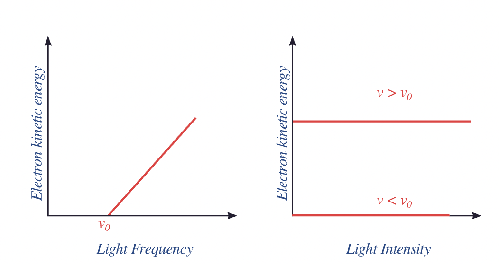
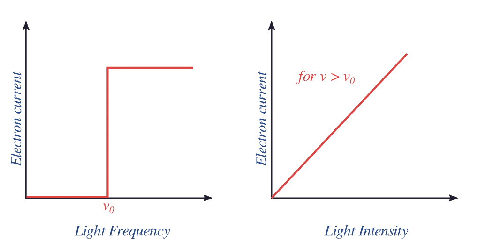
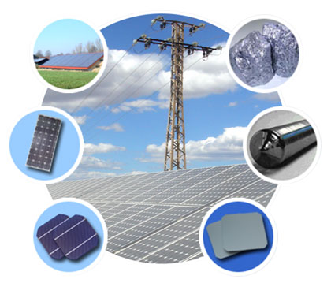

## Photoelectric effect


```{admonition} What you need to know
:class: note

- **Photoelectric effect** Electrons are ejected when surface of a material is subjected to radiation exceeding a certain threshold frequency. 
- Below the threshold fequency no electrons are ejected regardless of intensity of light (brightness)
- Photoelectric effect is impossible to explain classically because energy in Classical Mechanics is thought to only grows with intensity of light. 
- In QM radiation just like matter is quantized. Radiation can be viewed as a stream of photons: a tiny and discrete packets of energy.
- One photon can eject one electron only if it has sufficient energy. Any extra energy gets converted into kinetic energy resulting in electrons flying faster.
- Photons with insufficent energy scatters of the electron
- High intensity light meaning lots of photons per unit area per unit time are unable to eject a single electron
```


```{image} ./images/lec2_intro.png
:align: center
```

### Photoelectric effect challanges classical mechanical thinking.


- When you shine a light on a metal surface exceeding certain threshold frequency electrons, start flying off the surface. But below this frequency no electrons are ejected regardless of the intensity of light. This experiment challanged classical way of thinking about light according to which energy of light is proportional to amplitude of wave or intensity. 

- Recall that to reconcile experiment with theory Planck was already forced to introduce quantization of black bodies modlled as spings that can only assume discrete energies: $0, h\nu, 2h\nu, 3h\nu, …$.  At a time this discreteness was thought to be nothing more than a temporary mathematical trick to fit experimental curve. 

- Einstein, on the other hand, was more imaginative and saw in Plank’s prescription more than just a math trick. He suggested that light can behave like a stream of particles with discrete countable energy packets which he called photons. This view was instrumental in making sense of the photoelectric experiment. 

### Kinetic energy: frequency vs intensity




1. Frequency $\nu$ determines weather electrons will be ejected: $\nu>\nu_0$ but does not affect the number of electrons (current)


2. Kinetic energy of an ejected electron is a linearly increasing function of the frequency of light with no dependence on the intensity: $KE\sim \nu$ 
   
3.  Contrary to wave theory of light increasing intensity (brighter) of light does not eject electrons when frequency is below the threshold $\nu < \nu_0$

   

### Electric current: frequency vs intensity



1. Once threoshold is reached $\nu>\nu_0$  frequency has no effect on electron current (number of electrons)

2. Once threoshold is reached $\nu>\nu_0$ Increasing intensity of light on the other hand increases the current linearly.


### Photons explains photoelectric effect 

- Light consists of photons: tiny packets of energy carrying $h\nu$ energy. 
- Intensity of light is measure of number of photons. frequency is measure of energy of photons. 
- 1 photon can collide with 1 electron and eject it if it has sufficient energy 

$$\boxed{E_{photon} = h\nu}$$

$$\boxed{E_{photon} = E_{bind} + KE}$$

$$\boxed{h\nu = E_{bind} + \frac{mv^2}{2}}$$

- Any extra energy gets converted into kinetic energy of ejected electron
- If frequency is lower than threshold photon does not transfer any energy to electron! 


### Applications of photoelectric effect

- Besides its historical role in the establishment of QM photoelectric effect has many practical applications. It is relevant for the design of solar cells, photovoltaics, photoelectron spectroscopy, night vision, etc. 



### Problems 

````{tab-set}
```{tab-item} Problem 1
 The so-called Lyman series of lines in the emission spectrum of hydrogen corresponds to transitions from various excited states to the n = 1 orbit. Calculate the wavelength of the lowest-energy line in the Lyman series to three significant figures. In what region of the electromagnetic spectrum does it occur?
```

```{tab-item} Solution 1
We can use the Rydberg equation (Equation \ref{1.5.1}) to calculate the wavelength:

$$
\dfrac{1}{\lambda }=R_H \left ( \dfrac{1}{n_{1}^{2}} - \dfrac{1}{n_{2}^{2}}\right )
$$

A For the Lyman series, $n_1 = 1$.

$$
\begin{align*} \dfrac{1}{\lambda } &=R_H \left ( \dfrac{1}{n_{1}^{2}} - \dfrac{1}{n_{2}^{2}}\right ) \\[4pt] &=1.097 \times 10^{7}\, m^{-1}\left ( \dfrac{1}{1}-\dfrac{1}{4} \right )\\[4pt] &= 8.228 \times 10^{6}\; m^{-1} \end{align*}
$$


Spectroscopists often talk about energy and frequency as equivalent. The cm-1 unit (wavenumbers) is particularly convenient. We can convert the answer in part A to cm-1.

$$
\begin{align*} \widetilde{\nu} &=\dfrac{1}{\lambda } \\[4pt] &= 8.228\times 10^{6}\cancel{m^{-1}}\left (\dfrac{\cancel{m}}{100\;cm} \right ) \\[4pt] &= 82,280\: cm^{-1} \end{align*}
$$

and

$$\lambda = 1.215 \times 10^{−7}\; m = 122\; nm \nonumber$$

This emission line is called Lyman alpha and is the strongest atomic emission line from the sun and drives the chemistry of the upper atmosphere of all the planets producing ions by stripping electrons from atoms and molecules. It is completely absorbed by oxygen in the upper stratosphere, dissociating O2 molecules to O atoms which react with other O2 molecules to form stratospheric ozone

B This wavelength is in the UV region of the spectrum.
```
````


