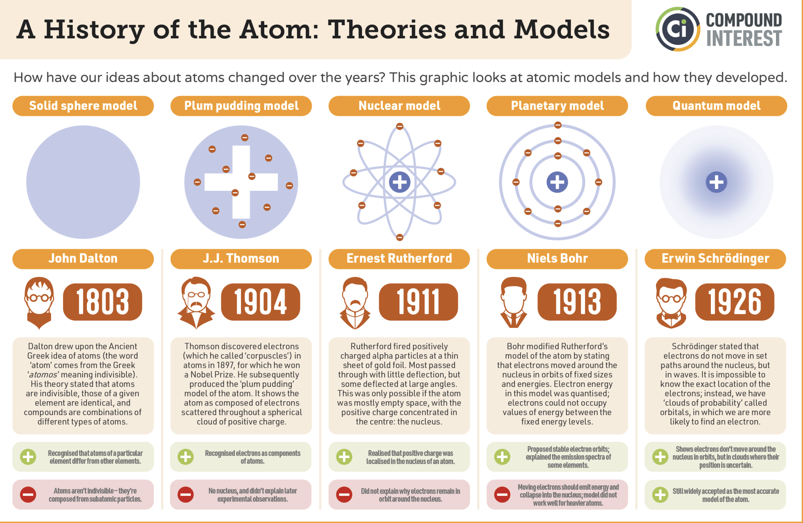

## Atomic spectra

:::{admonition} **What you will learn**
:class: note

- The energies of atoms, molecules, and light are **quantized**—they can only take on specific, **discrete values** rather than a continuous spectrum.  
- This quantization is a cornerstone of physical reality, confirmed by countless experiments and rigorously explained by quantum mechanics.  
- Pivotal historical discoveries—such as **blackbody radiation, the photoelectric effect, and the double-slit experiment**—laid the foundation for quantum theory.  
- Everyday macroscopic phenomena, including the red glow of heated metals, the heat capacity of solids at low temperatures, and the characteristic colors of materials, all originate from quantum effects.  
:::

### Spectroscopy of Atoms

- **Spectroscopy** is the study of the interaction between matter and electromagnetic radiation.  
- By analyzing the emitted or absorbed light, spectroscopy reveals information about the **structure and composition** of atoms and molecules.  
- When heated or subjected to electrical discharge, atoms emit radiation at characteristic frequencies. The resulting spectrum is **unique for each element**, serving as a kind of atomic fingerprint.  

:::{figure-md} markdown-fig

**Atomic spectroscopy of the hydrogen atom.**  
Hydrogen in a gas-discharge tube emits light at discrete wavelengths, which appear as distinct spectral lines when passed through a prism.  
:::

:::{figure-md} markdown-fig

**Spectroscopy of the Sun.**  
By analyzing spectral lines, one can identify the presence of different elements in the solar atmosphere.  
:::

### Spectral lines and Rydberg's formula

- The existance of discrete spectral lines are impossible to describe with classical mechanics.  In 1885, Johann Blamer demonstrated that a subset of the hydrogen atom spectrum (the Balmer series) could be described by the equation

$$\tilde{\nu} = 8.2202\times10^{14}\left(1-\frac{4}{n^2}\right)$$

where $n=3,4,5,...$.  Later, Johannes Rydberg generalized this formula to account for the entire hydrogen atom spectrum yielding the Rydberg formula

:::{admonition} **Rydberg formula**
:class: important

$$\tilde{\nu} = R_H\left(\frac{1}{n_1^2}-\frac{1}{n_2^2}\right)$$

where 
- $R_H = 1.097 \times 10^7 \ \text{m}^{-1}$ is the Rydberg constant.
- $n_1 = 1,2,3,...$, and $n_2 = n_1+1,n_1+2,...$.  

:::

- While these equations fit the hydrogen atom spectrum nicely, they do not prescribe any physics to the system.  They do not present a model of the hydrogen atom but rather a heuristic equation that fits the data.  Nonetheless, scientists were perplexed by the presence of the integers $n_1$ and $n_2$. 

:::{figure-md} markdown-fig

Atomic spectral lines are named after their disocerers. Each series contains all transitions to a distinct ground or excited state level $n=1,2,3$. 
:::

### Bohr's Model of the Hydrogen Atom

:::{figure-md} markdown-fig

**Evolution of atomic models.**  
From pre-quantum pictures of atoms to the modern quantum mechanical description.  
:::

- In 1913, Niels Bohr proposed a model of the hydrogen atom that successfully explained its **discrete emission spectrum**.  
- The atom was pictured as an electron moving in **circular orbits** around a central proton. Because the proton is far more massive than the electron, it was treated as fixed in space.  
- To prevent the electron from spiraling into the nucleus, Bohr introduced a new **quantization rule**: the electron’s orbital motion must accommodate an integer number of standing wave modes, $n = 1, 2, 3, \ldots$  
- This postulate leads directly to an expression for the allowed **energy levels of hydrogen**, each labeled by a principal quantum number $n$.  

:::{figure-md} markdown-fig

**Anecdote about Niels Bohr.**  
A visitor once noticed a horseshoe (a Scandinavian good-luck charm) hanging above Bohr’s door:  

*"But Niels, you are a scientist! Surely you don’t believe in this superstition?"*  

*"Of course I don’t,"* Bohr replied. *"But I am told it works even if you don’t believe in it!"*  
:::

### Quantizing the States of the Electron in the Hydrogen Atom

:::{figure-md} markdown-fig

Bohr rationalized discrete orbits by requiring that an integer number of electron wavelengths fit around the circumference of the orbit.  
:::

- Imposing this condition gives the relation  

$$
2\pi r = n \lambda_e, \quad n = 1, 2, 3, \ldots
$$

- Here, $\lambda_e$ is the **de Broglie wavelength** of the electron:  

$$
\lambda_e = \frac{h}{m_e v}.
$$

- Substituting this expression for $\lambda_e$ into the quantization condition yields  

$$
m_e v r = \frac{n h}{2\pi} = n \hbar.
$$

- We introduce the shorthand $\hbar = \tfrac{h}{2\pi}$ because it appears frequently in quantum mechanics. The left-hand side, $m_e v r$, represents the **angular momentum** of the electron.  
- Thus, Bohr’s model predicts that the electron’s angular momentum is **quantized** in integer multiples of $\hbar$.  

### Force Balance

After introducing his quantization rule, Bohr turned back to **classical mechanics** to determine the allowed electron energies. He assumed that, in a stationary orbit, the **electrostatic attraction** between the proton and electron is exactly balanced by the **centrifugal force** of the orbiting electron.  

**Electrostatic force**  

$$
f_{\text{el}} = \frac{e^2}{4\pi\varepsilon_0 r^2},
$$  

where $e$ is the elementary charge and the factor $4\pi \varepsilon_0$ ensures SI units.  

**Centrifugal force**  

$$
f_{\text{cf}} = \frac{m_e v^2}{r},
$$  

where $m_e$ is the electron mass and $v$ its orbital velocity.  

Equating these two forces gives  

$$
\frac{e^2}{4\pi\varepsilon_0 r^2} = \frac{m_e v^2}{r}.
$$  

---

The **force-balance equation** together with the **quantized angular momentum condition** restricts the allowed radii $r$ of electron orbits. Solving step by step:  

1. From angular momentum quantization:  

   $$
   m_e v r = n\hbar \quad \Rightarrow \quad v = \frac{n\hbar}{m_e r}.
   $$  

2. Substituting into the force-balance equation:  

   $$
   \frac{e^2}{4\pi\varepsilon_0 r^2} = \frac{m_e}{r} \left( \frac{n\hbar}{m_e r} \right)^2.
   $$  

3. Simplifying:  

   $$
   \frac{e^2}{4\pi\varepsilon_0} = \frac{(n\hbar)^2}{m_e r}.
   $$  

4. Solving for $r$:  

   $$
   r = \frac{4\pi \varepsilon_0 (n\hbar)^2}{m_e e^2} = n^2 a_0, \quad n = 1, 2, 3, \ldots
   $$  

where the constant $z_0$ is the **Bohr radius**, corresponding to the size of the ground-state orbit.  

$$
a_0 = \frac{4\pi \varepsilon_0 \hbar^2}{m_e e^2}
$$  

:::{admonition} **Bohr radius**,
:class: tip

$$a_0 \approx 0.529 \,\text{Å}$$

- We will encounter the Bohr radius many times. It sets the fundamental length scale for atomic physics.
:::

### Energy of the Hydrogen Atom

The total energy of the electron–proton system is the sum of the electron’s **kinetic energy** and the **Coulomb potential energy**:  

$$
E(r) = \tfrac{1}{2} m_e v^2 - \frac{e^2}{4\pi\varepsilon_0 r}.
$$  

Using the force-balance relation  

$$
m_e v^2 = \frac{e^2}{4\pi\varepsilon_0 r},
$$  

we substitute into the energy expression:  

$$
\begin{align}
E(r) &= \tfrac{1}{2}\frac{e^2}{4\pi\varepsilon_0 r} - \frac{e^2}{4\pi\varepsilon_0 r} \\
     &= -\tfrac{1}{2}\frac{e^2}{4\pi\varepsilon_0 r}.
\end{align}
$$  

Next, inserting the quantized orbital radius  

$$
r = \frac{4\pi \varepsilon_0 (n\hbar)^2}{m_e e^2},
$$  

gives the **Bohr energy levels**:  

$$
E_n = -\frac{m_e e^4}{8 \varepsilon_0^2 h^2} \cdot \frac{1}{n^2}, 
\quad n = 1, 2, 3, \ldots
$$  

:::{admonition} **Bohr Energy formula**
:class: important

$$
E_n = -13.6\frac{ 1}{n^2} \,\,\,[eV]
$$  

- This is the most useful form for problem solving. You can quickly compute the energy of any hydrogenic level just by inserting the principal quantum number $n$.  

- Ionization energy corresponds to taking the electron from $n=1$ to $n \to \infty$, requiring exactly 13.6 eV.  
:::

### Spectral lines and the Rydberg constant  

The energy difference between two levels $n_1$ and $n_2$ is  

$$
\Delta E = \frac{m_e e^4}{8 \varepsilon_0^2 h^2}
\left(\frac{1}{n_1^2} - \frac{1}{n_2^2}\right).
$$  

Relating this to photon energy $E = h\nu$ and the wavenumber $\tilde{\nu} = \nu/c$ gives  

$$
\tilde{\nu} = \frac{m_e e^4}{8 \varepsilon_0^2 c h^3}
\left(\frac{1}{n_1^2} - \frac{1}{n_2^2}\right)
= R_H \left(\frac{1}{n_1^2} - \frac{1}{n_2^2}\right),
$$  

Where $R_H$ is the **Rydberg constant** which we know expressedin fundmamental constants as opposed to obtaining as a result of an experimental fit! 

$$
R_H = \frac{m_e e^4}{8 \varepsilon_0^2 c h^3}
$$  

:::{admonition} **A note about wavenumbers and $cm^{-1}$ units**
:class: tip

- Wavenumbers $\tilde{\nu}$ in **cm⁻¹** are standard in spectroscopy.  
- To convert to wavelength: $\lambda = 1 / \tilde{\nu}$ (with $\tilde{\nu}$ in cm⁻¹, $\lambda$ will come out in cm).  

$$
\tilde{\nu}\ \text{(cm}^{-1}\text{)} 
= R_H \left( \frac{1}{n_1^2} - \frac{1}{n_2^2} \right),
\quad n_2 > n_1,
$$  

- $R_H = 1.097 \times 10^5 \ \text{cm}^{-1}$   is the Rydberg constant in spectroscopic units 
:::

### Problems 

#### Problem 1

The so-called Lyman series of lines in the emission spectrum of hydrogen corresponds to transitions from various excited states to the n = 1 orbit. Calculate the wavelength of the lowest-energy line in the Lyman series to three significant figures. In what region of the electromagnetic spectrum does it occur?

:::{admonition} **Solution** 
:class: dropdown

**A** We can use the Rydberg equation  to calculate the wavelength for the Lyman series, $n_1 = 1$.

$$
\dfrac{1}{\lambda }=R_H \left ( \dfrac{1}{n_{1}^{2}} - \dfrac{1}{n_{2}^{2}}\right )
$$

The lowest energy results from a transition from or to nearest energy level hence $n_2 = n_1+1$

$$
\begin{align*} \dfrac{1}{\lambda } &=R_H \left ( \dfrac{1}{n_{1}^{2}} - \dfrac{1}{n_{2}^{2}}\right ) \\[4pt] &=1.097 \times 10^{7}\, m^{-1}\left ( \dfrac{1}{1}-\dfrac{1}{4} \right )\\[4pt] &= 8.228 \times 10^{6}\; m^{-1} \end{align*}
$$

Spectroscopists often talk about energy and frequency as equivalent. The $cm^{-1}$ unit (wavenumbers) is particularly convenient. We can convert the answer in part A to $cm^{-1}$

$$
\begin{align*} \widetilde{\nu} &=\dfrac{1}{\lambda } \\[4pt] &= 8.228\times 10^{6}\cancel{m^{-1}}\left (\dfrac{\cancel{m}}{100\;cm} \right ) \\[4pt] &= 82,280\: cm^{-1} \end{align*}
$$

and

$$\lambda = 1.215 \times 10^{−7}\; m = 122 \,\,nm$$

This emission line is called Lyman alpha and is the strongest atomic emission line from the sun and drives the chemistry of the upper atmosphere of all the planets producing ions by stripping electrons from atoms and molecules. It is completely absorbed by oxygen in the upper stratosphere, dissociating O2 molecules to O atoms which react with other O2 molecules to form stratospheric ozone

**B** This wavelength is in the UV region of the spectrum.
:::

#### Problem 2

- A. Calculate the energy of a photon that is produced when an electron in a hydrogen atom goes from an orbit with  n=4 to and orbit with  $n=1$
- B. What happens to the energy of the photon as the initial value of  $n$ approaches infinity?

:::{admonition} **Solution** 
:class: dropdown

**A.**  We will use the Bohr's formula in units of electron $E_n = -19.6 \frac{1}{n^2}$ to calculate energy of a photon. 

$$\Delta E = 19.6  \Big ( \frac{1}{1^2} - \frac{1}{4^2} \Big) = 19.6 \cdot 0.9375 = 18.375\,\, ev$$

**B.** Energy of a photon goes up as we excite electron to higher and higher level. As $n_2\rightarrow \infty$ we end up with a photon that has sufficient energy to ionize the atom. $E = 19.6 \cdot ( \frac{1}{1^2} - \frac{1}{\infty} \Big) = 19.6 ev$
:::

#### Problem 3

Use Rydberg's formula to calculate firs few lines of Lymann series ($n_1=1$)

:::{admonition} **Solution** 
:class: dropdown
The Rydberg formula is given by:

$$
\frac{1}{\lambda} = R_H \left( \frac{1}{n_1^2} - \frac{1}{n_2^2} \right)
$$

For the Lyman series, $n_1 = 1$, and $n_2 = 2, 3, 4, \dots$. The Rydberg constant for hydrogen is:

$$
R_H = 1.097 \times 10^7 \ \text{m}^{-1}
$$

**First few lines of the Lyman series:**

For $n_2 = 2$:

$$
\frac{1}{\lambda} = 1.097 \times 10^7 \left( \frac{1}{1^2} - \frac{1}{2^2} \right)
$$

$$
\lambda = 1.2157 \times 10^{-7} \ \text{m} = 121.57 \ \text{nm}
$$

For $n_2 = 3$:

$$
\frac{1}{\lambda} = 1.097 \times 10^7 \left( \frac{1}{1^2} - \frac{1}{3^2} \right)
$$

$$
\lambda = 1.0257 \times 10^{-7} \ \text{m} = 102.57 \ \text{nm}
$$

For $n_2 = 4$:

$$
\frac{1}{\lambda} = 1.097 \times 10^7 \left( \frac{1}{1^2} - \frac{1}{4^2} \right)
$$

$$
\lambda = 9.724 \times 10^{-8} \ \text{m} = 97.24 \ \text{nm}
$$

So, the first three wavelengths of the Lyman series are approximately $121.57$ nm, $102.57$ nm, and $97.24$ nm.

:::

#### Problem 4

A line in the  Lymann series of hydrogen has a wavelength of $1.03 \cdot 10^{-7} m$ Find the original level of the electron.

:::{admonition} **Solution** 
:class: dropdown

We are given a wavelength $\lambda = 1.03 \times 10^{-7} \ \text{m}$ and asked to find the original level $n_2$ of the electron in the Lyman series (where $n_1 = 1$).

Using the Rydberg formula:

$$
\frac{1}{\lambda} = R_H \left( \frac{1}{n_1^2} - \frac{1}{n_2^2} \right)
$$

For the Lyman series, $n_1 = 1$, so the equation becomes:

$$
\frac{1}{\lambda} = R_H \left( 1 - \frac{1}{n_2^2} \right)
$$

Rearranging to solve for $n_2$:

$$
\frac{1}{n_2^2} = 1 - \frac{1}{R_H \lambda}
$$

Substituting the values:

$$
R_H = 1.097 \times 10^7 \ \text{m}^{-1}
$$

$$
\frac{1}{n_2^2} = 1 - \frac{1}{(1.097 \times 10^7) \times (1.03 \times 10^{-7})}
$$

$$
\frac{1}{n_2^2} = 1 - \frac{1}{1.13091} = 1 - 0.884 = 0.116
$$

Now, solving for $n_2$:

$$
n_2^2 = \frac{1}{0.116} = 8.621
$$

$$
n_2 = \sqrt{8.621} \approx 2.94
$$

Since $n_2$ must be an integer, we round it to $n_2 = 3$.

Thus, the original level of the electron is $n_2 = 3$.

:::

#### Problem 5

Using Bohr theory calculate ionization energy of singly ionized helium $He^{+}$

:::{admonition} **Solution** 
:class: dropdown

The ionization energy is the energy required to remove an electron from its ground state to infinity. Using Bohr's theory, the energy of an electron in an orbit is given by:

$$
E_n = -\frac{Z^2 R_H}{n^2}
$$

Where:
- $Z$ is the atomic number,
- $R_H = 13.6 \ \text{eV}$ is the Rydberg constant for hydrogen,
- $n$ is the principal quantum number.

For singly ionized helium $He^+$, the atomic number $Z = 2$. In the ground state, $n = 1$.

Thus, the energy in the ground state is:

$$
E_1 = -\frac{Z^2 R_H}{1^2} = -\frac{(2)^2 \times 13.6 \ \text{eV}}{1^2} = -4 \times 13.6 \ \text{eV} = -54.4 \ \text{eV}
$$

The ionization energy is the negative of this ground state energy (since we want to bring the electron to $n = \infty$):

$$
E_{\text{ionization}} = 54.4 \ \text{eV}
$$

Therefore, the ionization energy of singly ionized helium $He^+$ is $54.4 \ \text{eV}$.

:::

#### Problem 6

- Calculate radii of Bohr orbit for first few levels. 

- (Optional) Using python plot $r_n$ vs $n$

:::{admonition} **Solution** 
:class: dropdown

The radius of the Bohr orbit is given by the formula:

$$
r_n = \frac{n^2 a_0}{Z}
$$

Where:
- $n$ is the principal quantum number (level),
- $a_0 = 5.29 \times 10^{-11} \ \text{m}$ is the Bohr radius for hydrogen,
- $Z$ is the atomic number (for hydrogen, $Z = 1$).

For hydrogen ($Z = 1$), the radii for the first few levels are:

**For $n = 1$:**
$$
r_1 = \frac{1^2 \times 5.29 \times 10^{-11} \ \text{m}}{1} = 5.29 \times 10^{-11} \ \text{m}
$$

**For $n = 2$:**
$$
r_2 = \frac{2^2 \times 5.29 \times 10^{-11} \ \text{m}}{1} = 4 \times 5.29 \times 10^{-11} \ \text{m} = 2.116 \times 10^{-10} \ \text{m}
$$

**For $n = 3$:**
$$
r_3 = \frac{3^2 \times 5.29 \times 10^{-11} \ \text{m}}{1} = 9 \times 5.29 \times 10^{-11} \ \text{m} = 4.761 \times 10^{-10} \ \text{m}
$$

**For $n = 4$:**
$$
r_4 = \frac{4^2 \times 5.29 \times 10^{-11} \ \text{m}}{1} = 16 \times 5.29 \times 10^{-11} \ \text{m} = 8.464 \times 10^{-10} \ \text{m}
$$

Therefore, the radii of the Bohr orbits for the first few levels are:
- $r_1 = 5.29 \times 10^{-11} \ \text{m}$,
- $r_2 = 2.116 \times 10^{-10} \ \text{m}$,
- $r_3 = 4.761 \times 10^{-10} \ \text{m}$,
- $r_4 = 8.464 \times 10^{-10} \ \text{m}$.

:::