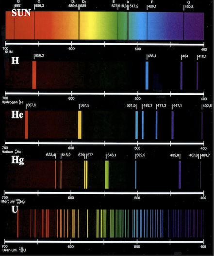
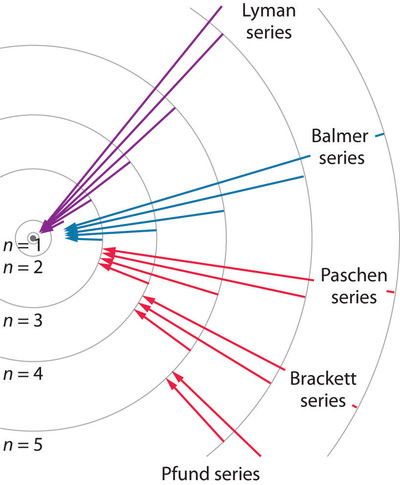
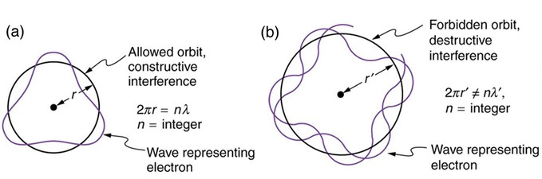

## Atomic spectra

::: {admonition} **What You Need to Know**
:class: note

- **Atomic Spectroscopy** measures the frequencies or wavelengths of radiation absorbed or emitted by atoms.
- **Spectra of Atoms** show discrete lines, indicating that atoms absorb or emit only specific, few frequencies.
In other words, the energies of atoms are quantized.
- **Bohr's Theory:** Bohr attempted to explain atomic spectra by combining classical mechanics with the concept of quantization. For the simplest hydrogen atom, Bohr's theory worked perfectly, providing a closed formula that explains all the spectral lines of the hydrogen atom.
- **Limitation of Bohr's Theory:** However, for atoms with more than one electron, Bohr's theory fails to generalize, leading scientists to develop a more rigorous theory—Quantum Mechanics.
:::

### Spectroscopy of atoms

- When heated or subjected to electrical discharge, atoms emit radiation of characteristic frequencies.  The spectrum from each atom is unique. 

:::{figure-md} markdown-fig

Atomic spectorscopy of hydrogen atom. hydrogen in gas discharge tube radiates discrete wavelengts which can be detected as discrete lines by passing the radiation through prism.
:::

:::{figure-md} markdown-fig

Using spectorscopy one could detect presence of different elements in the sun. 
:::

### Spectral lines and Rydberg's formula

- The existance of discrete spectral lines are impossible to describe with classical mechanics.  In 1885, Johann Blamer demonstrated that a subset of the hydrogen atom spectrum (the Balmer series) could be described by the equation

$$v = 8.2202\times10^{14}\left(1-\frac{4}{n^2}\right)$$

where $n=3,4,5,...$.  Later, Johannes Rydberg generalized this formula to account for the entire hydrogen atom spectrum yielding the Rydberg formula

:::{admonition} **Rydberg formula**
:class: important

$$\tilde{v} = R_H\left(\frac{1}{n_1^2}-\frac{1}{n_2^2}\right)$$

where 
- $R_H = 109677.581$ cm$^{-1}$ is the Rydberg constant
- $n_1 = 1,2,3,...$, and $n_2 = n_1+1,n_1+2,...$.  

:::

- While these equations fit the hydrogen atom spectrum nicely, they do not prescribe any physics to the system.  They do not present a model of the hydrogen atom but rather a heuristic equation that fits the data.  Nonetheless, scientists were perplexed by the presence of the integers $n_1$ and $n_2$. 

:::{figure-md} markdown-fig

Atomic spectral lines are named after their disocerers. Each series contains all transitions to a distinct ground or excited state level n=1,2,3. 
:::

### Bohr's model of H atom

- In 1911, Niels Bohr proposed a model for the hydrogen atom that was able to recapitulate the hydrogen atom spectrum. 
- The model consists of an electron orbiting a proton in circular orbits.  The proton is considered to be fixed in space because it is so much more massive than the electron.  
- Most importantly Bohr had to introduce new ad-hoc requirements to keep the electron stable. Namely the electron demonstrates wavelike characteristics which has an integer number $n=1,2,3,...$ of modes around the circular orbit.  
- Thanks to this quantization rule expression for the H atom energy is obtained which is a function of an integer number $n=1,2,3,...$

### Quantizes states of electron

Restricitng waves with wavelength $\lambda$ to sit around orbit separated by integer number yields

$$\begin{equation}
2\pi r = n\lambda_e \quad n=1,2,3,...
\end{equation}$$

:::{figure-md} markdown-fig

One could rationalize discrete Bohr's orbits by the integer number of wavelengths one could fit into the orbit.  
:::

where $\lambda_e$ is the deBroglie wavelength of an electron and can be written as

$$\begin{equation}
\lambda_e = \frac{h}{m_ev}.
\end{equation}$$

Plugging the deBroglie wavelength equation into the circular wave equation yields

$$\begin{equation}
m_evr = \frac{nh}{2\pi} = n\hbar,
\end{equation}$$

where we have introduce $\hbar = \frac{h}{2\pi}$ as a short-hand because it comes up frequently in quantum mechanics. The term on the left-hand side of the last equation, $m_evr$, is the angular momentum of the electron.  Thus Bohr 's model demonstrates a quantization of the angular momentum of the electron.

### Force balance

After introducing ad-hoc quantization rule, Bohr's model then resorts to lclassical mechanics to obtain energy function. 

Bohr posited that for stationary states of the electron the electrostatic force between the proton and electron,

$$\begin{equation}
f = \frac{e^2}{4\pi\varepsilon_0r^2}
\end{equation}$$

where $4\pi\varepsilon_0$ is present to achieve SI units, must be equal to the centrifugal force,

$$\begin{equation}
f = \frac{m_ev^2}{r}
\end{equation}$$

where $m_e$ is the mass and $v$ is the velocity of the electron.  Equating these two forces yields

$$\begin{equation}
\frac{e^2}{4\pi\varepsilon_0r^2} = \frac{m_ev^2}{r}.
\end{equation}$$

The combination of the force balance equation and the quantized angular momentum equation quantizes the values of $r$, the radius of the electron's circular orbit, that can be taken.  To demonstrate this we solve the quantized angular momentum equation for $v$ and plug the result into the force balance equation and solve for $r$:

$$\begin{align}
\frac{e^2}{4\pi\varepsilon_0r^2} &= \frac{m_e\left( \frac{n\hbar}{m_er}\right)^2}{r} \\
\Rightarrow \frac{e^2}{4\pi\varepsilon_0} &= \frac{(n\hbar)^2}{m_er} \\
\Rightarrow e^2m_er &= 4\pi\varepsilon_0(n\hbar)^2 \\
\Rightarrow r &= \frac{4\pi\varepsilon_0(n\hbar)^2}{e^2m_e} \quad n=1,2,3,...
\end{align}$$

The radius of the first Bohr orbit is denoted $a_0 = \frac{4\pi\varepsilon_0\hbar^2}{e^2m_e}$ or units of Bohr.  Allowed values of $r$ as a function of $n$ are plotted below.

### Energy of H atom 

The energy of the system can is a sum of the Coulomb attraction between the electron and the proton and the kinetic energy of the electron:

$$\begin{equation}
E(r) = \frac{1}{2}m_ev^2 - \frac{e^2}{4\pi\varepsilon_0r}
\end{equation}$$

To determine the energy of an electron that is limited to be in the circular wavelike orbits described above, we must use the force balance relationship.  We do that by substituting $m_ev^2 = \frac{e^2}{4\pi\varepsilon_0r}$ into the energy equation to yield

$$\begin{align}
E(r) &= \frac{1}{2}\frac{e^2}{4\pi\varepsilon_0r} - \frac{e^2}{4\pi\varepsilon_0r} \\
    &= -\frac{1}{2}\frac{e^2}{4\pi\varepsilon_0r} \\
    &= -\frac{1}{2}\frac{e^2}{4\pi\varepsilon_0}\frac{e^2m_e}{4\pi\varepsilon_0(n\hbar)^2} \\
    &= -\frac{m_ee^4}{32\pi^2\varepsilon_0\hbar^2}\frac{1}{n^2} \\
    &= -\frac{m_ee^4}{8\varepsilon_0^2h^2}\frac{1}{n^2} \quad n=1,2,3,...
\end{align}$$

where I plugged in the quantized values for $r$ derived from the for balance relationship.   Taking differences in energy between two energy levels, $n_1$ and $n_2>n_1$, yields

$$\begin{equation}
\Delta E = \frac{m_ee^4}{8\varepsilon_0^2h^2}\left(\frac{1}{n_1^2} - \frac{1}{n_2^2}\right)
\end{equation}$$

Equating this to the frequency (use $E = h\nu$ and $\tilde{\nu} = \frac{\nu}{c}$) of emitted light yields

$$\begin{equation}
\tilde{v} = \frac{m_ee^4}{8\varepsilon_0^2ch^3}\left(\frac{1}{n_1^2} - \frac{1}{n_2^2}\right)
\end{equation}$$

We see that this yields an expression for the Rydberg constant in terms of fundamental constants

$$\begin{equation}
R_H = \frac{m_ee^4}{8\varepsilon_0^2ch^3}
\end{equation}$$

### Problems 

#### Problem 1

The so-called Lyman series of lines in the emission spectrum of hydrogen corresponds to transitions from various excited states to the n = 1 orbit. Calculate the wavelength of the lowest-energy line in the Lyman series to three significant figures. In what region of the electromagnetic spectrum does it occur?

:::{admonition} **Solution** 
:class: dropdown

**A** We can use the Rydberg equation  to calculate the wavelength for the Lyman series, $n_1 = 1$.

$$
\dfrac{1}{\lambda }=R_H \left ( \dfrac{1}{n_{1}^{2}} - \dfrac{1}{n_{2}^{2}}\right )
$$

The lowest energy results from a transition from or to nearest energy level hence $n_2 = n_1+1$

$$
\begin{align*} \dfrac{1}{\lambda } &=R_H \left ( \dfrac{1}{n_{1}^{2}} - \dfrac{1}{n_{2}^{2}}\right ) \\[4pt] &=1.097 \times 10^{7}\, m^{-1}\left ( \dfrac{1}{1}-\dfrac{1}{4} \right )\\[4pt] &= 8.228 \times 10^{6}\; m^{-1} \end{align*}
$$

Spectroscopists often talk about energy and frequency as equivalent. The $cm^{-1}$ unit (wavenumbers) is particularly convenient. We can convert the answer in part A to $cm^{-1}$

$$
\begin{align*} \widetilde{\nu} &=\dfrac{1}{\lambda } \\[4pt] &= 8.228\times 10^{6}\cancel{m^{-1}}\left (\dfrac{\cancel{m}}{100\;cm} \right ) \\[4pt] &= 82,280\: cm^{-1} \end{align*}
$$

and

$$\lambda = 1.215 \times 10^{−7}\; m = 122 \,\,nm$$

This emission line is called Lyman alpha and is the strongest atomic emission line from the sun and drives the chemistry of the upper atmosphere of all the planets producing ions by stripping electrons from atoms and molecules. It is completely absorbed by oxygen in the upper stratosphere, dissociating O2 molecules to O atoms which react with other O2 molecules to form stratospheric ozone

**B** This wavelength is in the UV region of the spectrum.
:::

#### Problem 2

- A. Calculate the energy of a photon that is produced when an electron in a hydrogen atom goes from an orbit with  n=4 to and orbit with  $n=1$
- B. What happens to the energy of the photon as the initial value of  $n$ approaches infinity?

:::{admonition} **Solution** 
:class: dropdown

**A.**  We will use the Bohr's formula in units of electron $E_n = -19.6 \frac{1}{n^2}$ to calculate energy of a photon. 

$$\Delta E = 19.6  \Big ( \frac{1}{1^2} - \frac{1}{4^2} \Big) = 19.6 \cdot 0.9375 = 18.375\,\, ev$$

**B.** Energy of a photon goes up as we excite electron to higher and higher level. As $n_2\rightarrow \infty$ we end up with a photon that has sufficient energy to ionize the atom. $E = 19.6 \cdot ( \frac{1}{1^2} - \frac{1}{\infty} \Big) = 19.6 ev$
:::

#### Problem 3

Use Rydberg's formula to calculate firs few lines of Lymann series ($n_1=1$)

:::{admonition} **Solution** 
:class: dropdown
The Rydberg formula is given by:

$$
\frac{1}{\lambda} = R_H \left( \frac{1}{n_1^2} - \frac{1}{n_2^2} \right)
$$

For the Lyman series, $n_1 = 1$, and $n_2 = 2, 3, 4, \dots$. The Rydberg constant for hydrogen is:

$$
R_H = 1.097 \times 10^7 \ \text{m}^{-1}
$$

**First few lines of the Lyman series:**

For $n_2 = 2$:

$$
\frac{1}{\lambda} = 1.097 \times 10^7 \left( \frac{1}{1^2} - \frac{1}{2^2} \right)
$$

$$
\lambda = 1.2157 \times 10^{-7} \ \text{m} = 121.57 \ \text{nm}
$$

For $n_2 = 3$:

$$
\frac{1}{\lambda} = 1.097 \times 10^7 \left( \frac{1}{1^2} - \frac{1}{3^2} \right)
$$

$$
\lambda = 1.0257 \times 10^{-7} \ \text{m} = 102.57 \ \text{nm}
$$

For $n_2 = 4$:

$$
\frac{1}{\lambda} = 1.097 \times 10^7 \left( \frac{1}{1^2} - \frac{1}{4^2} \right)
$$

$$
\lambda = 9.724 \times 10^{-8} \ \text{m} = 97.24 \ \text{nm}
$$

So, the first three wavelengths of the Lyman series are approximately $121.57$ nm, $102.57$ nm, and $97.24$ nm.

:::

#### Problem 4

A line in the  Lymann series of hydrogen has a wavelength of $1.03 \cdot 10^{-7} m$ Find the original level of the electron.

:::{admonition} **Solution** 
:class: dropdown

We are given a wavelength $\lambda = 1.03 \times 10^{-7} \ \text{m}$ and asked to find the original level $n_2$ of the electron in the Lyman series (where $n_1 = 1$).

Using the Rydberg formula:

$$
\frac{1}{\lambda} = R_H \left( \frac{1}{n_1^2} - \frac{1}{n_2^2} \right)
$$

For the Lyman series, $n_1 = 1$, so the equation becomes:

$$
\frac{1}{\lambda} = R_H \left( 1 - \frac{1}{n_2^2} \right)
$$

Rearranging to solve for $n_2$:

$$
\frac{1}{n_2^2} = 1 - \frac{1}{R_H \lambda}
$$

Substituting the values:

$$
R_H = 1.097 \times 10^7 \ \text{m}^{-1}
$$

$$
\frac{1}{n_2^2} = 1 - \frac{1}{(1.097 \times 10^7) \times (1.03 \times 10^{-7})}
$$

$$
\frac{1}{n_2^2} = 1 - \frac{1}{1.13091} = 1 - 0.884 = 0.116
$$

Now, solving for $n_2$:

$$
n_2^2 = \frac{1}{0.116} = 8.621
$$

$$
n_2 = \sqrt{8.621} \approx 2.94
$$

Since $n_2$ must be an integer, we round it to $n_2 = 3$.

Thus, the original level of the electron is $n_2 = 3$.

:::

#### Problem 5

Using Bohr theory calculate ionization energy of singly ionized helium $He^{+}$

:::{admonition} **Solution** 
:class: dropdown

The ionization energy is the energy required to remove an electron from its ground state to infinity. Using Bohr's theory, the energy of an electron in an orbit is given by:

$$
E_n = -\frac{Z^2 R_H}{n^2}
$$

Where:
- $Z$ is the atomic number,
- $R_H = 13.6 \ \text{eV}$ is the Rydberg constant for hydrogen,
- $n$ is the principal quantum number.

For singly ionized helium $He^+$, the atomic number $Z = 2$. In the ground state, $n = 1$.

Thus, the energy in the ground state is:

$$
E_1 = -\frac{Z^2 R_H}{1^2} = -\frac{(2)^2 \times 13.6 \ \text{eV}}{1^2} = -4 \times 13.6 \ \text{eV} = -54.4 \ \text{eV}
$$

The ionization energy is the negative of this ground state energy (since we want to bring the electron to $n = \infty$):

$$
E_{\text{ionization}} = 54.4 \ \text{eV}
$$

Therefore, the ionization energy of singly ionized helium $He^+$ is $54.4 \ \text{eV}$.

:::

#### Problem 6

- Calculate radii of Bohr orbit for first few levels. 

- (Optional) Using python plot $r_n$ vs $n$

:::{admonition} **Solution** 
:class: dropdown

The radius of the Bohr orbit is given by the formula:

$$
r_n = \frac{n^2 a_0}{Z}
$$

Where:
- $n$ is the principal quantum number (level),
- $a_0 = 5.29 \times 10^{-11} \ \text{m}$ is the Bohr radius for hydrogen,
- $Z$ is the atomic number (for hydrogen, $Z = 1$).

For hydrogen ($Z = 1$), the radii for the first few levels are:

**For $n = 1$:**
$$
r_1 = \frac{1^2 \times 5.29 \times 10^{-11} \ \text{m}}{1} = 5.29 \times 10^{-11} \ \text{m}
$$

**For $n = 2$:**
$$
r_2 = \frac{2^2 \times 5.29 \times 10^{-11} \ \text{m}}{1} = 4 \times 5.29 \times 10^{-11} \ \text{m} = 2.116 \times 10^{-10} \ \text{m}
$$

**For $n = 3$:**
$$
r_3 = \frac{3^2 \times 5.29 \times 10^{-11} \ \text{m}}{1} = 9 \times 5.29 \times 10^{-11} \ \text{m} = 4.761 \times 10^{-10} \ \text{m}
$$

**For $n = 4$:**
$$
r_4 = \frac{4^2 \times 5.29 \times 10^{-11} \ \text{m}}{1} = 16 \times 5.29 \times 10^{-11} \ \text{m} = 8.464 \times 10^{-10} \ \text{m}
$$

Therefore, the radii of the Bohr orbits for the first few levels are:
- $r_1 = 5.29 \times 10^{-11} \ \text{m}$,
- $r_2 = 2.116 \times 10^{-10} \ \text{m}$,
- $r_3 = 4.761 \times 10^{-10} \ \text{m}$,
- $r_4 = 8.464 \times 10^{-10} \ \text{m}$.

:::