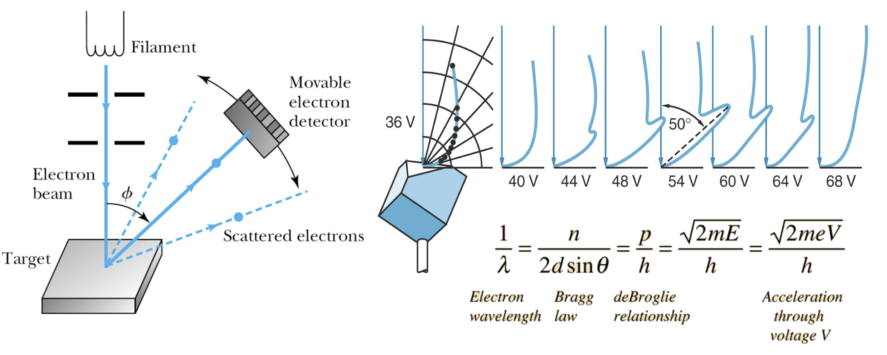
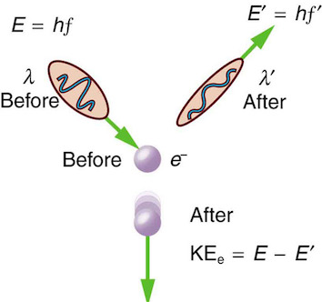

## Wave-particle duality


```{admonition} What you need to know
:class: note
- Compton scattering and electron diffraction experiment shave demonstrated that concepts of a particle and wave are not mutually exclusive.

- A physical entity has both wave-like (wavelengths, interference, diffraction, etc.) and particle-like (momentum, collision, countable, etc.) characteristics. An electron has a wavelength; a photon has momentum.

- Wave-like and particle-like characteristics are inversely proportional to each other and are quantified by de Broglie relation: $\lambda = \frac{h}{p}$

-  Thus all quantum objects can behave both as a wave and a particle! Which behavior would be more pronounced depends on the experiment!
```


### Bragg's formula for diffraction. 

- X-rays interact with the atoms in a crystal. The phase shift upon scattering off of atoms causes constructive (left figure) or destructive (right figure) interferences.


- Maxima and minima in interference patters are dictated by simple geometric  argument captured in Bragg’s formula: 

$$\boxed{2d sin\theta = n\lambda}$$

- One expects waves like X-rays to show interference patterns according to this formula. Interference was thought to be a purely a wave like phenomenon. 

### Both X-rays and electrons show the same diffraction patterns. 


### Davisson & Germer show: electrons scatter like waves.

- In 1925, Davisson and Germer were studying electron scattering from various materials. To their great surprise, they discovered that at certain angles there was a peak in the intensity of the scattered electron beam. This peak indicated wave behavior for the electrons and could be interpreted by Bragg's law (previously only applied to X-ray scattering) to give values for the lattice spacing in the nickel crystal. 




### Particles can behave like waves in appropriate circumstances.  

- Observing diffraction patterns and computing wavelength from de Broglie relation confirmed that thinking of matter as a dual wave-particle was correct with an impressive agreement between experimental predictions and theory. 


- Another striking wave behavior of electrons emerges in the double-slit experiment where electrons all line up as bands on the detector screen after passing throw a double-slit wall. We are going to have a more in-depth look into this incredible experiment later on.

### Diffraction and color. 

- Thin films of oil, soap bubbles, butterfly wings, seashells, CD and DVD, etc. show a rainbow pattern. This is caused by the constructive and destructive interference of light traveling slightly different paths.

- An electron can be scattered by different layers of a crystal lattice and interfere constructively or destructively, giving rise to alternating intensity patterns. 

### Compton scattering

:::{figure-md} markdown-fig


Caption
:::


Arthur Compton showed that X-rays get scattered off free electrons like elastic billiard balls. Applying conservation of momentum principle (previously only applied to particle-like objects), it was shown that the outgoing X-rays should be of longer wavelength than the incoming ones. This means that a moving photon hits the resting free electron and transfers some energy to get the electron moving. Note that this experimental result makes sense only if you think of a photon as a particle with linear momentum which gets bounced off the electron.


### Wave particle duality as universal feature of nature. 

- Light is a wave and a particle. An electron is also a particle and a wave. Is everything a wave and a particle? The answer is YES! This is what is meant by wave-particle duality.  Sometimes we only see one side of the duality because under some conditions, either wave or particle characteristics are more pronounced. 

- The wave-like and particle-like characteristics of a physical entity are inversely proportional to each other as described by the de Broglie relationship.

### De Broglie comes up with a simple equation which establishes the duality of matter. 

$$\boxed{\lambda = \frac{h}{p}}$$

- Where $h$: Planck's constant. $p$: the momentum of the object (electron, photon, molecule, chair, etc.). $\lambda$: wavelength associated with the object. 

- The relation implies that heavy objects have a small wavelength, and light objects have a large wavelength. Hence the smaller the object, the more pronounced wave-like qualities it will have. And vice versa, the bigger the object, the more particle-like qualities it will have. 


### Problems

#### Problem 1

Estimate the wavelength of electrons that have been accelerated from
rest through a potential difference of $V = 40 kV$. 
> Note that potential energy difference that the electrons experience is simply $e×V$ where e is the magnitude of electron charge and $V$ potential difference.

:::{dropdown} Solution
In order to calculate the de Broglie wavelength, we need to calculate the linear momentum of the electrons.
At the end of the acceleration, all the acquired energy is in the form of kinetic energy ($p^2 / 2m_e$).

$$
\frac{p^2}{2m_e} = eV \Rightarrow p = {\sqrt{2m_eeV}}
$$

$$
{\lambda = \frac{h}{p} = \frac{h}{\sqrt{2m_eeV}}}{= \frac{6.626\times 10^{-34}\textnormal{ Js}}{\sqrt{2\times (9.109\times 10^{-31}\textnormal{ kg})\times (1.609\times 10^{-19}\textnormal{ C})\times (4.0\times 10^4\textnormal{ V})}}}{ = 6.1\times 10^{-12}}\, m
$$
:::

