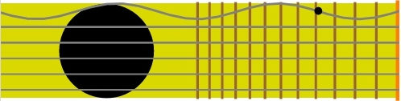
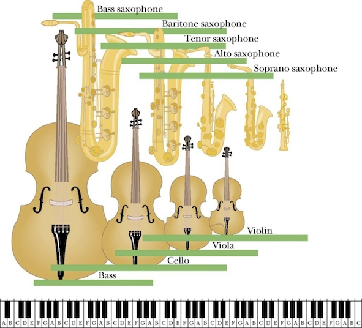

## Wave equation

```{admonition} What you need to know
:class: note
- A wave is a self-propagating disturbance in a medium. Waves carry energy, momentum, information, but not matter!
- An equation, partially differential equation known as a wave completely describes wave's spatial and temporal evolution
- The wave equation, a partial differential equation (PDE), completely describes waves' spatial and temporal evolution.
- 1D wave equation for a guitar string is governed by the displacement of the string $u(x,t)$ in time and space.
```


### Guitar string, a simple toy example desired by wave equation. 



 <iframe src="https://giphy.com/embed/x988dOESRoCeQ" width="480" height="160" frameBorder="0" class="giphy-embed" allowFullScreen></iframe><p><a href="https://giphy.com/gifs/animation-physics-x988dOESRoCeQ">via GIPHY</a></p>
Our objective in the next few pages is to describe motion of guitar string mathematically. That is given arbitrary initial conditions precisely predict the evolution of string in time and space. 


### Solving wave equation by separation of variables. A technique worth remembering!

- Wave equation is an example of a second order PDE (partial differential equation). This PDE governs behavior of displacement $u(x,t)$ in time and space.

$$\frac{1}{v^2}\frac{\partial^2 u(x,t)}{\partial t^2} =\frac{\partial^2 u(x,t)}{\partial x^2 }$$ 

- In order to solve this equation we need to specify two boundary conditions to obtain solution that is specific to our physical situation: a guitar string attached to two ends. Mathematically we specify boundary conditions by:

$$u(0,t)=0 \,\,\,\, | \,\,\,\, u(L,t)=0$$

- A general way of solving such equations is by using the technique of separation of variables: assuming $x$ and $t$ vary independent of each other enables us to write $u$ as a product of two single variable functions.

$$u(x,t)=X(x)T(t)$$

### Step one: plug product of univariate functions into wave equation.

 $$\frac{1}{v^2}\frac{\partial^2 u(x,t)}{\partial t^2} =\frac{\partial^2 u(x,t)}{\partial x^2 }$$

 Plugging $u(x,t)=X(x)T(t)$ in the above wave equation leads to separation of variables into two independent equations:

  $$\frac{1}{v^2}\frac{\partial^2 X(x)T(t)}{\partial t^2} =\frac{\partial^2 X(x)T(t)}{\partial x^2 }$$

  Some rearrangement first

  $$\frac{X(x)}{v^2}\frac{\partial^2 T(t)}{\partial t^2} =T(t)\frac{\partial^2 X(x)}{\partial x^2 }$$

  And voilà, the final product we have two ordinary differential equations (ODEs) as opposed to much harder partial differential equation (PDE). 

$$\frac{1}{T(t)v^2}\frac{\partial^2 T(t)}{\partial t^2} =\frac{1}{X(x) }\frac{\partial^2 X(x)}{\partial x^2 }=K=const$$


### Step two: After decomposing PDE into ODEs we begin solving each ODE one by one. 

$$\frac{1}{T(t)v^2}\frac{\partial^2 T(t)}{\partial t^2} =K \,\,\,\,and\,\,\,\,\,\,\,\, \frac{1}{X(x) }\frac{\partial^2 X(x)}{\partial x^2 }=K$$

$$\frac{\partial^2 T(t)}{\partial t^2} -KT(t)v^2=0 \,\,\,\,and\,\,\,\,\,\,\,\, \frac{\partial^2 X(x)}{\partial}-K X(x)=0$$

### Intermezzo: solve the ODE by considering all cases for the separating constant. Case K>0 

- If $K \geq 0$: and we explicitly specify this $K=\beta^2$ via a constant $\beta$.

$$X(x)= c_1 e^{\beta x}+c_2 e^{-\beta x}$$

Applying boundary conditions $X(0)=X(L)=0$ leads to $c_1=c_2=0$. There is simply no other way to make linear combination of two positive numbers equal to zero. We are left with a pretty boring solution $X(x)=0$  implying that string does not move. No music :( 

### Intermezzo: solve the ODE by considering all cases for the separating constant. Case K<0 

- If $K < 0$: and we explicitly specify this $K=-\beta^2$ via a constant $\beta$.

$$X(x)= c_1 e^{i\beta x}+c_2 e^{-i\beta x}$$

$$X(x)= c_1 \left[\cos(\beta x)+ i \sin(\beta x)\right] + c_2 [\cos(\beta x) - i \sin(\beta x)]$$

Above we have made use of Euler's relation to clarify things. Now one more rearrangement and we are done here:

$$X(x)= (c_1+ic_2)(\cos(\beta x)+(c_1-ic_2)\sin(\beta x)$$

$$X(x)= A \cos(\beta x)+B \sin(\beta x)$$

Applying boundary conditions leads to $X(0)=0$ hence $A \cdot 1+0=0$. <br>And $X(L)=0=\sin (\beta L)=0$ hence we have a non-trivial solution! 

$$\beta L=n\pi \,\, \rightarrow \,\, \beta=\frac{n\pi}{L} \,\,  \rightarrow \,\,  X(x)=B\sin\left(\frac{n\pi}{L}x\right)$$


### Intermezzo: Solutions for wave equation are also called normal modes.

We have found solution for $X(x)=B\sin\left(\frac{n\pi}{L}x\right)$. <br>Now it is time to do the same for $T(t)$ by repeating the same steps:

$$\frac{\partial^2 T(t)}{\partial t^2 }-K T(t)v^2=0 \,\,\rightarrow \,\, \frac{\partial^2 T(t)}{\partial t^2 }-\beta^2 T(t)v^2=0$$

$$T(t)=D_n \cos(\omega_n t)+E_n \sin(\omega_n t)$$

- Since there are no boundary conditions for T(t), both $\sin$ and $\cos$ terms survived.
- $\omega_n=\beta \nu=\frac{n\pi}{L} \nu$ are called normal modes.  Integer index $n = 0,1,2,...$ lists normal modes which are simply solutions satisfying our wave equation. 

### Step 3: Combine the solutions of all ODEs to obtain the solution of the original PDE. 

$$u(x,t)=X(x)T(t)=[D_n \cos(\omega_n t)+E_n \sin(\omega_n t)] B \sin\left(\frac{n\pi}{L}x\right)$$

Using trigonometric relation for sum of $\sin$ and $\cos$ functions we arrive at infinite number of solutions for each $n$. 

$$u(x,t)=X(x)T(t)=A \sin\left(\frac{n\pi}{L}x\right)\cos(\omega_n t+\phi_n)$$

Since for any value of $n$ the above normal mode expression satisfies the wave equation, the most general solution would be a linear combination of all the normal modes. 

$$u(x,t)=\sum_n X_n(x)T_n(t)=\sum_n A_n \sin\left(\frac{n\pi}{L}x\right)\cos(\omega_n t+\phi_n)$$

This general solution describes a time evolution of any 1D guitar string, regardless of how you pluck it. 

### Interpretation of solution to wave equation. 

Complete information for describing any vibrational motion is contained in the sum of the normal modes: $X_n(x)$. Depending on where and how fast you pluck the guitar string the terms that contain time, $T_n(t)$ will be different, but normal modes $X_n(x)$ are always the same.

$$\nu_n=\frac{\omega_n}{2\pi}=\frac{n \nu}{2L}$$

- $n = 1$; 0 nodes; fundamental or first harmonic:
- $n = 2$; 1 node; first overtone or second harmonic:
- $n = 3$; 2 nodes; second overtone or third harmonic:

### The sound of music.




 - Music produced by musical instruments is a combination of sound waves with frequencies corresponding to a superposition of normal modes (in music they call harmonics, overtones) of those musical instruments. 

- The size of the musical instrument reflects the range of frequencies over which the instrument is designed to function. Smaller size implies higher frequencies, larger size implies lower frequencies.
> Learn more from [this series](https://www.youtube.com/watch?v=jveKIYyafaQ).

### 2D membrane vibrations.


Wave function of 2D membrane with fixed edges has two independent variables x and y. 

$$u(x,y,t) =X(x)Y(y)T(t)$$

- Boundary on the $X$ edge: $X(0)=X(L)=0$.
- Boundary on the $Y$ edge: $Y(0)=Y(L)=0$.

Now we will apply the same procedure as before:<br>
1. Substitute into PDE to get ODEs. <br>
2. Solve for ODEs (applying boundary conditions). <br>
3. Put everything back together and obtain full solution. 

Going through exactly the same steps as in 1D case we get full solution expressed as a linear combination of normal modes. 

The 2D solution is essentially a product of two 1D solutions for each coordinate. Each coordinate has its own independent wave number $k_x$ and $k_y$. 

Now can you guess what the solution would be fore the 3D case? :)
