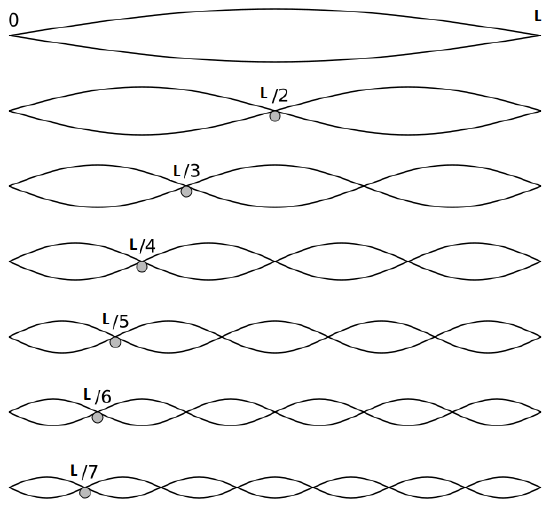

## Wave equation

:::{admonition} What you need to know
:class: note

- **Wave Equation Overview:** The wave equation, a partial differential equation (PDE), fully describes the spatial and temporal evolution of waves.

- **Linearity of the Wave Equation:** The wave equation is linear, meaning that any linear combination of solutions is also a solution. This allows the most general solution to be expressed as a linear combination of all possible solutions.

- **Boundary and Initial Conditions:** To solve the wave equation for a specific physical system, boundary conditions must be specified. These include the values the wave function takes at the physical boundaries (e.g., $x = 0$ and $x = L$). Initial conditions with respect to time (e.g., at $t = 0$) may also be required.

- **Solution Method for 1D Guitar String:** For a 1D guitar string, the wave equation is solved by separating variables, solving the resulting ordinary differential equations, and then applying boundary conditions at the two ends of the string.

- **Periodic Solutions:** The solution for a 1D guitar string results in an infinite number of periodic solutions, which are parameterized by an integer $n$. 

:::

### Classical Wave equation

- **Wave equation** is an example of a second order PDE (partial differential equation). This PDE governs behavior of displacement $u(x,t)$ in time and space.

$$\frac{\partial^2 u(x,t)}{\partial x^2 }= \frac{1}{v^2}\frac{\partial^2 u(x,t)}{\partial t^2}$$ 

:::{figure-md} markdown-fig

Classical wave equation can describe any complicated wave in space and time given the intitial conditions.
:::

- **Applications of the Classical Wave Equation:** To illustrate the applications of the classical wave equation, we will solve it for a 1D guitar string. This provides a comprehensive mathematical description of the string's behavior.

- **Predicting Evolution:** By specifying arbitrary initial conditions, the wave equation allows us to precisely predict the evolution of the string over time and space.

:::{figure-md} markdown-fig

Classical wave equation can describe any complicated wave in space and time given the intitial conditions.
:::

### Solving Wave Equation: The big picture 

- **Boundary Conditions:** To solve the wave equation for a specific physical situation, such as a guitar string fixed at both ends, we need to specify two boundary conditions. Mathematically, these are:

$$
u(0, t) = 0 \quad \text{and} \quad u(L, t) = 0
$$

where $u(x, t)$ represents the displacement of the string at position $x$ and time $t$.

- **Separation of Variables:** A common method to solve such equations is the technique of separation of variables. This technique assumes that $x$ and $t$ vary independently of each other, allowing us to express $u(x, t)$ as a product of two functions, each depending on only one variable. This allows us to decompose PDE into Ordinary Differnetial Equations ODEs. 

$$
u(x, t) = X(x) \cdot T(t)
$$

- **Principle of superposition:** The wave equation is linear which you can see by  $u$ terms appearing with first order on both side. Linearity means that linear combination of two solutions $c_1 u_1+c_2u_2$ is also a solution. If you have $n$ particular solutions than you write general solution as linear combination of n terms. 

### Step 1: Plug the Product of Univariate Functions into the Wave Equation

- Start with the 1D wave equation that can describe 1D guitar string:

$$
\frac{1}{v^2}\frac{\partial^2 u(x,t)}{\partial t^2} = \frac{\partial^2 u(x,t)}{\partial x^2}
$$

- Substitute $u(x, t) = X(x)T(t)$ into the wave equation:

$$
\frac{1}{v^2}\frac{\partial^2 X(x)T(t)}{\partial t^2} = \frac{\partial^2 X(x)T(t)}{\partial x^2}
$$

- After rearranging, we get:

$$
\frac{X(x)}{v^2}\frac{\partial^2 T(t)}{\partial t^2} = T(t)\frac{\partial^2 X(x)}{\partial x^2}
$$

- Thus, we obtain two separate ordinary differential equations (ODEs) from the original partial differential equation (PDE):

$$
\frac{1}{T(t)v^2}\frac{\partial^2 T(t)}{\partial t^2} = \frac{1}{X(x)}\frac{\partial^2 X(x)}{\partial x^2} = K
$$

- where $K$ is a constant.

### Step 2: Solving Each Ordinary Differential Equation

After decomposing the PDE into ODEs, we solve each ODE separately:

$$
\frac{\partial^2 T(t)}{\partial t^2} - K T(t) v^2 = 0
$$

$$
\frac{\partial^2 X(x)}{\partial x^2} - K X(x) = 0
$$

:::{admonition} **Solving the spatial part: when $K > 0$**
:class: tip, dropdown

- If $K > 0$, we specify $K = \beta^2$, where $\beta$ is a constant. The general solution for $X(x)$ is represented as linar combination of particular solutions (principle of superposition):

  $$
  X(x) = c_1 e^{\beta x} + c_2 e^{-\beta x}
  $$

  Applying the boundary conditions $X(0) = X(L) = 0$ leads to $c_1 = c_2 = 0$. Since a non-trivial linear combination of two exponential functions cannot be zero everywhere, this results in the trivial solution:

  $$
  X(x) = 0
  $$

  This implies that the string does not move—no music!

:::

:::{admonition} **Solving the spatial part: when $K < 0$**
:class: tip, dropdown

- If $K < 0$, we specify $K = -\beta^2$, where $\beta$ is a constant. The general solution for $X(x)$ is:

  $$
  X(x) = c_1 e^{i \beta x} + c_2 e^{-i \beta x}
  $$

  Using Euler's formula, this can be rewritten as:

  $$
  X(x) = c_1 (\cos(\beta x) + i \sin(\beta x)) + c_2 (\cos(\beta x) - i \sin(\beta x))
  $$

  Simplifying further:

  $$
  X(x) = (c_1 + i c_2) \cos(\beta x) + (c_1 - i c_2) \sin(\beta x)
  $$

  Let $A = c_1 + i c_2$ and $B = c_1 - i c_2$:

  $$
  X(x) = A \cos(\beta x) + B \sin(\beta x)
  $$

  Applying the boundary conditions $X(0) = 0$ and $X(L) = 0$:

  - At $x = 0$: $A \cdot 1 + B \cdot 0 = 0$, so $A = 0$.
  - At $x = L$: $X(L) = B \sin(\beta L) = 0$.

  For a non-trivial solution, $\sin(\beta L) = 0$, which implies:

  $$
  \beta L = n \pi \quad \text{where} \quad n = 1, 2, 3, \ldots
  $$

  Hence:

  $$
  \beta = \frac{n \pi}{L}
  $$

  Thus:

  $$
  X(x) = B \sin \left(\frac{n \pi}{L} x \right)
  $$

:::

:::{admonition} **Solving temporal part**
:class: tip, dropdown

- Having identified $K<0$ conditions through solution of spatial part we can now solve for $T(t)$:

$$
\frac{\partial^2 T(t)}{\partial t^2} - K v^2 T(t) = 0 \quad \text{with} \quad K = \beta^2
$$

- Substitute $K = \beta^2$:

$$
\frac{\partial^2 T(t)}{\partial t^2} - \beta^2 v^2 T(t) = 0
$$

- The solution is:

$$
T(t) = D_n \cos(\omega_n t) + E_n \sin(\omega_n t)
$$

- where $\omega_n = \beta v = \frac{n \pi v}{L}$.
:::

#### Solution for spatial part

- Becasue of boundary conditions ($X(x)=X(L)=0$) imposed at the ends of guitar string we found infinite number of solutions indexed by an integer number $n$. These terms are called **normal modes** and are visualized below. 

$$
X(x) = B \sin \left(\frac{n \pi}{L} x \right)
$$

:::{figure-md} markdown-fig

The first seven solutions (normal modes) of spatial part of the wave equation on a length $L$ with two amplitudes (one positive and one negative).
:::

#### Solution for temporal part

-  For temporal part since we do not have boundary conditions! Time is allowed to march forward into infinity.  We find solution in the form of linear combination of sine and cosine functions with $\omega_n = \beta v = \frac{n \pi v}{L}$ and $n = 1, 2, 3, \ldots$ represents the normal modes. 

$$
T(t) = D_n \cos(\omega_n t) + E_n \sin(\omega_n t) = A_n \cos (\omega_n t + \phi_n)
$$

- In the second line we esing trig identity to express sum of cosine and sine in terms of cosine. Still we have two constantst o determine 
- The constants $A_n$ $\phi_n$ in temporal part are determined by **initial codnitions** E.g what should be the amplitude and phase of wave at starting time $t=0$.

### Step 3 Full solution of 1D guitar string: A linear combination of normal modes

- After solving ODEs for spatial and tempoeral parts we now combine them into a full solution. 
- The complete description of any vibrational motion of the guitar string is given by the sum of the normal modes, $X_n(x)$. 
- While the terms involving time, $T_n(t)$, depend on how and where the string is plucked, the normal modes $X_n(x)$ remain the same for a given string.
- Note that the general solution to wave equation is expressed as **a linear combination of all normal modes**  

:::{admonition}
:class: important

$$
u(x, t) = \sum_n X_n(x) T_n(t)
$$

$$
u(x, t) = \sum_n A_n \sin \left(\frac{n \pi}{L} x \right) \cdot \cos (\omega_n t + \phi_n)
$$

- $x$ spatial profile of wave bounded in region $[0, L]$
- $t$ time variable is free $(0, \infty$)
- $n=0,1,2,$ index of normal mode
- $A_n$ and $\phi_n$ coefficients specified as part of initial conditions
:::

:::{figure-md} markdown-fig

Presented are first six solutions from $n=0,1,2,3,4,5$
:::

- **For $n = 1$**: There are 0 nodes (excluding the endpoints). This is called the fundamental frequency or first harmonic.

- **For $n = 2$**: There is 1 node. This is known as the first overtone or second harmonic.

- **For $n = 3$**: There are 2 nodes. This is called the second overtone or third harmonic.

### 2D membrane vibrations.

:::{figure-md} markdown-fig

Vibrations of 2D membrane. 
:::

- Wave function of 2D membrane with fixed edges has two independent variables x and y. Applying the technique of separation of variables we will get three ordinary differential equations.

$$u(x,y,t) =X(x)Y(y)T(t)$$

- This time there will be two boundary conditions fo X and Y
- Boundary on the $X$ edge: $X(0)=X(L)=0$.
- Boundary on the $Y$ edge: $Y(0)=Y(L)=0$.
- Going through exactly the same steps as in 1D case we get full solution expressed as a linear combination of 2D normal modes. 
- **The 2D normal mode is a product of two 1D modes for each coordinate.** Each coordinate has its own independent mode number $n$ and $m$. 

$$ u(x,y,t) = \sum_n \sum_m A_{nm} cos(\omega_{nm}t+\phi_{nm}) sin \frac{n\pi x}{a} sin \frac{m\pi y}{b} $$

- The angular frequency depends on the geometry of the domain and on two integer numbers $n$ and $m$. 

$$\omega_{nm} = v\pi \Big(\frac{n^2}{a^2}+ \frac{m^2}{b^2}\Big)^{1/2} $$

:::{admonition} **Full derivation of 2D rectangular membrane problem**
:class: tip, dropdown

To extend the solution of the 1D guitar string problem to 2D, you can analyze a 2D  vibrating membrane, such as a rectangular or circular drumhead. Here's a step-by-step solution for a 2D rectangular membrane:

**Solution for a 2D Rectangular Membrane**

Consider a rectangular membrane with dimensions $L_x$ and $L_y$, fixed along its edges. The wave equation for the membrane is:

$$
\frac{\partial^2 u(x, y, t)}{\partial t^2} = c^2 \left( \frac{\partial^2 u(x, y, t)}{\partial x^2} + \frac{\partial^2 u(x, y, t)}{\partial y^2} \right)
$$

where $c$ is the wave speed.

**Separation of Variables**

Assume the solution can be written as a product of functions, each depending on only one variable:

$$
u(x, y, t) = X(x) Y(y) T(t)
$$

Substitute this into the wave equation:

$$
\frac{d^2}{dt^2}[X(x) Y(y) T(t)] = c^2 \left( \frac{d^2}{dx^2}[X(x) Y(y) T(t)] + \frac{d^2}{dy^2}[X(x) Y(y) T(t)] \right)
$$

This simplifies to:

$$
X(x) Y(y) \frac{d^2 T(t)}{dt^2} = c^2 \left( T(t) \frac{d^2 X(x)}{dx^2} Y(y) + T(t) X(x) \frac{d^2 Y(y)}{dy^2} \right)
$$

Divide through by $X(x) Y(y) T(t)$:

$$
\frac{1}{c^2} \frac{1}{T(t)} \frac{d^2 T(t)}{dt^2} = \frac{1}{X(x)} \frac{d^2 X(x)}{dx^2} + \frac{1}{Y(y)} \frac{d^2 Y(y)}{dy^2}
$$

Since the left side depends only on  $t$ and the right side depends only on  $x$ and $y$, each side must equal a constant, which we denote as $-\lambda$:

$$
\frac{1}{c^2} \frac{d^2 T(t)}{dt^2} = -\lambda
$$

$$
\frac{d^2 X(x)}{dx^2} + \frac{d^2 Y(y)}{dy^2} = -\lambda X(x)
$$

**Solving for $T(t)$**

The ODE for $T(t)$ is:

$$
\frac{d^2 T(t)}{dt^2} + \lambda c^2 T(t) = 0
$$

This has the general solution:

$$
T(t) = A \cos(\omega t) + B \sin(\omega t)
$$

where $(\omega = \sqrt{\lambda} c)$.

**Solving for $X$ and $Y$**

To solve the spatial part, we need to separate the problem into two parts:

$$
\frac{d^2 X(x)}{dx^2} + \frac{d^2 Y(y)}{dy^2} = -\lambda X(x)
$$

Assume:

$$
\frac{d^2 X(x)}{dx^2} = -\alpha^2 X(x)
$$

$$
\frac{d^2 Y(y)}{dy^2} = -(\lambda - \alpha^2) Y(y)
$$

where $(\lambda = \alpha^2 + \beta^2)$. 

So, we have:

$$
\frac{d^2 X(x)}{dx^2} + \alpha^2 X(x) = 0
$$

$$
\frac{d^2 Y(y)}{dy^2} + \beta^2 Y(y) = 0
$$

**Boundary Conditions:**

For a rectangular membrane with boundaries $x = 0$, $x = L_x$, $y = 0$, and $y = L_y$, we apply:

$$
X(0) = X(L_x) = 0
$$

$$
Y(0) = Y(L_y) = 0
$$

The solutions for \(X(x)\) and \(Y(y)\) are:

$$
X(x) = C \sin\left(\frac{n \pi x}{L_x}\right)
$$

$$
Y(y) = D \sin\left(\frac{m \pi y}{L_y}\right)
$$

where \(n\) and \(m\) are positive integers, and:

$$
\alpha = \frac{n \pi}{L_x}, \quad \beta = \frac{m \pi}{L_y}
$$

So, the general solution for \(u(x, y, t)\) is:

$$
u(x, y, t) = \sum_{n=1}^\infty \sum_{m=1}^\infty \left[ A_{nm} \cos\left(\omega_{nm} t\right) + B_{nm} \sin\left(\omega_{nm} t\right) \right] \sin\left(\frac{n \pi x}{L_x}\right) \sin\left(\frac{m \pi y}{L_y}\right)
$$

where:

$$
\omega_{nm} = c \sqrt{\left(\frac{n \pi}{L_x}\right)^2 + \left(\frac{m \pi}{L_y}\right)^2}
$$

This solution describes the vibration modes of a 2D rectangular membrane, with each mode characterized by different integer values of \(n\) and \(m\).

:::

### The sound of music.

 - Music produced by musical instruments is a combination of sound waves with frequencies corresponding to a superposition of normal modes (in music they call harmonics, overtones) of those musical instruments. 
- Learn more from [this series](https://www.youtube.com/watch?v=jveKIYyafaQ).

:::{figure-md} markdown-fig

The size of the musical instrument reflects the range of frequencies over which the instrument is designed to function. Smaller size implies higher frequencies, larger size implies lower frequencies.
:::

### Example Problems 

#### Problem 1: Simple Harmonic Oscillator

Solve the ODE:

$$
\frac{d^2 y}{dt^2} + \omega^2 y = 0
$$

where $\omega$ is a constant.

:::{admonition} **Solution:**
:class: dropdown

The characteristic equation is:

$$
r^2 + \omega^2 = 0
$$

Solving for $r$:

$$
r = \pm i \omega
$$

Thus, the general solution is:

$$
y(t) = C_1 \cos(\omega t) + C_2 \sin(\omega t)
$$

where $C_1$ and $C_2$ are constants determined by initial conditions.

:::

#### Problem 2: Damped Oscillator

Solve the ODE:

$$
\frac{d^2 y}{dt^2} + 2 \beta \frac{dy}{dt} + \omega^2 y = 0
$$

where $\beta$ and $\omega$ are constants. Consider cases of $\beta^2 < \omega^2$, $\beta^2 > \omega^2$ and $\beta^2 = \omega^2$

:::{admonition} **Solution:**
:class: dropdown

The characteristic equation is:

$$
r^2 + 2 \beta r + \omega^2 = 0
$$

Solving for $r$ using the quadratic formula:

$$
r = \frac{-2 \beta \pm \sqrt{(2 \beta)^2 - 4 \omega^2}}{2}
$$

$$
r = -\beta \pm \sqrt{\beta^2 - \omega^2}
$$

Depending on the discriminant $\beta^2 - \omega^2$, we have three cases:

1. **Underdamping ($\beta^2 < \omega^2$):**

   $$ 
   y(t) = e^{-\beta t} [C_1 \cos(\omega_d t) + C_2 \sin(\omega_d t)]
   $$

   where $\omega_d = \sqrt{\omega^2 - \beta^2}$.

2. **Critical Damping ($\beta^2 = \omega^2$):**

   $$
   y(t) = (C_1 + C_2 t) e^{-\beta t}
   $$

3. **Overdamping ($\beta^2 > \omega^2$):**

   $$
   y(t) = C_1 e^{r_1 t} + C_2 e^{r_2 t}
   $$

   where $r_1$ and $r_2$ are the distinct real roots found from the quadratic formula.

:::

#### Problem 3: ODE with Constant Coefficients

Solve the ODE:

$$
\frac{d^2 y}{dt^2} - 4 y = 0
$$

:::{admonition} **Solution:**
:class: dropdown

The characteristic equation for this ODE is:

$$
r^2 - 4 = 0
$$

Solving for $r$:

$$
r^2 = 4
$$

$$
r = \pm 2
$$

Thus, the general solution is:

$$
y(t) = C_1 e^{2t} + C_2 e^{-2t}
$$

where $C_1$ and $C_2$ are constants determined by initial conditions.

:::

#### Problem 4: Simple 2nd order ODE

Solve the ODE:

$$
\frac{d^2 y}{dt^2} + 9 y = 0
$$

:::{admonition} **Solution:**
:class: dropdown

The characteristic equation for this ODE is:

$$
r^2 + 9 = 0
$$

Solving for $r$:

$$
r^2 = -9
$$

$$
r = \pm 3i
$$

Thus, the general solution is:

$$
y(t) = C_1 \cos(3t) + C_2 \sin(3t)
$$

where $C_1$ and $C_2$ are constants determined by initial conditions.

:::

#### Problem 5: When ODE gives repeated roots

Solve the ODE:

$$
\frac{d^2 y}{dt^2} - 6 \frac{dy}{dt} + 9 y = 0
$$

:::{admonition} **Solution:**
:class: dropdown

The characteristic equation for this ODE is:

$$
r^2 - 6r + 9 = 0
$$

Factoring:

$$
(r - 3)^2 = 0
$$

Thus:

$$
r = 3 \text{ (repeated root)}
$$

The general solution for repeated roots is:

$$
y(t) = (C_1 + C_2 t) e^{3t}
$$

where $C_1$ and $C_2$ are constants determined by initial conditions.
:::
