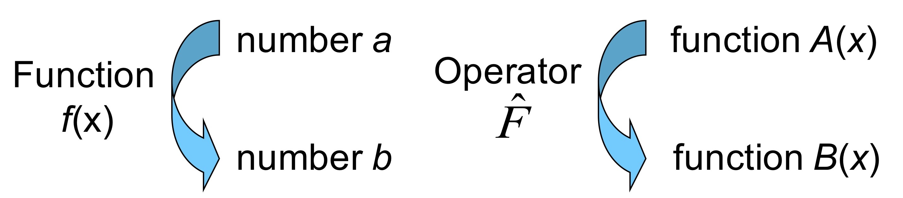

## Schrödinger Equation


```{admonition} What you need to know
:class: note
- By combining classical wave equation with quantum ideas we arrive at a new equation describing quantum wave functions: Schrödinger's equation (SE).
- Schrödinger's equation, just like classical wave equation depends on both time and space. 
- Once again we can use the technique of separation of variables and turn the time-dependent Schrödinger equation (TD-SE) into the time-independent Schrödinger equation  (TI-SE). The later is of special significance for chemical/biological sciences and will be our main focus in the rest of this course. 
- We will learn about the powerful operator notation with the help of which  we can write equations of quantum mechanics in concise form. 
- Each physical quantity that is measured in experiments (energy, momentum, position, etc) has a corresponding operator in quantum mechanics. 
- We re-formulate the problem of solving Schrodinger equation into a problem of finding eigenfunctions and eigenvalues corresponding to different operators.  
```

  

## The exciting journey into the microscopic world.  

- In the next few sections we are going to arrive at Schrödinger equation (SE) which is one of the fundamental laws of physics. The expression "fundamental law" means that SE can only be inferred or guessed from the experiments. It can not be derived. Correctness of SE is confirmed by the myriad of successful quantitative predictions and explanations of experimental observations. 

- Let us note that there has not been a single instance when quantum mechanics has failed when used properly! The physical world is quantum which is especially pronounced at small scales. Quantum Mechanics works flawlessly. Always. At all sales.  

:::{figure-md} markdown-fig


You are now entering the quantum world. Proceed wih caution 
:::

### Picking up where classical mechanics has failed

- Let us recall that classical mechanics while valid at large scales totally failed at describing motion at the atomic and molecular scales. A new, correct equation of motion is needed that can explain:

- **Quantized nature of energy** seen in  experiments on blackbody radiation, atomic and molecular spectra.

- **Wave-particle duality** Electron diffraction, Compton scattering, double slit experiments

:::{figure-md} markdown-fig


Schrodinger had to make peace with the idea that correct description of electrons is done via wave functions.
:::

### From classical to quantum wave equation

- In 1925/1926 Erwin Schrödinger, who was an expert on physics of waves, derived a new equation of motion which allows computing, predicting and obtaining from first principles the quantum phenomena such as energy quantization and wave-particle duality.

- We can trace Schordinger's approach by starting with classical wave equation

  $$\frac{\partial^2 \Psi(x,t)}{\partial x^2}=\frac{1}{v^2}\frac{\partial^2 \Psi(x,t)}{\partial t^2}$$

- Solution of classical wave equation in general produces traveling waves such as a periodic wave seen in previous sections. 

$$\Psi(x,t) = Acos{(kx-\omega t)}$$

- Or the following more general and mathematically convenient representation of a periodic traveling wave: 

$$\Psi(x,t) = Ae^{i(kx-\omega t)}$$

### Arriving at Schrödinger Equation

Now let us combine the following two cornerstone quantum ideas into a periodic wave function:

- **De Broglie relation:** Encoding wave-particle duality 

$$p=h/\lambda=\hbar k\,\,\,\, where\,\,\,\, k=\frac{2\pi}{\lambda}$$

- **Planck equaton:**   Encoding energy quantization

$$E=h\nu=\hbar\omega\,\,\,\, where\,\,\,\, \omega=2\pi\nu$$

- Inserting the two quantum expressions into the classical wave function we now get a quantum wave function:

$$\Psi(x,t)=Ae^{i(kx-\omega t)}=Ae^{\frac{i}{\hbar}(px-E t)}$$

- **What equation can genereate such wave functions?** To find out we need to take derivatives with respect to time and space.


### Turning a quantum wave function into quantum wave equation. 

- Taking time derivative we get energy as a multiplicative factor. This is interesting! As you know total energy is conserved hence one wants to find out its relationship with the wave function.

$$
\frac{\partial \Psi(x,t)}{\partial t}=-\frac{i}{\hbar}E \Psi(x,t)
$$

- We can recover total energy by taking  two spatial derivatives. 

$$ \frac{\partial \Psi(x,t)}{\partial x}=\frac{i}{\hbar}p\Psi(x,t)$$

$$ \frac{\partial^2 \Psi(x,t)}{\partial x^2}=-\frac{p^2}{\hbar^2}\Psi(x,t)=-\frac{2m(E-V)}{\hbar^2}\Psi(x,t)$$

- Where we have made use of total energy conservation for a free wave by expressing kinetic energy to the total energy.  $E=\frac{p^2}{2m}+V$

This last expression we will come to know as the time-independent Schrödinger equation (TI-SE):

$$\boxed{{\color{green}-\frac{\hbar^2}{2m}\frac{\partial^2 \Psi}{\partial x^2}+V(x) \Psi=E\Psi}}$$

By connecting spatial and temporal derivatives through total energy we obtain the time-dependent Schrödinger equation (TD-SE):

$$\boxed{{\color{red}i\hbar \frac{\partial }{\partial t} \Psi }= {\color{green}-\frac{\hbar^2}{2m}\frac{\partial^2 \Psi}{\partial x^2}+V(x) \Psi} }$$

### The mathematical language of QM: operators

- Let us introduce some jargon and notation which is going to help us make mathematics and analogies with classical intuition more concise.
 
- We define operators via a mathematical act of turning function A into function B. By operators we mean anything that can act on a function including but not limited to differentiation, integration, adding, multiplying etc. 

:::{figure-md} markdown-fig


Analogy of operators with ordinary functions.
:::


### Linear operators. 

- Linear means that operator acting on sum of function does not change the power of any of functions. 

$$\hat{A}[c_1 f_1(x)+c_2f_2(x)]=  c_1 \hat{A}f_1(x)+c_2 \hat{A}f_2(x)$$

- Schrödinger equation is a linear differential equation. Hence it can be written as a linear operator acting on a wave function.

- Which of the following would be linear operator? $\hat{A}=\frac{d}{dx}$      $\hat{A}=\int dx$       $\hat{A}=\sqrt{}$.


### Time-dependent Schrödinger equation in operator notation.

- By writing the equation in operator notation we may begin to recognize certain terms and appreciate that Schrödinger equation, as any proper equation of motion, reflects the total energy conservation 

$$i\hbar \frac{\partial }{\partial t} \Psi= \Big[-\frac{\hbar^2}{2m}\frac{\partial^2 \Psi}{\partial x^2}+V \Big]\Psi=\hat{H}\Psi$$

- The operator $\hat{H}$ is called a Hamilton operator or hamiltonian. And is an analog of classical Hamiltonian  which is an expression of total energy. 

$$H(x,p)=K+V = \frac{p^2}{2m}+V(x)$$

$$\hat{H}=\hat{K}+\hat{V}=\frac{\hbar^2}{2m}\frac{\partial^2}{\partial x^2}+V(x)$$

We see that the analog of classical kinetic energy is an a second order partial differentiation operator. 

- Potential energy has exactly the same appearance: It is a function of spatial coordinates, e.g $V(x)=0$ (free particle) or $V(x)=kx^2$ (particle trapped in harmonic well) or  $V(x)=cos(x)$ (particle subject to periodic potential).


### From time-dependent to time-independent Schrödinger equation.

As we have learned from lectures on classical wave equation when the spatial and temporal coordinates are independent of each other one can use separation of variables and decouple time and space dependence. 

$$\Psi(x,t)=f(t)\psi(x) $$

Plugging this into time-dependent wave equation we get

$$i\hbar \frac{\partial }{\partial t} f(t)\psi(x) =\hat{H}f(t)\psi(x)$$

Now collecting $x$ and $t$ terms we achieve separation of variables. 

$$\frac{1}{f(t)}i\hbar \frac{\partial }{\partial t} f(t)=\frac{1}{\psi(x) }\hat{H}\psi(x)=E$$

Notice that the hamiltonian operator contains $x$ derivatives hence $f(t)$ can be taken out of the operator expression. In the expression $\frac{\hat{H}\psi(x)}{\psi(x)}$ however one can not cancel $\psi$ becasue what we have in the numerator is differentiation written with the help of an operator, and not just a simple product! 

The separation constant can be recognized as the total energy as is evident by recalling that the Hamiltonian operator is the analog of Hamilton function.  The temporal part is solved instantly:

$$f(t)=e^{-iEt/\hbar} $$

The spatial part is obtained by solving time-independent Schrödinger equation.

$$\hat{H}\psi(x)=E\psi(x)$$

Once we have a solution to both spatial and temporal parts of the wave function we can put them back into $\psi(x)f(t)$ and obtain full wave function:

$$\boxed{\psi(x,t) = {\color{green}\psi(x)} {\color{red}e^{-\frac{i}{\hbar}Et}} }$$


### What about the boundary conditions and normal modes?

- As we recall from solving classical wave equation whenever there are boundary conditions imposed on the spatial domain of our PDE we can end up having infinite number of solutions $u_n(x)$ discretized by integers $n=1,2,...$ for each spatial coordinate. 

$$\frac{\partial^2 u_n(x)}{\partial x^2}=\beta^2_n u_n(x)$$

- The general solution is written as linear combination of normal modes
$$u(x,t) = \sum_n c_n u_n(x) f_n(t)$$

- In the same analogy we are going to have infinite number of  solutions to quantum wave equation discretized by $n$ where the multiplicative factors are nothing but the discrete energy levels! 

- The wave functions for each $n$ are going to have special significance as gateways to describing the probability profile of finding electrons in different points in space. 

$$\hat{H} \psi_n(x)=E_n \psi_n(x)$$

- The general solution is written as linear combination of wave functions:

$$\psi(x,t) = \sum_n c_n \psi_n(x) f_n(t)$$


### Eigenvalue eigenfunction problems

- Using the operator notation we see that both classical wave equation and time-independent Schrödinger equation can be framed as a problem of seeking special functions and multiplicative factors which satisfy a special kind of operators. 

:::{figure-md} markdown-fig


Eigenvalue/Eigenfunction problem
:::

E.g while action of operator can in general change the function in quantum mechanics we are interested in operators which preserve the function witht he constant multi0licative factor.  

**The time-independent Schrödinger equation can now be seen as an eigenfunction-eigenvalue problem where eigenfunctions $\psi_n$ are wave-functions and eigenvalues are energies $E_n$.**

$$\boxed{\hat{H} \psi_n=E_n \psi_n}$$

### The correspondence principle of Quantum Mechanics

Thanks to universality of energy conservation law, for every observable in classical mechanics there can be found a corresponding operator in quantum mechanics! Lets list them here:

|               Observables               |                   Classical                    |                           Quantum                            |
| :-------------------------------------: | :--------------------------------------------: | :----------------------------------------------------------: |
|                Position                 |                      $x$                       |                         $\hat{x}=x$                          |
|                Momentum                 |                     $p=mv$                     |        $\hat{p}=-i\hbar \frac{\partial}{\partial x}$         |
|            Potential Energy             |                     $V(X)$                     |                        $\hat{V}=V(x)$                        |
|             Kinetic Energy              |               $K=\frac{p^2}{2m}$               |                $\hat{K}=\frac{\hat{p}^2}{2m}$                |
|              Total Energy               |          $H(x,p)=\frac{p^2}{2m}+V(x)$          |                  $\hat{H}=\hat{K}+\hat{V}$                   |
|           Equation of motion            | Newton's law $F=ma$ <br>or Hamiltons equations | $\hat{H}\psi=E\psi$ Or <br>$i\hbar\frac{\partial \psi}{\partial t}=\hat{H}\psi$ |
| Quantization and wave-particle duality? |                      N/A                       | Energy quantization and duality are<br> naturally described by $E_n$ and $\psi_n$. |

