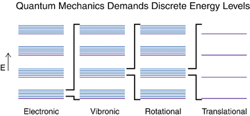
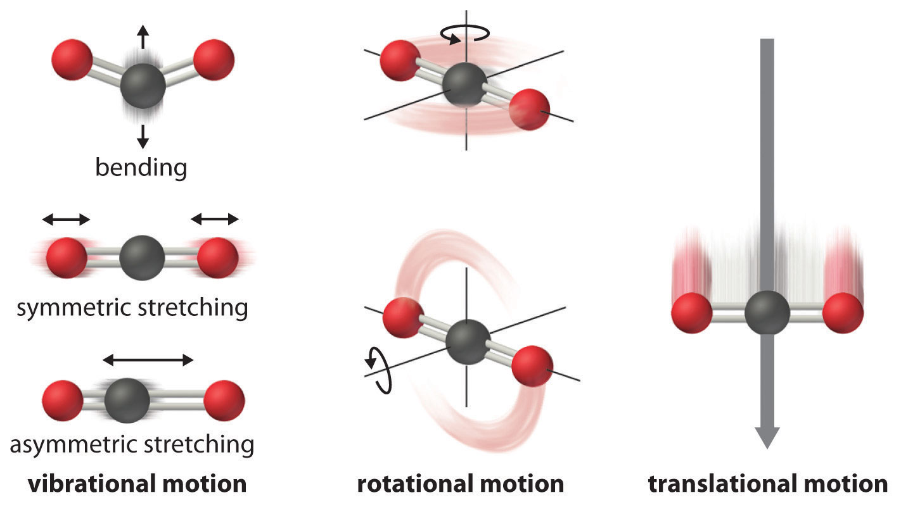

## Molecular degrees of freedom

```{admonition} What you need to know
:class: note
Having found that the energy of bound systems is quantized our next goal is to invesitaget differen tmanifestations of these quantization and ways of probing it in experiments via spectroscopy. On the example of exactly solvable simple toy systems  we will study the specifics of quantization of different **degrees of freedom (DOF)** found in molecules. Degrees of freedom of molecule fall into **translational, rotational, vibrational and electronic motion.** 

- **Particle in a box.** (quantization of translational DOF)
- **Harmonic oscillator** (quantization of vibrational DOF)
- **Rigid rotor.**  (quantization of rotational DOF)
```

###  Energies of molecules

Molecules conssiting of N nuclei and n electrons are descibed by wave functions that depends on 3(n+N) variables in 3D space.  These coordinates or degrees of freedom (DOF)  are useful to break down into different kinds of motions classified as translational, rotational, vibrational and also electronic. Due to the fact that molecules are microscopic objects we expect these energies to all be quantized. The relative spacings, however, are going to be different to a signficant extent due to boundary conditions restricting the motions of these DOFs. This is why there exists different kinds of spectrosocopies for probing the specific degrees of freedom in molecules

$$E= \epsilon_{trans}+ \epsilon_{rot}+ \epsilon_{vib}+\epsilon_{elec}$$





### 3N Nuclear degrees of freedom 

- The *Born-Oppenheimer apprpximation* allows us to separate the nuclear and electronic degrees of freedom. The nuclear hamiltonian for $N$ nuclei can be now written in such a way that the electronic part appears as a potential term:

$${\hat{H} = \sum\limits_{i=1}^{N} -\frac{\hbar^2}{2m_i}\nabla_{R_i}^2 + E(R_1, R_2, ..., R_N)}$$




- In the absence of external electric or magnetic fields, the potential term $E$ depends only on the relative positions of the nuclei, as shown above, and not on the overall position of the molecule or its orientation in space. The above hamiltonian $H$ can often be approximately written as a sum of the following terms:

$${\hat{H} = \hat{H}_{tr} + \hat{H}_{rot} + \hat{H}_{vib}}$$

where $H_{tr}$ is the translational, $H_{rot}$ the rotational, and $H_{vib}$ the vibrational hamiltonian. The translational and rotational terms have no potential part but the vibrational part contains the potential $E$, which depends on the distances between the nuclei. 

> In some cases the different degrees of freedom  become coupled and one cannot use the following separation technique. Separation of $H$ means that we can write the wavefunction as a product:

$${\psi = \psi_{tr}\psi_{rot}\psi_{vib}}$$

### Separtion of degrees of freedom

The resulting three Schr\"odinger equations are then:

$${\hat{H}_{tr}\psi_{tr} = E_{tr}\psi_{tr}}$$

$${\hat{H}_{rot}\psi_{rot} = E_{rot}\psi_{rot}}$$

$${\hat{H}_{vib}\psi_{vib} = E_{vib}\psi_{vib}}$$

- The translational part is not interesting since there is no external potential or boundary conditions that could lead to quantization (i.e., it produces a continuous spectrum). 
  
- On the other hand, the rotational part is subject to cyclic boundary condition and the vibrational part to potential $E$, hence we expect these to produce quantization, which can be probed by spectroscopic methods.

- The original number of variables in the hamiltonian is given by $3\times N$ (i.e. the $x,y,z$ coordinates for each nuclei). We can neglect the translational motion and we are left with $3N - 3$ coordinates. 
  
- To account for molecular rotation, three variables are required or if we have a linear molecule, only two variables. Therefore the vibration part must have either $3N - 6$ variables for a non-linear molecule or $3N - 5$ variables for a linear molecule. These are referred to as *vibrational degrees of freedom* or *internal coordinates*.


