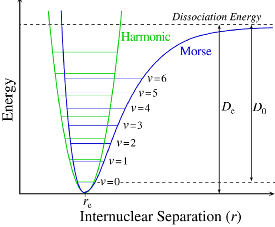
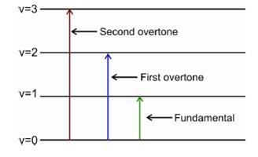
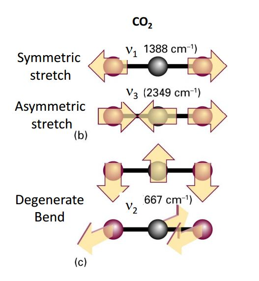
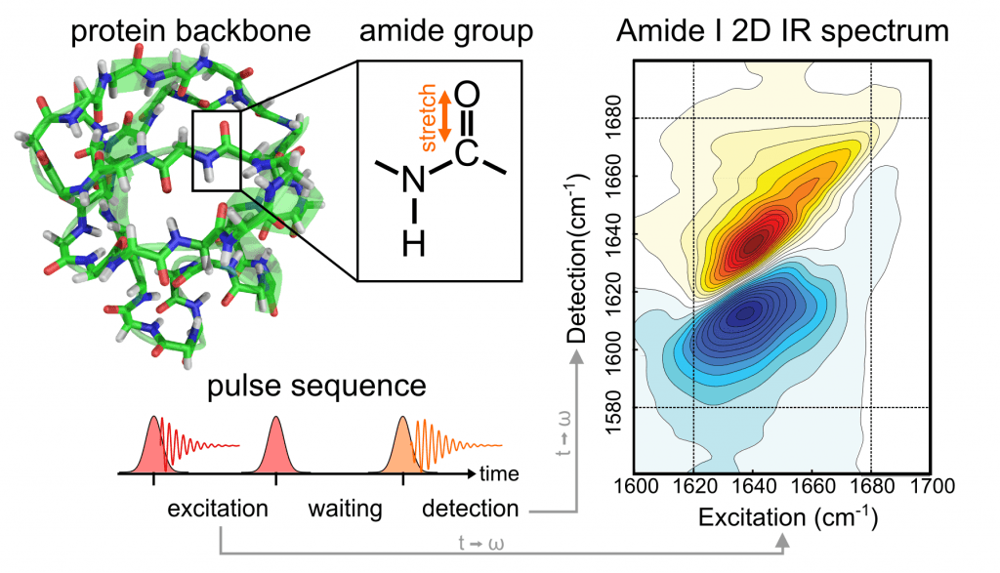

## Molecular Vibrations

:::{admonition} What you need to know
:class: note

- **Quantization of vibrations in molecules.** Vibrational degrees of freedom are quantized in molecules. This which implications for infrared and raman spectroscopies. 
- **Existence of Selection rules.** Not all vibrational transitions are observed. Quantum mechanics predicts that for transition to occur the trasnition probability needs to be non zero which is quantified via transition dipole moment.  
- **Effects of unharmonicity.** Harmonic osccilator approximation captures the dominant transition frequency but is not fully accurate becasue harmonic shape of the potential descrimed the vicinity of potential energy minima which tends to become less accurate for excited vibrational states of molecules. 
:::

### Harmonic Oscillator

- First let us write harmonic oscillator energies in a format used for spectroscopic analysis. This means converting to wavenumber units $\tilde{\nu}=\frac{1}{\lambda}$:

$${\tilde{E}_v = \frac{E_v}{hc} = \tilde{\nu}\left(v + \frac{1}{2}\right)}$$

- **The vibrational quantum number** is denoted as $v$ 
- **The vibrational frequency** expressed in wavenumber units $cm^{-1}$ units is $\tilde{\nu} = \frac{1}{2\pic}\sqrt{k/\mu}$
- **Reduced mass of the diatomic molecule** $\mu$. 

- Note that $v$ and $\nu$ look very similar but have different meaning!  A typical value for vibrational frequency would be around  $500 - 4000cm^{-1}$. Small values are associated with weak bonds whereas strong bonds have larger vibrational frequencies.

:::{admonition} **Example**
:class: note

A strong absorption of infrared radiation is observed for $1H^{35}Cl$ at $2991 cm{-1}$.

- Calculate the force constant k for this molecule
- By what factor do you expect this frequency to shift if deuterium is substituted for hydrogen in this molecule? The force constant is unaffected by this substitution.
:::

:::{admonition} **Solution**

- **part a**

$$\omega = 2\pi \nu = \frac{2\pi c}{\lambda} =\Big(\frac{k}{\mu}\Big)^{1/2}$$

$$k = \Big(\frac{2\pi c}{\lambda}\Big)^2\mu=516 N \cdot m^{-1}$$

- **part b**

$$\frac{\nu_{DCl}}{\nu_{HCL}}=\Big(\frac{\mu_{HCl}}{\mu_{DCL}}\Big)^{1/2}=0.717$$
:::

### Going beyond harmonic approximation

- Earlier when we have discussed the harmonic oscillator problem and we briefly mentioned that it can be used to approximate atom - atom interaction energy (*potential energy curve*) near the equilibrium bond length. 

- Harmonic potential would not allow for molecular dissociation and therefore it is clear that it would not be a realistic model when we are far away from the equilibrium geometry. The harmonic potential is given by:

$${E(R) = \frac{1}{2}k(R - R_e)^2}$$

-  $k$ is called the *force constant*, $R_e$ is the *equilibrium bond length*, and $R$ is the distance between the two atoms. The actual potential energy curve can be obtained from theoretical calculations or to some degree from spectroscopic experiments. 

- This curve has usually complicated form and hence it is difficult to solve the nuclear Schrodinger equation exactly for this potential. One way to see the emergence of the harmonic approximation is to look at *Taylor series expansion*:

$${E(R) = E(R_e) + \left(\frac{dE}{dR}\right)_{R = R_e}(R - R_e) + \frac{1}{2}\left(\frac{d^2E}{dR^2}\right)_{R = R_e}(R - R_e)^2 + ...}$$

:::{figure-md} markdown-fig

One has to distinguish between two kinds of dissociation energies: *equilibrium dissociation energy* $D_e$ and *spectroscopic dissociation energy* $D_0$. Show are Harmonic vs Morse potential
:::

### Morse potential and dissociation energy 

- Morse potential proisde more accurate description for molecular vibrations and predicts dissociation and changing spacing between energy levels. 

$$V(R)=D_e(1-e^{-a(R-R_e)^2})$$

- $D_e$ is measured from the bottom of the potential to the dissociation limit whereas $D_0$ is measured from the lowest vibrational level to the dissociation limit. 

$$D_0 = D_e-\frac{1}{2}h\nu$$

### Unharmonic oscillator

- We attempt to account for the deviation from the harmonic behavior by adding higher order polynomial terms $\tilde{E}_v$:

$${\tilde{E}_v = \tilde{\nu}_e(v + \frac{1}{2}) - \tilde{\nu}_ex_e(v + \frac{1}{2})^2 + \tilde{\nu}_ey_e(v + \frac{1}{2})^3}$$

- where $\tilde{\nu}_e$ is the vibrational wavenumber, $x_e$ and $y_e$ are anharmonicity constants, and $v$ is the vibrational quantum number. Usually the third term is ignored and we can write the vibrational transition frequencies as ($v\rightarrow v+1$):

$${\tilde{\nu}_{v\rightarrow v+1} = \tilde{E}_{v+1} - \tilde{E}_v = \tilde{\nu}_e[1- 2x_e  (v+1)] }$$

- As we will see soon that by adding the 2nd order polynomial term to the eigenvalues, we actually imply the use of a potential function that allows for dissociation. 

### Overtone transitions

- The higher order terms are small but they give rise to overtone transitions with $\Delta v = \pm 2, \pm 3, ...$ with rapidly decreasing intensities.

$${\tilde{\nu}_{0\rightarrow v}  = \tilde{E}_{v} - \tilde{E}_0 = \tilde{\nu}_e \cdot v - \tilde{\nu}_ex_e \cdot v (v+1)}$$

:::{admonition} **Example**
:class: note

Given  $\tilde{\nu}=536 cm^{-1}$ and $x_e\tilde{\nu}=3.4 cm^{-1}$ for $^{23}Na^{19}F$ molecule, calculate frequencies of first two overtones.
:::

:::{admonition} **Solution**
:class: note, dropdown

We make use of the equation ${\tilde{\nu}_{0\rightarrow v} = \tilde{\nu}_e \cdot v - 2\tilde{\nu}_ex_e v (v+1)}$ to compute transitions to levels 1 (fundamental), 2 (first overtone) and 3 (second overtone)

- $\tilde{\nu}_{0\rightarrow 1} = 1\tilde{\nu}_e  - 2\tilde{\nu}_ex_e= 1\cdot536-2\cdot3.4=529 cm^{-1}$
- ${\tilde{\nu}_{0\rightarrow 2} = 2\tilde{\nu}_e  - 6\tilde{\nu}_ex_e= 2\cdot536-6\cdot3.4}=1059 cm^{-1}$
- ${\tilde{\nu}_{0\rightarrow 3} = 3\tilde{\nu}_e  - 12\tilde{\nu}_ex_e= 3\cdot536-12\cdot3.4}=1567 cm^{-1}$
:::

### Population of vibrational states

- Out of all possible vibrational states which states do molecules occupy at room temperature? For harmonic oscillator, the Boltzmann distribution  gives the statistical weight for the $v$ level:

$${f_v = \frac{e^{-(v + 1/2)h\nu/(k_BT)}}{\sum\limits_{v=0}^\infty e^{-(v+1/2)h\nu/(k_BT)}}}
{= \frac{e^{-vh\nu/(k_BT)}}{\sum\limits_{v=0}^\infty e^{-vh\nu/(k_BT)}}}$$

- Note that the degeneracy factor is identically one because there is no degeneracy in one dimensional harmonic oscillator. To proceed, we recall geometric series:

$${\sum\limits_{v=0}^\infty x^v = \frac{1}{1 - x}\textnormal{ with }x < 1}$$

$${\sum\limits_{v=0}^\infty e^{-vh\nu/(k_BT)} = \frac{1}{1 - e^{-h\nu/(k_BT)}}}$$

$${f_v = \left(1 - e^{-h\nu/(k_BT)}\right)e^{-vh\nu/(k_BT)}}$$

- For example, for $H^{35}Cl$ the thermal population of the first vibrational level $v = 1$ is very small about $9\times$ $10^{-7}$.
-  **This is why generally the excited vibrational levels do not contribute to the (IR) spectrum.**

### Vibrational modes of molecules

A molecule has translational and rotational motion as a whole while each atom has it's own motion. The vibrational modes can be IR or Raman active. For a mode to be observed in the IR spectrum, changes must occur in the permanent dipole (i.e. not diatomic molecules). Diatomic molecules are observed in the Raman spectra but not in the IR spectra. This is due to the fact that diatomic molecules have one band and no permanent dipole, and therefore one single vibration. An example of this would be $O_2$ or $N_2$.

:::{figure-md} markdown-fig

Normal modes of $CO_2$ with associated vibrational frequencies
:::

- However, unsymmetric diatomic molecules (i.e. CN do absorb in the IR spectra. Polyatomic molecules undergo more complex vibrations that can be summed or resolved into normal modes of vibration. The normal modes of vibration are: asymmetric, symmetric, wagging, twisting, scissoring, and rocking for polyatomic molecules.

### Calculating number of modes

- The degrees of vibrational modes for linear molecules can be calculated using the formula:

$$3N−5$$
 
- The degrees of freedom for nonlinear molecules can be calculated using the formula:

$$3N−6$$

- Determine if the molecule is linear or nonlinear (i.e. Draw out molecule using VSEPR). If linear, use Equation 1 If nonlinear, use Equation 2
Calculate how many atoms are in your molecule. This is your N value.
Plug in your N value and solve.

### Selection rules

- Selection rules in spectroscopy are fundamental principles that dictate whether a transition is allowed or forbidden during the absorption or emission of electromagnetic radiation, such as infrared (IR) or Raman spectroscopy. The origins of these rules lie in the quantum mechanical description of molecular vibrations and the interactions of molecules with electromagnetic radiation.

- Molecular symmetry plays a crucial role in determining the allowed transitions.
Symmetry considerations, especially in molecules, come from group theory, which helps in predicting whether a certain vibrational mode will be IR or Raman active.

- Not all diatomic molecules have vibrational absorption spectrum. To see this, we have to calculate the electric dipole transition moment. We will learn more about whu To proceed, we expand $\mu_0^{(e)}$ in a Taylor series about $R = R_e$:

$${\mu_0^{(e)}(R) = \mu_e + \left(\frac{\partial\mu}{\partial R}\right)_{R = R_e}(R - R_e) + \frac{1}{2}\left(\frac{\partial^2\mu}{\partial R^2}\right)_{R = R_e}(R - R_e)^2 + ...}$$

- Next we integrate over the vibrational degrees of freedom and obtain:

$${\int\psi^*_{v''}\mu_0\psi_{v'}dR = \mu_e\int\psi^*_{v''}\psi_{v'}dR + \left(\frac{\partial\mu}{\partial R}\right)_{R = R_e}\int\psi_{v''}^*(R - R_e)\psi_{v'}dR\hspace*{0.1cm}}\\
{ + \frac{1}{2}\left(\frac{\partial^2\mu}{\partial R^2}\right)_{R = R_e}\int\psi_{v''}^*(R - R_e)^2\psi_{v'}dR + ...}$$

- The first term above is zero since the vibrational eigenfunctions are orthogonal. The second term is nonzero if the dipole moment depends on the internuclear distance $R$. Therefore we conclude that the selection rule for pure vibrational transition is that the dipole moment must change as a function of $R$. 

### Application of selection rules

:::{figure-md} markdown-fig

Example of 2D IR spectorsocpy used to study protein by detecting amide group $C=0$ vibrations in different parts of the molecules.
:::

- All homonuclear diatomic molecules (e.g., $H_2$, $O_2$, etc.) have zero dipole moment, which cannot change as a function of $R$. Hence these molecules do not show vibrational spectra. 
- In general, all molecules that have dipole moment have vibrational spectra as change in $R$ also results in change of dipole moment. We still have the integral present in the second term. 
- For harmonic oscillator wavefunctions, this integral is zero unless $v'' = v'\pm 1$ . This provides an additional selection rule, which says that the vibrational quantum number may either decrease or increase by one.

### IR spectra

:::{figure-md} markdown-fig

IR spectral frequencies observed due to different vibrational frequencies of bonds in organic molecules. 
:::

:::{figure-md} markdown-fig

Example of 2D IR spectorsocpy used to study protein by detecting amide group $C=0$ vibrations in different parts of the molecules.
:::

