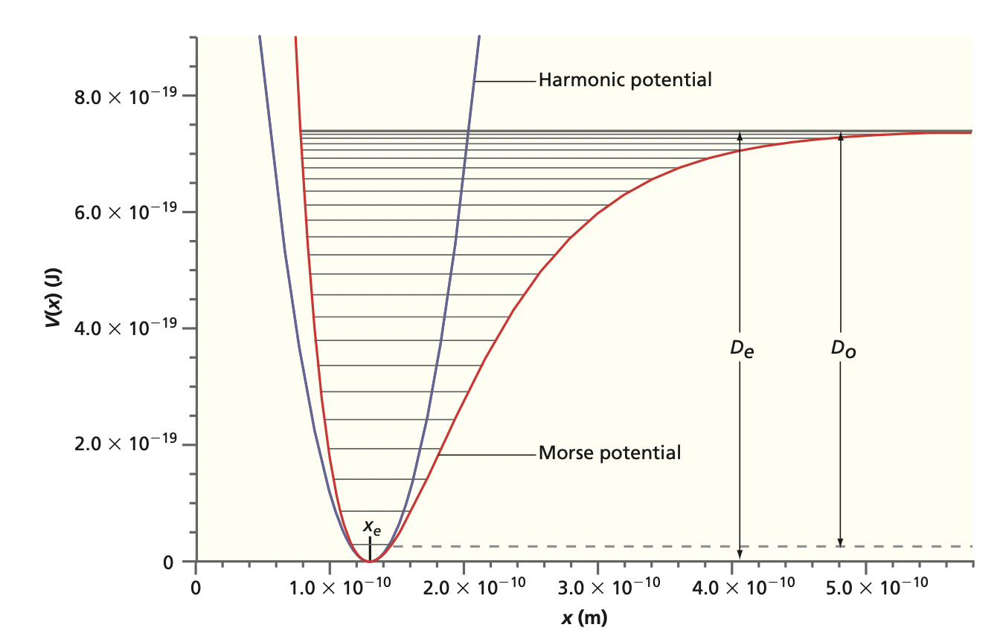

## Vibrational spectra of diatomic molecules 

:::{admonition} What you need to know
:class: note
- **Quantization of vibrations in molecules.** Vibrational degrees of freedom are quantized which has implications for infrared and raman spectroscopies and bonding. 
- **Existence of Selection rules.** Not all transitions are possible. Quantum mechanics predicts that for transition to occur the transition dipole moment needs to be finite.  
- **Effects of unharmonicity.** We will see the impact on energy levels of harmonic oscillators when one goes beyond harmonic approximation. 
:::

### Harmonic Oscillator

- First let us write harmonic oscillator energies in a format used for spectroscopic analysis. This means converting to wavenumber units:

$${\tilde{E}_v = \frac{E_v}{hc} = \tilde{\nu}\left(v + \frac{1}{2}\right)}$$

- The $v$ is the vibrational quantum number, the vibrational frequency $\nu = \frac{1}{2\pi}\sqrt{k/\mu}$ and $\mu$ is the reduced mass of the diatomic molecule. Note that $v$ and $\nu$ look very similar but have different meaning! This can be expressed in wavenumber units as:

- A typical value for vibrational frequency would be around 500 - 4000 $cm^{-1}$.Small values are associated with weak bonds whereas strong bonds have larger vibrational frequencies.

:::{admonition} **Example**
:class: note

A strong absorption of infrared radiation is observed for 1H^{35}Cl at 2991 cm{-1}.

- Calculate the force constant k for this molecule
- By what factor do you expect this frequency to shift if deuterium is substituted for hydrogen in this molecule? The force constant is unaffected by this substitution.
:::

:::{admonition} **Solution**

- **part a**

$$\omega = 2\pi \nu = \Big(\frac{k}{\mu}\Big)^{1/2}$$

$$\Delta E = h\nu = \frac{hc}{\lambda}=\hbar \Big(\frac{k}{\mu}\Big)^{1/2}$$

$$k = 4\pi^2 \Big(\frac{c}{\lambda}\Big)^2=516 N \cdot m^{-1}$$

- **part b**

$$\frac{\nu_{DCl}}{\nu_{HCL}}=\Big(\frac{\mu_{HCl}}{\mu_{DCL}}\Big)^{1/2}=0.717$$
:::

### Going beyond harmonic approximation

- Earlier when we have discussed the harmonic oscillator problem and we briefly mentioned that it can be used to approximate atom - atom interaction energy (*potential energy curve*) near the equilibrium bond length. 

- Harmonic potential would not allow for molecular dissociation and therefore it is clear that it would not be a realistic model when we are far away from the equilibrium geometry. The harmonic potential is given by:

$${E(R) = \frac{1}{2}k(R - R_e)^2}$$

-  $k$ is called the *force constant*, $R_e$ is the *equilibrium bond length*, and $R$ is the distance between the two atoms. The actual potential energy curve can be obtained from theoretical calculations or to some degree from spectroscopic experiments. 

- This curve has usually complicated form and hence it is difficult to solve the nuclear Schrodinger equation exactly for this potential. One way to see the emergence of the harmonic approximation is to look at *Taylor series expansion*:

$${E(R) = E(R_e) + \left(\frac{dE}{dR}\right)_{R = R_e}(R - R_e) + \frac{1}{2}\left(\frac{d^2E}{dR^2}\right)_{R = R_e}(R - R_e)^2 + ...}$$

### Selection rules

- Selection rules in spectroscopy are fundamental principles that dictate whether a transition is allowed or forbidden during the absorption or emission of electromagnetic radiation, such as infrared (IR) or Raman spectroscopy. The origins of these rules lie in the quantum mechanical description of molecular vibrations and the interactions of molecules with electromagnetic radiation.

- Molecular symmetry plays a crucial role in determining the allowed transitions.
Symmetry considerations, especially in molecules, come from group theory, which helps in predicting whether a certain vibrational mode will be IR or Raman active.

- Not all diatomic molecules have vibrational absorption spectrum. To see this, we have to calculate the electric dipole transition moment. We will learn more about whu To proceed, we expand $\mu_0^{(e)}$ in a Taylor series about $R = R_e$:

$${\mu_0^{(e)}(R) = \mu_e + \left(\frac{\partial\mu}{\partial R}\right)_{R = R_e}(R - R_e) + \frac{1}{2}\left(\frac{\partial^2\mu}{\partial R^2}\right)_{R = R_e}(R - R_e)^2 + ...}$$

Next we integrate over the vibrational degrees of freedom and obtain:

$${\hspace*{-1cm}\int\psi^*_{v''}\mu_0\psi_{v'}dR = \mu_e\int\psi^*_{v''}\psi_{v'}dR + \left(\frac{\partial\mu}{\partial R}\right)_{R = R_e}\int\psi_{v''}^*(R - R_e)\psi_{v'}dR\hspace*{0.1cm}}\\
{ + \frac{1}{2}\left(\frac{\partial^2\mu}{\partial R^2}\right)_{R = R_e}\int\psi_{v''}^*(R - R_e)^2\psi_{v'}dR + ...}$$

- The first term above is zero since the vibrational eigenfunctions are orthogonal. The second term is nonzero if the dipole moment depends on the internuclear distance $R$. Therefore we conclude that the selection rule for pure vibrational transition is that the dipole moment must change as a function of $R$. 
- All homonuclear diatomic molecules (e.g., $H_2$, $O_2$, etc.) have zero dipole moment, which cannot change as a function of $R$. Hence these molecules do not show vibrational spectra. 
- In general, all molecules that have dipole moment have vibrational spectra as change in $R$ also results in change of dipole moment. We still have the integral present in the second term. 
- For harmonic oscillator wavefunctions, this integral is zero unless $v'' = v'\pm 1$ . This provides an additional selection rule, which says that the vibrational quantum number may either decrease or increase by one.

### Unharmonic oscillator

We attempt to account for the deviation from the harmonic behavior by adding higher order polynomial terms $\tilde{E}_v$:

$${\tilde{E}_v = \tilde{\nu}_e(v + \frac{1}{2}) - \tilde{\nu}_ex_e(v + \frac{1}{2})^2 + \tilde{\nu}_ey_e(v + \frac{1}{2})^3}$$

where $\tilde{\nu}_e$ is the vibrational wavenumber, $x_e$ and $y_e$ are anharmonicity constants, and $v$ is the vibrational quantum number. Usually the third term is ignored and we can write the vibrational transition frequencies as ($v\rightarrow v+1$):

$${\tilde{\nu}(v) = \tilde{E}_{v+1} - \tilde{E}_v = \tilde{\nu}_e - 2\tilde{\nu}_ex_e(v+1)}$$

As we will see soon that by adding the 2nd order polynomial term to the eigenvalues, we actually imply the use of a potential function that allows for dissociation. 

### Overtone transitions

The higher order terms are small but they give rise to overtone transitions with $\Delta v = \pm 2, \pm 3, ...$ with rapidly decreasing intensities.

For harmonic oscillator, the Boltzmann distribution  gives the statistical weight for the $v$ level:

$${f_v = \frac{e^{-(v + 1/2)h\nu/(k_BT)}}{\sum\limits_{v=0}^\infty e^{-(v+1/2)h\nu/(k_BT)}}}
{= \frac{e^{-vh\nu/(k_BT)}}{\sum\limits_{v=0}^\infty e^{-vh\nu/(k_BT)}}}$$

Note that the degeneracy factor is identically one because there is no degeneracy in one dimensional harmonic oscillator. To proceed, we recall geometric series:

$${\sum\limits_{v=0}^\infty x^v = \frac{1}{1 - x}\textnormal{ with }x < 1}$$

The denominator now gives:

$${\sum\limits_{v=0}^\infty e^{-vh\nu/(k_BT)} = \frac{1}{1 - e^{-h\nu/(k_BT)}}}$$

Further simplifying we obtain:

$${f_v = \left(1 - e^{-h\nu/(k_BT)}\right)e^{-vh\nu/(k_BT)}}$$

For example, for $H^{35}Cl$ the thermal population of the first vibrational level $v = 1$ is very small ($9\times$ $10^{-7}$) and therefore the excited vibrational levels do not contribute to the (IR) spectrum.

### On dissociation energy

- One has to distinguish between two kinds of dissociation energies: *equilibrium dissociation energy* $D_e$ and *spectroscopic dissociation energy* $D_0$. 

- $D_e$ is measured from the bottom of the potential to the dissociation limit whereas $D_0$ is measured from the lowest vibrational level to the dissociation limit. The meaning of these two quantities is demonstrated below.

The ground vibrational level energy is given by:

$${\tilde{E}_0 = \frac{\tilde{\nu}_e}{2} - \frac{\tilde{\nu}_ex_e}{4} + \frac{\tilde{\nu}_ey_e}{8}}$$

And therefore the difference between $D_0$ and $D_e$ is:

$${\tilde{D}_e - \tilde{D}_0 = \tilde{E}_0}$$

When starting from the lowest vibrational level ($v = 0$), the observed absorption frequencies for $v' = 1,2,3...$ are given by:

$${\tilde{\nu}(v') = \tilde{E}_{v'} - \tilde{E}_0 = \tilde{\nu}_ev' - \tilde{\nu}_ex_ev'(v'+1)}$$

Note that sometimes the frequency $\nu$ may be expressed as angular frequency $\omega$. The relationship between the two is just a constant factor:
$\omega = 2\pi\nu$. To convert these to energy, one must use either $E = h\nu$ or $E = \hbar\omega$.

