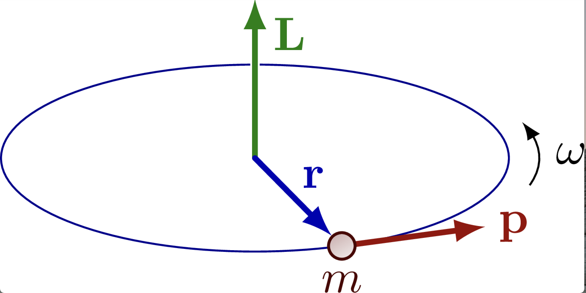
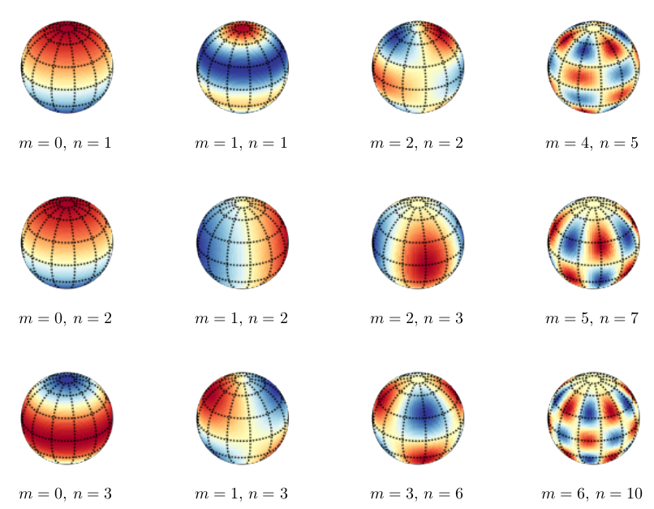

## Angular momentum  

```{admonition} What you need to know
:class: note
- Angular momentum plays a central role in both classical and quantum mechanics. In classical mechanics, all isolated systems conserve angular momentum (as well as energy and linear momentum); this fact reduces considerably the amount of work required in calculating trajectories of planets, rotation of rigid bodies, and many more. 
- Similarly, in quantum mechanics, angular momentum plays a central role in understanding the structure of atoms, as well as other quantum problems that involve rotational symmetry. Like other observable quantities, angular momentum is described in QM by an operator. This is in fact a vector operator, similar to momentum operator. However, contrary to the linear momentum operator, the three components of the angular momentum operator do not commute!
- In QM, there are several angular momentum operators: the total angular momentum (usually denoted by $J$), the orbital angular momentum (usually denoted by $L$ ) and the intrinsic, or spin angular momentum (denoted by $S$). This spin has no classical analogue! Confusingly, the term “angular momentum” can refer to either the total angular momentum, or to the orbital angular momentum.
```

### L vs p Overview


| Property                  | Linear Momentum              | Angular Momentum             |
|---------------------------|-----------------------------|------------------------------|
| Symbol                    | $p$                        | $L$                        |
| Nature                    | Linear motion in a straight line | Rotational motion around an axis |
| CM formula               | $p = m \cdot v$            | $L = I \cdot \omega$        |
| QM operators              | $\hat{p_x}=-i\hbar\frac{\partial}{\partial x}$           | ${\hat{L_x} = yp_z - zp_y}$           |
| Conservation Principle    | Law of Conservation of Linear Momentum | Law of Conservation of Angular Momentum |
| Conservation Condition    | No net external force acting on a closed system | No net external torque acting on a closed system |


### Classical angular momentum 



- In classical mechanics, the  [angular momentum](http://en.wikipedia.org/wiki/Angular_momentum) is defined as:

$${\vec{L} = \vec{r}\times \vec{p} = \vec{r}\times(m\vec{v})}$$

- Where $\vec{L} = (L_x,L_y,L_z)$, ${\vec{r} = (x,y,z)}$ is the position and ${\vec{p} = \left(p_x, p_y, p_z\right)}$ the velocity of the mass $m$. To evaluate the [cross](http://en.wikipedia.org/wiki/Cross_product), we write down the Cartesian components:

- The cross product is convenient to write using a [determinant](http://en.wikipedia.org/wiki/Determinant):

$${\vec{L} = \vec{r}\times\vec{p} =
\begin{vmatrix}
\vec{i} & \vec{j} & \vec{k}\\
x & y & z\\
p_x & p_y & p_z\\
\end{vmatrix}= \left(yp_z - zp_y\right)\vec{i} + \left(zp_x - xp_z\right)\vec{j} + \left(xp_y - yp_x\right)\vec{k}}$$

- where $\vec{i}, \vec{j}$ and $\vec{k}$ denote [unit vectors](http://en.wikipedia.org/wiki/Unit_vector) along the $x, y$ and $z$ axes. The Cartesian components can be identified as:

$${L_x = yp_z - zp_y}$$

$${L_y = zp_x - xp_z}$$

$${L_z = xp_y - yp_x}$$

- The square of the angular momentum is given by:

$${\vec{L}^2 = \vec{L}\cdot\vec{L} = L_x^2 + L_y^2 + L_z^2}$$


### Cartesian to polar converter 

Since we are going to work in spherical coordinate system we need to know how operators look in differnet cooridnate systems

**Laplacian**

::::{tab-set} 
:::{tab-item} Cartesian

$$
\nabla^2 = \frac{{\partial^2}}{{\partial x^2}} + \frac{{\partial^2}}{{\partial y^2}} + \frac{{\partial^2}}{{\partial z^2}}
$$

:::

:::{tab-item} Polar
$$
\nabla^2 = \frac{1}{{r^2}} \frac{{\partial}}{{\partial r}} \left(r^2 \frac{{\partial}}{{\partial r}}\right) + \frac{1}{{r^2 \sin(\phi)}} \frac{{\partial}}{{\partial \theta}} \left(\sin(\phi) \frac{{\partial}}{{\partial \theta}}\right) + \frac{1}{{r^2 \sin^2(\phi)}} \frac{{\partial^2}}{{\partial \phi^2}}
$$
:::
::::


**Volume Element**
::::{tab-set} 
:::{tab-item} Cartesian

$$
dV = dxdydz
$$

:::

:::{tab-item} Polar
$$
dV = r^2 \sin(\phi) \, dr \, d\theta \, d\phi
$$
:::
::::

### Quantum angular momentum 

- In quantum mechanics, the classical angular momentum is replaced by the corresponding
quantum mechanical operator (see the previous ``classical - quantum'' correspondence
table). 

- In [spherical coordinates](http://en.wikipedia.org/wiki/Spherical_coordinate_system), the angular momentum operators can be written in the following form (derivations are quite tedious but just math). Note that the choice of $z$-axis (``quantization axis'') here was arbitrary. Sometimes the physical system implies such axis naturally (for example, the direction of an external magnetic field). 


::::{tab-set} 
:::{tab-item} Cartesian

$${\hat{L}_x = -i\hbar\left(y\frac{\partial}{\partial z} - z\frac{\partial}{\partial y}\right)}$$

$${\hat{L}_y = -i\hbar\left(z\frac{\partial}{\partial x} - x\frac{\partial}{\partial z}\right)}$$

$${\hat{L}_z = -i\hbar\left(x\frac{\partial}{\partial y} - y\frac{\partial}{\partial x}\right)}$$

:::

:::{tab-item} Polar
$${\hat{L}_x = i\hbar\left(\sin(\phi)\frac{\partial}{\partial\theta} + \cot(\theta)\cos(\phi)\frac{\partial}{\partial\phi}\right)}$$

$${\hat{L}_y = i\hbar\left(-\cos(\phi)\frac{\partial}{\partial\theta} + \cot(\theta)\sin(\phi)\frac{\partial}{\partial\phi}\right)}$$

$${\hat{L}_z = -i\hbar\frac{\partial}{\partial\phi}}$$

$${\vec{\hat{L}}^2 = -\hbar^2\underbrace{\left[\frac{1}{\sin(\theta)}\frac{\partial}{\partial\theta}\left(\sin(\theta)\frac{\partial}{\partial\theta}\right) + \frac{1}{\sin^2(\theta)}\frac{\partial^2}{\partial\phi^2}\right]}_{\equiv \Lambda^2}}$$
:::
::::


### Commutation relations

The following commutation relations can be shown to hold:

$$
{\left[\hat{L}_x,\hat{L}_y\right] = i\hbar\hat{L}_z, \left[\hat{L}_y,\hat{L}_z\right] = i\hbar\hat{L}_x,\left[\hat{L}_z,\hat{L}_x\right] = i\hbar\hat{L}_y} \\
{\left[\hat{L}_x,\vec{\hat{L}}^2\right] = \left[\hat{L}_y,\vec{\hat{L}}^2\right] = \left[\hat{L}_z,\vec{\hat{L}}^2\right] = 0}
$$


- Note that equations imply that it is not possible to measure any of the Cartesian angular momentum pairs simultaneously with an infinite precision (the Heisenberg uncertainty relation).

### Eignefunctins and eigenvalues of $L$ and $L_z$

It is possible to find functions that are eigenfunctions of both $\vec{\hat{L}}^2$ and $\hat{L}_z$. It can be shown that for $\vec{\hat{L}}^2$ the eigenfunctions and eigenvalues are:

$$\boxed{\vec{\hat{L}}^2\psi_{l,m}(\theta,\phi) = l(l+1)\hbar^2\psi_{l,m}(\theta,\phi)}$$

$$\boxed{\hat{L}_zY^m_l(\theta,\phi) = m\hbar Y_l^m(\theta,\phi)}$$

- **Wavefunction:** $\psi_{l,m} = Y_l^m(\theta,\phi)$
- **Angular quantum number:** $l = 0,1,2,3...$ 
- **Magnetic quantum number:** $|m| = 0,1,2,3,...l$


- These eigenvalues are often denoted by $L_z$ ($= m\hbar$). Note that specification of both $L^2$ and $L_z$ provides all the information we can have about the system.

- Note that here $m$ has nothing to do with magnetism but the name originates from the fact that (electron or nuclear) spins follow the same laws of angular momentum. 
- Functions $Y_l^m$ are called [spherical harmonics](http://en.wikipedia.org/wiki/Spherical_harmonics). Examples of spherical harmonics with various values of $l$ and $m$ are given below (with [Condon-Shortley](http://en.wikipedia.org/wiki/Spherical_harmonics\#Condon-Shortley_phase)  [phase convention](http://en.wikipedia.org/wiki/Spherical_harmonics\#Condon-Shortley_phase)


### Spherical harmonics

| $Y_{lm}(\theta, \phi)$ | Expression |
|-----------------------|------------|
| $Y_{00}(\theta, \phi)$ | $\frac{1}{\sqrt{4\pi}}$ |
| $Y_{10}(\theta, \phi)$ | $\sqrt{\frac{3}{4\pi}} \cos(\theta)$ |
| $Y_{1-1}(\theta, \phi)$ | $\sqrt{\frac{3}{4\pi}} \sin(\theta) e^{-i\phi}$ |
| $Y_{20}(\theta, \phi)$ | $\sqrt{\frac{5}{16\pi}} (3\cos^2(\theta) - 1)$ |
| $Y_{2-1}(\theta, \phi)$ | $\sqrt{\frac{15}{4\pi}} \sin(\theta) \cos(\theta) e^{-i\phi}$ |
| $Y_{2-2}(\theta, \phi)$ | $\sqrt{\frac{15}{4\pi}} \sin^2(\theta) e^{-2i\phi}$ |

- The functions $Y_{J,m}(\theta,\phi)$ are spherical harmonics that frequently occur in problems with spherical symmetry as the convenient basis of expansion. Spherical harmonics are important in many theoretical and practical applications, e.g., the representation of multipole electrostatic and electromagnetic fields, computation of [atomic orbital](https://en.wikipedia.org/wiki/Atomic_orbital) [electron configurations](https://en.wikipedia.org/wiki/Electron_configuration), representation of gravitational fields,  MRI imaging for streamline tractography, and the magnetic fields of planetary bodies and stars.



- Spherical harmonics consist of associated Legendre polynomials ($\theta$ part) and complex exponential ($\phi$ part). In and physical science, [spherical harmonics](https://en.wikipedia.org/wiki/Spherical_harmonics) are defined on the surface of a sphere. The spherical harmonics are a complete set of on the sphere, and thus may be used to represent functions defined on the surface of a sphere, just as circular functions (sines and cosines) are used to represent functions on a circle via [Fourier series](https://en.wikipedia.org/wiki/Fourier_series). Like the sines and cosines in the Fourier series, the spherical harmonics may be organized by (spatial) angular frequency. 

The following relations are useful when working with spherical harmonics:

**Orthogonality**
$${\int\limits_0^{\pi}\int\limits_0^{2\pi}Y_{l'}^{m'*}(\theta,\phi)Y_l^m(\theta,\phi)\sin(\theta)d\theta d\phi = \delta_{l,l'}\delta_{m,m'}}$$

**Triple product**
$${\int\limits_0^{\pi}\int\limits_0^{2\pi}Y^{m''*}_{l''}(\theta,\phi)Y_{l'}^{m'}(\theta,\phi)Y_l^m(\theta,\phi)\sin(\theta)d\theta d\phi = 0}$$

$${\textnormal{unless }m'' = m + m'\textnormal{ and a triangle with sides }l, l', l''\textnormal{ can be formed:}} \\
{l''^2 = l^2 + l'^2 - 2ll'\cos(\alpha)\textnormal{ with some value of }\alpha\textnormal{ }(\left|\cos(\alpha)\right|\le 1)}\\
{Y^{m*}_l = (-1)^mY^{-m}_l\textnormal{ (Condon-Shortley)}}$$


### Visualizing spherical harmonics 

Mathematically, the spherical harmonics contain alternating odd and even pairs of Legendre polynomials similar to Hermite polynomials. Visually, the spherical harmonics clearly show nodal lines with increasing quantum numbers, a pattern that we have seen on the examples of a particle in a box and harmonic oscillator. Using the symmetry argument, one can already tell that the product of any two different spherical harmonics integrated over the sphere will be zero!


