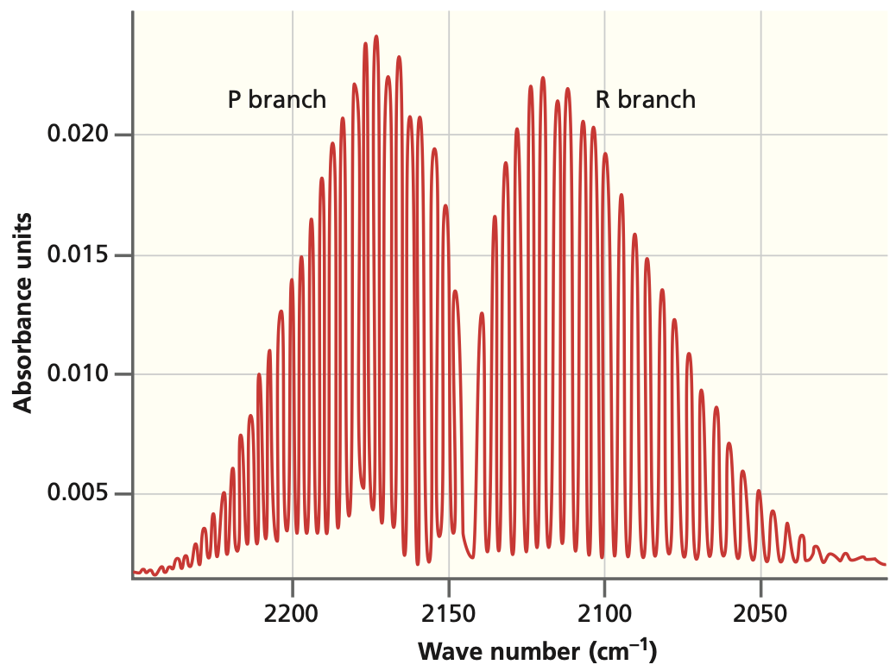

## Rigid Rotor  

:::{admonition} What You Need to Know
:class: note

- The **rigid rotor model** serves as a prototype for understanding the quantization of rotational degrees of freedom in molecules. We use a spherical coordinate system to exploit the spherical symmetry of the problem, effectively reducing the system's dimensionality.

- Solving the Schrödinger equation in spherical coordinates yields eigenfunctions in the form of **spherical harmonics**. The resulting energy eigenvalues exhibit degeneracy with respect to one of the quantum numbers.

- To compute **rotational spectra**, the **moment of inertia** of the molecule must be known. For diatomic molecules, this is simply $I = \mu r^2 $, where $\mu $ is the reduced mass and $r $ is the bond distance. For polyatomic molecules, the calculation is more complex, as it must account for the spatial distribution of mass.

- **Microwave spectroscopy** is directly connected to this model, with spectral lines predicted to occur at equal intervals of $2\tilde{B} $.

- The **selection rule** is established through the recursion relation of spherical harmonics and requires $\Delta J = \pm 1 $ and $\Delta M_J = 0, \pm 1 $.

- **Coupling with vibrational modes** leads to rovibronic transitions, necessitating the inclusion of vibrational quantum numbers for a comprehensive description of transition frequencies.

- Rotational motion can cause slight changes in bond length, known as the **centrifugal distortion effect**. This effect can be accounted for by adding a centrifugal correction term to the rigid rotor model.

:::

### Quantum rigid rotor and angular momentum operator 

- The hamiltonian for the rigid rotor model is the kinetic energy operator of an effective mass $\mu$ wchih rotates around sphere of radius $r=const$. 

- To incorporate constraint $r=const$ it is more convenient to adopt spherical coordinates $(x,y,z)\rightarrow (r,\theta,\phi)$. To the full laplacian in spherical coordinates is:

- In spherical coordinates Hamitlonian is more conveniently expressed in terms of angular momentum operator as opposed to linear momentum operator:

$$
\hat{H}=-\frac{\hbar^2}{2\mu}\nabla_{x,y,z}^2 = -\frac{\hbar^2}{2\mu r^2}\nabla_{\theta,\phi}^2=\frac{\hat{L}^2}{2I}
$$

- Where $I=\mu r^2$ is the moment of inertia and where identified  the angular momentum operator as:

$$
\hat{L}= -i\hbar \nabla_{\theta,\phi}
$$

### Quantum numbers $(J,M_J)$ for quantizing $(\theta,\phi)$ coordiante pair. 

- Having written down hamitlonain we now solve it anticipating two quantum numbers for two coordinates. 

- The eigenfunctions turn out to be well known special functions called spherical harmonics $Y(\theta,\phi)$:

$$
\hat{H}Y(\theta, \phi)=E_{J,m}Y(\theta,\phi)
$$

- We are once again able to separat two angular variables and solve the resulting ODE exactly. 
- We expect energy to depend on two quantum numbers $J$ and $M_J$ which quantize roational motion acorss $\theta$ and $\phi$ angles. 

### Rotational states of molecules are quantized

:::{admonition} **Eigenvalues of Rotational States**
:class: important

$$
E_J = \frac{\hbar^2}{2I}J(J+1) = BJ(J+1)
$$

* The **rotational constant** (has units of energy) is defined 

$$
B = \frac{h^2}{8\pi^2 I},
$$
  
:::

* Solving the rigid rotor problem reveals that **rotational energy eigenvalues depend only on the quantum number $J$**. 
* Each energy level is therefore **$(2J + 1)$-fold degenerate**, corresponding to the allowed values of the magnetic quantum number $M_J$.

* The **quantization** of rotational motion arises from the **cyclic boundary condition** rather than from any potential energy term (which is zero for a free rotor).

  $$
  \Phi(0) = \Phi(2\pi),
  $$

* There is **no rotational zero-point energy**, since the $J = 0$ state is allowed.

* The **ground-state rotational wavefunction** corresponds to an isotropic distribution—equal probability for all orientations.

:::{admonition} **Example**

What are the reduced mass and moment of inertia of $H^{35}Cl$? The equilibrium internuclear distance $R_e$ is 127.5 pm. What are the values of $L, L_z$ and $E$ for the state with $J = 1$? The atomic masses are: $m_H = 1.673470 \cdot 10^{-27}$ kg and $m_{Cl} = 5.806496 \cdot 10^{-26}$ kg.
:::

:::{admonition} **Solution**
:class: note, dropdown

First we calculate the reduced mass:

$$\mu = \frac{m_{\textnormal{H}}m_{^{35}\textnormal{Cl}}}{m_{\textnormal{H}} + m_{^{35}\textnormal{Cl}}} = \frac{(1.673470\times 10^{-27}\textnormal{ kg})(5.806496\times 10^{-26}\textnormal{ kg})}{(1.673470\times 10^{-27}\textnormal{ kg}) + (5.806496\times 10^{-26}\textnormal{ kg})}$$
$$= 1.62665\times 10^{-27}\textnormal{ kg}$$

$$I = \mu R_e^2 = (1.626\times 10^{-27}\textnormal{ kg})(127.5\times 10^{-12}\textnormal{ m})^2 = 2.644\times 10^{-47}\textnormal{ kg m}^2$$

$L$ and $Lz$ are given by eigenvalue expressions of the respective operators:

$$L = \sqrt{J(J+1)}\hbar = \sqrt{2}\left(1.054\times 10^{-34}\textnormal{ Js}\right) = 1.491\times 10^{-34}\textnormal{ Js}$$

$$L_z = -\hbar,0,\hbar\textnormal{ (three possible values)}$$

Energy of the $J = 1$ level is given by the eiganvalue expression of Hamiltonian:

$$E = \frac{\hbar^2}{2I}J(J+1) = \frac{\hbar^2}{I} = 4.206\times 10^{-22}\textnormal{ J} = 21\textnormal{ cm}^{-1}$$

This rotational spacing can be, for example, observed in gas phase infrared spectrum of HCl.
:::

### Rotational spectra of diatomic molecules

- We assume that the molecule is a rigid rotor, which means that the molecular geometry does not change during molecular rotation. We have solved this problem already 

- Energies are typically expressed in wavenumber units ($cm^{-1}$ although the basic SI unit is $m^{-1}$) by dividing $E$ by $hc$. The use of wavenumber units is denoted by including a tilde sign above the variable (e.g., $\tilde{\nu}$). The rotational energies expressed in wavenumbers are given by:

:::{admonition} **Rotaitonal energies in spectroscopic units**
:class: important

$${\tilde{E}_r(J) = \frac{E_r}{hc} = \tilde{B} J(J+1)}$$

:::

- Where the *rotational constant* is usually expressed in $cm^{-1}$ units and is given by:

$${\tilde{B} = \frac{h}{8\pi^2Ic}}$$

### Selection rules 

:::{admonition} **Selection rules for rigid rotor model**
:class: important

$$\boxed{\Delta J = J' - J = \pm 1}$$

- The molecule must posess permanent dipole moment!
- $\Delta J =0$ transitions are forbidden
:::

- Since photons have one unit of angular momentum, the above rule can be understood in terms of angular momentum transfer. The transition frequencies between the rotational levels are given by ($J = 0,1,2,...$):

### Spectral lines and rotational constant determination 

$${\tilde{\nu_J} = \tilde{E}_r(J + 1) - \tilde{E}_r(J) = \left((J+1)(J+2) - J(J+1)\right)\tilde{B} = 2\tilde{B}(J+1)}$$

:::{admonition} **Spacing of adjacent spectral lines**
:class: important

$$\tilde{\nu}_{J+1} - \tilde{\nu_J} = 2\tilde{B}$$

:::

- The successive line positions in the rotational spectrum are given by $2\tilde{B}, 4\tilde{B}, 6\tilde{B},...$. Note that molecules with different atomic isotopes have different moments of inertia and hence different positions for the rotational lines.

:::{figure-md} markdown-fig

Rigid rotor model predicts evenlys spaced spectral lines
:::

:::{admonition} **Population of rotational states**
:class: info, dropdown

Another factor that affects the line intensities in a rotational spectrum is related to the thermal population of the rotational levels. Thermal populations of the rotational levels is given by the Boltzmann distribution (for a collection of molecules):

$${f_J = \frac{g_Je^{-hc\tilde{E}_r(J) / (k_B T)}}{\sum\limits_{J'}g_{J'}e^{-hc\tilde{E}_r(J') / (k_B T)}} = \frac{g_Je^{-hc\tilde{E}_r(J) / (k_B T)}}{q}}$$

- The  $q$ is called the *partition function* and $g_J = 2J + 1$ corresponds to the degeneracy count of state $J$. A useful comparison of thermal energy is given by $kT$ and if the energy of a state is much higher than this, it will not be thermally populated. 
- one expects the intensities to first increase as a function of the initial state $J$, reach a maximum, and then decrease because the thermal populations decrease. In an absorption experiment, one can see the thermal populations of the initial rotational levels.

- Note: For systems, where the rotational degrees of freedom may exchange identical nuclei, an additional complication arises from the symmetry requirement for the nuclear wavefunction. Recall that bosons must have symmetric wavefunctions and fermions antisymmetric. We will not discuss this in more detail here.
:::

:::{admonition} **Example** 
:class: note

Calculate the relative populations of the first five rotational levels of the ground vibrational state of $H^{35}$Cl at 300 K. The ground vibrational state rotational constant $B_0 = 10.44$ cm$^{-1}$.
:::

:::{admonition} **Solution** 
:class: note, dropdown 

The level populations are given by the Boltzmann distribution:

$$\frac{N_J}{N_0} = \left(2J + 1\right)e^{-hcJ(J+1)\tilde{B}_0/(k_BT)}$$

where $N_0$ is the number of molecules in the rotational ground state. First we calculate the factor appearing in the exponent:

$$\frac{hc\tilde{B}_0}{k_BT} = \frac{(6.626\times 10^{-34}\textnormal{ Js})(2.998\times 10^8\textnormal{ m/s})(10.44\textnormal{ cm}^{-1})(10^2\textnormal{ cm/m})}{(1.3806\times 10^{-23}\textnormal{ J K}^{-1})(300\textnormal{ K})}$$
$$ = 5.007\times 10^{-2}$$

Then, for example, for $J = 1$ we get:

$$\frac{N_1}{N_0} = 3e^{-2(5.007\times 10^{-2})} = 2.71$$

The same way one can get the relative populations as: 1.00, 2.71, 3.70, 3.84, 3.31, and 2.45 for $J = 0, 1, 2, 3, 4, 5$. Note that these are relative populations since we did not calculate the partition function $q$.
:::  

### Ro-vibrational spectra, R, P and Q branches

:::{figure-md} markdown-fig

A cartoon depiction of a ideal rovibrational spectrum.
:::

- Often times we are interested in transitions among rotational levels that accompany excitation from ground vibrational state $v=0\rightarrow v=1 $. This can be described by combing rigid rotor and harmonic oscillator models:

$$
\tilde{E}_{v, J} = \tilde{\omega}(v+1/2)+\tilde{B}J(J+1)
$$

- Since at room temperatures molecules mostly occupy vibrational ground state we are interested in rotational transitions taking place between ground ($v=0$) and the first excited ($v=1$) vibrational states.

- Rigid rotor model predicts different frequencies for absorption and emission transitions between any two rotational states $J$ and $J'$ given by $\tilde{\nu}_{\Delta J} = {\tilde{E}_{1,J'} - \tilde{E}_{0,J}}$ where the $J = 0,1,2...$ refers to the initial rotational state and $J'$ is the final state. 

 - **The transitions with $\Delta J=+1$ are called R branch**: 
 
 $$\tilde{\nu}_{\Delta J=+1}=\tilde{\omega} + 2\tilde{B}(J+1)$$

 - **The transitions with $\Delta J=-1$ are called P branch:** 
 
 $$\tilde{\nu}_{\Delta J=-1}=\tilde
 {\omega} - 2\tilde{B}J$$

 - **The Q-branch $\Delta J =0$** is predicted to be absent because it is forbidden by the selection rule of the rigid rotor model. 

  $$\tilde{\nu}_{\Delta J=0}=\tilde
 {\omega}$$

### Rigid rotor and real microwave spectra

:::{figure-md} markdown-fig

A cartoon depiction of a ideal rovibrational spectrum.
:::

:::{figure-md} markdown-fig

A cartoon depiction of a real rovibrational spectrum.
:::

:::{figure-md} markdown-fig

A high-resolution spectrum for CO. The P and R branches are resolved into the individual rotational transitions.
:::

### Rovibronic Coupling

* As a diatomic molecule **vibrates**, its **bond length** oscillates. Because the **moment of inertia** depends on the bond length, it also changes during vibration, leading to a variation in the **rotational constant** $B$.

* In earlier approximations, we assumed that the rotational constants of the $R(0)$ and $P(1)$ transitions were identical. In reality, they differ due to this **rovibrational coupling**.

* The dependence of $B$ on the vibrational quantum number $v$ can be expressed as:

  $$
  B_v = B_e - \alpha_e (v + \tfrac{1}{2}),
  $$

  where $B_e$ is the equilibrium rotational constant (for a rigid rotor), and $\alpha_e$ is the **rotation–vibration coupling constant**.
  From observed band spectra, one can determine $B_0$, $B_1$, and $\alpha_e$ using **combination differences**.

**R branch (ΔJ = +1) with rovibronic coupling:**

$$
\tilde{\nu}_{R} = \tilde{\omega} + 2\tilde{B}_1 + (3\tilde{B}_1 - \tilde{B}_0)J + (\tilde{B}_1 - \tilde{B}_0)J^2
$$

**P branch (ΔJ = −1) with rovibronic coupling:**

$$
\tilde{\nu}_{P} = \tilde{\omega} - (\tilde{B}_1 + \tilde{B}_0)J + (\tilde{B}_1 - \tilde{B}_0)J^2
$$

When  $B_0 = B_1$, these reduce to the **rigid-rotor–harmonic-oscillator** expressions, as expected.

### Centrifugal Distortion

* Real molecules are **not perfectly rigid**. As rotational speed increases, the **centrifugal force** stretches the bond, increasing the moment of inertia and **reducing the energy spacing** between rotational levels.

* This effect represents another type of **rotation–vibration coupling**, but it arises from the **centrifugal stretching** of the bond rather than from vibrational averaging of $B$.

* The correction is introduced by adding a **centrifugal distortion term** to the rigid-rotor energy expression:

  $$
  \tilde{E}_r(J) = \tilde{B} J(J+1) - \tilde{D} J^2 (J+1)^2,
  $$

  where ( \tilde{D} ) is the **centrifugal distortion constant** (in cm(^{-1})), and both ( \tilde{B} ) and ( \tilde{D} ) are positive.

* The corresponding **rotational transition frequencies** become:

  $$
  \tilde{\nu} = \tilde{E}_r(J+1) - \tilde{E}_r(J)
  = 2\tilde{B}(J+1) - 4\tilde{D}(J+1)^3, \qquad J = 0, 1, 2, \ldots
  $$

#### Key Difference in two rovibronic couplings

| Effect                     | Physical Origin                                               | Depends on                       | Typical Signature                              |
| :------------------------- | :------------------------------------------------------------ | :------------------------------- | :--------------------------------------------- |
| **Rovibronic coupling**    | Vibrational averaging of ( B ) due to bond-length oscillation | Vibrational quantum number $v$ | Causes $B_v$ to decrease linearly with $v$ |
| **Centrifugal distortion** | Bond stretching at high rotational speeds                     | Rotational quantum number 4J$  | Causes energy levels to crowd at large $J$   |

### Problems

#### Problem 1

Consider a diatomic molecule with the following constants:

- Vibrational constant: $\omega_e = 2100 \, \text{cm}^{-1}$
- Rotational constant: $B_e = 1.4 \, \text{cm}^{-1}$
  
The molecule undergoes a transition from the vibrational ground state ($v = 0$) to the first excited vibrational state ($v = 1$). 

1. **Calculate the wavenumbers** of the $P$-branch transitions for $J = 1$ and $J = 2$ in the $v = 0 \rightarrow v = 1$ transition.
2. **Calculate the wavenumbers** of the $R$-branch transitions for $J = 0$ and $J = 1$ in the $v = 0 \rightarrow v = 1$ transition.
3. Explain the nature of the $P$- and $R$-branches in the context of rotational-vibrational spectroscopy and how they appear in the spectrum.

:::{admonition} **Solution**
:class: dropdown

**Part 1: $P$-Branch Transitions**

The $P$-branch corresponds to transitions where $\Delta J = -1$. For a $v = 0 \rightarrow v = 1$ vibrational transition, the wavenumber of the $P$-branch transition from a state with rotational quantum number $J$ is given by:

$$
\tilde{\nu}_{P(J)} = \omega_e - B_e \left[ J (J - 1) \right]
$$

1. **For $J = 1$:**
   $$
   \tilde{\nu}_{P(1)} = \omega_e - B_e \cdot 1 \cdot (1 - 1) = \omega_e - B_e \cdot 0 = 2100 - 0 = 2100 \, \text{cm}^{-1}
   $$

2. **For $J = 2$:**
   $$
   \tilde{\nu}_{P(2)} = \omega_e - B_e \cdot 2 \cdot (2 - 1) = 2100 - 1.4 \cdot 2 = 2100 - 2.8 = 2097.2 \, \text{cm}^{-1}
   $$

So, the wavenumbers for the $P$-branch transitions are:
- $J = 1 \rightarrow J = 0$: $2100 \, \text{cm}^{-1}$
- $J = 2 \rightarrow J = 1$: $2097.2 \, \text{cm}^{-1}$

**Part 2: $R$-Branch Transitions**

The $R$-branch corresponds to transitions where $\Delta J = +1$. For a $v = 0 \rightarrow v = 1$ vibrational transition, the wavenumber of the $R$-branch transition from a state with rotational quantum number $J$ is given by:

$$
\tilde{\nu}_{R(J)} = \omega_e + B_e \left[ (J + 1)(J + 2) \right]
$$

1. **For $J = 0$:**
   $$
   \tilde{\nu}_{R(0)} = \omega_e + B_e \cdot (0 + 1)(0 + 2) = 2100 + 1.4 \cdot 2 = 2100 + 2.8 = 2102.8 \, \text{cm}^{-1}
   $$

2. **For $J = 1$:**
   $$
   \tilde{\nu}_{R(1)} = \omega_e + B_e \cdot (1 + 1)(1 + 2) = 2100 + 1.4 \cdot 6 = 2100 + 8.4 = 2108.4 \, \text{cm}^{-1}
   $$

So, the wavenumbers for the $R$-branch transitions are:
- $J = 0 \rightarrow J = 1$: $2102.8 \, \text{cm}^{-1}$
- $J = 1 \rightarrow J = 2$: $2108.4 \, \text{cm}^{-1}$

**Part 3: Nature of the $P$- and $R$-Branches**

In rotational-vibrational spectroscopy:

- The **$P$-branch** consists of transitions where the rotational quantum number decreases by 1 ($\Delta J = -1$). These transitions appear at wavenumbers lower than the vibrational transition frequency $\omega_e$, creating a series of lines that shift progressively to lower energies as $J$ increases.
  
- The **$R$-branch** consists of transitions where the rotational quantum number increases by 1 ($\Delta J = +1$). These transitions appear at wavenumbers higher than $\omega_e$, resulting in a series of lines at progressively higher energies as $J$ increases.

In a spectrum, the $P$-branch lines appear on the lower wavenumber side of the fundamental vibrational frequency, while the $R$-branch lines appear on the higher wavenumber side. These branches provide a characteristic double-sided pattern centered around $\omega_e$, reflecting the rotational structure superimposed on the vibrational transition.
:::

#### Problem 2

Measurement of pure rotational spectrum of H$^{35}$Cl molecule gave the following positions for the absorption lines:

$$\tilde{\nu} = \left(20.794\textnormal{cm}^{-1}\right)\left(J+1\right) - \left(0.000164\textnormal{cm}^{-1}\right)\left(J+1\right)^3$$

What is the equilibrium bond length and what is the value of the centrifugal distortion constant?

:::{admonition} **Solution**
:class: dropdown

We first write the expression for $\tilde{B}$ and then use the definition of the moment of inertia $I$:

$$\tilde{B} = \frac{h}{8\pi^2cI} = \frac{h}{8\pi^2c\mu R_0^2}$$

where $\mu$ is the reduced mass for the molecule and $R_0$ is the equilibrium bond length. Solving for $R_0$ gives:

$$R_0 = \sqrt{\frac{h}{8\pi^2c\mu\tilde{B}}} = 129\textnormal{ pm}$$

The centrifugal distortion constant can obtained by comparing the above equation with the equation for rovibronic coupling

$$\tilde{D} = 4.1\times 10^{-5}\textnormal{ cm}^{-1}$$
:::