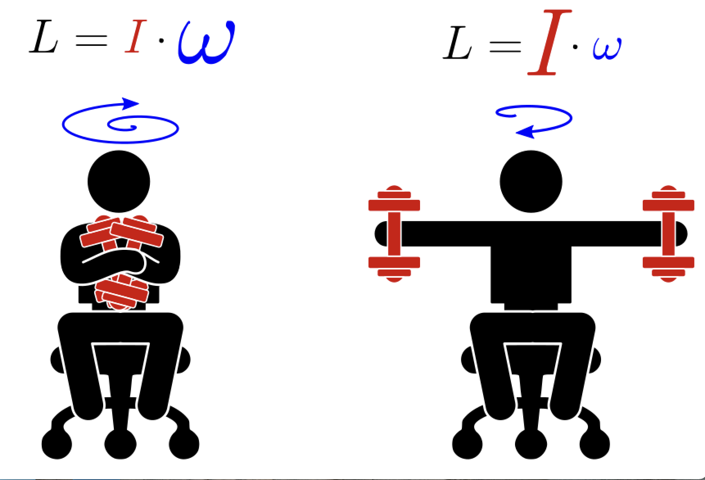
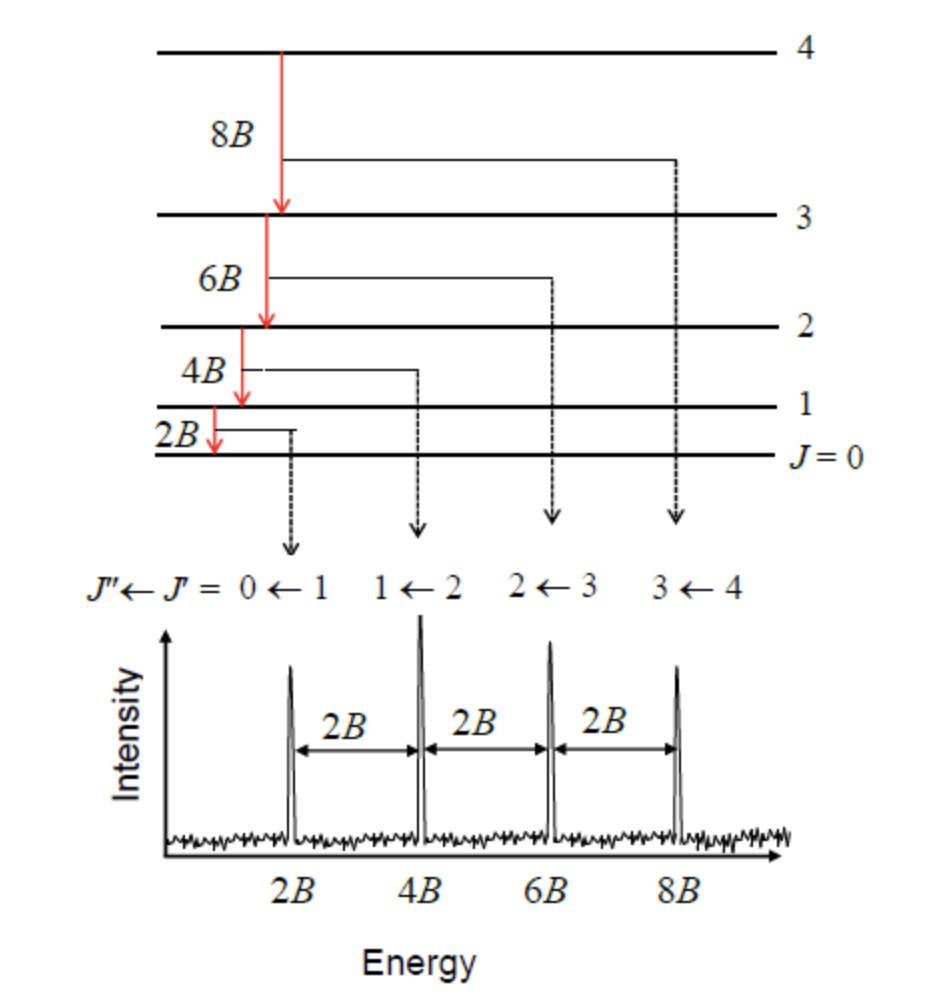
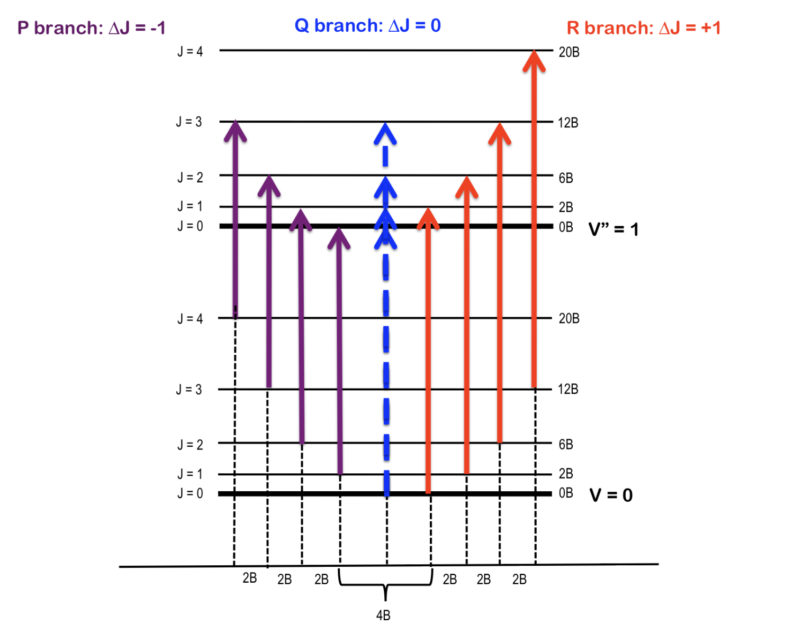
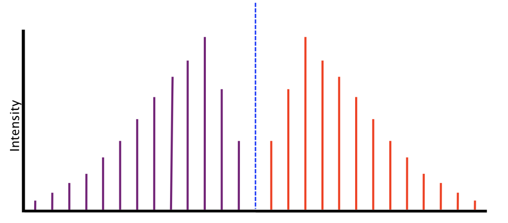
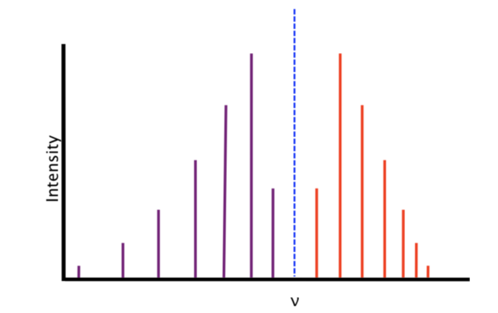

## Rigid Rotor  

:::{admonition} What You Need to Know
:class: note

- The **rigid rotor model** serves as a prototype for understanding the quantization of rotational degrees of freedom in molecules. We use a spherical coordinate system to exploit the spherical symmetry of the problem, effectively reducing the system's dimensionality.

- Solving the Schrödinger equation in spherical coordinates yields eigenfunctions in the form of **spherical harmonics**. The resulting energy eigenvalues exhibit degeneracy with respect to one of the quantum numbers.

- To compute **rotational spectra**, the **moment of inertia** of the molecule must be known. For diatomic molecules, this is simply $I = \mu r^2 $, where $\mu $ is the reduced mass and $r $ is the bond distance. For polyatomic molecules, the calculation is more complex, as it must account for the spatial distribution of mass.

- **Microwave spectroscopy** is directly connected to this model, with spectral lines predicted to occur at equal intervals of $2\tilde{B} $.

- The **selection rule** is established through the recursion relation of spherical harmonics and requires $\Delta J = \pm 1 $ and $\Delta M_J = 0, \pm 1 $.

- **Coupling with vibrational modes** leads to rovibronic transitions, necessitating the inclusion of vibrational quantum numbers for a comprehensive description of transition frequencies.

- Rotational motion can cause slight changes in bond length, known as the **centrifugal distortion effect**. This effect can be accounted for by adding a centrifugal correction term to the rigid rotor model.

:::

### Classical picture: Rotating dumbbell

:::{figure-md} markdown-fig

Conservation of angular momentum: In the absence of torque angular momentum of conservative system remains constant. This has implications for rotational motion, for instance you can rotate faster if you decreese moment of inertia and vice versa.
:::

- The rigid rotor is a model of a rotating dumbbell: two unequal masses held together via a rigid stick.  The system is not acted upon by any external potential; hence the only energy is the kinetic energy of rotation: 

$$
K=\frac{m_1 v_1^2}{2}+\frac{m_2 v_2^2}{2}=\frac{m_1 r_1^2+m_2 r^2_2}{2}\omega^2
$$

- Where we have plugged in $v_1=\omega r_1$ and $v_2=\omega_2 r$ velocities of rotation of two masses rotating with frequency $\omega$. The classical mechanical problem of two masses is once again reducible to a single reduced mass $\mu$ rotating around constant radius $r=r_1+r_2$ rotating around center of mass $m_1 r_1=m_2 r_2$.

$$
K=\frac{I \omega^2}{2}=\frac{L^2}{2I}
$$

- here $L=I \omega$ is the angular momentum, the $I=\mu r^2$ is moment of inertia and $\mu=\frac{m_1 m_2}{m_1+m_2}$

### Quantum rigid rotor and angular momentum operator 

- The hamiltonian for the rigid rotor model is the kinetic energy operator of an effective mass $\mu$ wchih rotates around sphere of radius $r=const$. To incorporate constraint $r=const$ it is more convenient to adopt spherical coordinates $(x,y,z)\rightarrow (r,\theta,\phi)$. To the full laplacian in spherical coordinates is:

- In spherical coordinates Hamitlonian is more conveniently expressed in terms of angular momentum operator as opposed to linear momentum operator:

$$
\hat{H}=-\frac{\hbar^2}{2\mu}\nabla_{x,y,z}^2 = -\frac{\hbar^2}{2\mu r^2}\nabla_{\theta,\phi}^2=\frac{\hat{L}^2}{2I}
$$

- Where $I=\mu r^2$ is the moment of inertia and where identified  the angular momentum operator as:

$$
\hat{L}= -i\hbar \nabla_{\theta,\phi}
$$

### Quantum numbers $(J,M_J)$ for quantizing $(\theta,\phi)$ coordiante pair. 

- Having written down hamitlonain we now solve it anticipating two quantum numbers for two coordinates. The eigenfunctions turn out to be well known special functions called spherical harmonics $Y(\theta,\phi)$:

$$
\hat{H}Y(\theta, \phi)=E_{J,m}Y(\theta,\phi)
$$

- We are once again able to separat two angular variables and solve the resulting ODE exactly. 
- We expect energy to depend on two quantum numbers $J$ and $M_J$ which quantize roational motion acorss $\theta$ and $\phi$ angles. 

### Rotational states of molecules are quantized

- Solving a rigid rotor problem, we find that eigenvalues depend only on the quantum number $J$. This makes each energy level degenerate with respect to $2J+1$ values assumed by $M_J$ quantum number. 

:::{admonition} **Eigenvalues of rotational states**
:class: important

$$
{E_J = \frac{\hbar^2}{2I}J(J+1)=BJ(J+1)}
$$

:::

- Where we have defined $B=\frac{h^2}{8\pi^2 I}$ rotational constant with units of energy. 
- Quantization in this equation arises from the cyclic boundary condition rather than the potential energy, which is identically zero.
- There is no rotational zero-point energy ($J = 0$ is allowed). 
- The ground state rotational wavefunction has equal probability amplitudes for each orientation.

:::{admonition} **Example**

What are the reduced mass and moment of inertia of $H^{35}Cl$? The equilibrium internuclear distance $R_e$ is 127.5 pm. What are the values of $L, L_z$ and $E$ for the state with $J = 1$? The atomic masses are: $m_H = 1.673470 \cdot 10^{-27}$ kg and $m_{Cl} = 5.806496 \cdot 10^{-26}$ kg.
:::

:::{admonition} **Solution**
:class: note, dropdown

First we calculate the reduced mass:

$$\mu = \frac{m_{\textnormal{H}}m_{^{35}\textnormal{Cl}}}{m_{\textnormal{H}} + m_{^{35}\textnormal{Cl}}} = \frac{(1.673470\times 10^{-27}\textnormal{ kg})(5.806496\times 10^{-26}\textnormal{ kg})}{(1.673470\times 10^{-27}\textnormal{ kg}) + (5.806496\times 10^{-26}\textnormal{ kg})}$$
$$= 1.62665\times 10^{-27}\textnormal{ kg}$$

$$I = \mu R_e^2 = (1.626\times 10^{-27}\textnormal{ kg})(127.5\times 10^{-12}\textnormal{ m})^2 = 2.644\times 10^{-47}\textnormal{ kg m}^2$$

$L$ and $Lz$ are given by eigenvalue expressions of the respective operators:

$$L = \sqrt{J(J+1)}\hbar = \sqrt{2}\left(1.054\times 10^{-34}\textnormal{ Js}\right) = 1.491\times 10^{-34}\textnormal{ Js}$$

$$L_z = -\hbar,0,\hbar\textnormal{ (three possible values)}$$

Energy of the $J = 1$ level is given by the eiganvalue expression of Hamiltonian:

$$E = \frac{\hbar^2}{2I}J(J+1) = \frac{\hbar^2}{I} = 4.206\times 10^{-22}\textnormal{ J} = 21\textnormal{ cm}^{-1}$$

This rotational spacing can be, for example, observed in gas phase infrared spectrum of HCl.
:::

### Rotational spectra of diatomic molecules

- We assume that the molecule is a rigid rotor, which means that the molecular geometry does not change during molecular rotation. We have solved this problem already 

- Energies are typically expressed in wavenumber units ($cm^{-1}$ although the basic SI unit is $m^{-1}$) by dividing $E$ by $hc$. The use of wavenumber units is denoted by including a tilde sign above the variable (e.g., $\tilde{\nu}$). The rotational energies expressed in wavenumbers are given by:

:::{admonition} **Rotaitonal energies in spectroscopic units**
:class: important

$${\tilde{E}_r(J) = \frac{E_r}{hc} = \tilde{B} J(J+1)}$$

:::

- Where the *rotational constant* is usually expressed in $cm^{-1}$ units and is given by:

$${\tilde{B} = \frac{h}{8\pi^2Ic}}$$

### Selection rules 

Using the known properties for spherical harmonics, one can show the following selection rule holds for the rigid rotor model:

:::{admonition} **Selection rules for rigid rotor model**
:class:important

$$\boxed{\Delta J = J' - J = \pm 1}$$

:::

- Since photons have one unit of angular momentum, the above rule can be understood in terms of angular momentum transfer. The transition frequencies between the rotational levels are given by ($J = 0,1,2,...$):

$${\tilde{\nu_J} = \tilde{E}_r(J + 1) - \tilde{E}_r(J) = \left((J+1)(J+2) - J(J+1)\right)\tilde{B} = 2\tilde{B}(J+1)}$$

:::{admonition} **Spacing of adjacent spectral lines**
:class: important

$$\tilde{\nu}_{J+1} - \tilde{\nu_J} = 2\tilde{B}$$

:::

- The successive line positions in the rotational spectrum are given by $2\tilde{B}, 4\tilde{B}, 6\tilde{B},...$. Note that molecules with different atomic isotopes have different moments of inertia and hence different positions for the rotational lines.

:::{figure-md} markdown-fig

Rigid rotor model predicts evenlys spaced spectral lines
:::

:::{admonition} **Population of rotational states**
:class: info, dropdown

Another factor that affects the line intensities in a rotational spectrum is related to the thermal population of the rotational levels. Thermal populations of the rotational levels is given by the Boltzmann distribution (for a collection of molecules):

$${f_J = \frac{g_Je^{-hc\tilde{E}_r(J) / (k_B T)}}{\sum\limits_{J'}g_{J'}e^{-hc\tilde{E}_r(J') / (k_B T)}} = \frac{g_Je^{-hc\tilde{E}_r(J) / (k_B T)}}{q}}$$

- The  $q$ is called the *partition function* and $g_J = 2J + 1$ corresponds to the degeneracy count of state $J$. A useful comparison of thermal energy is given by $kT$ and if the energy of a state is much higher than this, it will not be thermally populated. 
- one expects the intensities to first increase as a function of the initial state $J$, reach a maximum, and then decrease because the thermal populations decrease. In an absorption experiment, one can see the thermal populations of the initial rotational levels.

- Note: For systems, where the rotational degrees of freedom may exchange identical nuclei, an additional complication arises from the symmetry requirement for the nuclear wavefunction. Recall that bosons must have symmetric wavefunctions and fermions antisymmetric. We will not discuss this in more detail here.
:::

:::{admonition} **Example** 
:class: note

Calculate the relative populations of the first five rotational levels of the ground vibrational state of $H^{35}$Cl at 300 K. The ground vibrational state rotational constant $B_0 = 10.44$ cm$^{-1}$.
:::

:::{admonition} **Solution** 
:class: note, dropdown 

The level populations are given by the Boltzmann distribution:

$$\frac{N_J}{N_0} = \left(2J + 1\right)e^{-hcJ(J+1)\tilde{B}_0/(k_BT)}$$

where $N_0$ is the number of molecules in the rotational ground state. First we calculate the factor appearing in the exponent:

$$\frac{hc\tilde{B}_0}{k_BT} = \frac{(6.626\times 10^{-34}\textnormal{ Js})(2.998\times 10^8\textnormal{ m/s})(10.44\textnormal{ cm}^{-1})(10^2\textnormal{ cm/m})}{(1.3806\times 10^{-23}\textnormal{ J K}^{-1})(300\textnormal{ K})}$$
$$ = 5.007\times 10^{-2}$$

Then, for example, for $J = 1$ we get:

$$\frac{N_1}{N_0} = 3e^{-2(5.007\times 10^{-2})} = 2.71$$

The same way one can get the relative populations as: 1.00, 2.71, 3.70, 3.84, 3.31, and 2.45 for $J = 0, 1, 2, 3, 4, 5$. Note that these are relative populations since we did not calculate the partition function $q$.
:::  

### Ro-vibrational spectra, R, P and Q branches

:::{figure-md} markdown-fig

A cartoon depiction of a ideal rovibrational spectrum.
:::

- Often times we are interested in transitions among rotational levels that accompany excitation from ground vibrational state $v=0\rightarrow v=1 $. This can be described by combing rigid rotor and harmonic oscillator models:

$$
E_{v,J} = \tilde{\omega}(v+1/2)+\tilde{B}J(J+1)
$$

- Since at room temperatures molecules mostly occupy vibrational ground state we are interested in rotational transitions taking place between ground (v=0) and the first excited (v=1) vibrational states.

- Rigid rotor model predicts different frequencies for absorption and emission transitions between any two rotational states $J$ and $J'$.

$$\tilde{\nu} = \frac{E_{1,J'} - E_{0,J}}{hc} $$

 - **The transitions with $\Delta J=+1$ are called R branch**: 
 
 $$\tilde{\nu}_{\Delta J=+1}=\tilde{\omega} + 2\tilde{B}(J+1)$$

 - **The transitions with $\Delta J=-1$ are called P branch:** 
 
 $$\tilde{\nu}_{\Delta J=-1}=\tilde
 {\omega} - 2\tilde{B}J$$

 - **The Q-branch $\Delta J =0$** is predicted to be absent because it is forbidden by the selection rule of the rigid rotor model. 

  $$\tilde{\nu}_{\Delta J=0}=\tilde
 {\omega}$$

- The $J = 0,1,2...$ **always refers to the initial rotational state**. For instane one often writes R(0) and R(1) to represent R branches for $0\rightarrow1$ and $1\rightarrow2$ transitions.

### Beyond rigid rotor

:::{figure-md} markdown-fig

A cartoon depiction of a ideal rovibrational spectrum.
:::

:::{figure-md} markdown-fig

A cartoon depiction of a real rovibrational spectrum.
:::

### Centrifugal distortion

In reality molecules are not rigid rotors and one must consider the coupling between $H_{rot}$ and $H_{vib}$. Classically thinking, with increasing rotational motion, the chemical bond stretches due to centrifugal forces, which increases the moment of inertia, and consequently, the rotational energy levels come closer together. It can be shown that this can be accounted for by including an additional term the energy expresison for rigid rotor:

$${\tilde{E}_r(J) = \tilde{B}J(J+1) - \tilde{D}J^2(J+1)^2}$$

- The $\tilde{D}$ is the *centrifugal distortion constant* ($cm^{-1}$). Note that both $\tilde{B}$ and $\tilde{D}$ are positive.
When the centrifugal distortion is taken into account, the rotational transition frequencies are given by:

$${\tilde{\nu} = \tilde{E}_r(J+1) - \tilde{E}_r(J) = 2\tilde{B}(J+1) - 4\tilde{D}(J+1)^3\textnormal{ where }J=0,1,2,...}$$

:::{admonition} **Example**
:class: note

Measurement of pure rotational spectrum of H$^{35}$Cl molecule gave the following positions for the absorption lines:

$$\tilde{\nu} = \left(20.794\textnormal{cm}^{-1}\right)\left(J+1\right) - \left(0.000164\textnormal{cm}^{-1}\right)\left(J+1\right)^3$$

What is the equilibrium bond length and what is the value of the centrifugal distortion constant?
:::

:::{admonition} **Solution**
:class: note, dropdown

We first write the expression for $\tilde{B}$ and then use the definition of the moment of inertia $I$:

$$\tilde{B} = \frac{h}{8\pi^2cI} = \frac{h}{8\pi^2c\mu R_0^2}$$

where $\mu$ is the reduced mass for the molecule and $R_0$ is the equilibrium bond length. Solving for $R_0$ gives:

$$R_0 = \sqrt{\frac{h}{8\pi^2c\mu\tilde{B}}} = 129\textnormal{ pm}$$

The centrifugal distortion constant can obtained by comparing the above equation with the equation for rovibronic coupling

$$\tilde{D} = 4.1\times 10^{-5}\textnormal{ cm}^{-1}$$
:::

### Rovibronic coupling

- As a diatomic molecule vibrates, its bond length changes. Since the moment of inertia is dependent on the bond length, it too changes and, in turn, changes the rotational constant B. We assumed above that B of R(0) and B of P(1) were equal, however they differ because of this phenomenon.

- The v dependence is captured via the following expression showing that rotational constant is a linearly decreasing function of v!

$$
B_v = B_e-\alpha_e(v+1/2)
$$

- Where $B_e$ is the rotational constant for a rigid rotor and $\alpha_e$ is the rotational-vibrational coupling constant. The information in the band can be used to determine $B_0$ and $B_1$ of the two different energy states as well as the rotational-vibrational coupling constant, which can be found by the method of combination differences.

**The R branch with rovibronic coupling**:

$$
\tilde{\nu}_{\Delta J=+1} = \tilde{\omega} + 2\tilde{B_1}+(3\tilde{B_1}-\tilde{B}_0)J+(\tilde{B_1}-\tilde{B}_0)J^2
$$

**The P brnach with rovibronic coupling**:

$$
\tilde{\nu}_{\Delta J=-1} = \tilde{\omega} - (\tilde{B_1}+\tilde{B}_0)J+(\tilde{B_1}-\tilde{B}_0)J^2
$$

- When $B_0=B_1$ we recover rigid-rotor harmonic oscillator predictions.