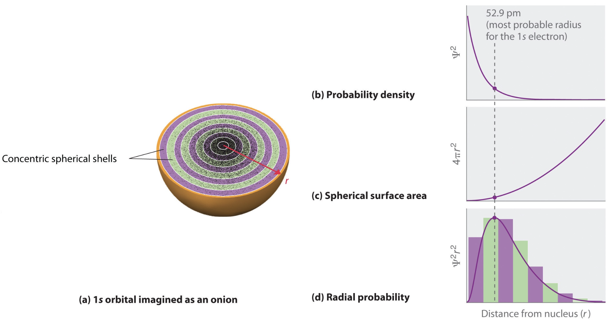
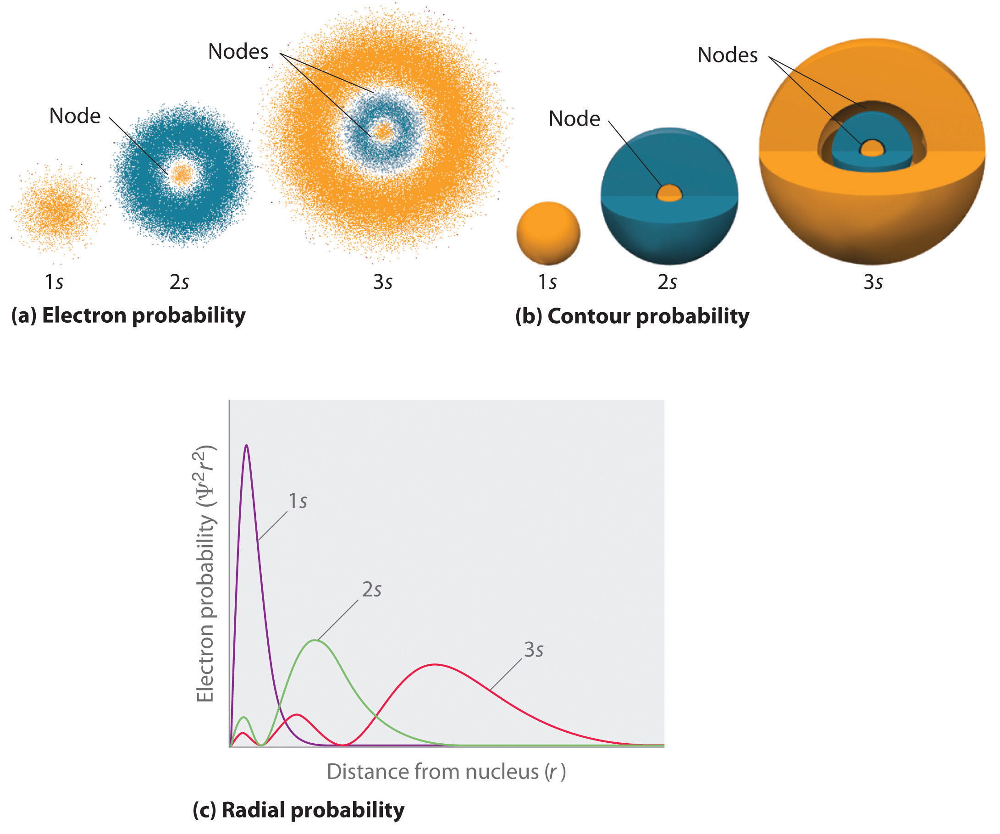
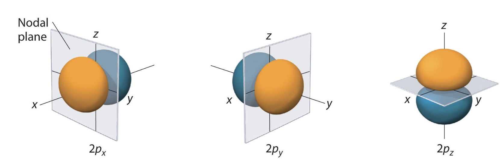
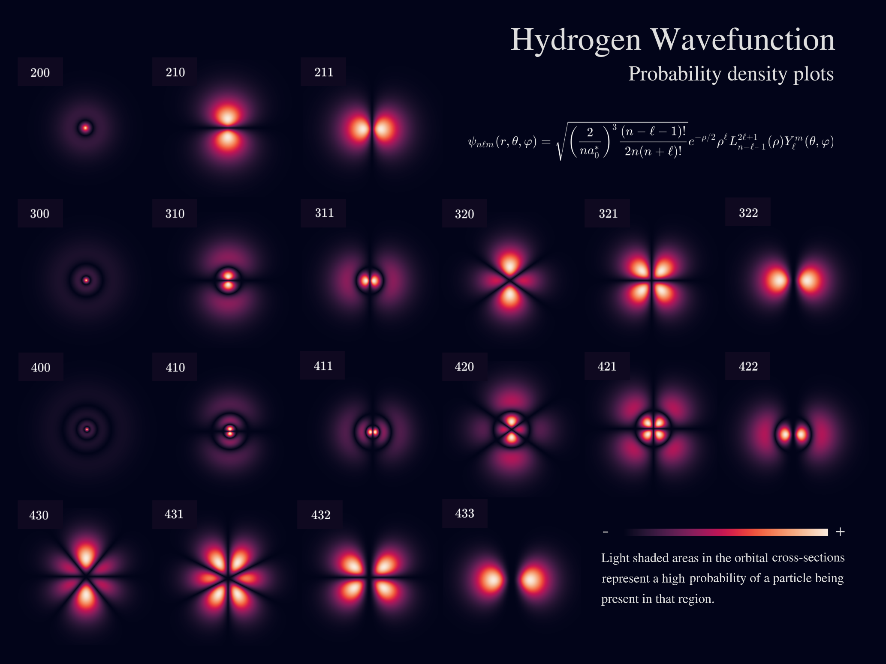
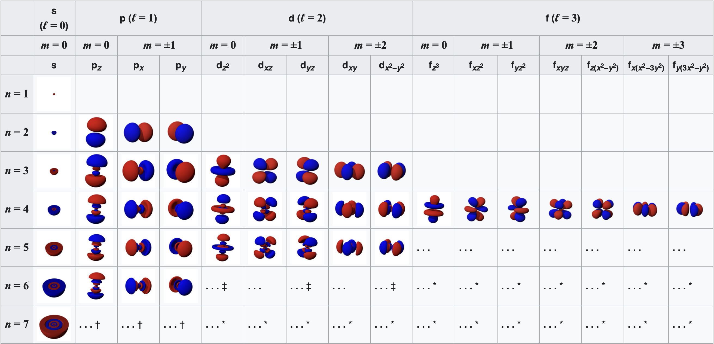

## Atomic orbitals

:::{admonition} What you need to know
:class: note

- A wavefunction for a one-electron system is called an orbital. For an atomic system such as H (hydrogen atom), it is called an [atomic](http://en.wikipedia.org/wiki/Atomic_orbital).
- The orbital plots demonstrated the shapes of the orbitals but this does not tell us anything about the radial extent (i.e., how far the orbital reaches).
-  As the value of $Z$ is increased, the radial extent decreases. This indicates that for higher nuclear charge, the electrons will reside closer to the nucleus.
- The radial functions have $n - l - 1$ zero values (nodes) between distances from zero to infinity.
- The existence of the nodes makes the wavefunctions orthogonal. For example, $\psi_{1s}$ and $\psi_{2s}$ in hydrogenlike atoms are orthogonal.
:::

### Radial profiles of atomic orbitals

When visualizing the radial probabilities, it is possible to do directly plot the square of the radial wavefunction ($R_{nl}^2$) or the radial probability density ($P_{nl}$):

$${P_{nl}(r) = r^2N_{nl}^2R_{nl}^2(r)}$$

According to this expression, the most probable radius for an electron on hydrogen atom $1s$ orbital is $a_0$ (the Bohr radius). Previous figures showed examples of $R_{nl}$ and $P_{nl}$. Probability densities are useful, for example, in understanding charge distributions in atoms and molecules.

As the principal quantum number $n$ increases, the electron moves out to greater distances from the nucleus. The average distance for an electron in a given orbital (with quantum numbers $n$ and $l$) is given by (this is \textit{not} the expectation value):

$${\langle r\rangle_{nl} = \int_0^\infty r\times P_{nl}(r)dr}{= \frac{n^2a_0}{Z}\lbrace 1 + \frac{1}{2}\lbrack  1 - \frac{l(l+1)}{n^2}\rbrack\rbrace}$$

Note that the expectation value of $r$ and the most probable value for $r$ are not equal. The expectation value can be thought of like *an average* and the most probable value like a *maximum value*.

The probability density (including the angular variables) for the electron in a hydrogenlike atom is given by:

$${\psi^*_{nlm}(r,\theta,\phi)\psi_{nlm}(r,\theta,\phi) = |N_{nl}R_{nl}(r)Y_l^m(\theta,\phi)|^2}$$

This function depends on three variables and is difficult to plot directly. Previously, we have seen that it is convenient to plot contour levels, which contain the electron with, for example, 90\% probability.

### 3D shapes of orbitals

For degenerate states with $l > 0$, we have an additional degree of freedom in choosing how to represent the orbitals. In fact, any linear combination of given $3l$ orthogonal eigenfunctions corresponding to a degenerate set with orbital angular momentum $l$, is also a solution to the Schr\"odinger equation.

Two commonly used representations are the Cartesian form, which are real valued functions and have been, in the case of $l = 1$, denoted by $p_x$, $p_y$ and $p_z$, and the eigenfunctions of the angular momentum ($L^2$ and $L_z$), which are complex valued and are denoted by $p_{-1}$, $p_0$ and $p_{+1}$. The relation between the representations is:

$${p_x = -\frac{1}{\sqrt{2}}\left( p_{+1} - p_{-1}\right)\propto \textnormal{sin}(\theta)\textnormal{cos}(\phi)\propto x}
{p_y = \frac{i}{\sqrt{2}}\left( p_{+1} + p_{-1}\right)\propto \textnormal{sin}(\theta)\textnormal{sin}(\phi)\propto y}
{p_z = p_0}$$

- Note by combining $p_x$, $p_y$ and $p_z$, the lobe of the orbital can be made to point at any direction. For $d$-orbitals, we have five degenerate levels:

$${d_{x^2 - y^2} = \frac{1}{\sqrt{2}} \left(d_{+2} + d_{-2}\right)\textnormal{, }d_{xy} = -\frac{i}{\sqrt{2}}\left( d_{+2} - d_{-2}\right)}
{d_{xz} = -\frac{1}{\sqrt{2}}\left( d_{+1} - d_{-1}\right)\textnormal{, }d_{yz} = \frac{i}{\sqrt{2}}\left( d_{+1} + d_{-1}\right)}
{d_{z^2} = d_0}$$

### Table of 2D orbitals

### Table of 3D orbitals

### Interactive plotter of Atomic Orbitals

<iframe src="https://al2me6.github.io/evanescence/"
        width="800"
        height="500"
        allowfullscreen>
</iframe>

### Problems

#### Problem 1

- For the hydrogen atom, how many possible quantum states correspond to the principal number $n=3$
- What are the energies of these states?
- Consider several values for n, and show that the number of orbitals for each $n$ is $n^2$

:::{dropdown} **Solution**

If  n=3 the allowed values of l are 0, 1, and 2. 
- If  l=0; m=0 (1 state)
- If  l=1; m=−1,0,1 (3 states);
- If  l=2; m=−2,−1,0,1,2 (5 states). 

In total, there are 1 + 3 + 5 = 9 allowed states. This confirms that number of orbitals for H-atom is $n^2$

- Because the total energy depends only on the principal quantum number!  n=3. the energy of each of these states is given by:

$$
E_n = -13.5 \frac{1}{n^2}\, [eV]
$$

:::

#### Problem 2

- The notation $3d$ specifies the quantum numbers for an electron in the hydrogen atom. What are the values for $n$ and $l$? 
- What are the values for the energy and angular momentum? 
- What are the possible values for the magnetic quantum number? 
- What are the possible orientations for the angular momentum vector?

:::{dropdown} **Hint**

- 3d orbital corresponds to n=1 and l=2. A number of $m_l$ values are possible
- Orientation of $L_z$. with respect to L is defined by $cos\theta = L_z/L$
:::

#### Problem 3

Locate nodes or nodal surfaces of $3p_z$ orbital:

$$
\psi_{3p_z} = \frac{1}{81}\sqrt{\frac{2}{\pi}}\left(\frac{1}{a_0}\right)^{3/2}\left(6\frac{r}{a_0} - \frac{r^2}{a^2_0}\right) e^{-r/3a_0}	{cos}(\theta)
$$

:::{dropdown} **Solution**

- $3p_z$ corresponds to $n=3$, $l=1$ and $m_l=0$

- Radial part of the equations is zero at $r=0$ and $r=6a_0$. First one is part of a boundary condition and not a node becaue wavfunction is not changing a sign. Hence 1 node from radial part.

- Angular part has one nodal surface due to  $cos\theta=0$ which happens at $\theta=\frac{\pi}{2}$

- We have 2 nodes for $3p_z$ orbital. The toal number of nodes are n-1 where one has l angular nodes and n - l - 1 radial nodes.
:::

#### Problem 4

- Calculate average distance from nucleus to find the electron in H-atom in its ground state.
- Calculate probabiltiy to find the electron within first Bohr raidus $a_0.$
- calcualte the most probable value of r to find the electron. 

:::{dropdown} **Solution**

- Ground state is 1s;

$$
\psi_{1s}(r) = \frac{1}{\sqrt{\pi}}\frac{1}{a^{3/2}_0}e^{-r/a_0}
$$

- **Compute averages.** Averages  or expectations of observables in quantum mechanics are calculated as usual by $\langle\psi |A| \psi \rangle$ expression:

$$\langle 1s |r| 1s\rangle = \frac{1}{\pi a^3_0}\int^{\infty}_0 e^{-2r/a_0} r \cdot r^2 dr \int^{\pi}_0 sin\theta d\theta \int^{2\pi}_0d\phi = \frac{4}{a^3_0}\int^{\infty}_0 r^3 e^{-2r/a_0} dr$$

The last integral is evaluated using the following table integral:

$$
\int^{\infty}_0 x^n e^{-Ax}dx = \frac{n!}{A^{n+1}}
$$

$$\langle 1s |r| 1s\rangle=\frac{4}{a^3_0} \cdot \frac{3!}{(2/a_0)^4}=\frac{3}{2}a_0$$

- **Computing probabilities** Wavefunction square is a probability distribution function to find electron in small volume dV in 3D space. Probability to find electron at a distance regardless of angles is found by integrating out angles:

$$
Prob(r)= \int |\psi(r, \theta, \phi)|^2d\theta d\phi = |\psi(r)|^2 = \frac{4}{a^3_0} r^2 e^{-2r/a_0}
$$

- Probability to find electron in a range $0\leq r\leq a_0$ is found by integrating (summing probabilities) over that range:

$$
Prob(0\leq r\leq a_0)= \frac{4}{a^3_0} \int^{a_0}_0 r^2 e^{-2r/a_0} dr
$$

- **Most probable value** is found by finding the maximim value of $P(r)$

$$
\frac{dP(r)}{dr}|_{r=r_max}=0
$$

Carrying out the derivative we find that $r_max=a_0$
:::

#### Problem 5

Show that $|210\rangle$ is normalized and orthogoanal to $|200\rangle$

:::{dropdown} Hint

- This problem is solved in Chapter 7 of McQuarrie's book. Page 326
:::

#### Problem 6

Calculate average potential energy of H-atom in its ground and first excited states.

:::{dropdown} Hint

- This problem is solved in Chapter 7 of McQuarrie's book. Page 3332
:::

