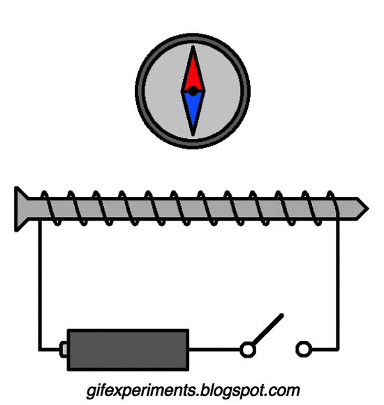

## Spin

:::{admonition} What you need to know
:class: note

- **Magnetism** results from the circular motion of charged particles.
- It is expected that atoms that have electrons with non-zero value of orbital angular momentum will be affected by the external magnetic field. 
- Experiment of Stern and Herlach estblaished the existance of intrinsic magnetic moment of lectrons termed spin that are affected by magnetic field regardless of orbital angular momentum. 
- Contrary to the suggestive name, *spin* is an intrinsic magnetic momentum which is permanently attached to a subatomic particle and has nothing to do with "spinning" or motion. Spins is a fundamental property of particles just like mass or charge. 
- Particles with half-integer spins, such as 1/2, 3/2, 5/2, are known as fermions, while those particles with integer spins, such as 0, 1, 2, are known as bosons . The two families of particles obey different rules. Fermions obey the Pauli exclusion principle:  there cannot be two identical fermions simultaneously having the same quantum numbers, e.g, having the same position, velocity and spin direction. In contrast, bosons  have no such restriction, so they may "bunch together" even if in identical states.
- *Normal Zeeman effect*: splitting of singlet states with spin zero in the magnetic field is due to electron's angular momentum can be understood classically. 
- *Anomalous Zeeman effect*: Is a more general case of electron spin and angular mometnum both contributing to splitting of energy levels.
:::

### Orbital angular momentum of the hydrogen atom

- In hydrogenlike atoms degeneracy implies that the angular momentum is non-zero. If the quantum numbers $l$ and $m$ are known, it is possible to calculate $L^2$ and $L_z$ directly:

$${L^2 = l(l+1)\hbar^2\textnormal{ (or formally }L = \sqrt{l(l+1)}\hbar\textnormal{)}}$$

$${L_z = m\hbar\textnormal{ where }m = -l,...,0,...,+l}$$

- Without external electric or magnetic fields and ignroing electron spin (to be interoduced later), the energy of hydrogen atom is independent of quantum number $m$. The Lorentz force law (see your physics course lecture notes) gives the interaction of a charged particle with an electromagnetic field (for a classical particle):

$${\vec{F} = q\left( \vec{E} + \vec{v}\times \vec{B}\right)}$$

- where vector $\vec{F}$ is the force experienced by the charged particle, $q$ is the particle charge, $\vec{E}$ is the electric field vector, $\vec{v}$ is the particle velocity vector and $\vec{B}$ is the magnetic field vector. Even though the above expression strictly applies to the classical case, it suggests that the presence of external magnetic or electric fields should somehow affect the electron orbit in hydrogenlike atoms.

### Rotating charge generates mangetic moment

:::{figure-md} markdown-fig

A GIF demonstrating the existence of a magnetic field around a current carrying wire.
:::

-  A moving charge interacts with an external magnetic field. 
- When an electron is in a state with $l > 0$, one can think of a circular motion of charge (of the wavefunction describing electron) around the nucleus and generate its own magnetic field. 
- Note that this motion is not classical but here we are just trying to obtain a wire frame model based on classical interpretation.

:::{figure-md} markdown-fig

Shown are magnetic moment and angular momentum generated by a charge moving on an obrit. 
:::

### Magnetic moment of  electron 

According to classical mechanics a charged particle like an electron that is rotating around an axis has a magnetic moment given by:

$${\vec{\mu} = \gamma_e\vec{L}}$$

- where $\gamma_e$ is the magnetogyric ratio of the electron expressed via fundamental constants ($-\frac{e}{2m_e}$) We choose the external magnetic field to lie along the $z$-axis and therefore it is important to consider the $z$ component of $\vec{\mu}$:

$${\mu_z = -\left(\frac{e}{2m_e}\right)L_z = -\left(\frac{e\hbar}{2m_e}\right)m \equiv -\mu_B m}$$

- where $\mu_B$ is the Bohr magneton as defined above. The interaction between a magnetic moment and an external magnetic field is given by (classical expression):

$${U = -\vec{\mu}\cdot\vec{B} = -|\vec{\mu}||\vec{B}|\cos(\alpha)}$$

- Where $\alpha$ is the angle between the two magnetic field vectors. This gives the energy for a bar magnet in presence of an external magnetic field:

-  Unlike quantum mechanics in classical mechanics any orientation is allowed. When the external magnetic field is oriented along $z$-axis the potential energy of interaction with field in classical mechanics is:

$${U = -\mu_z B = \frac{eB}{2m_e}L_z}$$

### Effect of magnetic field on atoms

- In quantum mechanics, a magnetic moment (here corresponding to a non $s$ orbital electron) may only take specific orientations!

- The $z$-axis is often called the quantization axis. The eigenvalues of $\hat{L}_z$ essentially give the possible orientations of the magnetic moment with respect to the external field. For example, consider an electron on $2p$ orbital in a hydrogenlike atom. The electron may reside on any of $2p_{+1}$, $2p_0$ or $2p_{-1}$ orbitals (degenerate without the field). For these orbitals $L_z$ may take the following values ($+\hbar, 0, -\hbar$):

$${\hat{L}_z|p_{+1}\rangle = +1\times\hbar|p_{+1}\rangle\textnormal{,\,\, }\hat{L}_z|p_0\rangle = 0\times\hbar|p_{0}\rangle\textnormal{,\,\, }\hat{L}_z|p_{-1}\rangle = -1\times\hbar|p_{-1}\rangle}$$

### Mangetic field modifies the Hamiltonian

- The relative orientations with respect to the external magnetic field are shown on the left side of the figure. The total quantum mechanical Hamiltonian for a hydrogenlike atom in a magnetic field can now be written as:

$${\hat{H} = \hat{H}_0 + \frac{eB}{2m_e}\hat{L}_z}$$

- where $\hat{H}_0$ denotes the Hamiltonian in absence of the magnetic field. 
- Since projection of angular momentum commutes with Hamitlonian $[\hat{L}_z, \hat{H}_0]=0$ we have same eigenfunctions for both:

$$\hat{L}_z\mid n,l, m_l\rangle = \hbar m_l \mid n,l, m_l\rangle$$

$$\hat{H}_0\mid n,l, m_l\rangle =E_n\mid n,l, m_l\rangle$$

- The eigenvalues are (derivation not shown):

$${E_{nlm} = -\frac{m_ee^4Z^2}{2(4\pi\epsilon_0)^2n^2\hbar^2} + \mu_BmB}$$

- where $n = 1, 2, ...$; $l = 0, 1, ..., n - 1$; and $m = -l, ..., 0, ..., +l$. In the presence of magnetic field, the $(2l + 1)$ degenerate levels have been split (i.e., the degeneracy is lifted). This is called the orbital Zeeman effect.

### The  Zeeman effect 

- Energy levels are affected by the external magnetic field

$$
E=E_n +\hbar m \frac{e}{2m_e} B=E_n+m\beta_B B
$$

- Where we have introduce the Boh'r magneton $\beta_B = \frac{\hbar e}{2 m_e}$. The energy expression predicts removal of degeneracy with respect to $m_l$ generating splitting energy levels into $2l+1$ lines. For instance the 2p level of hydrogen atom will split into 3 levels $-\beta_B B, 0,+\beta_B$

- When an external magnetic field is applied, sharp spectral lines like the $n=3\rightarrow 2$ transition of hydrogen split into multiple closely spaced lines. First observed by Pieter Zeeman, this splitting is attributed to the interaction between the magnetic field and the magnetic dipole moment associated with the orbital angular momentum. In the absence of the magnetic field, the hydrogen energies depend only upon the principal quantum number n , and the emissions occur at a single wavelength.

### Stern-Herlach experiment

<html>

<iframe width="560" height="315" src="https://www.youtube.com/embed/jDxUaBYINeQ" frameborder="0" allowfullscreen>
</iframe>
</html>

### Spin as a tiny magnet

- We come to view *spin* of subatomic particles in a same way as we view mass and charge. Spin is an intrinsic property of a particle manifested in having permanent magnetic moment. A particle with spin can interact with magnetic fields just like particles with charge can interact with electric fields. This is why spin is pictorially depcited as tiny manget. 

- The Schrodinger equation does not account for electron spin. The concept of electron spin originates from Dirac's relativistic equation. However, it can be included in the Schrodinger equation as an extra quantum number ($s$). Furthermore, it appears to follow the general laws of angular momentum. The spin angular momentum vector $\vec{S}$ has a magnitude: $|\vec{S}| = S = \sqrt{s(s+1)}\hbar$ where $s$ is the spin quantum number ($\frac{1}{2}$). 

### Eigenvalues of spin

- To summarize the behavior of electron spin angular momentum:

$${S^2 = s(s+1)\hbar^2 = \frac{3}{4}\hbar^2\textnormal{ (since }s = \frac{1}{2}\textnormal{)}}$$

$${S_z = m_s\hbar\textnormal{ with }m_s = \pm\frac{1}{2}}$$

### Eigenfunctions of spin

- The corresponding operators are denoted by $\hat{S}_z$ and $\hat{S}^2$. How about the eigenfunctions? The eigenfunctions are denoted by $\alpha$ and $\beta$ and we don't write down their specific forms. The following relations apply for these eigenfunctions:

$${\hat{S}^2\alpha\equiv \hat{S}^2|\alpha\rangle = \frac{1}{2}\left(\frac{1}{2} + 1\right)\hbar^2\alpha = \frac{3}{4}\hbar^2\alpha\equiv\frac{3}{4}\hbar^2|\alpha\rangle}$$

$${\hat{S}^2\beta\equiv \hat{S}^2|\beta\rangle = \frac{1}{2}\left(\frac{1}{2} + 1\right)\hbar^2\beta = \frac{3}{4}\hbar^2\beta\equiv\frac{3}{4}\hbar^2|\beta\rangle}$$

$${\hat{S}_z\alpha\equiv \hat{S}_z|\alpha\rangle = +\frac{1}{2}\hbar\alpha\equiv +\frac{1}{2}\hbar |\alpha\rangle}$$

$${\hat{S}_z\beta\equiv \hat{S}_z|\beta\rangle = -\frac{1}{2}\hbar\beta\equiv -\frac{1}{2}\hbar |\beta\rangle}$$

- Note that all the following operators commute: $\hat{H}$, $\hat{L}^2$, $\hat{L}_z$, $\hat{S}^2$, and $\hat{S}_z$. This means that they all can be specified simultaneously. The spin eigenfunctions are taken to be orthonormal:

$${\int\alpha^*\alpha d\sigma\equiv\langle\alpha|\alpha\rangle = \int\beta^*\beta d\sigma\equiv\langle\beta|\beta\rangle = 1}$$

$${\int\alpha^*\beta d\sigma\equiv\langle\alpha|\beta\rangle = \int\beta^*\alpha d\sigma\equiv\langle\beta|\alpha\rangle = 0}$$

- where the integrations are over variables that the spin eigenfunctions depend on. Note that we have not specified the actual forms these eigenfunctions. We have only stated that they follow from the rules of angular momentum. A complete wavefunction for a hydrogen like atom must specify also the spin part. The total wavefunction is then a product of the spatial wavefunction and the spin part.

### Effect of magnetic field on spin

- Note that analogously, the $\hat{S}_x$ and $\hat{S}_y$ operators can be defined. These do not commute with $\hat{S}_z$. Because electrons have spin angular momentum, the unpaired electrons in silver atoms (Stern-Gerlach experiment) produce an overall magnetic moment (``the two two spots of silver atoms''). The spin magnetic moment is proportional to its spin angular momentum:

$${\vec{\hat{\mu}}_S = -\frac{g_ee}{2m_e}\vec{\hat{S}}}$$

- where $g_e$ is the free electron $g$-factor (2.002322 from quantum electrodynamics). The $z$-component of the spin magnetic moment is ($z$ is the quantiziation axis):

$${\hat{\mu}_z = -\frac{g_ee}{2m_e}\hat{S}_z}$$

### Eigenvalues of spin magnetic moment

- Following the eigenfunctions of $S_z$ obtained above the corresponding eigenvalues for spin mangetic moment will be:

$${\mu_z = -\frac{g_ee\hbar}{2m_e}m_s = -g_e\mu_Bm_s}$$

- Thus the total energy for a spin in an external magnetic field is:

$${E = g_e\mu_Bm_sB}$$

- where $B$ is the magnetic field strength (in Tesla). By combining the contributions from the hydrogenlike atom Hamiltonian and the orbital
and electron Zeeman terms, we have the total Hamiltonian:

$${\hat{H} = \hat{H}_0 + \frac{eB}{2m_e}\hat{L}_z + \frac{g_eeB}{2m_e}\hat{S}_z = \hat{H}_0 + \frac{eB}{2m_e}\left(\hat{L}_z + g_e\hat{S}_z\right)}$$

- The eigenvalues of this operator are (derivation not shown):

$${E_{n,m_l,m_s} = -\frac{m_ee^4Z^2}{2(2\pi\epsilon_0)^2\hbar n^2} + \frac{eB\hbar}{2m_e}\left(m_l + g_em_s\right)}$$

### Spin-Orbit coupling

- Having two source of mangeitc fields in atoms one due to orbtial momentum and another due to spin there arises a possibility that these microscopic magnets can interact. And such a possibility is indeed realized and known under name of spin-orbit coupling. 

- Becsue of spint orbit coupling the energy levels are no longer diescribed by $l$ and $s$ separetely. This is why one introduces term sybols to describe new states with total spin multiplicity $(2S+1)$ and anuglar momentum $L$ and total angular momentum $J=L+S$. The word total will take more meaning when we discuss multi electorn atoms where angular moenta are summed $^{(2S+1)}L_J$

### "Anomalous" Zeeman Effect

- While the Zeeman effect in some atoms (e.g., hydrogen) showed the expected equally-spaced triplet, in other atoms the magnetic field split the lines into four, six, or even more lines and some triplets showed wider spacings than expected. These deviations were labeled the **anomalous Zeeman effect** and were very puzzling to early researchers. 
- The explanation of these different patterns of splitting gave additional insight into the effects of electron spin. With the inclusion of electron spin in the total angular momentum, the other types of multiplets formed part of a consistent picture. So what has been historically called the "anomalous" Zeeman effect is really the normal Zeeman effect when electron spin is included.

### Summary of spim and angular momentum

- Spin emerges naturally once one accounts for relativistic effect, as was originally shown by Paul Dirac. Except for special cases relativisti effects however are not too significant to include in quantum mechanics therefore we incoprorate spin as an additional degree of freedom which has not been accounted for but which is knwon to exist!

| *Angular momentum* (eigenfunctions and eigenvalues)          | *Spin momentum* (eigenfunctions and eigenvalues)             |
| :----------------------------------------------------------- | :----------------------------------------------------------- |
| $\hat{L}=\hat{r}\times \hat{p}$ $\hat{L}_z = -i\hbar \Big (x\frac{\partial}{\partial y}-y\frac{\partial}{\partial x} \Big)$ | $\hat{S}$ $\hat{S}_z$                                     |
| $l=0,1,2,3,...$ $m_l=-l...0...l$                          | $s=1/2$   $m_s=-1/2,1/2$                                  |
| $\mid l,m_l\rangle=Y_{l, m_l}$                               | $\mid s,m_s\rangle=\alpha,\beta$ $\mid 1/2,+ 1/2\rangle=\alpha$  $\mid 1/2,- 1/2\rangle=\beta$ |
| $L=\hbar\sqrt{l(l+1)}$ $L_z=\hbar m$                      | $S=\hbar\sqrt{s(s+1)}=\hbar\sqrt{3/4}$ $S_z=\hbar m_s= \pm \hbar/2$ |
| $\mu_L=- g_l \frac{e}{2m_e}L$ $g_l=1$                     | $\mu_S = g_s \frac{e}{2m_e}S$   $g_s \approx 2$           |
|                                                              |                                                              |
### Problems

