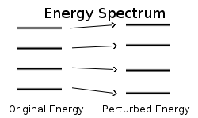

## Perturbation Method


```{admonition} What you need to know
:class: note
-  *Perturbation method*, attempts to solve analytically intractable problem by idintifying an exactly *sovable* part and a *"small"* pertrubation. The method is similair in spirit to taylor expansion of functions familiar from calculus and is the single most important method of solving problems in quantum mechanics. 

- Application of pertrubation theory proceeds in two steps. Step one identify solvable part and perturbation. Part two expand energy and eigenfunctions as series of corrections of increasing order. In particle first and second order corrections to energy suffice. 
```

  


## Time independent perturbations

We have hamiltonian $\hat{H}_0$ for some exactly solvable problem think particle in a box, harmonic oscilator, etc:  

$$
\hat{H}^0 \mid n^0\rangle=E^0_n \mid n^0\rangle
$$

- Note the 0 superscript: It indicates exactly solvable hamitlonian, eigenfunctions and eigenvalues. The  $\mid n^0\rangle$ is the eigenfunction corepsonding to the nth eigenvalue $E^0_n$. Now we perturb the hamitlonian by adding a "small" pertrubation $\hat{H_1}$. Where  $\lambda$ turns perturbation on $\lambda=1$ and off $\lambda=0$. 

$$
\hat{H}=\hat{H}^0+\lambda {\hat{H}^1}
$$

---

-  The objective of  perturbation theory is to solve the following problem with new hamiltonian expressed entirely in terms of eigenvalues and eigenfunctions of exactly solvable problems. 

$$
\hat{H}\mid n\rangle =E_n \mid n\rangle
$$


### It's just like Taylor expansions! 


We assume that eigenvalues and eigenfunctions can be expanded in power series in the parameter $\lambda$ to be set to 1 in the end.  


$$
E_n =E^0_n+\lambda E^1_n+\lambda^2 E^2_n+...
$$


$$
\mid n\rangle = \mid n^0\rangle+\lambda\mid n^1\rangle+\lambda^2\mid n^2\rangle ...
$$


$$
\Big(\hat{H}^0+\lambda \hat{H}^1 \Big)\Big(\mid n^0\rangle+\lambda\mid n^1\rangle \Big)  = \Big(E^0_n+\lambda E^1_n+\lambda^2 E^2_n \Big) \Big(\mid n^0\rangle+\lambda\mid n^1\rangle\Big)
$$


$$
\begin{split}\color{green}{\hat{H}^0 \mid n^0\rangle} + \lambda \color{red}{ \big (\hat{H}^1 \mid n^0\rangle + \hat{H}^0 \mid n^1\rangle \big)}+\lambda^2 \color{blue}{\hat{H}^1 \mid n^1\rangle }  = \\ = \color{green}{E^0_n \mid n^0\rangle} +\lambda \color{red}{ \big( E^1_n \mid n^0\rangle+ E^0_n \mid n^1\big )} +  \lambda^2\color{blue}{\big(E^1_n \mid n^1\rangle+E^2_n \mid n^0\rangle \big)}\end{split}
$$


### Petrubation equations of order 0, 1 and 2

Opening the brackets and collecting different orders of $\lambda$ we have  0, 1 and 2nd order perturbation equations:


$$
\color{green}{\hat{H}^0\mid n^0\rangle = E^0_n\mid n^0 \rangle}
$$


$$
\color{red}{\hat{H}^0\mid n^1\rangle +\hat{H^1}\mid n^0\rangle = E^0_n\mid n^1 \rangle+E^1_n\mid n^0 \rangle}
$$


$$
\color{blue}{\hat{H^1}\mid n^1\rangle = E^1_n\mid n^1 \rangle+E^2_n\mid n^0 \rangle}
$$


- Note how the sum of  upstairs index determines the order of perturbation expansion		
- Note that 0 order is just the exact solution.
- Note that hamitonian only has first order expansion while eigenfunctions and eigenvalues are expanded to infinite terms. Usually going to second order is enough for most problems. 


###  Fixing the normalization

If we have normalization the zero order eigenfunctions, then unperturbed eigenfunctions will be orthogonal to all higher order eigenfunctions:


$$
\langle n^0 \mid n^0 \rangle=1
$$


$$
\langle n^0\mid n\rangle = \langle n^0\mid n^0\rangle + \lambda\langle n^0\mid n^1\rangle=1+0+...
$$


$$
\langle n^0 \mid n^{k} \rangle=0\,\,\, k=1,2,..
$$


### 1st order correction to energy $E^1_n$

We multiply  first order pertrubation equation by $\langle n^0 \mid$.  The first terms on the right is zero becasue of rothogonality. The first term on left is alos zero because of orhtogonality and hermitian property :  $\langle n^0 \mid \hat{H}^0\mid n^1\rangle = \langle n^1 \mid \hat{H}^0\mid n^0\rangle^* = E^0_n \langle n^1 \mid n^0\rangle^* = 0$


$$
\color{red}{\hat{H}^0\mid n^1\rangle +\hat{H^1}\mid n^0\rangle = E^0_n\mid n^1 \rangle+E^1_n\mid n^0 \rangle}
$$


$$
\color{red}{ \color{black}{\langle n^0} \mid \hat{H}^0\mid n^1\rangle +\color{black}{\langle n^0} \mid  \hat{H^1}\mid n^0\rangle = E^0_n\color{black}{\langle n^0} \mid n^1 \rangle+E^1_n \color{black}{\langle n^0} \mid n^0 \rangle}
$$


$$
\color{red}{E_n^1 = \langle n^0 \mid \hat{H}^1\mid n^0 \rangle}
$$

---

- We have obtained the central result of pertrubation theory: *The 1st order correction to energy* $E^1_n$ 


$$
E_n=\color{green}{E^0_n}+\color{red}{E^1_n}=\color{green}{E^0_n}+\color{red}{\langle n^0 \mid \hat{H}^1\mid n^0 \rangle}
$$


- Note how this expression is different from expectation expressions we have seen before. Here the eigenfunctions of $\hat{H}^0$ sandwich the the pertrubation hamitlonian $\hat{H}^1$ . The two hamitlonians in general do not share eigenfunctions!

   

### 1st order correction to eigenfunction $\mid n^1 \rangle$

We express unknown first order eigenfunctions $\mid n^1 \rangle$ in terms of known eigenfunctions $\mid k^0 \rangle$ which form complete basis set. Another conseuqence of hermitian operators. 


$$
\mid n^1 \rangle = \sum_{k \neq n} c_{k} \mid k^0 \rangle
$$


- The coefficients are $c_k =\langle k^0 \mid n^1 \rangle$ . 

- Becasue of orthogonality  $c_n=\langle n^0 \mid n^1 \rangle=0$   therefore we have indicates  $k\neq n$ condition in the sum.

  

---


Inserting the expanstion of $\mid n^1\rangle$ and this taking dot product with bra $\langle k^0 \mid$ we find the coefficients of expansion:


$$
\color{red}{\hat{H}^0\mid n^1\rangle +\hat{H^1}\mid n^0\rangle = E^0_n\mid n^1 \rangle+E^1_n\mid n^0 \rangle}
$$


$$
\color{red}{  \hat{H}^0 \color{black}{\sum_{k \neq n} c_k\mid k^0\rangle} +  \hat{H^1}\mid n^0\rangle = E^0_n  \color{black} {\sum_{k \neq n} c_k \mid k^0 \rangle} +E^1_n  \mid n^0 \rangle}
$$


$$
c_k E^0_k + \langle k^0 \mid \hat{H}^1 \mid n^0\rangle  = c_k E^0_n
$$


$$
c_k = \frac{ \langle k^0 \mid \hat{H}^1 \mid n^0\rangle}{E^0_n-E^0_k}=\frac{H_{nk}}{E^0_n-E^0_k}
$$

---


$$
\mid n^1 \rangle = \sum_{k \neq n} c_{k} \mid k^0 \rangle = \sum_{k \neq n} \frac{H_{nk}}{E^0_n-E^0_k} \mid k^0 \rangle
$$

- We we have intduced convenient notaation for matrix elements of pertrubed hamitlonian:


### 2nd order correction. Obtaining expression for $E^2_n$

$$
\color{blue}{\hat{H^0}\mid n^2\rangle+\hat{H^1}\mid n^1\rangle = E_n^0\mid n^2\rangle+ E^1_n\mid n^1 \rangle+E^2_n\mid n^0 \rangle}
$$


$$
\color{blue}{\color{black}{\langle n^0 \mid }\hat{H^0} \mid n^2\rangle+\color{black}{\langle n^0 \mid }\hat{H^1}\mid n^1\rangle = E^0\color{black}{\langle n^0}\mid n^2\rangle+ E^1_n\color{black}{\langle n^0 \mid } n^1 \rangle+E^2_n \color{black}{\langle n^0}\mid n^0 \rangle}
$$


$$
\color{blue}{E^2_n = \langle n^0 \mid \hat{H}^1 \mid n^1 \rangle}
$$


- Once again wetook dot product with bra $\langle n^0 \mid$.  First term on the left. is zero (hermitian+orthogonality). The firs two terms on the right are zero due to orthogonality.
- We are not done yet, the expression contains eigenfunction $\mid n^1 \rangle$ which we need to expres in terms of known solutions $\mid n^0 \rangle$  


### 2nd order correction. Obtaining expression for $\mid n^1 \rangle$


$$
\color{black}{E^2_n = \langle n^0 \mid \hat{H}^1 \mid n^1 \rangle}= \sum_{k \neq n} c_k \langle n^0 \mid \hat{H}^1 \mid k^0 \rangle = \sum_{k \neq n} c_k H_{nk}
$$


$$
\color{blue}{E^2_n = \sum_{k \neq n} \frac{\mid H_{nk}\mid^2}{E^0_n-E^0_k}}
$$


$$
E = \color{green}{E^0_n} + \color{red}{\langle n^0\mid H^1\mid n^0\rangle} + \color{blue}{\sum_{k \neq n} \frac{\mid H_{nk}\mid^2}{E^0_n-E^0_k}}
$$


- The energy in the denominator is the difference between energy of a given state $E_n$ from all other states $E_k$ with k being the summation index. 
- If the matrix elements of $\hat{H}^1$ are of comparable magnitude the neighbouring levels make larger contributions that distance levels.


### Ground state energy perturbations

Let us write second order correction explicitely for the ground state for some exactly solvable hamiltonian $\hat{H^0}$ pertrubed by $\hat{H^1}$


$$
E_n = E^0_n+ H_{nn} + \sum_{k \neq n} \frac{\mid H_{nk}\mid^2}{E^0_n-E^0_k}
$$


$$
E_0 =E^0_0+ H_{00} + \frac{\mid H_{01}\mid^2}{E^0_0-E^0_1}+\frac{\mid H_{02}\mid^2}{E^0_0-E^0_2}+ \frac{\mid H_{03}\mid^2}{E^0_0-E^0_3}+ ...
$$


- Notice that for the ground state the second order correction thereofre will always be negative because $\Delta E_{0k}=E_0-E_k<0$


## Applications


### Example-1: Magnetic field

Hydrogen atom in magnetic field problem can be seen as as a hamitonian of H atom to which we have added a small pertrubation in the form of interation with magnetic field. 


$$
\hat{H}=\hat{H}_0 + \frac{e}{2m_e} B \hat{L}_z =  \hat{H}_0 + \hat{H}^1
$$


- Using 1st order pertrubation expression we can calculate for instance how ground state energy will be perturbed. Where on right hand side we define $R_H$ as Rydberg's and $\beta_B$ as Bohr's magneton, both constants.

  

$$
E_0=E^0_0 + \langle 0\mid \hat{H}^1 \mid 0\rangle = -\frac{R_H}{n^2}+m_l \beta_B B
$$

---

- In a similiar way the effect of spin orbit coupling ($LS$) 

$$
\hat{H} = \hat{H}_0 + A_{SO}\hat{L}\hat{S}
$$

$$
E=E_0+ A_{SO} \langle 0 \mid \hat{L} \hat{S}\mid 0 \rangle
$$


### Example-2: Particle in a box


Estimate the energy of the ground-state and first excited-state wavefunction within first-order perturbation theory of a system with the following potential energy:


$$
V(x) = V_0\,\,\,\, 0 \leq x \leq \infty 
$$

$$
V(x) = +\infty  \,\,\, x \leq -\infty,\,\,\,\ x \geq \infty
$$

---

This problem can be seen as a particle in a box pertrubed by the presence of a potential energy $V_0$


$$
E_n^1 = \langle n \mid V_0 \mid n \rangle = V_0 \cdot \frac{2}{L} \int^L_0 sin^2 \frac{n\pi x}{L}dx=V_0
$$


Thus we find that energy level of PIB are pertrubed by a constant shift up term:

$$
E_n = E^0_n+E^1_n \approx \frac{n^2 h^2}{8mL^2}+V_0
$$


### Exaple-3 Unharmonic oscillator


Unharmonic oscillator problem can be seen as a problem fo harmonic oscillator + pertrubation in the form of unharmonic term:

$$
\hat{H} = \hat{K}+ \frac{kx^2}{2} +\gamma x^3 = \hat{H}_0+\gamma x^3
$$


- Using first order pertrubation  we find an interesting result after evaluating the integral to by using simple symmetry arguments. 

  

$$
E_n^1 = \langle 0\mid \gamma x^3 \mid n\rangle = \langle even/odd \mid odd \mid even /odd\rangle = 0
$$


---


- But energy levels surely must experience change since we added a new term to hamitlonian. To see the change we must therefore turn to second order and use ground state as an example

  

$$
E^2_0 =  \sum_{k \neq 0} \frac{\mid  \langle 0\mid \gamma x^3 \mid k\rangle \mid^2}{E^0_0-E^0_k} = \frac{\mid  \langle 0\mid \gamma x^3 \mid 1\rangle \mid^2}{E^0_0-E^0_1}+\frac{\mid  \langle n\mid \gamma x^3 \mid 3\rangle \mid^2}{E^0_0-E^0_3}+ ...
$$


$$
E_0=E_0+E_1+E_2 = \frac{\hbar \omega}{2} + 0 + \frac{H^2_{01}}{\hbar \omega}+\frac{H^2_{03}}{2\hbar \omega}+ ...
$$


Thus we see that only terms odd terms of the sum contribute. The matrix elements need to be evaluated explicitly  using Hermite polynomials.  


