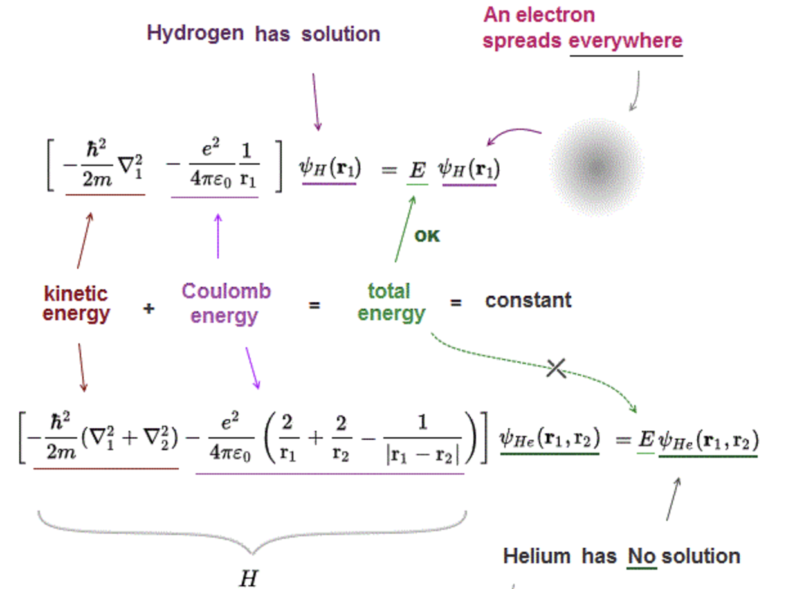
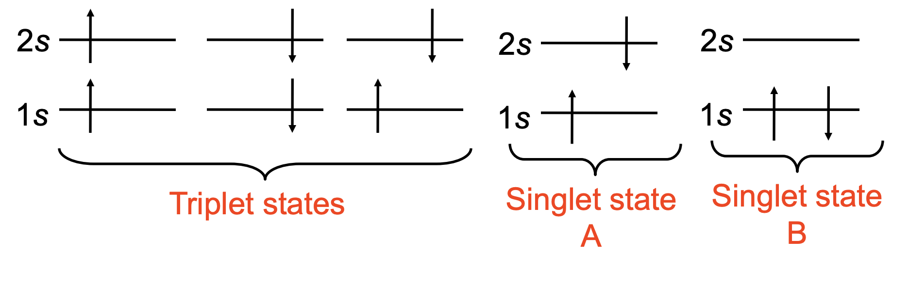
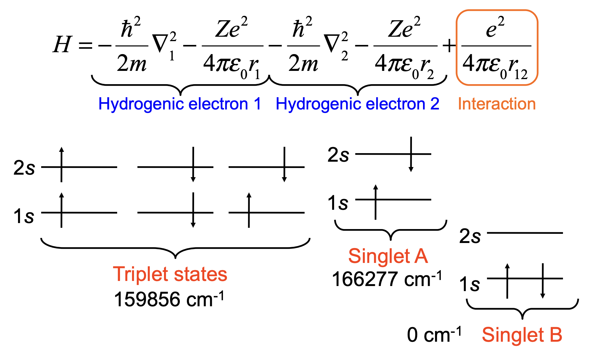
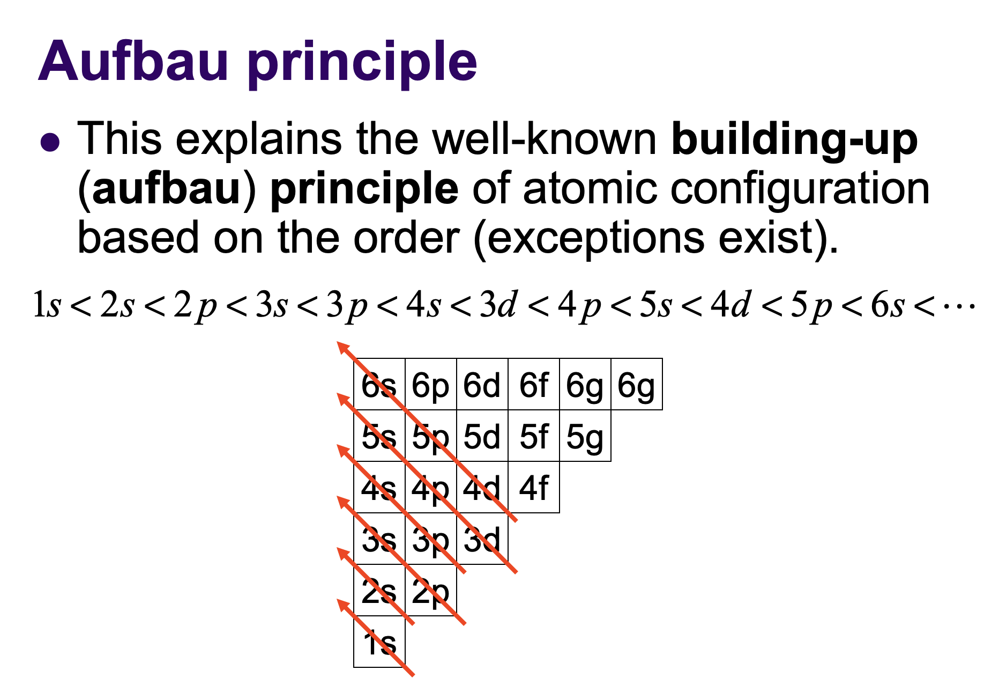
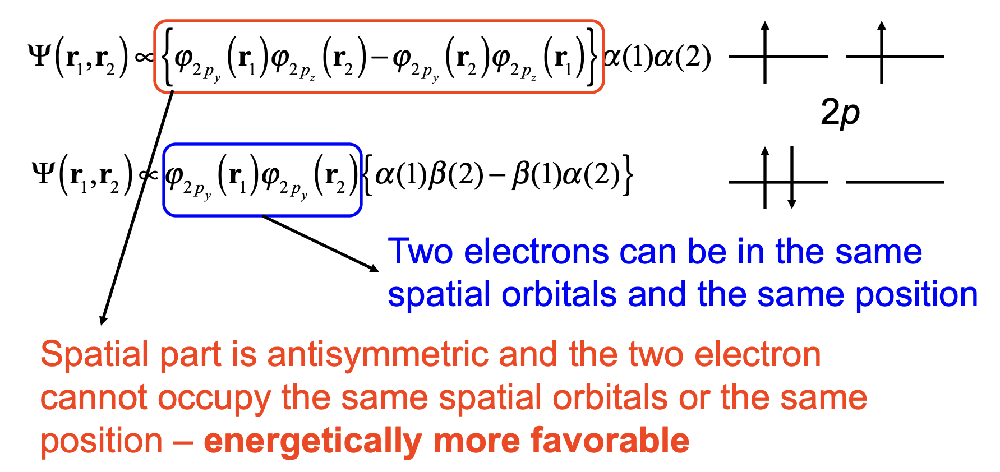

# Multi-electron atoms

:::{admonition} **What you need to know**

- We use the exact solutions of hydrogenic Schrödinger equation or orbitals to construct
**an approximate wave function of a manyelectron atom**, the helium and heavier atoms.
- Unlike the hydrogenic atom, the discussion here is approximate and some rules
introduced can have exceptions.
- **Spins and antisymmetry** put some constraints on the form of multielectron wavefunctions 
:::

## Orbital Approximation

:::{figure-md} markdown-fig

The difference between H and He Hamiltonians that makes the probelm unsolvable analytically. 
:::

- Unlike H atom for **many-electron atoms**, the Hamiltoninan and wavefunction depends on coordinates of multiple electonrs which can not be separated. Hence problem does not admit exact solution. 
- We can, however approximate multi-electorn wavefunction as product of **single electron wavefunctions called Orbitals.**
- Orbitals are determined computationally by choosing trial wavefunctions and finding parameters via variational method. 

:::{admonition} **Orbital Approximation**
:class: important

$$
\Psi(r_1, r_2, \ldots, r_n) \approx \phi_1(r_1)\phi_2(r_2)\ldots\phi_n(r_n)
$$

- $\Psi$ multielectron wavefunction describing probabilities of finding electrons in different parts of space. 
- $\phi_j(r_n)$ **Atomic ortbital** $n$ housing an electron $i$
:::

### Helium wavefunction

- For instance for the helium atom we first the orbital approximation:

$$\Psi(r_1, r_2) \approx \phi_1(r_1)\phi_2(r_2)$$

- But there are are some big problems with this wavefunction. 

1. **Electrons are fundmanentaly indistinguishable** Yet wavefunction says electron one is housed in orbtial 1 and electron 2 in orbtial 2. 

2. **Spin component of wavefunction is missing** We will see that spins put some constrains on the spatial part of wavefunction. 

3. **Electron-electron correlations** are ignored. That is each electron is "unaware of what the others are doing!. This can lead to quantiatively poor prediction of electronic energies. But here are techniques to account for correlation. 

### Issue 1: Indistinguishability and Antisymmetry Requirement

- **Subatomic particles are indistingusihable** this means wavefunction square must remain the same if we swap coordnates of those "particles". E.g 

$$|\psi(r_1, r_2)|^2 = |\psi(r_2, r_1)|^2$$

$$\psi(r_1, r_2) = \pm \psi(r_2, r_1)$$

- This leads to two possibilities for wavefunction to be symmetric or antisymmetric. Which one to pick?

- Electrons are fermions; Pauli have found that only by requiring **wavefunction of electrons must to be antisymmetric** (under interchange of electrons) does one get results in full agreement with experiments. We acept this as another QM postulate. 

:::{admonition} **antisymmetry of electronic wavefunctions**
:class: important 

$$
\Psi(\ldots, r_m, \ldots, r_n, \ldots) = -\Psi(\ldots, r_n, \ldots, r_m, \ldots)
$$

:::

- **How to make a function antisymmetric** As an example let u take a function with two arguments $f(x,y)$ and make it symmetric and antisymmetric with respect to arguments $x$ and $y$

- **Symmetrized functions:**

$$
g_+(x, y) = f(x, y) + f(y, x)
$$

- **Antisymmetrized functions:**

$$
g_-(x, y) = f(x, y) - f(y, x)
$$

- For Helium we can fix one of the issues by making wavefunction antisymmetric

$$
\Psi(r_1, r_2) \propto \phi_1(r_1)\phi_2(r_2) - \phi_1(r_2)\phi_2(r_1)
$$

### Issue 2: Spin Requirement

- Electrons have spin $\alpha$ or $\beta$. Spin factors must be included in the wavefunction. 
- And depending on their symmetry cordinate part can be iether symmetric or anti-symmetric to make **the total wavefunction anti-symmetric**

$$
\Psi(r_1, r_2) \propto \phi_1(r_1)\phi_2(r_2)\alpha(1)\beta(2)
$$

### Pauli exclusion principle

- Our previous wavefunction for He atom did not include electron spin. For two electrons, the spin functions can be written as products:

$${\alpha(1)\alpha(2)\textnormal{, }\beta(1)\alpha(2)\textnormal{, }\alpha(1)\beta(2)\textnormal{ or  }\beta(1)\beta(2)}$$

- Where, for example, $\alpha(1)$ indicates that electron 1 has spin $\alpha$. 

- **Electrons are indistinguishable** and therefore it makes no sense to try to use the two middle terms alone but combine them as:

$${\alpha(1)\alpha(2)\textnormal{ (symmetric)}}$$

$${\beta(1)\beta(2)\textnormal{ (symmetric)}}$$

$${\frac{1}{\sqrt{2}}\left(\alpha(1)\beta(2) + \alpha(2)\beta(1)\right)\textnormal{ (symmetric)}}$$

$${\frac{1}{\sqrt{2}}\left(\alpha(1)\beta(2) - \alpha(2)\beta(1)\right)\textnormal{ (antisymmetric)}}$$

- An important consequence of anti-symmetry requirement is **Pauli Exclusion Principle: No two electrons can have exactly the same quantum numbers.** 

- In order to construct a complete wavefunction for the ground state of He atom, we need to tag on the spin part to the wavefunction making sure that total wavefunction is anti-sysmetric

$${\psi = \frac{1}{\sqrt{2}}[1s(1)1s(2)+1s(2)1s(1)]\times\left(\alpha(1)\beta(2) - \alpha(2)\beta(1)\right)}$$

### Slater Determinants

- A generalization of antisimmetric wavefunctions for N electrons was proposed by Slater in 1929:

- The Slater determinant automatically ensures that the total wavefunction is antisymmetric. Note that from the mathematical point of view the antisymmetry requirement restricts the allowed solutions to the Schr\"odinger equation. The lowest energy solutions are typically symmetric and the antisymmetric states correspond to higher energy. 

$${
\psi(r_1,...,r_n) = \frac{1}{\sqrt{n!}}
\begin{vmatrix}
1s(1)\alpha(1) & 1s(1)\beta(1) & 2s(1)\alpha(1) & ... \\
1s(2)\alpha(2) & 1s(2)\beta(2) & 2s(2)\alpha(2) & ... \\
1s(3)\alpha(3) & ... & ... & ...\\
... & ... & ... & ...\\
\end{vmatrix}
}$$

- However, one must be careful with terminology here because only the antisymmetric states exist for electrons (Fermions) and as such they are the lowest energy (ground state) solutions for them. Particles that have symmetric wavefunctions are called Bosons (for example, $^4$He atoms).
- In general, particles with half-integral spin ($s = \frac{1}{2}, \frac{3}{2}, ...$) are Fermions (Fermi-Dirac statistics) and particles with integral spin ($s = 0, 1, 2, ...$) are Bosons (Bose-Einstein statistics). Note that electron spin enters the Hamiltonian only when external fields are present or when {spin-orbit} interaction is included (will be discussed later).

- For the ground state of He the Slater determinant is:

$${
\psi(r_1,r_2) = \frac{1}{\sqrt{2}}\begin{vmatrix}
1s(1)\alpha(1) & 1s(1)\beta(1)\\
1s(2)\alpha(2) & 1s(2)\beta(2)\\
\end{vmatrix}
}$$

:::{admonition} **Slater determinant for ground state of Li**
:class: note, dropdown

- For helium atom the singlet/triplet consideration is only relevant for the excited states but for atoms with more electrons this may have to be considered in order to determine the ground state. 

- When more electrons are added, the wavefunction becomes more complicated. For example, the Slater determinant for Li can be written as:

$${\psi = \frac{1}{\sqrt{6}}
\begin{vmatrix}
1s(1)\alpha(1) & 1s(1)\beta(1) & 2s(1)\alpha(1)\\
1s(2)\alpha(2) & 1s(2)\beta(2) & 2s(2)\alpha(2)\\
1s(3)\alpha(3) & 1s(3)\beta(3) & 2s(3)\alpha(3)\\
\end{vmatrix}
}$$

- Note that the last column could have been labeled as $\beta$ as well (degeneracy).

:::

:::{admonition} **Example**
:class: note

Show that the Slater determinant in for the ground state helium atom is an eigenfunction of the total spin operator $\hat{S}_{z,tot} = \hat{S}_{z_1} + \hat{S}_{z_2}$, where 1 and 2 refer to the two electrons.
:::

:::{admonition} **solution** 
:class: note, dropdown

- irst we recall how $\hat{S}_z$ operates on electron spin as follows:

$$\hat{S}_z|\alpha\rangle = +\frac{\hbar}{2}|\alpha\rangle\textnormal{ and }\hat{S}_z|\beta\rangle = -\frac{\hbar}{2}|\beta\rangle$$

- Next, we expand the Slater determinant:

$$\psi = \overbrace{1s(1)1s(2)}^{\textnormal{symmetric}}\times\overbrace{\frac{1}{\sqrt{2}}\left(\alpha(1)\beta(2) - \alpha(2)\beta(1)\right)}^{\textnormal{antisymmetric}}$$

Operate on this by $\hat{S}_{z_1}$ and $\hat{S}_{z_2}$. They operate only on the spin-part and on the corresponding electron only:

$$\hat{S}_{z_1}|\psi\rangle = |1s(1)1s(2)\rangle\times\frac{1}{\sqrt{2}}\left(\frac{\hbar}{2}|\alpha(1)\beta(2)\rangle + \frac{\hbar}{2}|\beta(1)\alpha(2)\rangle\right)$$

$$\hat{S}_{z_2}|\psi\rangle = |1s(1)1s(2)\rangle\times\frac{1}{\sqrt{2}}\left(-\frac{\hbar}{2}|\alpha(1)\beta(2)\rangle - \frac{\hbar}{2}|\beta(1)\alpha(2)\rangle\right)$$

$$\Rightarrow\textnormal{ }\hat{S}_{z,tot}|\psi\rangle = \left(\hat{S}_{z_1} + \hat{S}_{z_2}\right)|\psi\rangle = \hat{S}_{z_1}|\psi\rangle + \hat{S}_{z_2}|\psi\rangle = 0$$

- Note that the two terms are equal in magnitude but have opposite signs and they cancel. Thus the eigenvalue of the $z$-component of the total spin is zero. It can also be shown that $S^2 = 0$. This kind of electronic configuration is called a singlet state (i.e. the two electrons have opposite spins).
:::

### Singlet vs Triplet states of He atom

- Previously we had both electrons on $1s$ orbital with opposite spins. If the electrons reside on two different orbitals, for example, $1s$ and $2s$, we would have an excited helium atom. Such state can be created experimentally by a suitable high-energy process (laser induced break-down etc.). 

- The spatial part of the wavefunction is $\psi = 1s(1)2s(2)$. It could as well be $\psi = 2s(1)1s(2)$ as we cannot distinguish the electrons from each other. Obviously we must form a linear combination of these so that both electrons appear identical (two possibilities):

$${\psi_{sym} = \frac{1}{\sqrt{2}}\left(1s(1)2s(2) + 1s(2)2s(1)\right)\textnormal{ (symmetric)}}$$

$${\psi_{asym} = \frac{1}{\sqrt{2}}\left(1s(1)2s(2) - 1s(2)2s(1)\right)\textnormal{ (antisymmetric)}}$$

- Note that these two states may have different energies. Next, we consider adding the spin part to these wavefunctions. Because the electrons are on two different orbitals, we have the following four possibilities:

$$
\left.\begin{matrix}
\phi_1 = \alpha(1)\alpha(2)\textnormal{ (symmetric)}\\
\phi_2 = \beta(1)\beta(2)\textnormal{ (symmetric)}\\
\phi_3 = \frac{1}{\sqrt{2}}\left(\alpha(1)\beta(2) + \beta(1)\alpha(2)\right)\textnormal{ (symmetric)}\\
\end{matrix}\right\rbrace\textnormal{ Triplet state}
$$

$$
\left.\phi_4 = \frac{1}{\sqrt{2}}\left(\alpha(1)\beta(2) - \beta(1)\alpha(2)\right)\right\rbrace\textnormal{ Singlet state}
$$

- Before we can combine the spatial and spin wavefunctions, we must consider the symmetries of these functions. Remember that the total wavefunction must be antisymmetric. Thus the allowed combinations are: symmetric (spatial) $\times$ antisymmetric (spin) or antisymmetric (spatial) $\times$ symmetric (spin). 

- **Triplet state of He** 

$${\psi_1 = \frac{1}{\sqrt{2}}\left(1s(1)2s(2) - 2s(1)1s(2)\right)\alpha(1)\alpha(2)}$$

$${\psi_2 = \frac{1}{2}\left(1s(1)2s(2) - 2s(1)1s(2)\right)\left(\alpha(1)\beta(2) + \beta(1)\alpha(2)\right)}$$

$${\psi_3 = \frac{1}{\sqrt{2}}\left(1s(1)2s(2) - 2s(1)1s(2)\right)\beta(1)\beta(2)}$$

- **Singlet state of He** 

$${\psi_4 = \frac{1}{2}\left(1s(1)2s(2) + 2s(1)1s(2)\right)\left(\alpha(1)\beta(2) - \alpha(2)\beta(1)\right)}$$

### Action of spin operator on Singlet and Triplet state

- Singlet and triplet states have been named after the number of spin degenerate levels they posses. The total spin $\hat{S}^2$ and $\hat{S}_z$ operators for these states yield:

$${
\textnormal{Triplet: }\left\lbrace\begin{matrix}
\hat{S}_z|\psi_1\rangle = +\hbar|\psi_1\rangle\textnormal{, }\hat{S}_z|\psi_2\rangle = 0|\psi_2\rangle\textnormal{, }\hat{S}_z|\psi_3\rangle = -\hbar|\psi_3\rangle\\
\hat{S}^2|\psi_i\rangle = 2\hbar^2|\psi_i\rangle\textnormal{ where }i=1,2,3.\\
\end{matrix}\right.
}$$

$${
\textnormal{Singlet: }\left\lbrace\begin{matrix}
\hat{S}_z|\psi_4\rangle = 0|\psi_4\rangle\\
\hat{S}^2|\psi_4\rangle = 0|\psi_4\rangle\\
\end{matrix}\right.
}$$

## Computing total energy with multi-electron wavefunctions

- The total energy of a system of two electrons includes contributions from both Coulomb and exchange interactions. For singlet and triplet states, we use specific forms of the wavefunctions to evaluate these terms.

1. **Hamiltonian**:

   $$
   \hat{H} = \hat{H}_1 + \hat{H}_2 + \hat{H}_{12}
   $$

   where:
   - $\hat{H}_1 = -\frac{\hbar^2}{2m}\nabla_1^2 - \frac{Ze^2}{4\pi\epsilon_0 r_1}$
   - $\hat{H}_2 = -\frac{\hbar^2}{2m}\nabla_2^2 - \frac{Ze^2}{4\pi\epsilon_0 r_2}$
   - $\hat{H}_{12} = \frac{e^2}{4\pi\epsilon_0 r_{12}}$ (electron-electron repulsion)

2. **Wavefunctions**:

   
   - **Singlet State** (symmetric spatial, antisymmetric spin):

     $$
     \Psi_{\text{singlet}}(r_1, r_2) = \frac{1}{\sqrt{2}} \left[\phi_1(r_1)\phi_2(r_2) + \phi_1(r_2)\phi_2(r_1)\right] \cdot \frac{1}{\sqrt{2}} \left[\alpha(1)\beta(2) - \beta(1)\alpha(2)\right]
     $$

   - **Triplet State** (antisymmetric spatial, symmetric spin):

     $$
     \Psi_{\text{triplet}}(r_1, r_2) = \frac{1}{\sqrt{2}} \left[\phi_1(r_1)\phi_2(r_2) - \phi_1(r_2)\phi_2(r_1)\right] \cdot \text{spin combinations (e.g., } \alpha(1)\alpha(2))
     $$

3. **Energy Expression**:

   $$
   E = \int \Psi^*(r_1, r_2) \hat{H} \Psi(r_1, r_2) \, d\tau_1 d\tau_2
   $$
   

   $$
   E = \langle \Psi | \hat{H}_1 | \Psi \rangle + \langle \Psi | \hat{H}_2 | \Psi \rangle + \langle \Psi | \hat{H}_{12} | \Psi \rangle
   $$

### Coulomb and Exchange Contributions

:::{admonition} **single electron energy $I$**
:class: important

$$
I(a) = \int \phi_a^*(r) \left[ -\frac{\hbar^2}{2m} \nabla^2 - \frac{Z e^2}{4\pi \epsilon_0 r} \right] \phi_a(r) \, d\tau
$$

:::

:::{admonition} **Coulomb Integral ($J$)**
:class: important

$$
J_{ij} = \int |\phi_i(r_1)|^2 \frac{e^2}{4\pi\epsilon_0 r_{12}} |\phi_j(r_2)|^2 \, d^3r_1 \, d^3r_2
$$

:::

- Describes **direct electron-electron repulsion** and is always positive
$$
J>0
$$

:::{admonition} **Exchange Integral ($K$)**
:class: important

$$
K_{ij} = \int \phi_i^*(r_1)\phi_j^*(r_2) \frac{e^2}{4\pi\epsilon_0 r_{12}} \phi_j(r_1)\phi_i(r_2) \, d^3r_1 \, d^3r_2
$$

:::

- Purely quantum terms. Arises because electrons with parallel spins (in a triplet state) avoid occupying the same spatial region.
- This reduces their Coulomb repulsion, effectively creating a stabilizing effect even though $K$ tself is positive

$$
K>0
$$

### Ground state of He, $1s^2$

- Denoting spin part by $\sigma_{s, ms}$ compact notation where $s$ denotes total spin and $m_s$ possible spin projections we have the triplet and singlet state wavefunctions:

$$
\Psi(1, 2) = \frac{1}{\sqrt{2}} \psi_{1s}(1)\psi_{1s}(2) \cdot \sigma_{0,0}(1, 2)
$$

Plugging in symmetric wavefunction into energy expression we get

$$
E = I(1s) + I(2s) +J(1s,1s)
$$

### Which Excited State should we pick?

### Spin configuration matters!

### Excited States of Helium $1s2s$

$$
\Psi_+(1, 2) = \frac{1}{\sqrt{2}} \left[ \psi_{1s}(1)\psi_{2s}(2) + \psi_{2s}(1)\psi_{1s}(2) \right] \sigma_{0,0}(1, 2)
$$

- The three triplet states are given by:

$$
\Psi_-(1, 2) = \frac{1}{\sqrt{2}} \left[ \psi_{1s}(1)\psi_{2s}(2) - \psi_{2s}(1)\psi_{1s}(2) \right] 
$$

- with three spin functions: $\{\sigma_{1,1}(1, 2), \sigma_{1,0}(1, 2), \sigma_{1,-1}(1, 2)\}$

- Next we plug in the singlet and triplet states into energy expression:

$$E_{\pm} = \langle \Psi_{\pm}(1, 2) |\hat{H}|\Psi_{\pm}(1, 2)\rangle$$

- The **triplet sate** gets stabilized becasue of the exchange integral

  $$
  E_{\text{triplet}} = I(1s) + I(2s) + J(1s, 2s) - K(1s, 2s)
  $$

- The **singlet state**, of He $1s2s$ configuration get destabilized because of the exchange integral

  $$
  E_{\text{singlet}} = I(1s) + I(2s) + J(1s, 2s) + K(1s, 2s)
  $$

### Hund's rule and Aufbau principle

:::{figure-md} markdown-fig

The Aufbau principle dictates how electron configurations are built starting from the lowest energy orbitals and moving to higher energy orbitals. 
:::

- **Definition of Aufbau Principle**: The Aufbau principle (German for "building up") describes the process of filling atomic orbitals with electrons in a stepwise manner, starting from the lowest energy orbitals and moving to higher energy orbitals. 
  

- **Pauli Exclusion Principle**: The Pauli Exclusion Principle states that no two electrons in an atom can have the same set of four quantum numbers ($n$, $l$, $m_l$, $m_s$). 
  - As a result, each orbital can hold a maximum of **two electrons** with opposite spins ($m_s = +\frac{1}{2}$ and $m_s = -\frac{1}{2}$). 
  - This constraint determines how many electrons can occupy each subshell and thus influences how orbitals are filled according to the Aufbau principle.

:::{figure-md} markdown-fig

The triplet state of the $1s\,2s$ configuration is lower in energy than the singlet state due to the stabilizing effect of the exchange integral $K$. This behavior is almost universal and contributes to **Hund’s Rule**.
:::

- **Hund's Rules**: Hund's Rules state that for orbitals of the same energy (degenerate orbitals), electrons fill them singly first with parallel spins before pairing up. 
  - This minimizes electron-electron repulsion and stabilizes the system. 
  - When applying the Aufbau principle, this means that electrons will occupy different orbitals within the same subshell before pairing, which is why orbitals like the **p, d, and f** subshells are first filled with one electron in each orbital before pairing occurs.

- **Orbital Filling Order**: Orbitals are filled according to the increasing energy sequence: **1s, 2s, 2p, 3s, 3p, 4s, 3d, 4p, 5s, 4d, 5p**, and so on. 
  - The order is determined by the **n + l rule**, with orbitals of lower **n + l** value being filled first. For orbitals with the same **n + l** value, the one with the lower **n** value is filled first.

- **Significance in Electronic Configurations**: The Aufbau principle allows for the prediction of **ground-state electronic configurations** for atoms and ions. 
  - For example, the electron configuration of **oxygen (O)** is **1s² 2s² 2p⁴**, which follows the Aufbau principle, Pauli exclusion principle, and Hund's rule. 
  - Deviations from the Aufbau principle, like those seen in **transition metals** (e.g., Cr: [Ar] 3d⁵ 4s¹ instead of [Ar] 3d⁴ 4s²), arise due to additional stability from half-filled and fully filled subshells.

- **Role in Chemical Bonding and Reactivity**:  The Aufbau principle explains the arrangement of valence electrons, which are crucial for understanding **bonding, ionization energy, and reactivity**. 
  - For example, the chemical behavior of **alkali metals** (like Na) is directly related to their valence configuration (e.g., **[Ne] 3s¹**) predicted by the Aufbau principle.

