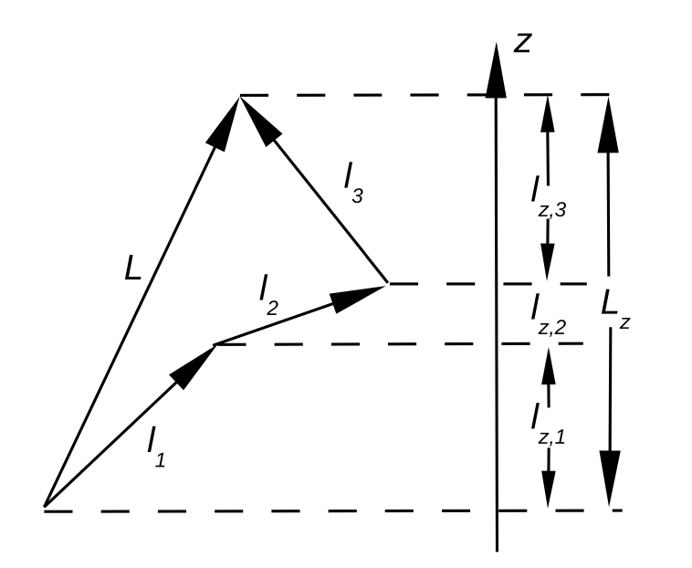
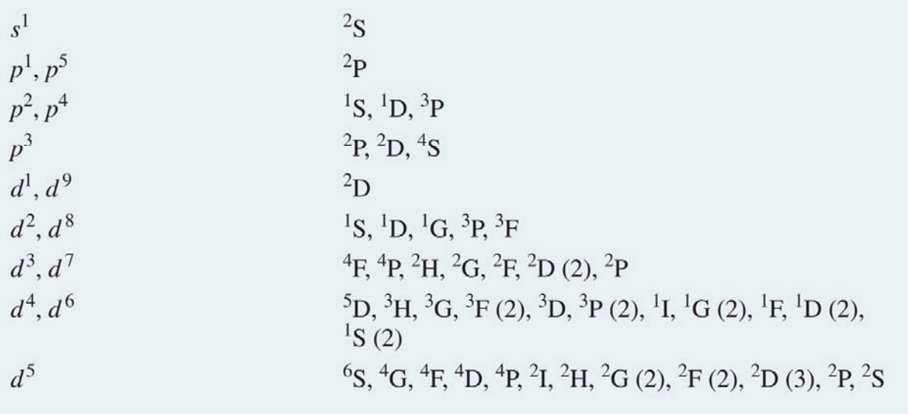
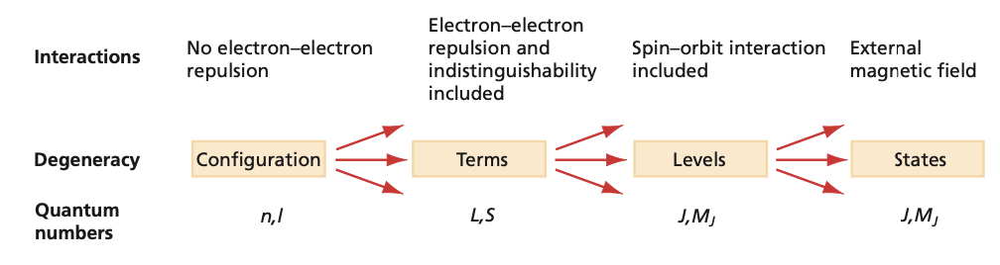
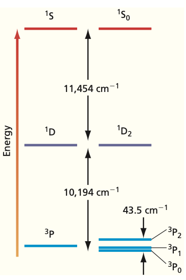
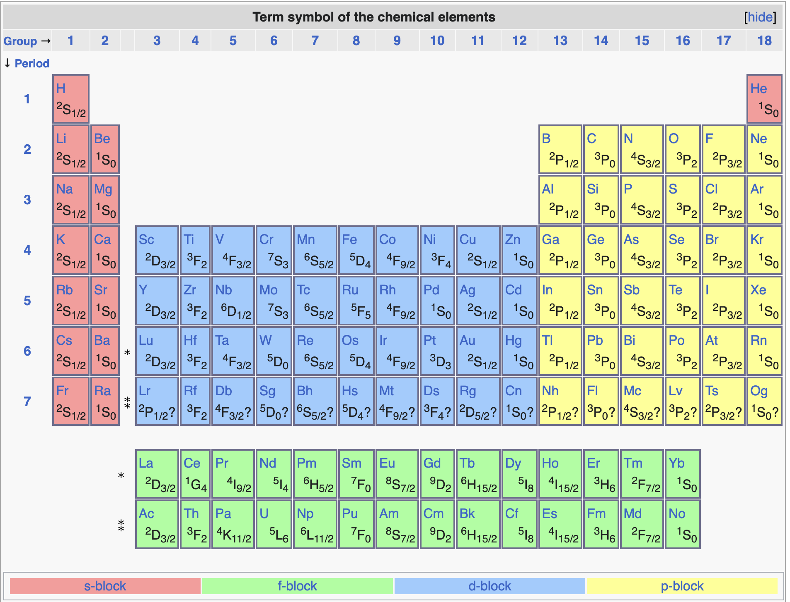
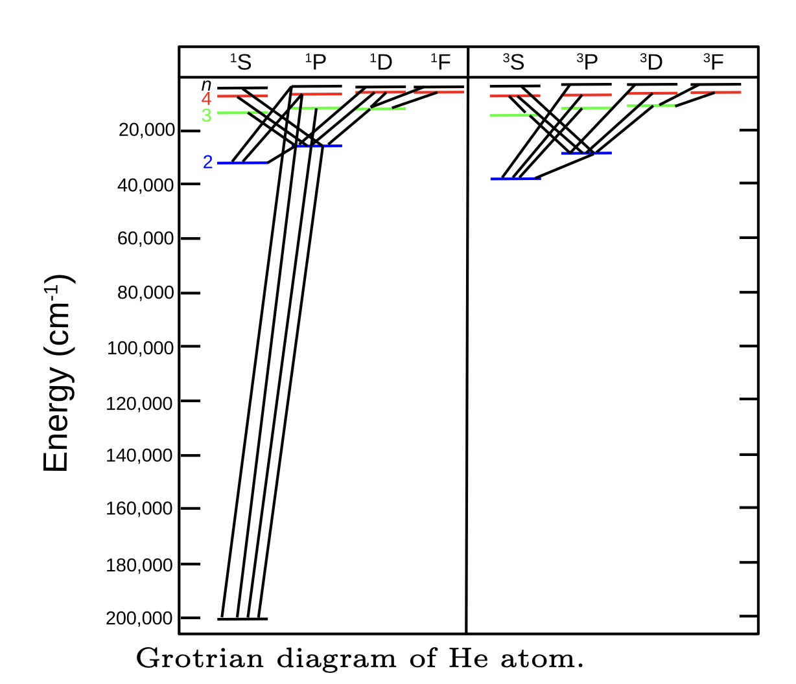

#  Angular momentum of many-electron atoms 

:::{admonition} **What you need to know**

- Total orbital angular momentum $\hat{L} = \sum_{i=1}^N \hat{l}_i$ quantifies the combined angular momentum of all electrons, with quantized values of $L$ ranging from $|l_1 - l_2|$ to $l_1 + l_2$.
- Total spin angular momentum $\hat{S} = \sum_{i=1}^N \hat{s}_i$ follows a similar quantization rule, with possible $S$ values for two electrons being 1 (triplet) or 0 (singlet).
- The total angular momentum $\hat{J} = \hat{L} + \hat{S}$ combines orbital and spin contributions, with $J$ taking values from $|L - S|$ to $L + S$.
- Term symbols are written as $^{2S+1}L_J$ where $2S+1$ is spin multiplicity, $L$ is the total orbital momentum (S, P, D, F, etc.), and $J$ is the total angular momentum.
- Hund's rules state that (1) the highest spin multiplicity ($2S+1$) lies lowest in energy, (2) for same $S$, the highest $L$ is lowest in energy, and (3) for same $S$ and $L$, the smallest $J$ is lowest for less-than-half-filled subshells, while the largest $J$ is lowest for more-than-half-filled subshells.
- Spin-orbit interaction couples $\vec{L}$ and $\vec{S}$ via $\hat{H}_{SO} = A , \vec{\hat{L}} \cdot \vec{\hat{S}}$, causing fine-structure splitting, especially in heavier atoms.
- Selection rules for allowed transitions are $\Delta l = \pm 1$, $\Delta L = 0, \pm 1$ (except $L = 0 \to L = 0$), $\Delta J = 0, \pm 1$ (except $J = 0 \to J = 0$), and $\Delta S = 0$ (spin does not change).
- In light atoms, Russell-Saunders ($LS$) coupling applies, meaning $L$, $S$, and $J$ are all good quantum numbers, but in heavier atoms, spin-orbit coupling dominates, and $J$ becomes the only good quantum number.
- The ground state term symbol of an atom is determined using Hund's rules, e.g., He (1s$^2$) has term symbol $^1$S$_0$, while C (1s$^2$ 2s$^2$ 2p$^2$) has term symbol $^3$P$_0$.
- Light-matter interaction occurs via electric (UV/Vis, IR, fluorescence) and magnetic (NMR, EPR) fields, with selection rules derived from conservation of angular momentum and symmetry constraints.
:::

### Vector model for adding 3 angular momenta

:::{figure-md} markdown-fig

Vector addition model to determine quantization of angular momentum
:::

- In many-electron atoms, each electron has both orbital and spin angular momenta. First, for simplicity, consider only the total orbital angular momentum operator:

$${\hat{L} = \sum\limits_{i=1}^{N} \hat{l}_i}$$

- Where $N$ is the number of electrons and $\hat{l}_i$ is the angular momentum operator for electron $i$. The projection operator along the $z$-axis is then given by:

$${\hat{L}_z = \sum\limits_{i=1}^{N} \hat{l}_{z,i}}$$

$${M_L = \sum\limits_{i=1}^{N}m_i}$$

- $\vec{L}$ = Total orbital angular momentum.
- $\vec{l}_1, \vec{l}_2, \vec{l}_3$ = individual angular momenta.

- $\hat{L}, \hat{l}_i$ are operators; $L, l_i$ are the corresponding quantum numbers.
- We assume a light atom and thus neglect the spin-orbit coupling.

### Total orbital angular momentum in a many-electron atom.

- Consider an atom with two electrons each with orbital angular momentum $l_1$ and $l_2$, respectively. The maximum total angular momentum is obtained when the two angular momenta vectors are parallel: $L = l_1 + l_2$. When they point in opposite directions, we have: $L = l_1 - l_2$.

- Hence the total angular momentum quantum number $L$ can take values (``Glebsch-Gordan series''):

:::{admonition} **Quantization of Angular momentum $L$**
:class: important 

$${L = l_1 + l_2, l_1 + l_2 - 1, ..., \left|l_1 - l_2\right|}$$

:::

- where $l_1$ and $l_2$ are the angular momentum quantum numbers for electrons 1 and 2, respectively. For example, if we have two electrons on $p$-orbitals, the above gives: $L = 2, 1$ or $0$. 
- Furthermore, for $L = 2$, we can have $M_L = +2, +1, 0, -1, -2$; for $L = 1$, $M_L = +1, 0, -1$; and $L = 0$, $M_L = 0$. It is instructive to check that we actually have the same number of states in both representations (i.e., the uncoupled vs. the coupled representation). 
- In the uncoupled representation: $3^2 = 9$ states (3 $p$-orbitals and 2 electrons) and in the coupled 5 + 3 + 1 = 9.

- Usually closed shell inner core electrons are not included in the consideration as they don't contribute to the end result.

### Total spin angular momentum in many-electron atom.

The total spin angular momentum operator for a many-electron atom is given by:

$${\hat{S} = \sum\limits_{i=1}^{N}\hat{s}_i}$$

and the $z$-component of the total spin angular momentum operator is defined as:

$${\hat{S}_z = \sum\limits_{i=1}^{N}\hat{s}_{z,i}}$$

Here $\hat{s}_i$ and $\hat{s}_{z,i}$ refer to spin angular momenta of the individual electrons. In similar fashion to (\ref{eq10.98}), total quantum number $M_S$ can be written:

$${M_S = \sum\limits_{i=1}^{N} m_{s,i}}$$

This value can range from $-S$ to $S$ and the total quantum number $S$ is given by:

:::{admonition} **Quantization of Spin Angular momentum $S$**
:class: important 

$${S = s_1 + s_2, s_1 + s_2 - 1, ..., \left|s_1 - s_2\right|}$$

:::

- For example, for two electrons, $S = 1$ ("triplet state'') or $S = 0$ ("singlet state").

### The total angular momentum (combined orbital and spin).

The total angular momentum operator $\hat{J}$, is as a vector sum of $\hat{L}$ and $\hat{S}$:

$${\vec{\hat{J}} = \vec{\hat{L}} + \vec{\hat{S}}}$$

$${\hat{J}_z = \hat{L}_z + \hat{S}_z}$$

The total quantum number $J$ with the corresponding total magnetic quantum number $M_J$ is given by:

:::{admonition} **Quantization of Total Angular momentum $J$**
:class: important 

$${J = L + S, L + S - 1, ..., \left|L - S\right|}$$

$${M_J = M_L + M_S}$$
:::

- The previous coupling scheme is called the $LS$ coupling or **Russell-Saunders coupling**. 

- This approach is only approximate when spin-orbit coupling is included in the Hamiltonian. Spin-orbit interaction arises from relativistic effects and its origin is not considered here. Instead, it should be simply thought to couple the orbital and spin angular momenta to each other with some given magnitude (``spin-orbit coupling constant'').
- Note that the spin-orbit effect is larger for heavier atoms. For these atoms the $LS$ coupling scheme begins to break down and only $J$ remains a good quantum number. This means that, for example, one can no longer speak about singlet and triplet electronic states. The $LS$ coupling scheme works reasonably well for the first two rows in the periodic table.

### Atomic terms and selection rules

:::{figure-md} markdown-fig

Possible Atomic terms for given electronic configurations
:::

In the table above we see various term symbols that can correspond to given electronic configurations. This term symbol contains information about the total orbital and spin angular momenta as well as the total angular momentum (i.e., $J = L + S$). This is expressed as follows:

:::{admonition} **Term Symbols**
:clss: important

$${^{2S+1}L_J}$$

- $S$ is the total spin
- $L$ is the total angular momentum 
- $J$ is the total angular momentum  
:::

- Both $2S+1$ and $J$ are expressed as numbers and for $L$ we use a letter: S for $L = 0$, P for $L = 1$, D for $L = 2$, etc. $2S+1$ is referred to as spin
multiplicity (1 = singlet, 2 = doublet, 3 = triplet, ...). 
- The term symbol specifies the ground state electronic configuration exactly. Note that column 6 in the table, is much longer and it ignores the exact configuration of electron spins. Note that only the valence electrons contribute to the term symbol.

- Becasue of electron-electron interactions and spin-orbit coupling we expect splitting of energy levels which can be decribed by various term Symbols

:::{figure-md} markdown-fig

Relationship of configura- tions, terms, levels, and states. The top row of the diagram indicates degree of approximation and type of interaction; the second row shows the group of states that are degenerate in energy; and the bottom row indicates the good quantum numbers in each level of approximation.
:::

:::{figure-md} markdown-fig

Relationship of terms and levels for carbon. For a carbon atom, assuming a spherically symmetric electron distribu- tion, a single energy state is allowed. Considering the dependence of electron repulsion on directions of L and S, the single state is split into terms of different energy, in this case 3P, 1D, and 1S. Further considering the coupling of L and S leads to an additional splitting of the terms
into levels according to the J values, in this case $^1S_0, ^1D_2, ^3P_2, ^3P_1$, and $^3P_0$. The separation of the levels for the 3P term has been multiplied by a factor of 25 to make it visible.
:::

:::{admonition} **Example**
:class: note

What is the atomic term symbol for He atom in its ground state?

:::

:::{admonition} **Solution**
:class: note, dropdown

The electron configuration in He is 1s$^2$ (i.e., two electrons on 1s orbital with opposite
spins). First we need to obtain $S$. We have two possibilities: $S = 1$ (triplet) or $S = 0$
(singlet). However, since we are interested in the ground state, both electrons are on 1s
orbital and hence they must have opposite spins giving a singlet state. Thus $S = 0$
and $2S + 1 = 1$. Since both electrons reside on s-orbital, $l_1 = l_2 = 0$ and $L = 0$.
The total monentum is $J = L + S = 0 + 0 = 0$. The term symbol is therefore $^1$S$_0$.
:::

:::{admonition} **Example**
:class: note

What are the lowest lying state term symbols for a carbon atom?

:::

:::{admonition} **Solution**
:class: note, dropdown

- The electronic configuration for ground state C is 1s$^2$2s$^2$2p$^2$. To get the possible lowest lying states, we only consider the two $p$-electrons. From Eq. (\ref{eq10.103}) we get: $S = \frac{1}{2} + \frac{1}{2} = 1$ or $S = 0$. The first case corresponds to triplet and the last singlet state. The total orbital angular momentum quantum numbers are given by Eq. (\ref{eq10.99}): $L = 2,1,0$, which correspond to D, P and S terms, respectively. Again, because the electrons must have opposite spins when the go on the same orbital, some $S$ and $L$ combinations are not possible. Consider the following scenarios:\\

1. $L = 2$ (D term): One of the states ($M_L = -2$) must correspond to configuration, where both electrons occupy a $p$-orbital having $m_l = -1$. Note that the electrons must go on the above orbital with opposite spins and therefore
the triplet state, where the electrons could be parallel, is not allowed:

Thus we conclude that for $L = 2$, only the singlet state (i.e., $^1$D) is possible.

2. $L = 1$ (P term): The three eigen states correspond to:

In principle, all these configurations could also be written for the singlet state but it requires a more complicated consideration to see that this is \textit{not allowed} (see below).

3. $L = 0$ (S term): For this term we can only have $M_L = 0$, which corresponds to:

- Again, it is not possible to have triplet state because the spins would have to be parallel on the same orbital. Hence only $^1$S exists.

- We conclude that the following terms are possible: $^1$D, $^3$P and $^1$S. As we will see below, the Hund's rules predict that the $^3$P term will be the ground state (i.e., the lowest energy). The total angular momentum quantum number $J$ for this state may have the following values: $J = L + S = 2, 1$, or $0$. Due to spin-orbit coupling, these states have different energies and the Hund’s rules predict that the $J = 0$ state lies lowest in energy. Therefore the $^3$P$_0$ state is the ground state of C atom.

- The above method is fast and convenient but does not always work and is not able to show that $^1$P does not exist. In the following (for carbon) we will list each possible electron configuration (microstate), label them according to their $M_L$ and $M_S$ numbers, count how many times each ($M_L$,$M_S$) combination appears and decompose this information into term symbols. The total number of possible microstates $N$ is given by:

$${N = \frac{(2(2l+1))!}{n!(2(2l+1) - n)!}}$$

- where $n$ is the number of electrons and $l$ is the orbital angular momentum quantum number (e.g., 1 for $p$ orbitals, 2 for $d$, etc.). Next we need to count how many states of each $M_L$ and $M_S$ we have:

- The total number of ($M_L$,$M_S$) combinations appearing above are counted in the following table and its decomposition into term symbols is demonstrated (note that $^1$P does not exist).

:::{admonition} **Exercise**
:class: note

Carry out the above procedure for oxygen atom (4 electrons distributed on $2p$ orbitals). What are resulting the atomic term symbols?

:::

### Hund's (partly empirical) rules are:

- The term arising from the ground configuration with the **maximum multiplicity ($2S + 1$)** lies lowest in energy.
    - For levels with the same multiplicity, the one with the **maximum value of $L$** lies lowest in energy.
    - For levels with the same $S$ and $L$ (but different $J$), the lowest energy state depends on the extent to which the subshell is filled:
        - If the subshell is less than half-filled, the state with the smallest value of $J$ is the lowest in energy.
        - If the subshell is more than half-filled, the state with the largest value of $J$ is the lowest in energy.

:::{figure-md} markdown-fig

Terms for ground states of elements in the periodic table 
:::

### Spin-orbit interaction

- This relativistic effect can be incorporated into non-relativistic quantum mechanics by including the following term into the Hamiltonian:

$${\hat{H}_{SO} = A\vec{\hat{L}}\cdot \vec{\hat{S}}}$$

- where $A$ is the spin-orbit coupling constant and $L$ and $S$ are the orbital and spin angular momentum operators, respectively. 
- The total angular momentum $J$ commutes with both $\hat{H}$ and $\hat{H}_{SO}$ and therefore it can be specified simultaneously with energy. We say that the corresponding quantum number $J$ remains good even when spin-orbit interaction is included whereas $L$ and $S$ do not. 
- The operator dot product $\hat{L}\cdot \hat{S}$ can be evaluated and expressed in terms of the corresponding quantum numbers:

$${\vec{\hat{L}}\cdot\vec{\hat{S}}\left|\psi_{L,S,J}\right> = \frac{1}{2}\left[J(J+1)-L(L+1)-S(S+1)\right]\left|\psi_{L,S,J}\right>}$$

- For example in alkali atoms ($S = 1/2, L = 1$), the spin-orbit interaction breaks the degeneracy of the excited $^2$P state ($^2$S$_{1/2}$ is the ground state):

### Atomic spectra and selection rules

- The following selection rules for photon absorption or emission in **one-electron atoms** can be derived by considering the symmetries of the initial and final state wavefunctions (orbitals)

$${\Delta n = \textnormal{unrestricted},\,\, \Delta l = \pm 1,\,\, \Delta m_l = +1, 0, -1}$$

- where $\Delta n$ is the change in the principal quantum number, $\Delta l$ is the change in orbital angular momentum quantum number and $\Delta m_l$ is the change in projection of $l$. 

- Qualitatively, the selection rules can be understood by **conservation of angular momentum.**
    - Photons are spin 1 particles with $m_l = +1$ (left-circularly polarized light) or $m_l = -1$ (right-circularly polarized light). 
    - When a photon interacts with an atom, the angular momentum in it may chance only by $+1$ or $-1$; just like in the selection rules above.

### Selection rules for mulit-electron atoms

:::{figure-md} markdown-fig

Allowed electronic transitions of He atom
:::

1.  $\Delta L = 0, \pm 1$ except that transition from $L = 0$ to $L = 0$ does not occur.
2. $\Delta l = \pm 1$ for the electron that is being excited (or is responsible for fluorescence).
3. $\Delta J = 0, \pm 1$ except that transition from $J = 0$ to $J = 0$ does not occur.
4. $\Delta S = 0$. The electron spin does not change in optical transition. The exact opposite holds for magnetic resonance spectroscopy, which deals with changes in spin states.

- In some exceptional cases, these rules may be violated but the resulting transitions will be extremely weak (""forbidden transitions"). Because of the last rule, some excited triplet states may have very long lifetime because the transition to the ground singlet state is forbidden (metastable states).

### Nature of light matter interaction

- Note that light is electromagnetic radiation and, as such, it has both electric and magnetic components. The oscillating electric field component is used in driving transitions in optical
spectroscopy (UV/VIS, fluorescence, IR) whereas the magnetic component is used in magnetic resonance spectroscopy (NMR, EPR/ESR). 
- Photon emission from an atom (e.g., fluorescence) is rather difficult to understand with the quantum mechanical machinery that we have developed so far.
- The plain Schrodinger equation would predict that excited states in atoms would have infinite lifetime in vacuum. However, this is not observed in practice and atoms/molecules return to ground state by emitting a photon. This transition is caused by fluctuations of electric field in vacuum (see your physics lecture notes).