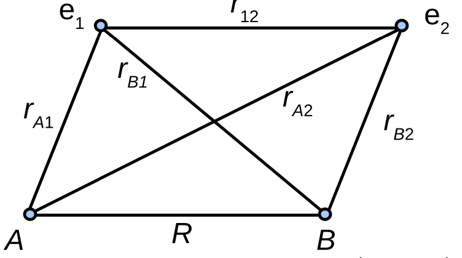
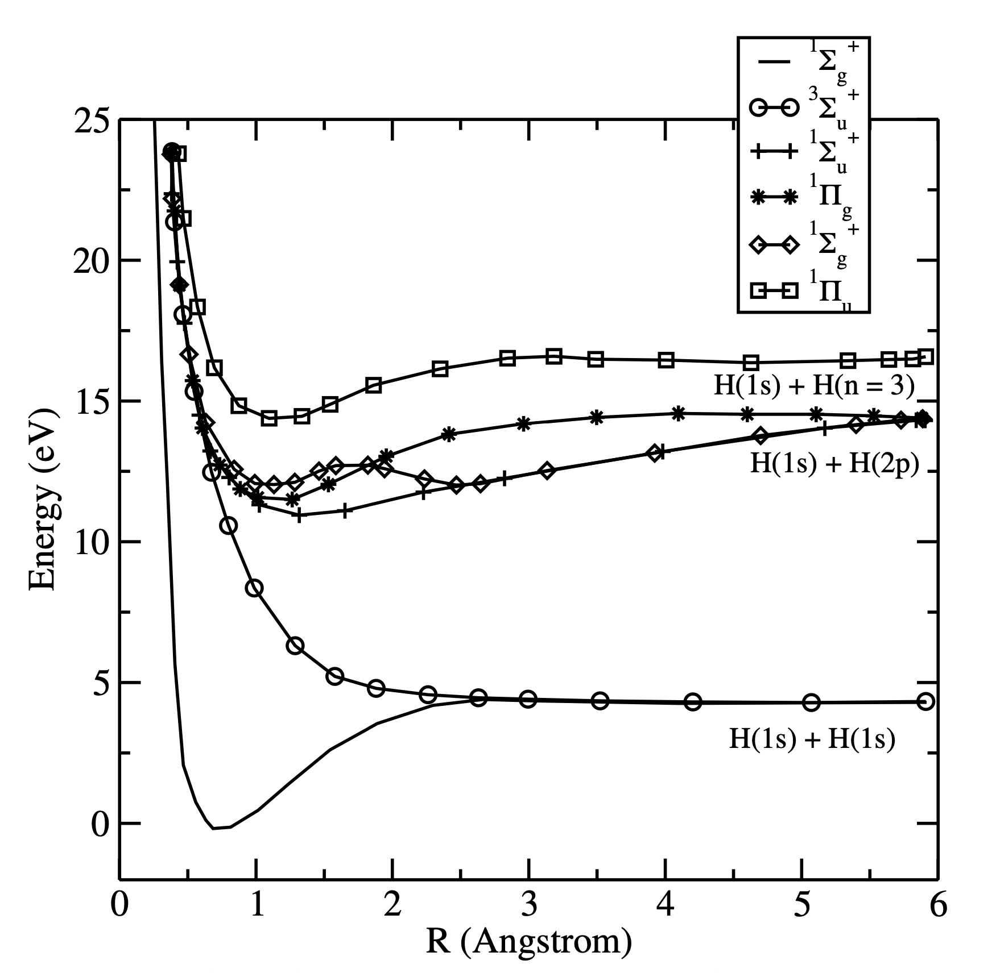

## Molecular orbital description of hydrogen molecule

### Setting up Hamiltonian 

$${H = -\frac{\hbar^2}{2m_e}\left( \Delta_1 + \Delta_2\right)
+ \frac{e^2}{4\pi\epsilon_0}\left(\frac{1}{R} + \frac{1}{r_{12}} - \frac{1}{r_{A1}} 
- \frac{1}{r_{A2}} - \frac{1}{r_{B1}} - \frac{1}{r_{B2}}\right)}$$

- The main difficulty in the molecular Hamiltonian is the $1/r_{12}$
term, which connects the two electrons to each other. This means that a simple  product wavefunction is not sufficient. No known analytic solutions have been  found to the electronic Schr\"odinger equation of $H_2$. 
- For this reason, we will attempt to solve the problem approximately by using the LCAO-MO approach that we  used previously. For example, the ground state for H$_2$ is obtained by placing  two electrons with opposite spins on the $1\sigma_g$ orbital. This assumes that
the wavefunction is expressed as antisymmetrized product (e.g. a Slater determinant).

### Constructing MOs for hydrogen molecule

- According to the Pauli principle, two electrons with opposite spins can be assigned to a given spatial orbital. As a first approximation, we assume that the molecular orbitals in $H_2$ remain the same as in $H_2^+$. Hence we can say that both electrons occupy the $1\sigma_g$ orbital (the ground state) and the electronic configuration is denoted by ($1\sigma_g$)$^2$. This is a similar notation  that we used previously for atoms (for example, He atom is ($1s$)$^2$).

- The molecular orbital for electron 1 in $1\sigma_g$ molecular orbital is:

$${1\sigma_g(1) = \frac{1}{\sqrt{2(1 + S)}}(1s_A(1) + 1s_B(1))}$$

- Previously we found that the total wavefunction must be antisymmetric with respect to change in electron indices. This can be achieved by using the  Slater determinant:

$${\psi_{MO}^{(1\sigma_g)^2} = \frac{1}{\sqrt{2}}\begin{vmatrix}
1\sigma_g(1)\alpha (1) & 1\sigma_g(1)\beta (1)\\
1\sigma_g(2)\alpha (2) & 1\sigma_g(2)\beta (2)\\
\end{vmatrix}}$$

- where $\alpha$ and $\beta$ denote the electron spin. The Slater determinant can be expanded as follows:

$${\psi_{MO}^{(1\sigma_g)^2} = \frac{1}{\sqrt{2}} 
 (1\sigma_g(1)1\sigma_g(2)\alpha (1)\beta (2) 
- 1\sigma_g(1)1\sigma_g(2)\beta (1)\alpha (2))} = \\
{= \frac{1}{2\sqrt{2}(1 + S_{AB})}(1s_A(1) + 1s_B(1))(1s_A(2) + 1s_B(2))
(\alpha (1)\beta (2) - \alpha (2)\beta (1))}$$

- Note that this wavefunction is only approximate and is definitely not an  eigenfunction of the H$_2$ electronic Hamiltonian. Thus we must calculate the  electronic energy by taking an expectation value of this wavefunction with the Hamiltonian (the actual calculation not shown):

$${E(R) = 2E_{1s} + \frac{e^2}{4\pi\epsilon_0 R} 
- \textnormal{integrals}}$$

- where $E_{1s}$ is the electronic energy of one hydrogen atom. The second term  represents the Coulomb repulsion between the two positively charged nuclei and the last term (``integrals'') contains a series of integrals describing the  interactions of various charge distributions with one another (see P. W.  Atkins, Molecular Quantum Mechanics, Oxford University Press). With this approach, the minimum energy is reached at $R$ = 84 pm (experimental 74.1 pm)
and dissociation energy $D_e$ = 255 kJ $mol^{-1}$ (experimental 458 kJ 
$mol^{-1}$).

### Improving upon simple MO approximation

- This simple approach is not very accurate but it demonstrates that the method  works. To improve the accuracy, ionic and covalent terms should be considered
separately:

$${{1s_A(1)1s_A(2)}_{\textnormal{Ionic (H$^-$ + H$^+$)}}
+ {[1s_A(1)1s_B(2) + 1s_A(2)1s_B(1)]}_{\textnormal{Covalent (H + H)}}
+ {1s_B(1)1s_B(2)}_{\textnormal{Ionic (H$^+$ + H$^-$)}}}$$

Both covalent and ionic terms can be introduced into the wavefunction with their 
own variational parameters $c_1$ and $c_2$:

$${\psi = c_1\psi_{\textnormal{covalent}} + c_2\psi_{\textnormal{ionic}}}$$

$${\psi_{\textnormal{covalent}} = 1s_A(1)1s_B(2) + 1s_A(2)1s_B(1)}$$

$${\psi_{\textnormal{ionic}} = 1s_A(1)1s_A(2) + 1s_B(1)1s_B(2)}$$

- Note that the variational constants $c_1$ and $c_2$ depend on the 
internuclear distance $R$. Minimization of the energy expectation value with 
respect to these constants gives $R_e$ = 74.9 pm (experiment 74.1 pm) and $D_e$
= 386 kJ $mol^{-1}$ (experiment 458 kJ $mol^{-1}$). 

- Further improvement could  be achieved by adding higher atomic orbitals into the wavefunction. The  previously discussed Hartree-Fock method provides an efficient way for
solving the problem. Recall that this method is only approximate as it ignores 
the electron-electron correlation effects completely. The full treatment 
requires use of configuration interaction methods, which can yield essentially 
exact results: $D_e$ = 36117.8 $cm^{-1}$ (CI) vs. $36117.3\pm1.0\, cm^{-1}$ 
(exp) and $R_e$ = 74.140 pm vs. 74.139 pm (exp).
