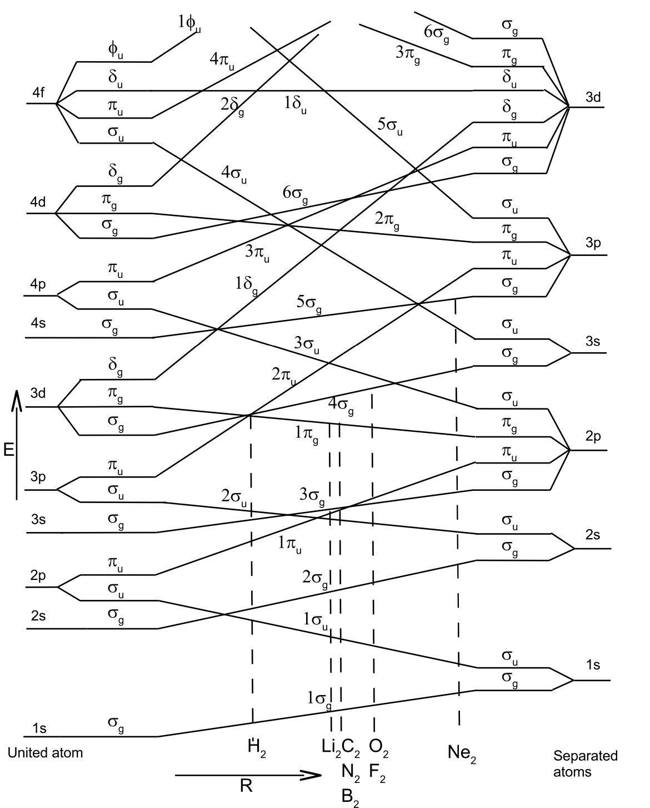
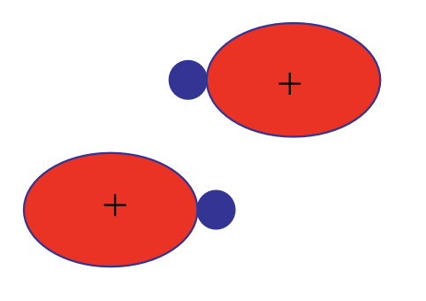
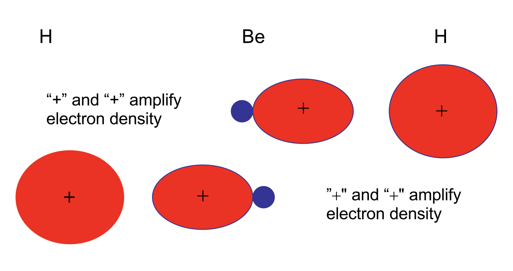
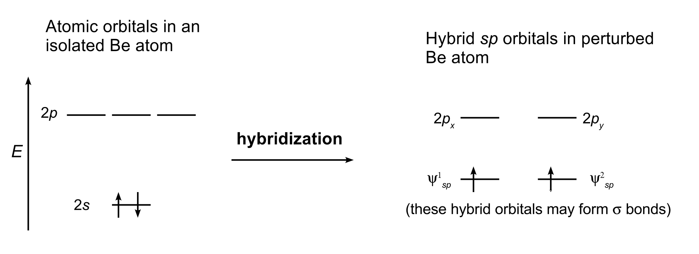
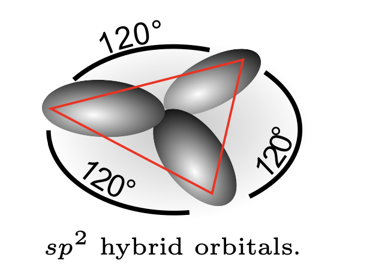
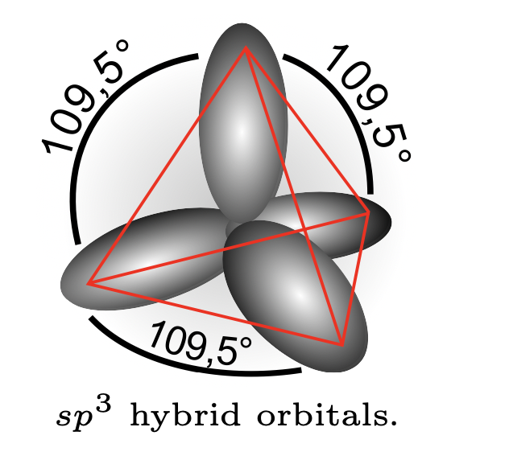
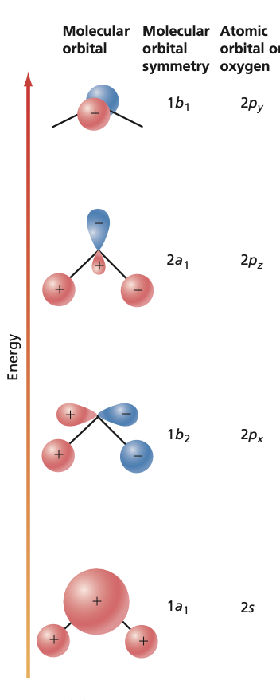
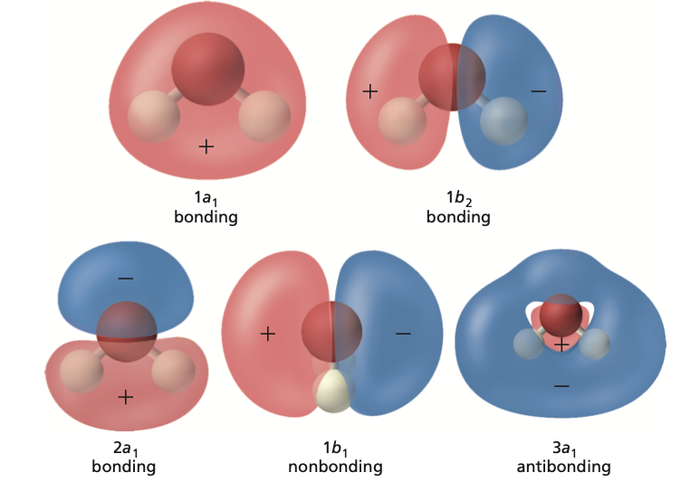
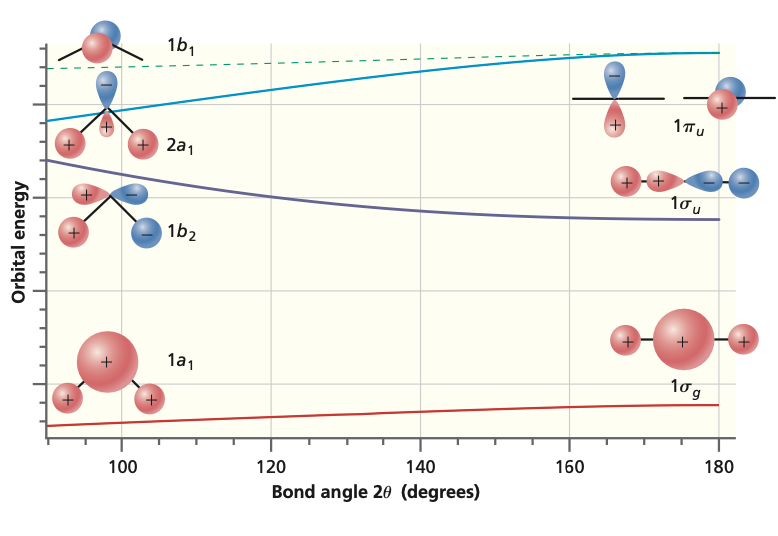
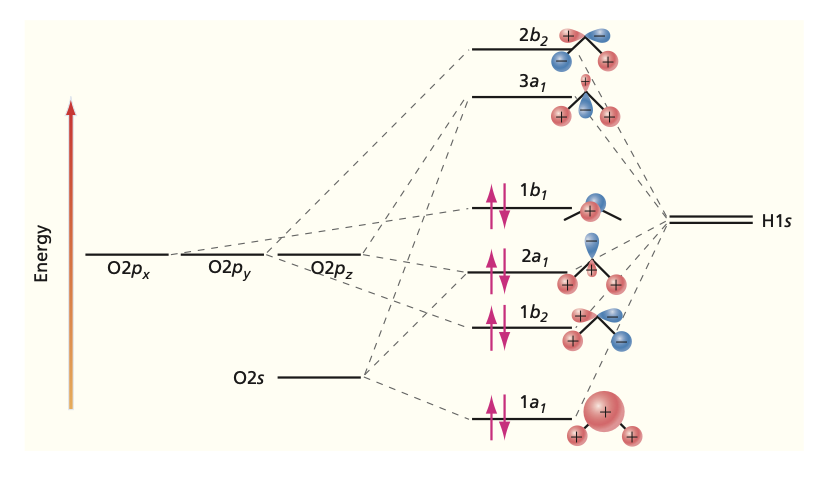

## Electronic structure of polyatomic molecules

### Orbitals of homonuclear diatomic molecules

Which atomic orbitals mix to form molecular orbitals and what are their
relative energies? The graph on the left can be used to obtain the energy order of molecular orbitals and indicates the atomic orbital limits.

<iframe src="https://al2me6.github.io/evanescence/"
        width="800"
        height="500"
        allowfullscreen>
</iframe>

### The non-crossing rule: States with the same symmetry never cross.

| Bonding orbitals:     | $1\sigma_g$, $2\sigma_g$, $1\pi_u$, etc.       |
|-----------------------|------------------------------------------------|
| Antibonding orbitals: | $1\sigma_u^*$, $2\sigma_u^*$, $1\pi_g^*$, etc. |

### Table of MOs

The orbitals should be filled with electrons in the order of increasing energy. 
Note that $\pi$, $\delta$, etc. orbitals can hold a total of 4 electrons. If only 
one bond is formed, we say that the bond order (BO) is 1. If two bonds form (for 
example, one $\sigma$ and one $\pi$), we say that the bond order is 2 (double bond). 
Molecular orbitals always come in pairs: bonding and antibonding.

| Molecule | \# of els. | El. Conf.                        | Term sym.    | BO  | $R_e$ ($\AA$) | $D_e$ (eV)   |
|----------|------------|----------------------------------|--------------|-----|-------------|--------------|
| $H_2^+$  | 1          | $(1\sigma_g)$                    | $^2\Sigma_g$ | 0.5 | 1.060       | 2.793        |
| $H_2$    | 2          | $(1\sigma_g)^2$                  | $^1\Sigma_g$ | 1.0 | 0.741       | 4.783        |
| $He_2^+$ | 3          | $(1\sigma_g)^2(1\sigma_u)$       | $^2\Sigma_u$ | 0.5 | 1.080       | 2.5          |
| $He_2$   | 4          | $(1\sigma_g)^2(1\sigma_u)^2$     | $^1\Sigma_g$ | 0.0 |             |
| $Li_2$   | 6          | $He_2(2\sigma_g)^2$              | $^1\Sigma_g$ | 1.0 | 2.673       | 1.14         |
| $Be_2$   | 8          | $He_2(2\sigma_g)^2(2\sigma_u)^2$ | $^1\Sigma_g$ | 0.0 |             |
| $B_2$    | 10         | $Be_2(1\pi_u)^2$                 | $^3\Sigma_g$ | 1.0 | 1.589       | $\approx 3.0$ |
| $C_2$    | 12         | $Be_2(1\pi_u)^4$                 | $^1\Sigma_g$ | 2.0 | 1.242       | 6.36         |
| $N_2^+$  | 13         | $Be_2(1\pi_u)^4(3\sigma_g)$      | $^2\Sigma_g$ | 2.5 | 1.116       | 8.86         |
| $N_2$    | 14         | $Be_2(1\pi_u)^4(3\sigma_g)^2$    | $^1\Sigma_g$ | 3.0 | 1.094       | 9.902        |
| $O_2^+$  | 15         | $N_2(1\pi_g)$                    | $^2\Pi_g$    | 2.5 | 1.123       | 6.77         |
| $O_2$    | 16         | $N_2(1\pi_g)^2$                  | $^3\Sigma_g$ | 2.0 | 1.207       | 5.213        |
| $F_2$    | 18         | $N_2(1\pi_g)^4$                  | $^1\Sigma_g$ | 1.0 | 1.435       | 1.34         |
| $Ne_2$   | 20         | $N_2(1\pi_g)^4(3\sigma_u)^2$     | $^1\Sigma_g$ | 0.0 |             |

> When value of $R_0$ not shown means molecular is not stable

> Note that the Hund's rules predict that the electron configuration with the
largest multiplicity lies the lowest in energy when the highest occupied
MOs are degenerate.

## Valence Bond Approach

### Creating hybrid orbitals centered on atoms

- The valence bond method is an approximate approach, which can be used in  understanding formation of chemical bonding. In particular, concepts like  hybrid orbitals follow directly from it.

- The valence bond method is based on the idea that a chemical bond is formed  when there is non-zero overlap between the atomic orbitals of the participating  atoms. Note that the the atomic orbitals must therefore have the same symmetry in  order to gain overlap.

- Hybrid orbitals are essentially linear combinations of atomic orbitals that  belong to a single atom. Note that hybrid orbitals are not meaningful for free  atoms as they only start to form when other atoms approach. The idea is best  illustrated through the following examples.

### 1. $BeH_2$ molecule.

- $Be$ atoms have atomic electron configuration of He$2s^2$. The two approaching hydrogen perturb the atomic orbitals and the two outer shell electrons reside on the two hybrid orbitals formed ($z$-axis is along the molecular axis):

$${\psi_{sp}^1 = \frac{1}{\sqrt{2}}(2s + 2p_z)}$$

$${\psi_{sp}^2 = \frac{1}{\sqrt{2}}(2s - 2p_z)}$$

The hybrid orbitals further form two molecular $\sigma$ orbitals:

$${\psi = c_11s_A + c_2\psi_{sp}^1}$$

$${\psi' = c_1'1s_B + c_2\psi_{sp}^2}$$

- **This form of hybridization is called $sp$.** This states that one  $s$ and one $p$ orbital participate in forming the hybrid orbitals. For $sp$
hybrids, linear geometries are favored and here H--Be--H is indeed linear. 
Here each MO between Be and H contain two shared electrons. Note that the 
number of initial atomic orbitals and the number of hybrid orbitals formed must
be identical. Here $s$ and $p$ atomic orbitals give two $sp$ hybrid orbitals. 
Note that hybrid orbitals should be orthonormalized.

### 2. $BH_3$ molecule.

- All the atoms lie in a plane (i.e. planar 
structure) and the angles between the H atoms is 120\degree . The 
boron atom has electron configuration $1s^22s^22p$. Now three
atomic orbitals ($2s$, $2p_z$, $2p_x$) participate in forming three hybrid orbitals:

$${\psi^1_{sp^2} = \frac{1}{\sqrt{3}}2s + \sqrt{\frac{2}{3}}2p_z}$$

$${\psi^2_{sp^2} = \frac{1}{\sqrt{3}}2s - \frac{1}{\sqrt{6}}2p_z 
+ \frac{1}{\sqrt{2}}2p_x}$$

$${\psi^3_{sp^2} = \frac{1}{\sqrt{3}}2s - \frac{1}{\sqrt{6}}2p_z 
- \frac{1}{\sqrt{2}}2p_x}$$

The three orbitals can have the following spatial orientations:

- Each of these hybrid orbitals bind form $\sigma$ bonds with H atoms. This is 
called $sp^2$ hybridization because two $p$ orbitals and one $s$ orbital 
participate in the hybrid.

### 3. $CH_4$ molecule. 

- The electron configuration of carbon atom is
$1s^22s^22p^2$. The outer four valence electrons should be placed on four
$sp^3$ hybrid orbitals:

$${\psi^1_{sp^3} = \frac{1}{2}(2s + 2p_x + 2p_y + 2p_z)}$$

$${\psi^2_{sp^3} = \frac{1}{2}(2s - 2p_x - 2p_y + 2p_z)}$$

$${\psi^3_{sp^3} = \frac{1}{2}(2s + 2p_x - 2p_y - 2p_z)}$$

$${\psi^4_{sp^3} = \frac{1}{2}(2s - 2p_x + 2p_y - 2p_z)}$$

These four hybrid orbitals form $\sigma$ bonds with the four hydrogen atoms.

The $sp^3$ hybridization is directly responsible for the geometry of CH$_4$ 
molecule. Note that for other elements with $d$-orbitals, one can also get 
bipyramidal (coordination 5) and octahedral (coordination 6) structures.

### 4. $H_2 O$ molecule. 

- The oxygen is $sp^3$ hybridized with O atom 
electron configuration: $1s^22s^22p^4$. Now two of
the four hybrid orbitals are doubly occupied with the electrons from 
oxygen atom and the remaining two hybrid orbitals can participate in $\sigma$ bonding 
with two H atoms. This predicts the bond angle H--O--H as $109\degree $(experimental 
value $104\degree$). Thus $H_2O$ has two lone-pair electrons.

### Other Molecules

<iframe src="https://al2me6.github.io/evanescence/"
        width="800"
        height="500"
        allowfullscreen>
</iframe>

### Numerical Calculations 

In numerical quantum chemical calculations, basis sets that resemble 
linear combinations of atomic orbitals are typically used (LCAO-MO-SCF). The 
atomic orbitals are approximated by a group of Gaussian functions, which allow 
analytic integration of the integrals, for example, appearing in the 
Hartree-Fock (SCF; HF) method. Note that hydrogenlike atom orbitals differ 
from Gaussian functions by the power of $r$ in the exponent. A useful rule for 
Gaussians: A product of two Gaussian functions is another Gaussian function.

