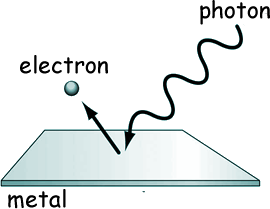
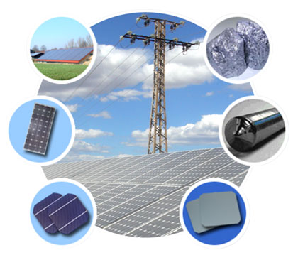

---

title: |
    | Lecture 1.1, Chem-324, Fall2019
	|
    | Photoelectric effect and photons.
author: 'Davit Potoyan'
institute: ' Iowa State University, Ames IA 50011'
toc: false

---

## Outline for Lecture 1.1: 

**Photoelectric effect: Electrons are ejected when light is shone onto a material. This experiment puzzled 20th century scientists who thought of light as being a continuous stream of waves.**

**Only by abandoning classical thinking and accepting the reality of quantized energy reconciles experiments with theory.**

## Photoelectric effect and why it contradicts classical mechanics.

- Previously we saw that in trying to reconcile experiment with theory Planck had to assume that blackbody absorbs and emits right with discrete energies: $0, h\nu, 2h\nu, 3h\nu, …$. It was thought to be nothing more than a neat mathematical trick that fixes theory. 

- Einstein on the other hand was more imaginative and saw in Plank’s prescription more than just a math trick. He suggested that light can behave like a stream of particles some discrete countable energy packets which he called photons. This view was instrumental for making sense of the photoelectric experiment. 

- Eventually it became clear that not only light can show particle like behavior but particles too can show wave like behavior! This was demonstrated in the electron diffraction experiments. This universal duality of particles and waves is captured by De Broglie relation which is one of the central equations of quantum mechanics. About this in the next lecture.  

## Photoelectric effect

When you shine light with sufficient energy content (UV radiation) on a metal surface electrons start flying off the surface. This is the essence of photoelectric effect. Observation of photoelectric effect was crucial for showing that only quantum mechanics can make sense of how light interest with matter.

Besides its historical role in the establishment of QM photoelectric effect has many practical applications. It is  relevant for design of solar cells, photovoltaics, photoelectron spectroscopy, night vision, etc. 

## Photoelectric effect challenges classical mechanics

Early experiments of photoelectric effect appeared truly puzzling to scientists of 20th century for the following reasons:

- They expected to see more electrons being ejected when increasing the intensity or duration of radiation. According to CM if one shines the light long enough or increases intensity by pumping more energy then surely those pesky electrons will start flying. 
  (reminder: Intensity of light is a quantity measuring the amount of energy transferred per unit surface per unit time.)

- That was not at all what experiments showed. Unless radiation had a frequency above certain threshold (v0) not a single electron would escape regardless of the intensity of radiation. That was really weird. 

## Energy is quantized! Any classical resistance is futile.

- What buries CM completely and implies quantization of energy is the fact that electrons would get ejected immediately once the frequency threshold is crossed even if the intensity of radiation ia minimal. 

- Furthermore kinetic energy of an ejected electron was observed to be a linearly increasing function of frequency of light with no dependence on the intensity.  

- Photoelectric effect becomes clear when we think of light consisting of packets of energy with particle like qualities called photons. Once one photon transfers the necessary amount of energy to the material one electron gets ejected from the metal.

## Understanding photoelectric part.

Electrons are bound in metals and to eject them some energy needs to be supplied by a photon: $E_{photon}$.
But this energy has to exceed $h\nu_0$, the energy difference between free and bound states.  

$$(E_{photon}-E_{photon})=KE$$

 
If energy of photon is smaller $E_{photon} < h\nu_0$  than electron stays bound; if $E_{photon}> h\nu_0$ electron gets ejected and any extra energy, gets converted into kinetic energy since the total energy is conserved. This explains why kinetic energy is a linear function of frequency (Fig a) and why there is no dependence on intensity (Fig b).
 
 

