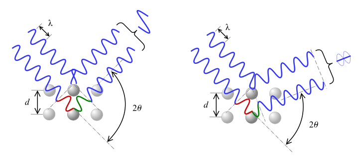
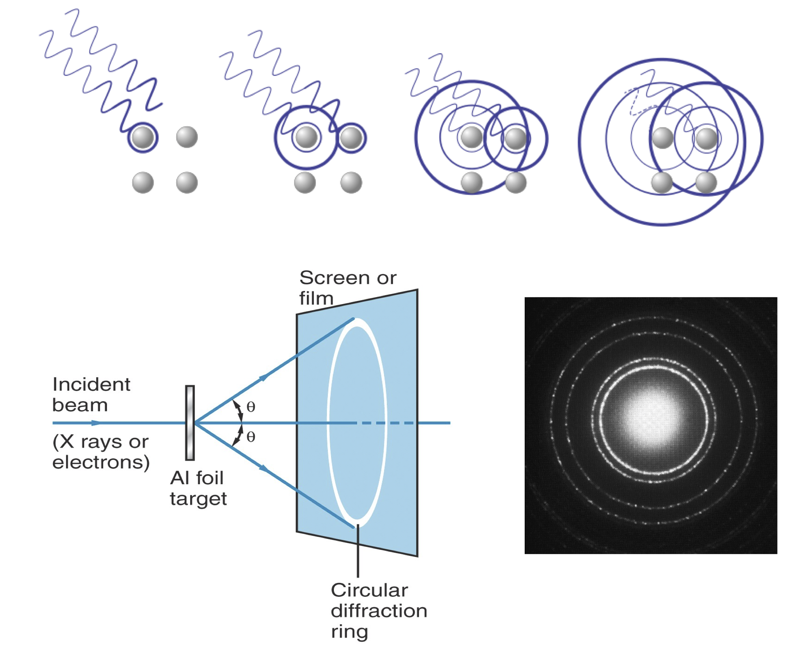

---

title: |
    | Lecture 1.2, Chem-324, Fall2019
	|
    | Electron diffraction and wave particle duality.
author: 'Davit Potoyan'
institute: ' Iowa State University, Ames IA 50011'
toc: false

---

## Outline for Lecture 1.2: 

- **A physical entity has both wave-like (wavelengths, interference, diffraction, etc.) and particle-like (momentum, collision, countable, etc.) characteristics.**
- **Compton scattering, electron diffraction show that concepts of particle and wave are mutually not exclusive and characteristics of all objects!**

## Electron diffraction

- Davisson and Germer at Bell Labs showed that electrons exhibit diffraction, a phenomenon characteristic of a wave.

- Electron diffraction and neutron diffraction are widely used experimental techniques today, complementing X-ray diffraction.

## Diffraction and color. 

Thin films of oil, soap bubbles, butterfly wings, sea shells, CD and DVD, etc. show a rainbow pattern. This is caused by the constructive and destructive interference of light traveling slightly different paths.

An electron can be scattered by different layers of a crystal lattice and interfere constructively or destructively, giving rise to alternating intensity patterns. 

## Bragg's formula for diffraction. 

X-rays interact with the atoms in a crystal. The phase shift upon scattering off of atoms causes constructive (left figure) or destructive (right figure) interferences.

Maxima and minima in interference patters is dictated by simple geometric  argument captured in Bragg’s formula: 

$$2d sin\theta = n\lambda$$

One expect waves like X-rays to show interference patterns according to this formula. Interference was thought to be a purely a wave like phenomena. 

## Both X-rays and electrons show same diffraction patterns. 

 
## Davisson & Germer show that electrons scatter just like X-rays!

- In 1925, Davisson and Germer were studying electron scattering from various materials. To their great surprise they discovered that at certain angles there was a peak in the intensity of the scattered electron beam. This peak indicated wave behavior for the electrons, and could be interpreted by the Bragg law (previously only applied to X-ray scattering) to give values for the lattice spacing in the nickel crystal. 

## Particles can and do behave like waves in appropriate circumstances.  

Observing diffraction patterns and computing wavelength from de Broglie relation confirmed that thinking of matter as a dual wave-particle was correct with impressive agreement between experimental predictions and theory. 

## Compton scattering

Arthur Compton showed that X-rays get scattered off free electrons like elastic billiard balls. Applying conservation of momentum principle (previously only applied to particle like objects) it was shown that the outgoing X-rays should be of longer wavelength than the incoming ones. This means that a moving photon hits the resting free electron and transfers some energy to get the electron moving. Not that this experimental result makes sense only if you think of photon as a particle with linear momentum which gets bounced off the electron.

## Wave particle duality as universal feature of nature. 

- Light is a wave and a particle. An electron is also a particle and a wave. Is everything a wave and a particle? The answer is YES! This is what is meant by wave-particle duality.  Sometimes we only see one side of the duality because under some conditions either wave or particle characteristics are more pronounced. 

- The wave-like and particle-like characteristics of a physical entity are inversely proportional to each other as described by the de Broglie relationship.

## De Broglie comes up with a simple equation which establishes the duality of matter. 

$$\lambda= \frac{h}{p}$$

- h: Plank's constant
- $p$: momentum of the object (electron, photon, molecule, chair, etc)
- $\lambda$: wavelength associated with the object. 

The relation implies that heavy object have small wavelength and light objects have large wavelength. Hence the smaller the object the more pronounced wave-like qualities it will have. And vice versa the bigger the object the more particle like qualities it will have. 

## Summary

- A physical entity has both wave-like (wavelengths, interference, diffraction, etc.) and particle-like (momentum, collision, countable, etc.) characteristics.

- Wave-like and particle-like characteristics are inversely proportional to each other and are quantified by de Broglie relation: $\lambda=\frac{h}{p}$

- An electron has a wavelength; a photon has a momentum. Welcome to the reality where everything can behave both as wave and a particle!

