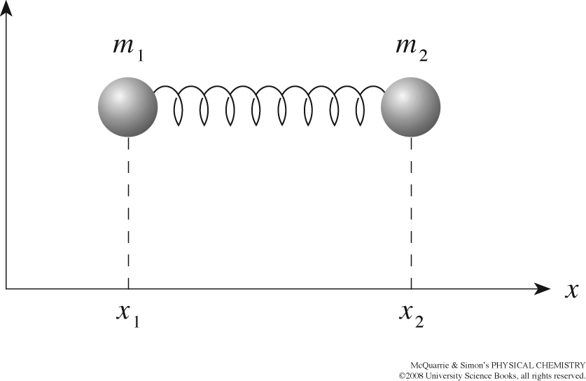

## Outline for Lecture 4.2:  Quantum Oscillators 

In this section we study quantum mechanical version of [harmonic oscillator](https://en.wikipedia.org/wiki/Harmonic_oscillator). Harmonic oscillators have ubqiutuous presence in everyday world: beads bound by a spring which vibrate around equilibirum positions. Turns out beads on a pring is remarkably common in microsocpic world as nuclie of atoms in solids or molecules are in some sense "quantum beads" vibrating around equilibriu position of "quantum springs". The distinction between quantum vs classical regimes will again be highly illuminating about the role of quantum effects on small scales. The key topics we will learn are:

- **Quantization of vibrational degrees of freedom in molecules.** This has implication for Infrared and raman spectroscopies, molecular mechancis and condensed matter in general.  
- **Existence of zero point energy and tunneling.** We have seen this on PIB example and will see again on the example of harmonic oscillator. 
- **Hermite Polynomials as orthogonal eigenfunctions.** This will be our first foray into the world od special functions. 
- **Raising and lower operators as elegant way of solving problems.** This will be our first introduction to raising and lowering operators which provide highly elegant way of solving problems in quantum mechanics. 
- **Effects of unharmonicity.** We will see the impact on energy levels of harmonic oscillators when one goes beyond harmonic approximation. 

## Bead, spring and a wall. 

The classical **harmonic oscillator** is a system of bead attached to a wall with a spring. When bead is displaced from its equilibrium or resting position $r_0$ to some point $r$, experiences a restoring force $F$ proportional to the displacement $x=r-r_0$:

$$ F=-kx$$

The above expression is also known as **Hooke's law**, where minus sign indicates that the direction of force is always towards restoring equilibrium location. The constant k characterizes stiffness of the spring and is called **spring constant.**

## Solving harmonic oscillator problem

The classical equation of motion for a one-dimensional simple harmonic oscillator with a particle of mass mm attached to a spring having spring constant kk is

$$m \ddot x=−kx$$

$$m \ddot x+kx = 0 \,\,\,\,\rightarrow \,\,\,\, \ddot{x}+\omega^2 x =0$$

whwhere we have intorduced constant $\omega$ which we will see is the frequency oscillations:

$$\omega=\Big(\frac{k}{m}\Big)^{1/2}$$

The differneital equation is a simple second order, linear ODE  which can be solved by a standard trick of pluggin exponential $x(t)=e^{\alpha t}$ and convertin the problem to algebraic equation. The solution is

$$x(t)= A sin(\omega t+\phi)$$ 

Where the two constnants  are: $A$ the amplitude of oscillations and $\phi$ is constant specifying the initial position of the bead. 

## Conservative system 

In the simple harmonic oscillator problem $F$ is the only force acting on the system.  We way that the system is conservative becasue the kinetic and potential energies keep being interconverted with no amount of total energy being of the system being dissipated into the environment. This will be true in a vaccuum where there is no friction.  For a simple harmonic oscillatorthe oscillations go on forever with position $x(t)$ velocity $v=\dot{x}(t)$ and acceleration $a=\ddot{x(t)}$ with same constant frequency $\omega$ but with different amplitudes.  

<iframe src='https://gfycat.com/ifr/CheapSelfishAlbacoretuna' frameborder='0' scrolling='no' allowfullscreen width='240' height='224'></iframe>
 

## Energy of the harmonic oscillator

In classical mechanics the force and the potential energy of a conservative system are related via the formula:

$$F = - \frac{\partial V(x)}{\partial x} $$

This means the steeper the potential the higher the force and minus sign indicates that force is restoring the equilibrium position. The potential energy can be obtained by integrating:

$$ V(x)= - \int F dx = - \int (-kx) dx =\frac{kx^2}{2}+C$$

Thus the potential energy for a simple harmoncin oscillator is a parabolic function of displacement. It is  convenient  to set $C=0$ and measure potential energy relative to equilibrium state $V(x=0)=0$ 

$$V(x)=\frac{kx^2}{2}$$

## Conservation of total energy

Kinetic energy is the familiar expression expressed either via momentum $p=mv$ or velocity $v=\dot{x}$

$$K=\frac{p^2}{2m} = \frac{m \dot{x}^2}{2}$$

Note that while both kinetic and potential energies oscilate over time, the total energy remains constant: 

## Diatomic molecule and two-body problem

Equations of motion for diatomic molecule modeled as beads bound by a spring are:

$$F_1=m_1 \ddot{x_1}=k(x_2-x_1-l_0)$$

$$F_2=m_2 \ddot{x_2}=-k(x_2-x_1-l_0)$$

Where $F_1=-F_2$ which is a reflection of Newtno's thrid law. By introducing a more convenient cooridnates in the from of relative distance $x$ and center of mass $x_{com}$ we are now going to reduce the two body problem to one body problem.

$$x=x_2-x_1-l_0$$

$$x_{com}=\frac{m_1x_2+x_2 m_2}{m_1+m_2}$$

## Effective mass of vibration

$$m_1\ddot{x_1}=kx \\  m_2\ddot{x_2}=-kx$$

By expressing equations of motion in terms of the center of mass which, we find that center of mass moves freely without acceleration. 

$$m_1\ddot{x_1}+ m_2\ddot{x_2}=0\,\,\,\, \rightarrow \frac{m_1\ddot{x_1}+ m_2\ddot{x_2}}{m_1+m_2}=\ddot{x}_{com}=0$$

Next by taking difference between coordinates $\ddot{x_2}=-\frac{k}{m_2}x_2$ and  $\ddot{x_1}=\frac{k}{m_1}x_1$we expres  the equations of motion in terms of relative distance

$$\ddot{x}=\ddot{x_2} - \ddot{x_1} =-\Big(\frac{1}{m_1}+\frac{1}{m_2} \Big)kx=-\frac{k}{\mu}x$$

This equation looks identical to the probel of bead anchored to wall with a spring. We have thus managed to reduce the two body probelm to a one modey problem by replacing masses of bodies with a reduced mass:  $\mu=\frac{1}{m_1}+\frac{1}{m_2}=\frac{m_1 m_2}{m_1+m_2}$

## Beads and springs model of molecules

Before discussing the harmonic oscillator approximation let us reflect on when this would be a good approximation and uner which cirumstances it will break down?

For an aribtarry potential energy funciton of x we can carry out Taylor's expansion around equilibrium bond length $x_0$ obtaining infinitey series. 

$$U(x) = U(x_0)+U'(x_0)(x-x_0)+\frac{1}{2!}U''(x_0)(x-x_0)^2+\frac{1}{3!}U'''(x_0)(x-x_0)^3+...$$

Setting energy scale to be relative to  $U(x_0)=0$ and recongizing that first derivative vanishes at minima $x_0$ we have

$$U(x) = \frac{1}{2!}k(x-x_0)^2+\frac{1}{3!}\gamma(x-x_0)^3+...$$

Hence we see that the Harmonic approximation is only the first non vanishing term! Furthermore we see that spring constant k and subsequent anharmonicity consnats such as $\gamma$ are higher order derivatives of potential energy. That is the more non-linear the potential the higer the contribution of these terms. And vice verse clsoer the potential to quadratic form the more accurate is the harmonic assumtion. 

## Qunatum mechanical harmonic oscillator problem

Quantum mechanical harmonic oscillator is defined by its Hamitlon operator

$$\hat{H} = -\frac{\hbar^2}{2\mu }\frac{d^2}{dx^2}+\frac{1}{2}kx^2$$

As with the particle in a box system our objective is to find eigenfunctions and eigenvalues which are the observable states and energy values in the experiment. 

$$\hat{H}\psi(x)=E\psi(x)
\\-\frac{\hbar^2}{2\mu }\psi^{''}+\frac{1}{2}kx^2\psi=E\psi \\ \psi''+\frac{2\mu}{\hbar^2}(E-kx^2/2)\psi=0$$

What we have is ODE **but with non-constant coefficients**! What this means is we can not use our exponential trick to quickly solve the problem via an algebraic equation. We will, however be able to solve it via an elegant opeator technique. 

## Vibrational energy is quantized

Particle in a box syste, showed that translational energy is quantized becasue of the boundary conditions imposed by the box. 

Similarly we find that that for harmonic oscillator system the virbational enegy is also quantized where the role of boundary is played by the potential keeping the system bound and wave functions decaying to zero. Similiar to particle in a box there is an infinitely high energy barrier appearing at large displacement $V(+\infty)=V(-\infty)=+\infty$!

The eigenvalues of harmonic oscillator are:

$$E_v = \hbar \omega (v+1/2)\,\,\, v=0,1,2,...$$

Note also that quantum number starts from zero! **The zero point energy** is $E_0=\hbar\omega/2$ where angular frequency $\omega=2\pi \nu$ is defined in terms of spring constant $\omega=\Big(\frac{k}{\mu}\Big)^{1/2}$

Harmonic oscillator model predics constant energy spacings! 

$$E_{v+1}-E_v =\hbar \omega=h\nu $$

The frequency of photon that takes harmonic oscillator from one to next level is equal to the frequency (classical) nuclear vibration!

