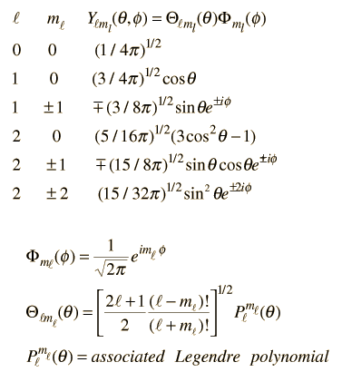
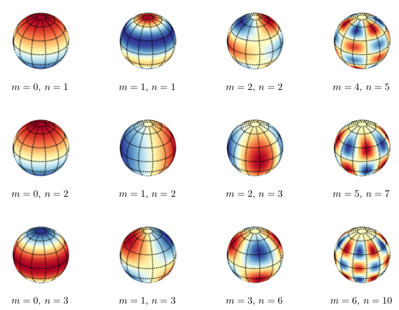

## Outline for Lecture 4.0:  

- Rigid body system is introduced as a prototype for quantization of rotational degrees of freedom in molecules.
- Spherica coordinate system is introduced out of necessity of taking advantage of spherical symmetry of the problem which leads to reduction of dimensionality.
- Solving Schrodinger equation in spherical coordinates results in eigenfunctions in the form of spherical harmonics. Energy eigenvalues are found to be degenerate with respect to one of the quantum numbers. 
- Connection with microwave spectroscopy is shown where spectral lines are predicted to be occur in equal intervals. 
- Selection rule is established via recursion relation of spherical harmonics.
- Coupling of virbational degrees leads to rovibronic transitions and neccessitates inclsuion of virbational quantum numbers for more accurate account of transitions. 

### Classical picture: Rotating dumbell

Rigid rotor is a model of a rotating dumbbell: two unequal masses held together via a rigid stick.  The system is not acted upon by any external potential hence the only energy is the kinetic energy of rotation: 

$$
K=\frac{m_1 v_1^2}{2}+\frac{m_2 v_2^2}{2}=\frac{m_1 r_1^2+m_2 r^2_2}{2}\omega^2
$$

Where we have plugged in $v_1=\omega r_1$ and $v_2=\omega_2 r$ velocoities of rotation of two masses rotating with frequency $\omega$. The classical mechanical problem of two masses is once again reducible to a single reduced mass $\mu$ rotating around constant radius $r=r_1+r_2$ rotating around center of mass $m_1 r_1=m_2 r_2$.

$$
K=\frac{I \omega^2}{2}=\frac{L^2}{2I}
$$
Where $L=I \omega$ is the angular momentum and $I=\mu r^2$ moment of inertia. 

### Quantum rigid rotor and angular momentum operator 

We can write down the hamiltonain for rigid rotor model which corresponds to operator of kinetic energy and which can also be written in terms of angular momentum operator to make correspondence with classical rigid rotor. 

$$
\hat{H}=-\frac{\hbar^2}{2\mu}\nabla^2=\frac{\hat{L}^2}{2I}
$$

Since internuclear distance is fixed in rigid rotor approximation $r=const$ it is convenient to use spherical coordinates which eliminates raidal coordinate from the problem. The laplacian in spherical coordinates is:

$$
\nabla^2 = \frac{1}{r^2} \frac{\partial }{\partial r} \Big(r^2\frac{\partial}{\partial r}\Big)+\frac{1}{r^2 sin \theta} \frac{\partial }{\partial \theta} \Big(sin \theta \frac{\partial}{\partial \theta}\Big)+\frac{1}{r^2 sin^2 \theta}\frac{\partial^2 }{\partial \phi^2}
$$

And in rigid rotor approximation it simplifies to an oeprator acting on two variables $\theta$ and $\phi$

$$
\nabla^2_{\theta,\phi} =\frac{1}{r^2}\Big[\frac{1}{sin \theta} \frac{\partial }{\partial \theta} \Big(sin \theta \frac{\partial}{\partial \theta}\Big)+\frac{1}{sin^2 \theta}\frac{\partial^2 }{\partial \phi^2} \Big ]
$$

$$
\hat{H} = -\frac{\hbar^2}{2\mu r^2}\nabla^2_{\theta,\phi}=-\frac{\hbar^2 \nabla_{\theta,\phi}^2}{2I}=\frac{\hat{L}^2}{2I}
$$

The angular momentum part of the hamiltonian expressed in sperhical coordinates can now be clearly recognized as: 
$$
\hat{L}=i\hbar \nabla_{\theta,\phi}
$$

### Quantum numbers $(J,m)$ for quantizing $(\theta,\phi)$ coordiante pair. 

Having written down hamitlonain we now solve it anticipating two quantum numbers for two coordinates. The eigenfunctions turn out to be well known special functions called spherical harmonics $Y(\theta,\phi)$:
$$
\hat{H}Y(\theta, \phi)=E_{J,m}Y(\theta,\phi)
$$
We are once again able to separet two angular variables and solve thr esulting ODE exactly:
$$
\frac{sin \theta}{\theta}\frac{d}{d\theta} \Big(sin \theta\frac{d\Theta(\theta)}{d\theta}\Big)+\beta sin^2 \theta = m^2
$$

$$
\frac{d^2 \Phi(\phi)}{d \phi^2}=-m^2\Phi(\phi)
$$

- The constant $\beta = \frac{2IE}{\hbar^2}=J(J+1)$ with $J=0,1,2,..$ a quantum number which emerges from solution of $\theta$ part.

-  The $m=0,\pm1,\pm2,...J$ is the quantum number which emerged from  the solution of $\phi $ part. 

### Spherical harmonics

The eigenfunctions of rigid rotor, $Y_{J,m}(\theta,\phi)$ are spherical harmonics which occur frequently in probelms with spehrical symmetry as the convenient bassis of expansion. Spherical harmonics are important in many theoretical and practical applications, e.g., the representation of multipole electrostatic and electromagnetic fields, computation of [atomic orbital](https://en.wikipedia.org/wiki/Atomic_orbital) [electron configurations](https://en.wikipedia.org/wiki/Electron_configuration), representation of gravitational fields,  MRI imaging for streamline tractography, and the magnetic fields of planetary bodies and stars.

Spherical harmonics consist of associated Legendre polynomials ($\theta$ part) and complex exponential ($\phi part$)

### Visualization of spherical harmonics

In and physical science, [spherical harmonics](https://en.wikipedia.org/wiki/Spherical_harmonics) are  defined on the surface of a sphere. The spherical harmonics are a complete set of  on the sphere, and thus may be used to represent functions defined on the surface of a sphere, just as circular functions (sines and cosines) are used to represent functions on a circle via [Fourier series](https://en.wikipedia.org/wiki/Fourier_series). Like the sines and cosines in Fourier series, the spherical harmonics may be organized by (spatial) angular frequency, as seen in the rows of functions in the illustration on the right. 

### Rotational states of molecules are quantized

Solving rigid rotor problem we find that eigenvalues depend only on quantum number $J$ this makes each energy level degenerate with respect to $2J+1$ values assumed by $m_J$ quantum number. 

$$
E_J = \frac{\hbar^2}{2I}J(J+1)=BJ(J+1) \,\,\, with\,\,\, g_j=2J+1 \,\,\, degeneracy
$$

Where we have defined $B=\frac{h^2}{8\pi^2 I}$ spectroscpic constnat with units of energy. 

### Spectroscopic applications of Rigid rotor model

$$
\Delta E_{J+1,J} = E_{J+1}-E_{J} = B[(J+1)(J+2)-J(J+1)]=2B(J+1)
$$
Often in spectroscopy application one will use wavenumbers
$$
\tilde{\nu}_{J+1,J} =\frac{1}{\lambda} = \frac{\Delta E}{hc} = 2\tilde{B}(J+1)
$$

Where we have defined $\tilde{B}=\frac{h^2}{8\pi^2 I c}$

### Spectral lines are predicted to be equidistant!

Rigid rotor model makes a very specifci prediction about spectral lines: they are to be equally spaced. In other words difference between adjacent frequency of tranisitons is a constnat number:
$$
\tilde{\nu}_{J+2,J+1}-\tilde{\nu}_{J+1,J}=2\tilde{B}
$$
Thus be measring this spectrl line difference we can extract structural information about the molecule, e.g compute moment of intertia!

