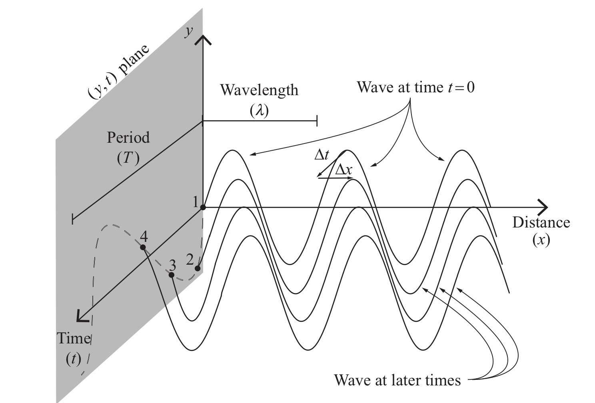

## Outline for Lecture 4: 

<iframe src="https://giphy.com/embed/7YCYZ4ItKG8F2" width="335" height="480" frameBorder="0" class="giphy-embed" allowFullScreen></iframe>

- **A wave is a self-propagating disturbance in a medium. Waves carry energy, momentum, information, but not matter!**
- **An equation, a partially differential equation (PDE) known as a wave equation completely describes wave's spatial and temporal evolution.**
- **Waves can be standing or traveling. Transverse or longitudinal.**

## Waves, waves and more waves

- Sound Waves. 
- Waves on a guitar string.
- Waves on the surface of the water.
- Quantum mechanical waves. E.g electron waves, neutron waves, hydrogen waves, etc. 
- Electromagnetic waves (light) – this is the only kind of wave which does not require a medium! EM waves can travel in vacuum. In a sense, an EM wave "rolls out its own carpet” hence creating its own medium as it moves forward. 
- Finally there are also gravitational waves traveling through spacetime. See this [video](https://www.youtube.com/watch?v=xj6vV3T4ok8).

## Classification of waves

<iframe src="https://giphy.com/embed/og52So0BUmZVe" width="480" height="360" frameBorder="0" class="giphy-embed" allowFullScreen></iframe>
<a href="https://giphy.com/gifs/waves-longitudinal-transverse-og52So0BUmZVe">via GIPHY</a>

## Describing waves mathematically part 1: functional form for a generic wave.  

Since wave is a moving disturbance u, we describe this disturbance (or vertical displacement) by specifying change of disturbance as a function of space $x$ and time $t$ via:
 $u(x,t)=f(x,t)$ 

Imagine an ocean wave. For an observer standing on a wave (surfer) the wave stands still but for the observer standing on the shore the wave moves away with velocity: $x'=x-vt$

Assuming that shape of the wave stays the same we can express the motion of wave in the reference frame of the still observer: $f(x,t)=f(x')$

$$u(x,t) = f(x-vt)$$

## Traveling waves.

We will be working a lot with periodic waves that have a shape of a sine or cosine, like this one: $$y(x,t)= Asin(kx)$$
Let us now turn this sinusoidal form into a wave traveling along x axis:
$$y(x,t)= Asin(k(x-vt))=Asin(kx-\omega t)$$

- *Amplitude* A: specifies maximum disturbance. 
- Wave vector $k$: specifies periodicity in space.
- Angular frequency $\omega$: specifies periodicity in time.

> Flashback to first lecture when we had this relationship of wavelength to speed of wave and frequency via $\lambda \nu = v$ and $\nu=\frac{1}{T}$

## Describing waves mathematically part 2: wave equation. 

We obtain equation of motion by using the chain rule and taking partial derivatives of u with respect to x and t.

Just as in classical mechanics we need to take second derivative in order to get the equation of motion that is determined by initial position and velocity. By using the chain rule and taking one more derivative with respect to x and t we obtain:

We just obtained a 1D classical wave equation. Solutions of this equation are functions of time and space called wave functions. 

## Wave interference part 1

 Interference – a phenomenon of combining waves. 
 
  <iframe src="https://giphy.com/embed/F3RijSq6e8fi8" width="280" height="280" frameBorder="0" class="giphy-embed" allowFullScreen></iframe>
<a href="https://giphy.com/gifs/physics-exchange-interference-F3RijSq6e8fi8">via GIPHY</a>

 
 This follows from the superposition principle to which we will be returning many times later in the class. The principle of superposition states that if wave A and B are both solutions of a wave equation than so is a wave C which is a sum of A and B.

## Wave interference part 2.

 Considering two sinusoidal waves of the same amplitude, wavelength, and direction of propagation but with a slight different phase: phi (e.g sound waves of a song coming from different holes on a wall). The resultant wave would be:
 
 $$ $$

## Wave interference part 3.

