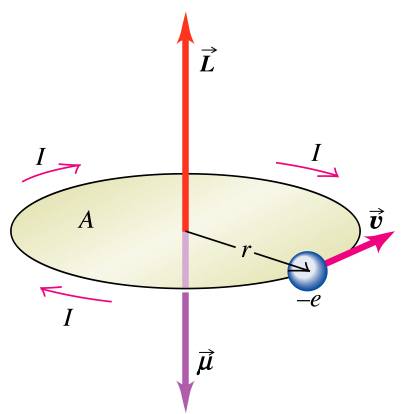

## Outline for Lecture 5.2:  "Spin"

- Experiment of Stern and Herlach provdies estblaishes the existance of spin for electrons. Contrary to the suggestive name, the spin is an intrinsic magnetic momentum which is permanently attached to a subatomic particle and has nothing to do with "spinning" or motion. Spins is an intrinsic property just like mass and charge. 
- Particles with half-integer spins, such as 1/2, 3/2, 5/2, are known as fermions, while those particles with integer spins, such as 0, 1, 2, are known as bosons . The two families of particles obey different rules. Fermions obey the Pauli exclusion principle:  there cannot be two identical fermions simultaneously having the same quantum numbers, e.g, having the same position, velocity and spin direction. In contrast, bosons  have no such restriction, so they may "bunch together" even if in identical states.

- *Normal Zeeman effect*: splitting of singlet states with spin zero in the magnetic field is due to electron's angular momentum can be understood classically. 
- *Anomalous Zeeman effect*: Is a more general case of electron spin and angular mometnum both contributing to splitting of energy levels.

### Rotating charge generates mangetic moment

Charged electron moving on a circle of radius has an angular momentum $\vec{L}=\vec{r} \times \vec{p}$ which generates a magnetic moment given by:
$$
\mu_L = -\frac{e}{2m_e}\vec{L}
$$

In an external magnetic field magnetic moment interacts with the field with a potential energy given as a scalar product of two vectors: 
$$
U = -\vec{\mu_L}\cdot\vec{B} = \frac{e}{2m_e}\vec{L}\cdot \vec{B}
$$

### Effect of magnetic field on atoms

The expressionof energy of mangeitc moment in the extenal magnetic field  $U = -\vec{\mu_L}\cdot\vec{B}$ implies that the magnetic field has an ordering effect which ias acheived via an exertion of a force:

$$
F_z=-\frac{\partial U}{\partial z}
$$

### Mangetic field modifies the hamiltonian

In a constant magnetic field the hydrogen atom's Hamiltonian willl be supplemetned with a new term    accounting for the interaction of electron's magnetic moment with the magnetic field  (e.g needs to not be in an s orbital with l=0). Picking the mangetic field along direction z  we can write the hamiltonain as: 

$$
\hat{H} = \hat{H}_0 + \hat{H}_{mag}+ \frac{e}{2m_e} B \hat{L}_z
$$

Since $[\hat{L}_z, \hat{H}_0]=0$ we have 

- $\hat{L}_z\mid n,l, m_l\rangle = \hbar m_l \mid n,l, m_l\rangle$ 
- $\hat{H}_0\mid n,l, m_l\rangle =E_n\mid n,l, m_l\rangle$

$$
E=E_n +\hbar m \frac{e}{2m_e} B=E_n+m\beta_B B
$$

Where we have introduce the Boh'r magneton $\beta_B = \frac{\hbar e}{2 m_e}$. The energy expression predicts removal of degeneracy with respect to $m_l$ generating splitting energy levels into $2l+1$ lines. For instance the 2p level of hydrogen atom will split into 3 levels $-\beta_B B, 0,+\beta_B$

### The  Zeeman effect 

When an external magnetic field is applied, sharp spectral lines like the $n=3\rightarrow 2$ transition of hydrogen split into multiple closely spaced lines. First observed by Pieter Zeeman, this splitting is attributed to the interaction between the magnetic field and the magnetic dipole moment associated with the orbital angular momentum. In the absence of the magnetic field, the hydrogen energies depend only upon the principal quantum number n , and the emissions occur at a single wavelength.

### Stern-Herlach experiment

<html>

<iframe width="560" height="315" src="https://www.youtube.com/embed/jDxUaBYINeQ" frameborder="0" allowfullscreen>
</iframe>
</html>

### Spin as a tiny magnet

We come to view *spin* of subatomic particles in a same way as we view mass and charge. Spin is an intrinsic property of a particle manifested in having permanent magnetic moment. A particle with spin can interact with magnetic fields just like particles with charge can interact with electric fields. This is why spin is pictorially depcited as tiny manget. 

### Spin-Orbit coupling

Having two source of mangeitc fields in atoms one due to orbtial momentum and another due to spin there arises a possibility that these microscopic magnets can interact. And such a possibility is indeed realized and known under name of spin-orbit coupling. 

### Term symbols

Becsue of spint orbit coupling the energy levels are no longer diescribed by $l$ and $s$ separetely. This is why one introduces term sybols to describe new states with total spin multiplicity $(2S+1)$ and anuglar momentum $L$ and total angular momentum $J=L+S$. The word total will take more meaning when we discuss multi electorn atoms where angular moenta are summed. 
$$
^{(2S+1)}L_J
$$

### "Anomalous" Zeeman Effect

While the Zeeman effect in some atoms (e.g., hydrogen) showed the expected equally-spaced triplet, in other atoms the magnetic field split the lines into four, six, or even more lines and some triplets showed wider spacings than expected. These deviations were labeled the "anomalous Zeeman effect" and were very puzzling to early researchers. The explanation of these different patterns of splitting gave additional insight into the effects of electron spin. With the inclusion of electron spin in the total angular momentum, the other types of multiplets formed part of a consistent picture. So what has been historically called the "anomalous" Zeeman effect is really the normal Zeeman effect when electron spin is included.

### Incorporating spin in non-relativistic quantum mechanics

Spin emerges naturally once one accounts for relativistic effect, as was originally shown by Paul Dirac. Except for special cases relativisti effects however are not too significant to include in quantum mechanics therefore we incoprorate spin as an additional degree of freedom which has not been accounted for but which is knwon to exist!

| Angular momentum                                             | Spin momentum                                                |
| :----------------------------------------------------------- | :----------------------------------------------------------- |
| $\hat{L}=\hat{r}\times \hat{p}$ $\hat{L}_z = -i\hbar \Big (x\frac{\partial}{\partial y}-y\frac{\partial}{\partial x} \Big)$ | $\hat{S}$ $\hat{S}_z$                                     |
| $l=0,1,2,3,...$ $m_l=-l...0...l$                          | $s=1/2$   $m_s=-1/2,1/2$                                  |
| $\mid l,m_l\rangle=Y_{l, m_l}$                               | $\mid s,m_s\rangle=\alpha,\beta$ $\mid 1/2,+ 1/2\rangle=\alpha$  $\mid 1/2,- 1/2\rangle=\beta$ |
| $L=\hbar\sqrt{l(l+1)}$ $L_z=\hbar m$                      | $S=\hbar\sqrt{s(s+1)}=\hbar\sqrt{3/4}$ $S_z=\hbar m_s= \pm \hbar/2$ |
| $\mu_L=- g_l \frac{e}{2m_e}L$ $g_l=1$                     | $\mu_S = g_s \frac{e}{2m_e}S$   $g_s \approx 2$           |
