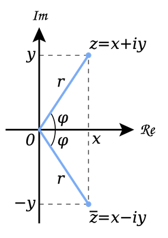

## Complex numbers

:::{admonition} What you need to know
:class: note

- **Complex numbers are just as 'real' as any other type of number!** 
They are not abstract, but essential tools in mathematics and physics.

- **Complex numbers as roots of polynomial equations.** 
For example, quadratic equations can have two complex roots, showcasing their relevance in solving equations.

- **Visualizing complex numbers**
Complex numbers can be represented on a 2D plane, known as the complex plane, much like vectors. The horizontal axis represents the real part, and the vertical axis represents the imaginary part.

- **The imaginary unit: $i = \sqrt{-1}$**
This symbol, $i$, represents the imaginary component of a complex number, where $i^2 = -1$.

- **Cartesian and polar representations**
Complex numbers can be expressed in Cartesian form $(x + iy)$ or polar form $(re^{i\phi})$, where $r$ is the magnitude, and $\phi$ is the phase (angle).

- **Euler’s formula: A beautiful and fundamental equation**
Euler’s equation, $re^{i\phi} = r(\cos \phi + i\sin \phi)$, elegantly connects complex numbers to trigonometric functions. It’s a cornerstone in both mathematics and physics.

- **Simplifying with polar coordinates**
Euler's equation makes it much easier to manipulate complex numbers, especially in their polar form, simplifying multiplication and division.

- **Rotation in the complex plane**
Multiplying by a complex number in polar form corresponds to a rotation. For instance, $re^{i\phi}$ rotates a vector of length $r$ counterclockwise by an angle $\phi$, while $re^{-i\phi}$ rotates it clockwise by $\phi$.

- **Complex conjugate: Flipping the imaginary part**
The conjugate of a complex number $z = x + iy$ is given by $z^* = x - iy$. It’s a useful operation in various calculations.

- **Multiplying by the conjugate**
When you multiply a complex number by its conjugate, $z \cdot z^*$, the result is a real number equal to the square of its distance from the origin in the complex plane: $|z|^2 = x^2 + y^2$.
:::

### Complex number living in 2D

- A complex number $z$ is a kind of 2D number that lives in 2D space and requires two components for its full specification. Watch the video to get a visual feel for why we need complex numbers. 

<iframe width="560" height="315" src="https://www.youtube.com/embed/T647CGsuOVU?si=Q2QdaM1jhy4SEdkx" title="YouTube video player" frameborder="0" allow="accelerometer; autoplay; clipboard-write; encrypted-media; gyroscope; picture-in-picture; web-share" referrerpolicy="strict-origin-when-cross-origin" allowfullscreen></iframe>

### Introducing imaginary number $ i $ 

- **What is the definition of $ i $?** The imaginary number $ i $ is defined solely by the property that its square is $−1$, that is: $i\cdot i=-1$. 

- **How does $i$ change what I know about math of real variables?** Imaginary numbers extend the real number system $\mathbb{R}$ to the complex number system $\mathbb{C}$.

- **Fundamental theorem of algebra.** says that polynomial equations like quadratic, cubic, quartic etc must have numbers of roots equal to the highest power. E.g quadratic must have two roots. Complex numbers ensure the existence of roots for polynomials.

- This equation must have two roots, how do we visualize them?

$$x^2+1=0$$

### Eculidean vs polar representation of complex numbers

:::{figure-md} markdown-fig

Visualizing complaex numbers in cartesian and polar coordinates. 

:::

:::{admonition} **Cartesian Representation**
:class: warning 

$$z = x+iy$$

- $x$ real component
- $y$ imaginary component
- $i$ imaginary number, $i^2=-1$
- $z$ complex number

:::

:::{admonition} **Euler’s formula**
:class: warning 

$$\cos{\phi} + i \sin{\phi} = e^{i\phi}$$

:::

:::{admonition} **Polar Representation**
:class: warning 

$$z = x+iy = r(\cos{\phi} + i \sin{\phi})$$

$$z = = re^{i\phi}$$

- $r=\sqrt{x^2+y^2}$ distance from origin.
- $\phi$ rotation angle in complex plane with $cos\phi=x/r$ and $sin\phi = y/r$
:::

The complex conjugate $\bar{z}$ of $z$ is defined as

:::{admonition} **Complex Conjugate**
:class: warning 

$$\bar z = x-iy$$

$$\bar z = re^{-i\phi}$$

:::

- **Sin and cos functions expressed via complex exponentials!** These representations of sin and cos are super powerful in simplifying various integrals and for deriving experssions. 

$$
\cos{\phi} = \frac{e^{i\phi} + e^{-i\phi}}{2}
$$

$$
\sin{\phi} = \frac{e^{i\phi} - e^{-i\phi}}{2i}
$$

#### Going From Carteisan to Polar

- **Extract r** The value $r$ is the Euclidean distance of vector $(x,y)$ from the origin and is equal to the modulus of $|z|=\sqrt{\bar{z}z}$

$$r = |z| = \sqrt{x^2 + y^2}$$

-  **Extract $\phi$** The value $\phi$ is the angle of with respect to the real axis.  The tangent of $\phi$ is $\left(\frac{y}{x}\right) $. Therefore using simple trigonometry we can backcalculate angle and sin, cos tan functions from cartesia representatn 

$$
\tan{\phi} = \frac{y}{x}
$$

$$
\phi = \tan^{-1} \Big(\frac{y}{x} \Big)
$$

### Examples of using complex numbers

:::{admonition} **De Moivre’s Theorem**
:class: tip, dropdown

[De Moivre’s theorem](https://en.wikipedia.org/wiki/De_Moivre%27s_formula) states that:

$$
z^n=(r(\cos{\theta} + i \sin{\theta}))^n =
r^n e^{in\theta} =
r^n(\cos{n\theta} + i \sin{n\theta})
$$

We raised complex number to power n, used polar representation and realized that exponent raised to power n simply multiplies polar angle by n. 
Note that de Moivre’s theorem allows relating trigonometric functions of angle $\theta$ raised to power $n$ to trignomoteric functions of of angle $n\theta$ of power one:

$$
r^n(\cos{\theta} + i \sin{\theta})^n = r^n (\cos{n\theta} + i \sin{n\theta})
$$

$$
(\cos{\theta} + i \sin{\theta})^n = (\cos{n\theta} + i \sin{n\theta})
$$

The proof of de Moivre's theorem can be done via [induction](https://en.wikipedia.org/wiki/De_Moivre%27s_formula), e.g one can expand the parentheses ans assert the equality for cases n=2, n=3, ...
:::

:::{admonition} **Deriving Pythagoras' theorem**
:class: tip, dropdown

We can use de Moivre’s theorem to show that
$ r = \sqrt{x^2 + y^2} $.

We have

$$
\begin{aligned}
1 &= e^{i\theta} e^{-i\theta} \\
&= (\cos{\theta} + i \sin{\theta})(\cos{(\text{-}\theta)} + i \sin{(\text{-}\theta)}) \\
&= (\cos{\theta} + i \sin{\theta})(\cos{\theta} - i \sin{\theta}) \\
&= \cos^2{\theta} + \sin^2{\theta} \\
&= \frac{x^2}{r^2} + \frac{y^2}{r^2}
\end{aligned}
$$

and thus

$$
x^2 + y^2 = r^2
$$

We recognize this as a theorem of **Pythagoras**.
:::

:::{admonition} **Deriving Trigonometric Identities**
:class: tip, dropdown

We can obtain a complete suite of trigonometric identities by
appropriately manipulating polar forms of complex numbers.

We’ll get many of them by deducing implications of the equality

$$e^{i(\omega + \theta)} = e^{i\omega} e^{i\theta}$$

For example, we’ll calculate identities for $\cos{(\omega + \theta)} $ and $ \sin{(\omega + \theta)}$.

Using the sine and cosine formulas presented at the beginning of this
lecture, we have:

$$\begin{aligned}
\cos{(\omega + \theta)} = \frac{e^{i(\omega + \theta)} + e^{-i(\omega + \theta)}}{2} \\
\sin{(\omega + \theta)} = \frac{e^{i(\omega + \theta)} - e^{-i(\omega + \theta)}}{2i}
\end{aligned}$$

We can also obtain the trigonometric identities as follows:

$$
\begin{aligned}
\cos{(\omega + \theta)} + i \sin{(\omega + \theta)}
&= e^{i(\omega + \theta)} \\
&= e^{i\omega} e^{i\theta} \\
&= (\cos{\omega} + i \sin{\omega})(\cos{\theta} + i \sin{\theta}) \\
&= (\cos{\omega}\cos{\theta} - \sin{\omega}\sin{\theta}) +
i (\cos{\omega}\sin{\theta} + \sin{\omega}\cos{\theta})
\end{aligned}
$$

Since both real and imaginary parts of the above formula should be
equal, we get:

$$
\begin{aligned}
\cos{(\omega + \theta)} = \cos{\omega}\cos{\theta} - \sin{\omega}\sin{\theta} \\
\sin{(\omega + \theta)} = \cos{\omega}\sin{\theta} + \sin{\omega}\cos{\theta}
\end{aligned}
$$

The equations above are also known as the **angle sum identities**. 

:::

:::{admonition} **Evaluating Trigonometric Integrals**
:class: tip, dropdown

We can also compute the trigonometric integrals using polar forms of
complex numbers.

For example, we want to solve the following integral:

$$\int_{-\pi}^{\pi} \cos(\omega) \sin(\omega) \, d\omega$$

Using Euler’s formula, we have:

$$\begin{aligned}
\int \cos(\omega) \sin(\omega) \, d\omega
&=
\int
\frac{(e^{i\omega} + e^{-i\omega})}{2}
\frac{(e^{i\omega} - e^{-i\omega})}{2i}
\, d\omega  \\
&=
\frac{1}{4i}
\int
e^{2i\omega} - e^{-2i\omega}
\, d\omega  \\
&=
\frac{1}{4i}
\bigg( \frac{-i}{2} e^{2i\omega} - \frac{i}{2} e^{-2i\omega} + C_1 \bigg) \\
&=
-\frac{1}{8}
\bigg[ \bigg(e^{i\omega}\bigg)^2 + \bigg(e^{-i\omega}\bigg)^2 - 2 \bigg] + C_2 \\
&=
-\frac{1}{8}  (e^{i\omega} - e^{-i\omega})^2  + C_2 \\
&=
\frac{1}{2} \bigg( \frac{e^{i\omega} - e^{-i\omega}}{2i} \bigg)^2 + C_2 \\
&= \frac{1}{2} \sin^2(\omega) + C_2
\end{aligned}$$

and thus:

$$
\int_{-\pi}^{\pi} \cos(\omega) \sin(\omega) \, d\omega =
\frac{1}{2}\sin^2(\pi) - \frac{1}{2}\sin^2(-\pi) = 0
$$
:::

### Problems

#### Problem 1

:::{admonition} **Solution 1** 
:class: dropdown

:::

#### Problem 2

:::{admonition} **Solution 2** 
:class: dropdown

:::

#### Problem 3

:::{admonition} **Solution 3** 
:class: dropdown

:::

#### Problem 4

:::{admonition} **Solution 4** 
:class: dropdown

:::

#### Problem 5

:::{admonition} **Solution 5** 
:class: dropdown

:::

