## Five things classical physics cannot explain {.smaller}

:::: {.columns}
::: {.column width="34%"}
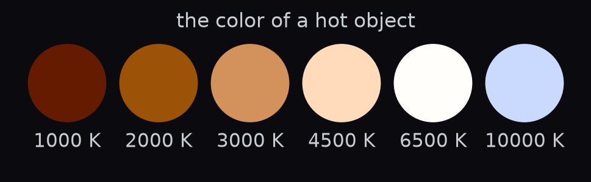{height="165px" fig-align="center"}

Why does hot iron glow **red**, then **white**?
:::
::: {.column width="33%"}
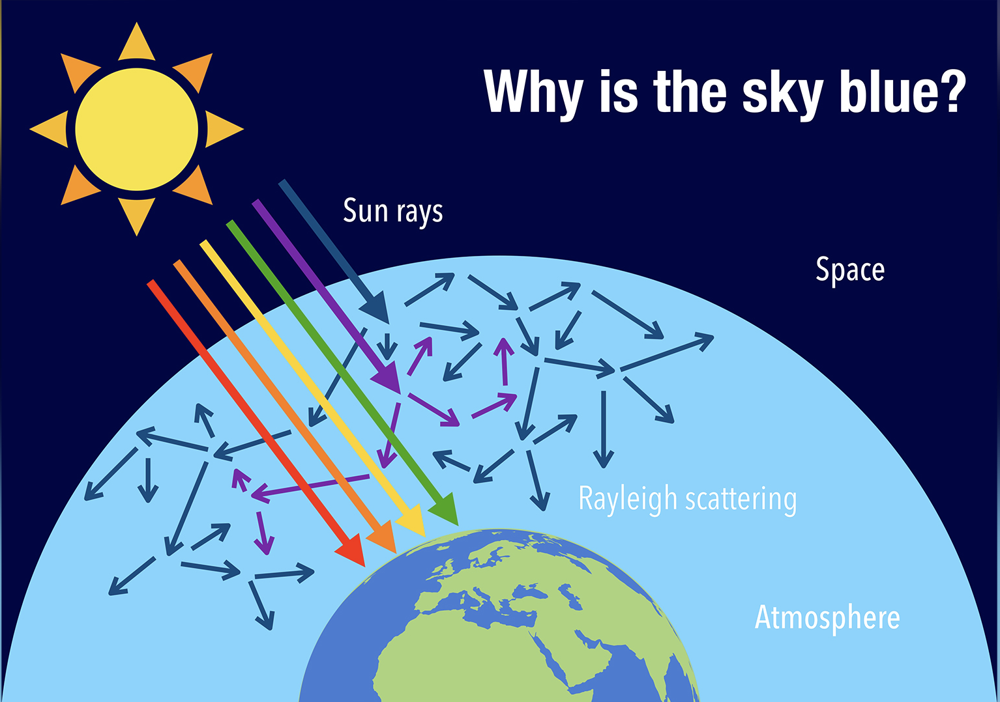{height="165px" fig-align="center"}

Why is the sky **blue**?
:::
::: {.column width="33%"}
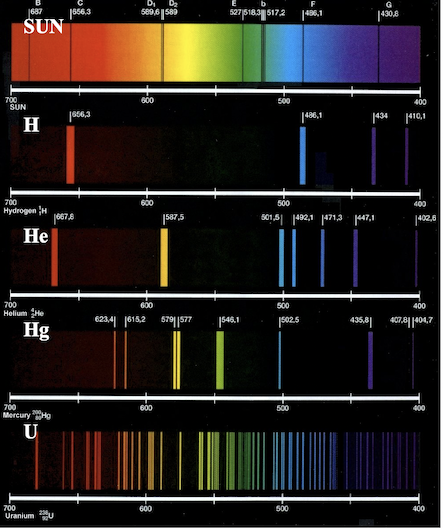{height="165px" fig-align="center"}

Why do stars and neon signs shine in **sharp lines**?
:::
::::

:::: {.columns}
::: {.column width="50%"}
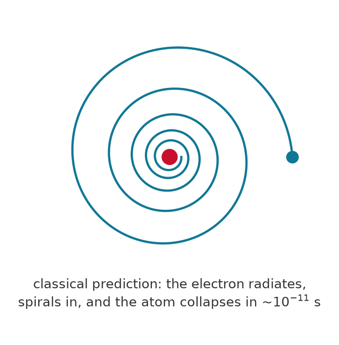{height="215px" fig-align="center"}

Why doesn't the electron **crash into the nucleus**?
:::
::: {.column width="50%"}
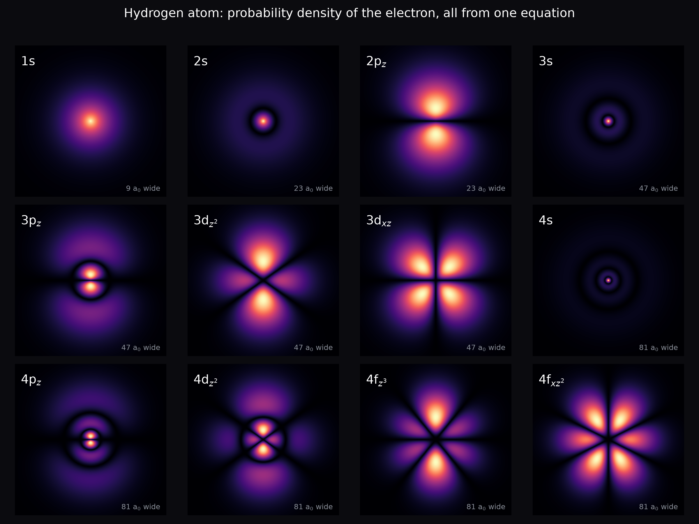{height="215px" fig-align="center"}

Why do electron clouds come in **these shapes**, and why does the periodic table follow from them?
:::
::::

::: {.fragment}
**Every one of these is answered in this course.**
:::

## What is quantum mechanics?

:::: {.columns}
::: {.column width="45%"}
The **fundamental theory of nature**, governing atoms, molecules, and subatomic particles.

- A *complete description* of physical reality
- Has **never failed an experimental test** since its discovery
- Verified to an **astonishing degree of accuracy**
:::
::: {.column width="55%"}
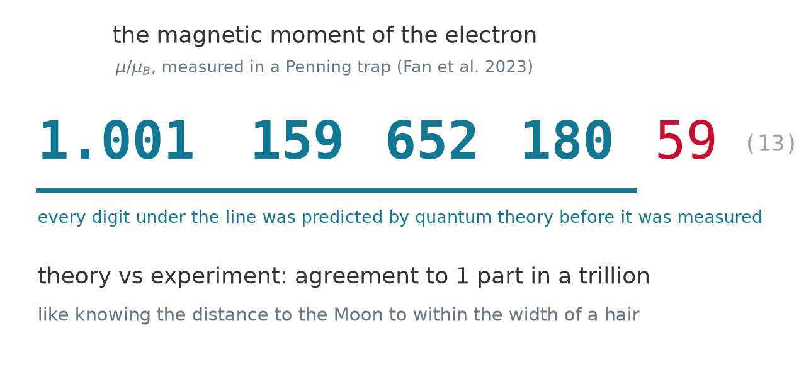{width="100%"}

[the most precisely tested prediction in all of science: theory and experiment agree to one part in a trillion. Fan, X., Myers, T. G., Sukra, B. A. D., & Gabrielse, G. (2023). Measurement of the electron magnetic moment. *Phys. Rev. Lett.* 130, 071801. [doi:10.1103/PhysRevLett.130.071801](https://doi.org/10.1103/PhysRevLett.130.071801)]{.caption}
:::
::::

## Beware: quantum mechanics is weird 🤯

:::: {.columns}
::: {.column width="45%"}
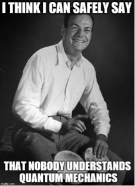{width="70%"}
:::
::: {.column width="55%"}
> "I think I can safely say that nobody understands quantum mechanics."
>
> Richard Feynman

::: {.fragment}
Be prepared to let go of the idea that *"things make sense."*
We can still **master the logic** of QM and apply it everywhere.
:::
:::
::::

## Zoom in {background-color="#0b0b0f"}

:::: {.columns}
::: {.column width="33%"}
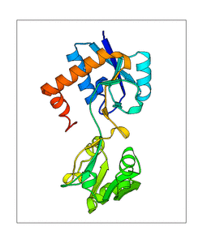{height="290px" fig-align="center"}

[**protein**: Newton's laws, ~10,000 atoms]{.caption}
:::
::: {.column width="34%"}
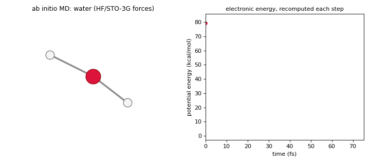{height="290px" fig-align="center"}

[**water molecule**: nuclei classical, electrons quantum, computed for this course]{.caption}
:::
::: {.column width="33%"}
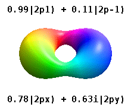{height="290px" fig-align="center"}

[**one electron in hydrogen**: pure quantum, no orbit, only a wave]{.caption}
:::
::::

::: {.fragment}
Same matter, three levels of description. This course is about the right-hand end.
:::

## QM is not "just another theory"

In the hierarchy *biology → chemistry → physics → math*,
quantum mechanics sits in a unique spot:

::: {.fragment}
> It is like the **operating system** on which other theories run as "apps."

Translating a classical theory into this OS is what physicists call **quantization**.

::: {.callout-note appearance="minimal"}
Scott Aaronson, *Quantum Computing Since Democritus* (2013)
:::
:::

## Chemistry runs on quantum mechanics

One year after the Schrödinger equation, Dirac (1929) declared the game over:

> "The underlying physical laws necessary for ... **the whole of chemistry** are thus completely known, and the difficulty is only that the exact application of these laws leads to equations much too complicated to be soluble."

::: {.fragment}
- Every **bond**, **reaction barrier**, **color**, and **spectrum** is a solution of one equation
- A century of cleverness (plus computers, plus now **AI trained on millions of quantum calculations**) went into extracting those solutions
:::

## What you will compute yourself {.smaller}

:::: {.columns}
::: {.column width="25%"}
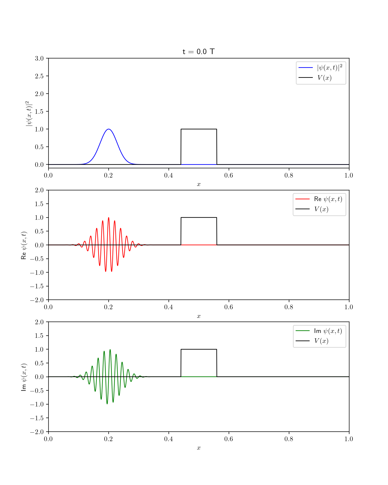{height="380px"}
:::
::: {.column width="25%"}
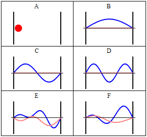{height="380px"}
:::
::: {.column width="25%"}
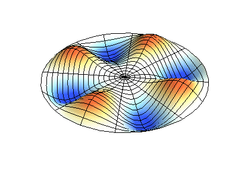{height="380px"}
:::
::: {.column width="25%"}
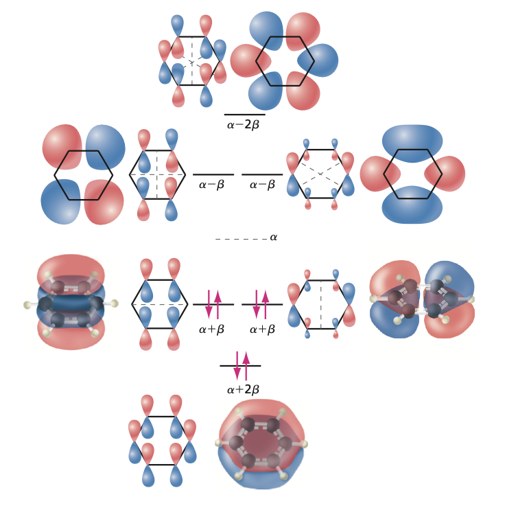{height="380px"}
:::
::::

## And then quantum mechanics became a technology

> "Nature isn't classical, dammit, and if you want to make a simulation of nature, you'd better make it quantum mechanical."
>
> Richard Feynman (1982)

::: {.fragment}
- **Superposition** and **entanglement** turned out to be *resources*
- A **qubit** is just a two-level quantum system; a quantum computer computes with wavefunctions
- The killer app: **simulating molecules**, exactly this course's subject
- Everyday hardware already runs on QM: transistors, LEDs, lasers, MRI, the atomic clocks behind GPS
:::

## What skills will you gain?

:::: {.columns}
::: {.column width="48%"}
- **Probabilistic thinking** and comfort with uncertainty
- **Linear algebra + differential equations**, applied for real
- Ability to **decode electronic structure calculations** in research papers
- Insight into **bonding, spectroscopy, and reactivity**
:::
::: {.column width="52%"}
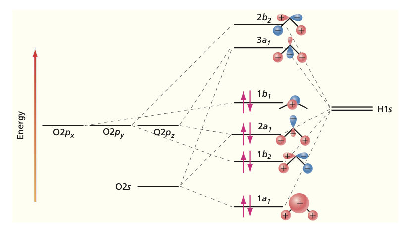{width="100%"}

[the molecular orbitals of water: by the end you will read this diagram at a glance, and compute it yourself]{.caption}
:::
::::

# Takeaway {.center background-color="#0b0b0f"}

> Chemistry *is* applied quantum mechanics. If you feel you don't fully understand QM, you're in good company, with *everyone else*. The goal is to master its **logic**, not its intuition.
