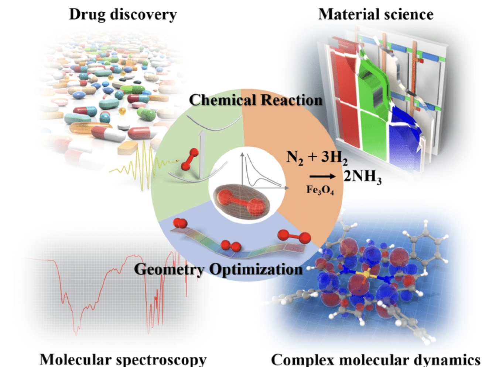
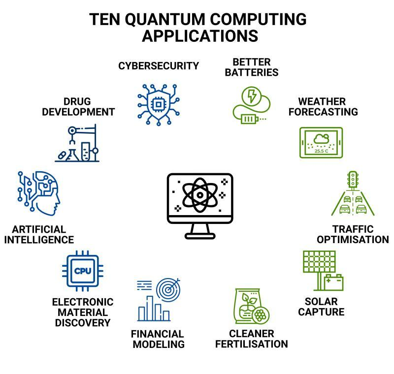

## What is quantum mechanics?

::: {.fragment}
The **fundamental theory of nature**, governing atoms, molecules, and subatomic particles.
:::

- A *complete description* of physical reality
- Has **never failed an experimental test** since its discovery
- Verified to an **astonishing degree of accuracy**

## Beware: quantum mechanics is weird 🤯

:::: {.columns}
::: {.column width="45%"}
{width="70%"}
:::
::: {.column width="55%"}
> "I think I can safely say that nobody understands quantum mechanics."
>
> Richard Feynman

::: {.fragment}
Be prepared to let go of the idea that *"things make sense."*
We can still **master the logic** of QM and apply it everywhere.
:::
:::
::::

## QM is not "just another theory"

::: {.fragment}
In the hierarchy *biology → chemistry → physics → math*,
quantum mechanics sits in a unique spot:
:::

::: {.fragment}
> It is like the **operating system** on which other theories run as "apps."

Translating a classical theory into this OS is what physicists call **quantization**.
:::

::: {.fragment}
::: {.callout-note appearance="minimal"}
Scott Aaronson, *Quantum Computing Since Democritus* (2013)
:::
:::

## Chemistry runs on quantum mechanics

::: {.fragment}
One year after the Schrödinger equation, Dirac (1929) declared the game over:
:::

::: {.fragment}
> "The underlying physical laws necessary for ... **the whole of chemistry** are thus completely known, and the difficulty is only that the exact application of these laws leads to equations much too complicated to be soluble."
:::

- Every **bond**, **reaction barrier**, **color**, and **spectrum** is a solution of the Schrödinger equation
- A century of cleverness (plus computers) went into extracting those solutions

## Where is quantum mechanics applied?

:::: {.columns}
::: {.column width="50%"}
{width="90%"}
:::
::: {.column width="50%"}
- Chemistry & materials
- Spectroscopy: NMR, UV-Vis, IR, lasers
- Lasers, LEDs, transistors, solar cells
- MRI, atomic clocks behind GPS
:::
::::

## Watching molecules move, atom by atom

{width="85%" fig-align="center"}

::: {.fragment}
**Ab initio molecular dynamics** of one water molecule: at every step the electrons' Schrödinger equation is solved from scratch to get the forces on the nuclei. *By the end of this course you will understand every ingredient of this simulation.*
:::

## "Too complicated to be soluble" is no longer entirely true

- **QM/MM** (Nobel Prize 2013): a quantum region embedded in a classical environment, enzymes and materials watched one femtosecond at a time
- **AI has joined the party**: machine-learned force fields are neural networks trained on **millions of quantum calculations**
- Quantum accuracy at a tiny fraction of the cost
- Quantum chemistry is now one of the biggest producers of **AI training data** in science

## And then quantum mechanics became a technology

:::: {.columns}
::: {.column width="45%"}
{width="90%"}
:::
::: {.column width="55%"}
> "Nature isn't classical, dammit, and if you want to make a simulation of nature, you'd better make it quantum mechanical."
>
> Richard Feynman (1982)

- **Superposition** and **entanglement** turned out to be *resources*
- A **qubit** is just a two-level quantum system
- The killer app: **simulating molecules**, exactly this course's subject
:::
::::

## What skills will you gain?

- **Probabilistic thinking** and comfort with uncertainty
- **Linear algebra + differential equations**, applied for real
- Ability to **decode electronic structure calculations** in research papers
- Insight into **bonding, spectroscopy, and reactivity**

::: {.fragment}
And an upgraded meme game.
:::

# Takeaway {.center}

> Chemistry *is* applied quantum mechanics. If you feel you don't fully understand QM, you're in good company, with *everyone else*. The goal is to master its **logic**, not its intuition.
