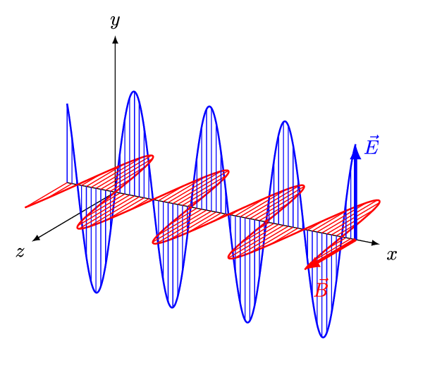
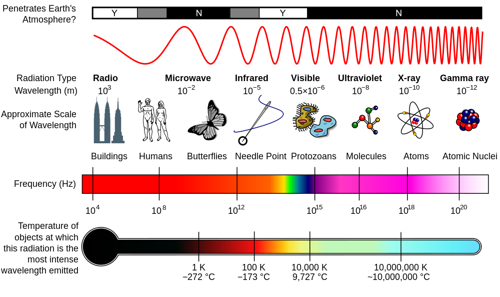
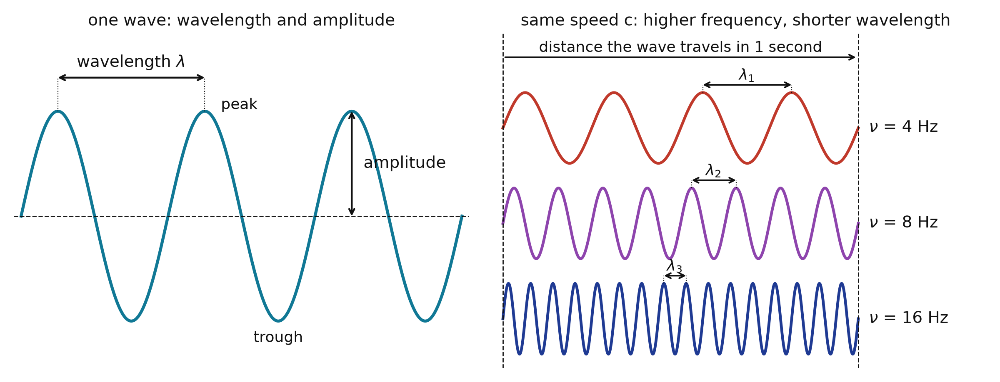
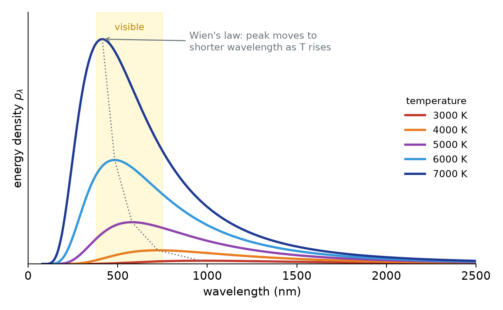
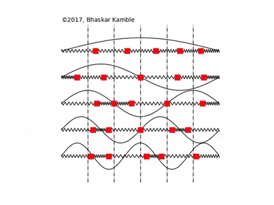
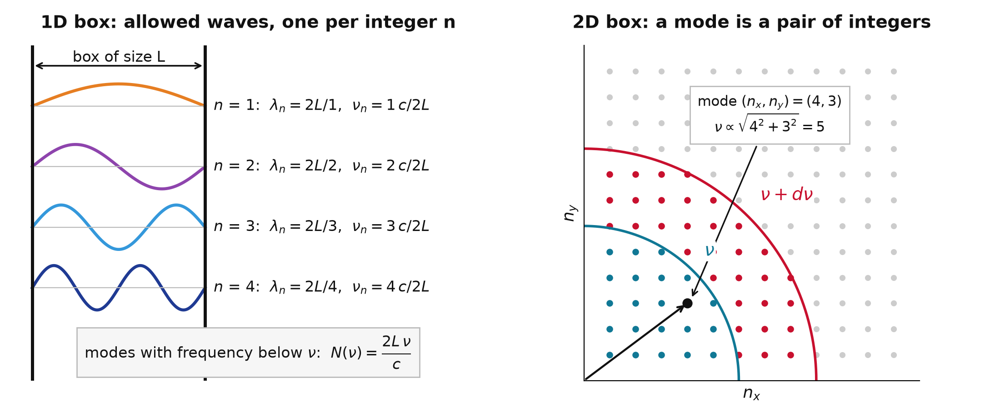
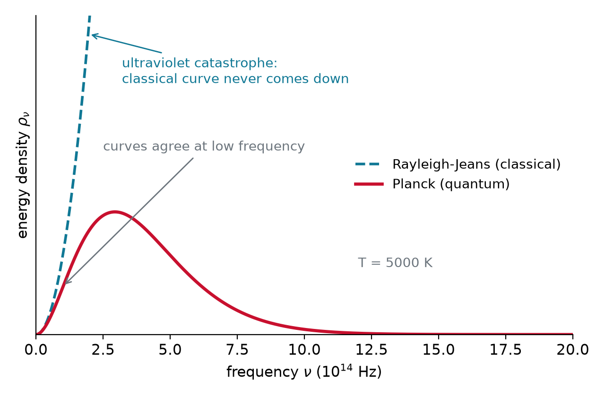
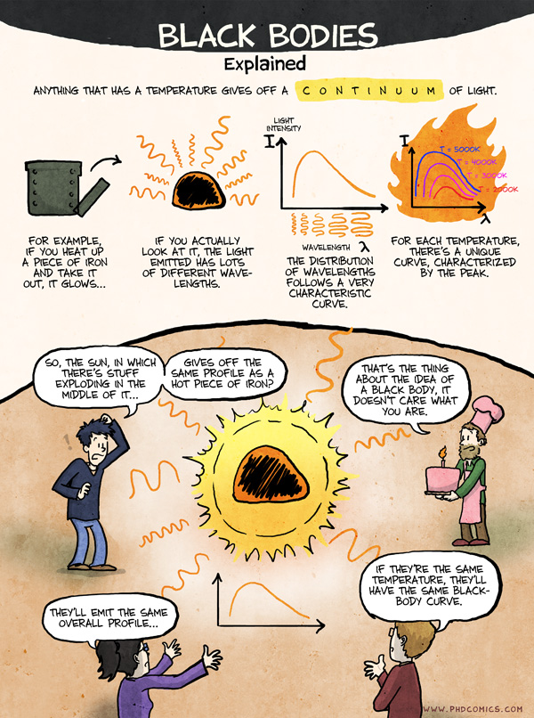

## What is the nature of light?

:::: {.columns}
::: {.column width="50%"}
{width="90%"}
:::
::: {.column width="50%"}
- Light as a **traveling electromagnetic wave**
- Perpendicular **electric** and **magnetic** components
- Needs **no medium**, travels in vacuum at speed $c$
- This wave picture is **not the whole story**
:::
::::

## The electromagnetic spectrum

:::: {.columns}
::: {.column width="55%"}
{width="95%"}
:::
::: {.column width="45%"}
- **Visible light** is a narrow band
- **High frequency** carries **more energy** (X-rays, gamma)
- **Low frequency** carries **less energy** (microwave, radio)
- Clear link between an object's **temperature** and its radiation
:::
::::

## Frequency, wavelength, speed of light

{width="88%" fig-align="center"}

::: {.keyeq}
$$\lambda \nu = c \qquad c = 3 \cdot 10^8 \, \text{m/s}$$
:::

- Key question: how does the **energy** $E$ of light relate to its **frequency** $\nu$?

## How a light bulb started quantum mechanics

:::: {.columns}
::: {.column width="30%"}
{width="100%"}
:::
::: {.column width="70%"}
- **1887**: Siemens and Helmholtz found the PTR in Berlin, the first national standards lab, to serve German industry
- Its customer: the **electric lighting** business. How much light does a glowing filament give per watt, and at what temperature?
- **1890s**: Lummer, Pringsheim, Rubens, Kurlbaum measure black body spectra with unmatched precision, deep into the infrared
- **October 1900**: Wien's formula fails at long wavelengths; Rubens tells Planck on a Sunday; Planck has the right formula by evening
- **December 1900**: the only derivation that works needs $E = h\nu$. Planck: "an act of desperation"
- [The full story, with the people and instruments (video)](https://www.youtube.com/watch?v=i1TVZIBj7UA)
:::
::::

## The black body

:::: {.columns}
::: {.column width="55%"}
{width="100%"}
:::
::: {.column width="45%"}
- **Idealized model**: absorbs and emits **every wavelength**
- In thermal equilibrium at temperature $T$
- Emitted spectrum set **only by** $T$
- Heating up: **intensity rises**, peak shifts to **shorter** $\lambda$, color goes **red to white to blue**
:::
::::

## The recipe for a radiation spectrum

$$\rho_{\nu}(T)\, d\nu = \underbrace{\langle E \rangle}_{\text{energy per mode}} \times \underbrace{dN_{\nu}}_{\text{number of modes}}$$

- A **mode** is one standing wave that fits in the box, like one harmonic of a guitar string; each mode has its own frequency
- Energy at frequency $\nu$ = **average energy** of one mode $\times$ **number of modes** at that frequency
- **Average mode energy** $\langle E\rangle$ is thermodynamics: what the waves are, how much energy each holds. This is where classical and quantum physics part ways
- **Number of modes** $dN_\nu$ is geometry: how many standing waves fit in a box. Same classically and quantum

## Average mode energy, the classical way

:::: {.columns}
::: {.column width="45%"}
{width="95%"}
:::
::: {.column width="55%"}
- Heated atoms vibrate like **springs**, radiating at frequency $\nu$
- **Equipartition**: every oscillator gets the same energy, whatever its frequency
$$\langle E\rangle = k_BT$$
- The same $k_BT$ for a slow, long wave and a fast, short one. Hold that thought
:::
::::

## Number of modes: counting the waves in a box

:::: {.columns}
::: {.column width="46%"}
{width="100%"}
:::
::: {.column width="54%"}
- Only whole half-waves fit: $\lambda_n = 2L/n$
- **Shorter waves fit more easily**: $N \sim L/\lambda \sim \nu$ in 1D
- In 3D the wave must fit along each direction, so $N \sim \nu^3$
- A thin slice of frequency holds
$$dN_{\nu} = \frac{8\pi}{c^3}\,\nu^2\, d\nu$$
:::
::::

## The ultraviolet catastrophe

:::: {.columns}
::: {.column width="55%"}
{width="100%"}
:::
::: {.column width="45%"}
- Energy per mode $\times$ modes, the **Rayleigh-Jeans law**:
$$\rho(\nu) = k_B T \cdot \frac{8\pi}{c^3}\nu^2$$
- It **shoots to infinity** at high $\nu$: a light bulb could destroy the universe
- The mode count is solid geometry, so **the average energy must be wrong**
:::
::::

## Live: heat it up {.smaller}

<span style="color:#C8102E">**Planck**</span> vs <span style="color:#7fb3d5">**Rayleigh-Jeans (classical)**</span>, plotted per unit frequency; shaded band is visible light, dotted line is the peak

```{ojs}
//| echo: false
viewof Tbb = Inputs.range([1000, 10000], {step: 100, value: 5800, label: "temperature T (K)"})
```

```{ojs}
//| echo: false
{
  const h = 6.626e-34, c = 2.998e8, kB = 1.381e-23;
  const nus = d3.range(0.02, 30, 0.05);   // in units of 1e14 Hz
  const planck = nus.map(n => { const nu = n * 1e14; return {x: n, y: 8 * Math.PI * h * Math.pow(nu, 3) / Math.pow(c, 3) / Math.expm1(h * nu / (kB * Tbb))}; });
  const rj = nus.map(n => { const nu = n * 1e14; return {x: n, y: 8 * Math.PI * Math.pow(nu, 2) * kB * Tbb / Math.pow(c, 3)}; });
  const ymax = 1.6 * d3.max(planck, d => d.y);
  const nuPeak = 5.879e10 * Tbb / 1e14;   // Wien's law in frequency form
  return Plot.plot({
    width: 1000, height: 360,
    x: {label: "frequency (10^14 Hz)", domain: [0, 30]},
    y: {label: "energy density per unit frequency", domain: [0, ymax], ticks: 0},
    marks: [
      Plot.rect([{x1: 4.0, x2: 7.9, y1: 0, y2: ymax}], {x1: "x1", x2: "x2", y1: "y1", y2: "y2", fill: "gold", fillOpacity: 0.15}),
      Plot.ruleX([nuPeak], {stroke: "#999", strokeDasharray: "2,3"}),
      Plot.line(rj, {x: "x", y: "y", stroke: "#7fb3d5", strokeWidth: 2, strokeDasharray: "6,4", clip: true}),
      Plot.line(planck, {x: "x", y: "y", stroke: "#C8102E", strokeWidth: 2.5})
    ]
  });
}
```

```{ojs}
//| echo: false
md`Peak at **${(5.879e10 * Tbb / 1e14).toFixed(1)} x 10^14 Hz**: the object ${Tbb < 3500 ? "glows dull red" : Tbb < 6500 ? "looks yellow-white, like the Sun" : "looks blue-white"}. The classical curve never comes down.`
```

## Planck's trick: quantization

In 1900 Planck postulated that an oscillator can hold only **discrete** amounts of energy:

::: {.keyeq}
$$\boxed{E = n\,h\nu}, \qquad n = 0, 1, 2, \ldots$$
:::

- Planck's constant: $h = 6.63 \cdot 10^{-34} \, \text{J} \cdot \text{s}$
- Atoms absorb and emit radiation in **quanta**, multiples of $h\nu$
- $h$ is tiny, so quantization is **invisible** at the macro scale (classical limit $h \to 0$)

## Planck's law: same recipe, new average energy

::: {.fragment}
Quantized oscillators give a **frequency-dependent** average energy (Boltzmann-weighted sum over $n$):
$$\langle E \rangle = \frac{h\nu}{e^{\frac{h\nu}{ kT}} - 1} \qquad \Big(\to k_BT \text{ for } h\nu \ll k_BT\Big)$$
:::

::: {.fragment}
Energy per mode $\times$ modes, with the mode count untouched:

::: {.keyeq}
$$\rho_{\nu}(T) = \frac{8\pi \nu^2}{c^3} \cdot \frac{h\nu}{e^{\frac{h\nu}{kT}} - 1}$$
:::

- The exponential **beats** the $\nu^2$: the curve comes down, the total is finite ($\propto T^4$)
:::

## Wien's displacement law

:::: {.columns}
::: {.column width="45%"}
{width="95%"}
:::
::: {.column width="55%"}
- Peak wavelength is **inversely proportional** to temperature:

::: {.keyeq}
$$\lambda_{max} = \frac{b}{T}$$
:::

- $b = 2.898 \cdot 10^{-3} \, m \cdot K$
- Connects an object's **temperature** to its **color**
- Hotter object: **shorter** $\lambda_{max}$ (bluer)
:::
::::

# Takeaway {.center}

> A spectrum is **modes times energy per mode**. Classical equipartition gives every mode $k_BT$ and the ultraviolet catastrophe; Planck's $E = nh\nu$ starves the high-frequency modes, cures the catastrophe, and starts quantum mechanics.
