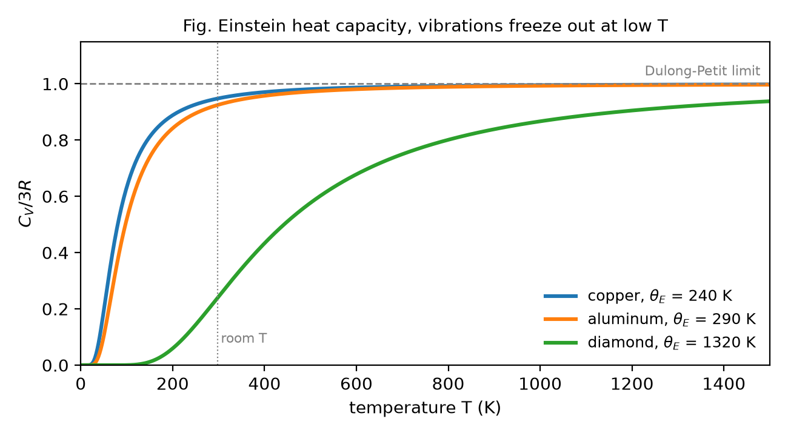

## What is the nature of light?

:::: {.columns}
::: {.column width="50%"}
{width="90%"}
:::
::: {.column width="50%"}
- Light as a **traveling electromagnetic wave**
- Perpendicular **electric** and **magnetic** components
- Needs **no medium**, travels in vacuum at speed $c$
- This wave picture is **not the whole story**
:::
::::

## The electromagnetic spectrum

:::: {.columns}
::: {.column width="55%"}
{width="95%"}
:::
::: {.column width="45%"}
- **Visible light** is a narrow band
- **High frequency** carries **more energy** (X-rays, gamma)
- **Low frequency** carries **less energy** (microwave, radio)
- Clear link between an object's **temperature** and its radiation
:::
::::

## Frequency, wavelength, speed of light

::: {.fragment}
$$\lambda \nu = c$$
:::

- **Speed of light**: $c = 3 \cdot 10^8 \, m/s$ (fundamental constant)
- **Frequency** $\nu$: cycles per second, $1\,Hz = 1\,s^{-1}$
- **Wavelength** $\lambda$: distance between successive peaks
- Key question: how does **energy** $E$ relate to **frequency** $\nu$?

## The black body

:::: {.columns}
::: {.column width="45%"}
{width="95%"}
:::
::: {.column width="55%"}
- **Idealized model**: absorbs and emits **every wavelength**
- In thermal equilibrium at temperature $T$
- Emitted spectrum set **only by** $T$
- Heating up: (1) **intensity rises**, (2) peak **shifts to higher** $\nu$, (3) color **red to yellow to blue**
:::
::::

## The classical picture

:::: {.columns}
::: {.column width="45%"}
{width="95%"}
:::
::: {.column width="55%"}
- Heated atoms vibrate like **springs**, radiating at frequency $\nu$
- More **short-wavelength** modes fit in a box than long ones:
$$dN_{\nu} = \frac{8\pi}{c^3} \cdot \nu^2 d\nu$$
- **Equipartition**: each oscillator gets the same energy
$$\langle E\rangle = k_BT$$
:::
::::

## The ultraviolet catastrophe

:::: {.columns}
::: {.column width="50%"}
{width="90%"}
:::
::: {.column width="50%"}
- Classical radiation distribution:
$$\rho({\nu}) = k_B T \cdot \frac{8\pi}{c^3}\nu^2$$
- **Shoots to infinity** at high $\nu$
- Total radiation would be **infinite**: a light bulb could destroy the universe
- **Classical physics fails**
:::
::::

## Live: heat it up {.smaller}

<span style="color:#C8102E">**Planck**</span> vs <span style="color:#7fb3d5">**Rayleigh-Jeans (classical)**</span>; shaded band is visible light, dotted line is the Wien peak

```{ojs}
//| echo: false
viewof Tbb = Inputs.range([1000, 10000], {step: 100, value: 5800, label: "temperature T (K)"})
```

```{ojs}
//| echo: false
{
  const h = 6.626e-34, c = 2.998e8, kB = 1.381e-23;
  const lams = d3.range(50, 3000, 5);
  const planck = lams.map(l => { const lm = l * 1e-9; return {x: l, y: 8 * Math.PI * h * c / Math.pow(lm, 5) / Math.expm1(h * c / (lm * kB * Tbb))}; });
  const rj = lams.map(l => { const lm = l * 1e-9; return {x: l, y: 8 * Math.PI * kB * Tbb / Math.pow(lm, 4)}; });
  const ymax = 1.6 * d3.max(planck, d => d.y);
  return Plot.plot({
    width: 1000, height: 360,
    x: {label: "wavelength (nm)", domain: [0, 3000]},
    y: {label: "energy density", domain: [0, ymax], ticks: 0},
    marks: [
      Plot.rect([{x1: 380, x2: 750, y1: 0, y2: ymax}], {x1: "x1", x2: "x2", y1: "y1", y2: "y2", fill: "gold", fillOpacity: 0.15}),
      Plot.ruleX([2.898e6 / Tbb], {stroke: "#999", strokeDasharray: "2,3"}),
      Plot.line(rj, {x: "x", y: "y", stroke: "#7fb3d5", strokeWidth: 2, strokeDasharray: "6,4", clip: true}),
      Plot.line(planck, {x: "x", y: "y", stroke: "#C8102E", strokeWidth: 2.5})
    ]
  });
}
```

```{ojs}
//| echo: false
md`Wien peak at **${(2.898e6 / Tbb).toFixed(0)} nm**: the object ${Tbb < 3500 ? "glows dull red" : Tbb < 6500 ? "looks yellow-white, like the Sun" : "looks blue-white"}. The classical curve never comes down.`
```

## Planck's trick: quantization

::: {.fragment}
In 1900 Planck postulated that only **discrete** energy values are allowed:
:::

::: {.fragment}
$$\boxed{E= h\nu}$$
:::

- Planck's constant: $h = 6.63 \cdot 10^{-34} \, \text{J} \cdot \text{s}$
- Atoms absorb and emit radiation in **quanta**, multiples of $h\nu$
- $h$ is tiny, so quantization is **invisible** at the macro scale (classical limit $h \to 0$)

## Planck's radiation law

::: {.fragment}
Quantized oscillators give a **frequency-dependent** average energy:
$$\langle E \rangle = \frac{h\nu}{e^{\frac{h\nu}{ kT}} - 1}$$
:::

::: {.fragment}
This yields a distribution that **vanishes** at high frequency:
$$\rho_{\nu}(T) = \frac{8\pi \nu^2}{c^3} \cdot \frac{h\nu}{e^{\frac{h\nu}{kT}} - 1}$$
:::

- Integrating over all $\nu$ gives a **finite** total, $\propto T^4$ (Stefan-Boltzmann)
- No more catastrophe!

## Wien's displacement law

:::: {.columns}
::: {.column width="45%"}
{width="95%"}
:::
::: {.column width="55%"}
- Peak wavelength is **inversely proportional** to temperature:
$$\lambda_{max} = \frac{b}{T}$$
- $b = 2.898 \cdot 10^{-3} \, m \cdot K$
- Connects an object's **temperature** to its **color**
- Hotter object: **shorter** $\lambda_{max}$ (bluer)
:::
::::

## Quantization beyond light: heat capacities

:::: {.columns}
::: {.column width="55%"}
{width="100%"}
:::
::: {.column width="45%"}
- Classical **Dulong-Petit**: $C_V = 3R$ for every solid, at every $T$
- Measured: $C_V \to 0$ as $T \to 0$
- **Einstein (1907)**: atoms are Planck oscillators, vibrations **freeze out** below $\theta_E = h\nu/k_B$
- Same $E = h\nu$, second triumph
:::
::::

# Takeaway {.center}

> Energy is **quantized**: by postulating $E = h\nu$, Planck cured the ultraviolet catastrophe and gave birth to quantum mechanics.
