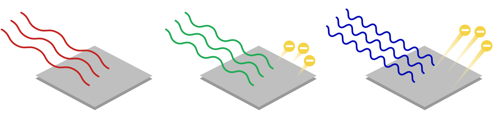
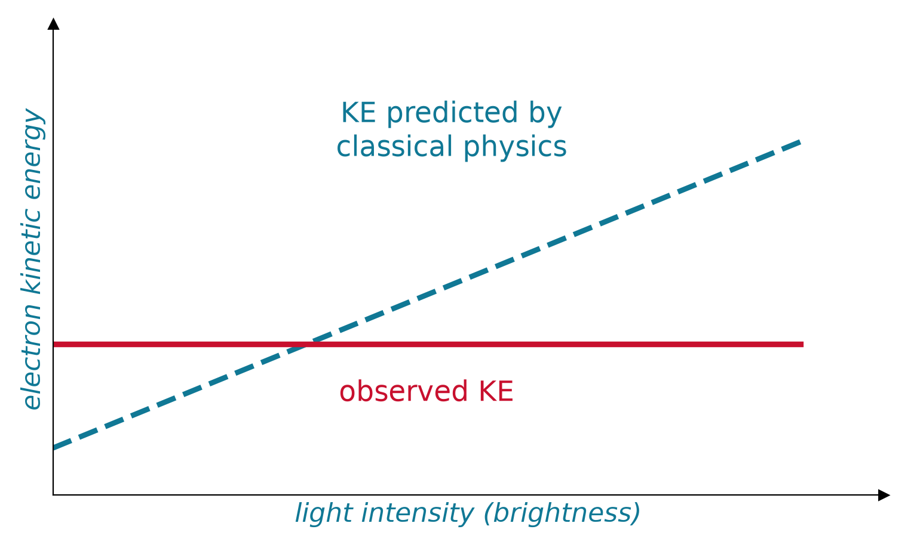
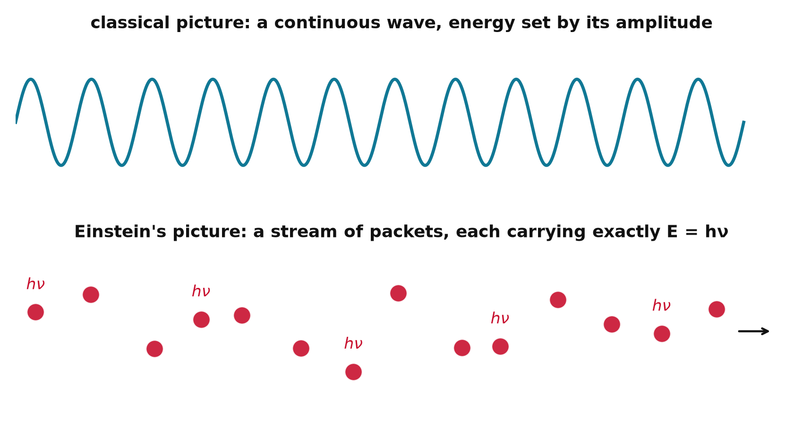
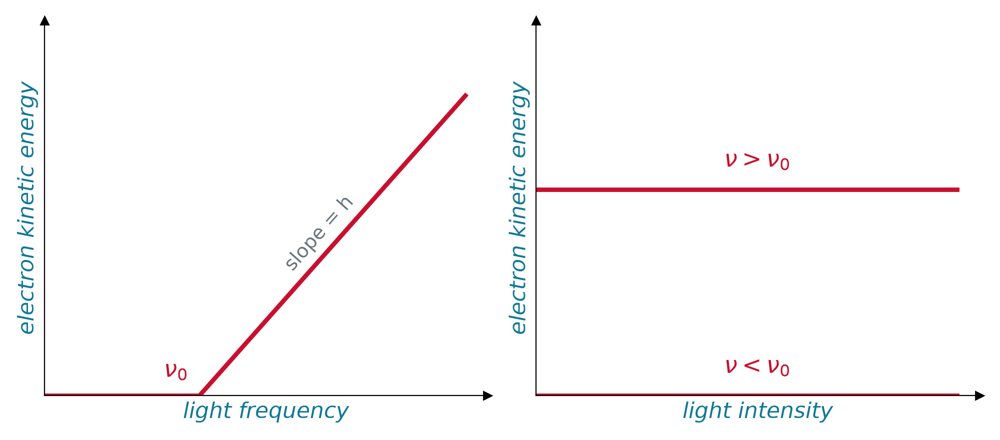
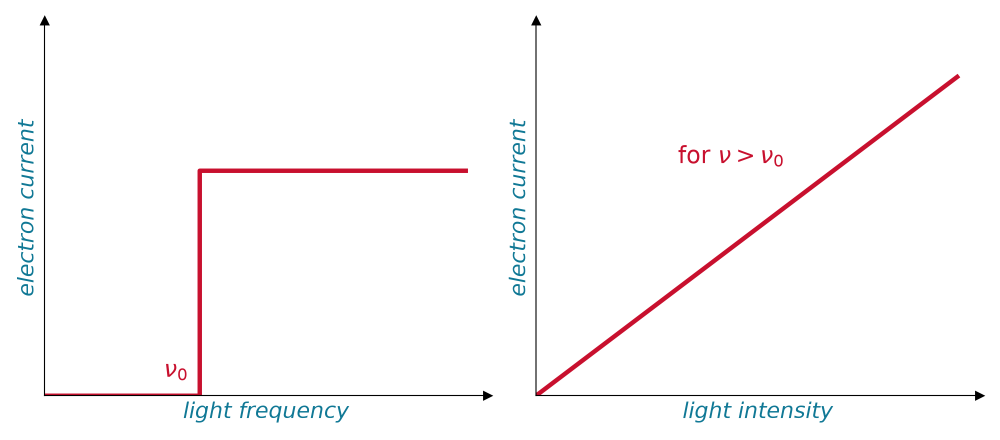
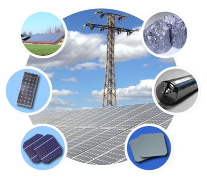

## The Puzzle

:::: {.columns}
::: {.column width="50%"}
{width="90%"}
:::
::: {.column width="50%"}
- Shine radiation on a metal: electrons fly off
- Only **above a threshold frequency** $\nu_0$
- **Below** $\nu_0$: no electrons, no matter how bright
- Frequency increases left to right
:::
::::

## Why Classical Physics Fails

{width="52%" fig-align="center"}

- Classically the energy of a wave scales with its **amplitude**: $E \propto A^2$, with **no role for frequency**
- Experiment says no, twice: KE ignores brightness, and electrons leave **instantly** even in dim light
- **Intensity is the wrong knob.** Frequency is the gatekeeper

## Enter the Photon

{width="72%" fig-align="center"}

- Planck quantized the **oscillators** (seen then as a math trick); **Einstein** quantized **light itself**: a stream of discrete packets, photons
- One packet is absorbed **whole by one electron**, instantly: no soaking-up time, and brightness only sets how many packets arrive

## Energy of a Photon

::: {.keyeq}
$$
E_{photon} = h\nu = \frac{hc}{\lambda}
$$
:::

- $E_{photon}$: energy of one photon
- $\nu$: frequency of that photon
- **Both matter and radiation are quantized**, by the same relation: energy = (Planck constant) times frequency

## Kinetic Energy: Frequency vs Intensity

{width="72%" fig-align="center"}

- Need $\nu > \nu_0$ to eject at all; then **KE grows linearly with frequency**, with slope $h$
- KE does **not** depend on intensity: below $\nu_0$, brighter light still ejects nothing

## Electric Current: Frequency vs Intensity

{width="72%" fig-align="center"}

- Above threshold, **frequency does not change the current**
- **Intensity sets the current**: more photons, more electrons, rising linearly

## How Photons Explain It All

- **Intensity** = number of photons (sets the *current*)
- **Frequency** = energy per photon (sets the *KE*)
- $n$ photons per second carry total energy $nh\nu$
- **One photon ejects one electron**, if it carries enough energy

## The Photoelectric Equation

One photon hands all its energy to one electron: part pays the exit fee, the rest is speed.

::: {.keyeq}
$$E_{photon} = W_0 + KE \qquad\Longrightarrow\qquad h\nu = h\nu_0 + \frac{mv_e^2}{2}$$
:::

- **Work function** $W_0 = h\nu_0$: minimum energy to free an electron (material dependent)
- $\nu_0$: **threshold frequency**; below it, no energy transfers
- Excess energy becomes electron kinetic energy $KE = mv_e^2/2$

## Live: pick a metal, dial the light {.smaller}

The line is $KE_{max} = h\nu - W_0$: its slope is always $h$, only the threshold moves with the metal. The dot is your light: on the line means electrons out, on the axis means nothing, however bright.

```{ojs}
//| echo: false
viewof W0 = Inputs.select(new Map([["cesium (W0 = 2.14 eV)", 2.14], ["sodium (2.28 eV)", 2.28], ["potassium (2.30 eV)", 2.30], ["zinc (4.33 eV)", 4.33], ["copper (4.70 eV)", 4.70], ["platinum (5.65 eV)", 5.65]]), {label: "metal"})
```

```{ojs}
//| echo: false
viewof lam = Inputs.range([150, 800], {step: 5, value: 400, label: "light wavelength (nm)"})
```

```{ojs}
//| echo: false
{
  const hEV = 4.1357e-15, c = 2.998e8;
  const nu0 = W0 / hEV / 1e14;
  const nuL = c / (lam * 1e-9) / 1e14;
  const KE = hEV * nuL * 1e14 - W0;
  const line = d3.range(0, 25, 0.1).map(n => ({x: n, y: n > nu0 ? hEV * n * 1e14 - W0 : 0}));
  return Plot.plot({
    width: 950, height: 320,
    x: {label: "frequency (10^14 Hz)", domain: [0, 25]},
    y: {label: "KE_max (eV)", domain: [-0.3, 6.5]},
    marks: [
      Plot.rect([{x1: c / 750e-9 / 1e14, x2: c / 380e-9 / 1e14, y1: -0.3, y2: 6.5}], {x1: "x1", x2: "x2", y1: "y1", y2: "y2", fill: "gold", fillOpacity: 0.15}),
      Plot.ruleY([0], {stroke: "#333"}),
      Plot.ruleX([nu0], {stroke: "#999", strokeDasharray: "2,3"}),
      Plot.line(line, {x: "x", y: "y", stroke: "#C8102E", strokeWidth: 2.5}),
      Plot.dot([{x: nuL, y: Math.max(KE, 0)}], {x: "x", y: "y", r: 8, fill: KE > 0 ? "#107895" : "#999"})
    ]
  });
}
```

```{ojs}
//| echo: false
md`Photon energy **${(4.1357e-15 * 2.998e8 / (lam * 1e-9)).toFixed(2)} eV** at ${lam} nm vs work function **${W0.toFixed(2)} eV**: ${(4.1357e-15 * 2.998e8 / (lam * 1e-9)) > W0 ? `electrons fly off with KE_max = **${(4.1357e-15 * 2.998e8 / (lam * 1e-9) - W0).toFixed(2)} eV**` : "**no electrons**, no matter how bright the light"}`
```

## Why It Matters

:::: {.columns}
::: {.column width="50%"}
{width="90%"}
:::
::: {.column width="50%"}
- Cornerstone of quantum theory
- **Solar cells** and photovoltaics
- **Photoelectron spectroscopy**
- Night vision and detectors
:::
::::

# Takeaway {.center}

> Light is quantized into photons: frequency sets each photon's energy (and the ejected electron's kinetic energy), while intensity sets only how many electrons fly off.
